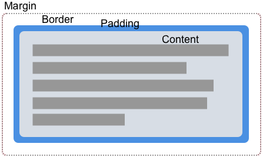

{{CSSRef}}

[CSS 박스 모델](/ko/docs/Web/CSS/CSS_box_model) 모듈의 값을 이용하여 도형을 생성하는 쉬운 방법이 있습니다. 이 아티클에서는 그 방법에 대해 설명합니다.

{{cssxref("box-edge")}} 박스 값은 다음 도형 값을 허용합니다.

- `content-box`
- `padding-box`
- `border-box`
- `margin-box`

또한 {{cssxref("box-edge")}} 값들도 지원됩니다. 이것은 요소에 곡선 테두리를 부여하고, 그리고 콘텐츠를 생성된 도형을 따라 흐르게 할 수 있음을 의미합니다.

## CSS 박스 모델

위에 나열된 값들은 CSS 박스 모델의 다양한 부분과 상응합니다. CSS 박스에서의 콘텐츠, 안쪽 여백, 테두리, 그리고 바깥 여백과 같은 것들입니다.

도형에 박스 값을 사용한다는 것은, 이러한 값들로 정의된 가장자리를 따라 콘텐츠를 감쌀 수 있다는 것입니다. 아래에 있는 각각의 예제들에서는, 안쪽 여백, 테두리, 그리고 바깥쪽 여백을 가진 요소가 정의되어 있고, 이것으로 콘텐츠가 어떻게 다양한 방식으로 흐르는지 확인할 수 있습니다.

### margin-box

`margin-box` 는 바깥쪽 여백 가장자리로부터 정의된 모양이고 {{cssxref("border-radius")}} 가 정의된 요소에 사용되었다면 도형 모서리의 둥글기도 포함됩니다.

아래 에제에서는, {{htmlelement("div")}} 로 만든 높이, 너비, 그리고 배경색을 가진 원형의 보라색 요소가 존재합니다. `border-radius` 속성에서는 원형 도형을 만들기 위해 `border-radius: 50%` 값이 사용되었습니다. 요소가 바깥 여백을 가진다면, 콘텐츠가 원형 도형을 따라 흐르고, 바깥 여백이 그대로 적용된 것을 확일할 수 있습니다.

{{EmbedGHLiveSample("css-examples/shapes/box/margin-box.html", '100%', 800)}}

### border-box

`border-box` 는 테두리 가장자리의 바깥 부분에 정의된 모양입니다. 이 모양은 바깥쪽 테두리에 대해 일반적인 테두리 둥글기 규칙을 따릅니다. 만일 {{cssxref("border")}} 속성을 사용하지 않았더라도 여전히 테두리가 있을 것입니다. 이러한 경우에는, `padding-box`, 즉 바깥쪽 패딩 가장자리로 정의된 모양과 동일한 동작을 하게 됩니다.

아래 예저에서는, 테두리로부터 생성된 선을 따라 텍스트가 어떻게 흐르는지를 확인할 수 있습니다. 테두리 크기를 변경해 보면 그에 따라 콘텐츠가 어떻게 달라지는지 확인할 수 있습니다.

{{EmbedGHLiveSample("css-examples/shapes/box/border-box.html", '100%', 800)}}

### padding-box

`padding-box` 값은 바깥쪽 패딩 가장자리에 둘러싸여 있는 모양을 정의합니다. 이 모양은 테두리 안쪽에 대해 일반적인 테두리 둥글기 규칙를 따릅니다. 만일 패딩 값이 없다면 `padding-box` 는 `content-box` 와 동일한 동작을 하게 됩니다.

{{EmbedGHLiveSample("css-examples/shapes/box/padding-box.html", '100%', 800)}}

### content-box

`content-box` 값은 바깥쪽 콘텐츠 가장자리에 둘러싸여 있는 모양을 정의합니다. 이 박스의 각각의 모서리 둥글기는 `border-radius` 에서 `border-width` 와  `padding` 을 뺀 값 혹은 `0` 중에 더 큰 값을 차지하게 됩니다. 이것은 음수 값을 가질 수 없다는 것을 의미하기도 합니다.

{{EmbedGHLiveSample("css-examples/shapes/box/content-box.html", '100%', 800)}}

## 박스 값을 언제 사용해야 할까요?

박스 값을 사용하는 것은 아주 간단하게 도형을 정의할 수 있습니다. 그러나, 이것은 기본적으로 잘 지원되는 `border-radius` 속성으로 정의할 수 있는 아주 간단한 도형에서만 동작합니다. 위에서 살펴보았던 예제들은 이러한 사용 예시 중 하나를 보여줄 뿐입니다. border-radius 를 사용하여 원형 도형을 생성할 수 있고 이를 따라 테두리를 기울일 수 있습니다.

기본적인 기법으로도 흥미로운 효과들을 만들어낼 수 있습니다. 이 섹션의 마지막 예제에서는, 두 개의 요소를 왼쪽과 오른쪽으로 플로팅하고, 각 요소에 텍스트와 가장 가까운 방향으로 100% 의 테두리 둥글기를 주었습니다.

{{EmbedGHLiveSample("css-examples/shapes/box/bottom-margin-box.html", '100%', 800)}}

더 많은 복잡한 도형에 대해서는 [basic shapes](/ko/docs/Web/CSS/CSS_shapes/Basic_shapes) 의 값 중 하나를 사용하거나, 혹은 이 섹션의 다른 안내서에서 다루는 것처럼 이미지를 사용하여 도형을 정의할 수도 있습니다.
