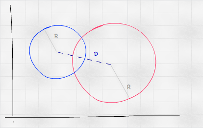

{{GamesSidebar}}

本文介绍了用于在 3D 环境中实现碰撞检测的不同包围体（bounding volume）技术。后续文章将讨论特定 3D 库中的实现。

## 轴对齐包围盒

在 2D 碰撞检测中，**轴对齐包围盒**（axis-aligned bounding box，AABB 包围盒）是判断两个物体是否重叠的最快算法。这种方法是将游戏实体包裹在一个非旋转的（因此是轴对齐的）盒中，并检查这些盒在三维坐标空间中的位置，以确定它们是否重叠。


由于性能原因，其存在**轴对齐约束**。两个非旋转的盒子之间是否重叠可以只通过逻辑比较进行检查，而旋转的盒子则需要三角运算，计算速度较慢。如果你有旋转的物体，可以通过修改包围盒的尺寸，这样盒子仍可以包裹物体，或者选择使用另一种边界几何类型，比如球体（旋转不改变形状）。下面的 GIF 动画显示了 AABB 的图形示例，该示例调整其大小以适应旋转实体。盒子不断改变尺寸以紧密贴合内部的实体。


> **备注：** 参考[使用 Three.js 的包围体](/zh-CN/docs/Games/Techniques/3D_collision_detection/Bounding_volume_collision_detection_with_THREE.js)，以了解该技术的实际实现。

### 点与 AABB

测试一个点是否在 AABB 内部非常简单——我们只需要测试这个点的坐标是否在 AABB 内（分别考虑每个坐标轴）。如果假设 _P<sub>x</sub>_、_P<sub>y</sub>_ 和 _P<sub>z</sub>_ 是点的坐标，_B<sub>minX</sub>_–_B<sub>maxX</sub>_、_B<sub>minY</sub>_–_B<sub>maxY</sub>_ 和 _B<sub>minZ</sub>_–_B<sub>maxZ</sub>_ 是 AABB 的每一个坐标轴的范围，我们可以使用以下公式计算两者之间的碰撞是否发生：

<math>
<semantics><mrow><mi>f</mi><mo stretchy="false">(</mo><mi>P</mi><mo>,</mo><mi>B</mi><mo stretchy="false">)</mo><mo>=</mo><mo stretchy="false">(</mo><msub><mi>P</mi><mi>x</mi></msub><mo>≥</mo><msub><mi>B</mi><mrow><mi>m</mi><mi>i</mi><mi>n</mi><mi>X</mi></mrow></msub><mo>∧</mo><msub><mi>P</mi><mi>x</mi></msub><mo>≤</mo><msub><mi>B</mi><mrow><mi>m</mi><mi>a</mi><mi>x</mi><mi>X</mi></mrow></msub><mo stretchy="false">)</mo><mo>∧</mo><mo stretchy="false">(</mo><msub><mi>P</mi><mi>y</mi></msub><mo>≥</mo><msub><mi>B</mi><mrow><mi>m</mi><mi>i</mi><mi>n</mi><mi>Y</mi></mrow></msub><mo>∧</mo><msub><mi>P</mi><mi>y</mi></msub><mo>≤</mo><msub><mi>B</mi><mrow><mi>m</mi><mi>a</mi><mi>x</mi><mi>Y</mi></mrow></msub><mo stretchy="false">)</mo><mo>∧</mo><mo stretchy="false">(</mo><msub><mi>P</mi><mi>z</mi></msub><mo>≥</mo><msub><mi>B</mi><mrow><mi>m</mi><mi>i</mi><mi>n</mi><mi>Z</mi></mrow></msub><mo>∧</mo><msub><mi>P</mi><mi>z</mi></msub><mo>≤</mo><msub><mi>B</mi><mrow><mi>m</mi><mi>a</mi><mi>x</mi><mi>Z</mi></mrow></msub><mo stretchy="false">)</mo></mrow><annotation encoding="TeX">f(P, B)= (P_x \ge B_{minX} \wedge P_x \le B_{maxX}) \wedge (P_y \ge B_{minY} \wedge P_y \le B_{maxY}) \wedge (P_z \ge B_{minZ} \wedge P_z \le B_{maxZ})</annotation></semantics></math>

或者用 JavaScript：

```js
function isPointInsideAABB(point, box) {
  return (
    point.x >= box.minX &&
    point.x <= box.maxX &&
    point.y >= box.minY &&
    point.y <= box.maxY &&
    point.z >= box.minZ &&
    point.z <= box.maxZ
  );
}
```

### AABB 与 AABB

测试一个 AABB 是否和另一个 AABB 相交类似于测试点的方法。我们只需要基于每一条坐标轴测试盒子的边界。下图显示了我们基于 X 轴的测试——基本上是测试 _A<sub>minX</sub>_–_A<sub>maxX</sub>_ 和 _B<sub>minX</sub>_–_B<sub>maxX</sub>_ 是否重叠。


在数学上的表示就像这样：

<math>
<semantics><mrow><mi>f</mi><mo stretchy="false">(</mo><mi>A</mi><mo>,</mo><mi>B</mi><mo stretchy="false">)</mo><mo>=</mo><mo stretchy="false">(</mo><msub><mi>A</mi><mrow><mi>m</mi><mi>i</mi><mi>n</mi><mi>X</mi></mrow></msub><mo>≤</mo><msub><mi>B</mi><mrow><mi>m</mi><mi>a</mi><mi>x</mi><mi>X</mi></mrow></msub><mo>∧</mo><msub><mi>A</mi><mrow><mi>m</mi><mi>a</mi><mi>x</mi><mi>X</mi></mrow></msub><mo>≥</mo><msub><mi>B</mi><mrow><mi>m</mi><mi>i</mi><mi>n</mi><mi>X</mi></mrow></msub><mo stretchy="false">)</mo><mo>∧</mo><mo stretchy="false">(</mo><msub><mi>A</mi><mrow><mi>m</mi><mi>i</mi><mi>n</mi><mi>Y</mi></mrow></msub><mo>≤</mo><msub><mi>B</mi><mrow><mi>m</mi><mi>a</mi><mi>x</mi><mi>Y</mi></mrow></msub><mo>∧</mo><msub><mi>A</mi><mrow><mi>m</mi><mi>a</mi><mi>x</mi><mi>Y</mi></mrow></msub><mo>≥</mo><msub><mi>B</mi><mrow><mi>m</mi><mi>i</mi><mi>n</mi><mi>Y</mi></mrow></msub><mo stretchy="false">)</mo><mo>∧</mo><mo stretchy="false">(</mo><msub><mi>A</mi><mrow><mi>m</mi><mi>i</mi><mi>n</mi><mi>Z</mi></mrow></msub><mo>≤</mo><msub><mi>B</mi><mrow><mi>m</mi><mi>a</mi><mi>x</mi><mi>Z</mi></mrow></msub><mo>∧</mo><msub><mi>A</mi><mrow><mi>m</mi><mi>a</mi><mi>x</mi><mi>Z</mi></mrow></msub><mo>≥</mo><msub><mi>B</mi><mrow><mi>m</mi><mi>i</mi><mi>n</mi><mi>Z</mi></mrow></msub><mo stretchy="false">)</mo></mrow><annotation encoding="TeX">f(A, B) = (A_{minX} \le B_{maxX} \wedge A_{maxX} \ge B_{minX}) \wedge ( A_{minY} \le B_{maxY} \wedge A_{maxY} \ge B_{minY}) \wedge (A_{minZ} \le B_{maxZ} \wedge A_{maxZ} \ge B_{minZ})</annotation></semantics></math>

在 JavaScript 中，我们可以这样：

```js
function intersect(a, b) {
  return (
    a.minX <= b.maxX &&
    a.maxX >= b.minX &&
    a.minY <= b.maxY &&
    a.maxY >= b.minY &&
    a.minZ <= b.maxZ &&
    a.maxZ >= b.minZ
  );
}
```

## 包围球

使用包围球（bounding sphere）检测碰撞比 AABB 盒子稍微复杂一点，但仍旧相当容易。球体的主要优势是它的旋转不变性，如果包裹的实体旋转，包围球仍将是相同的。它的主要缺点是，除非包裹的实体实际上是球形的，否则包裹通常不太合适（比如用包围球包裹一个人将导致一些误报，而 AABB 盒子将更合适)。

### 点与球

测试是否一个球体包含一个点，我们需要计算点和球体的中心之间的距离。如果这个距离小于或等于球的半径，这个点就在球体内部。


两个点 _A_ 和 _B_ 之间的欧氏距离是 <math><semantics><msqrt><mrow><mo stretchy="false">(</mo><msub><mi>A</mi><mi>x</mi></msub><mo>−</mo><msub><mi>B</mi><mi>x</mi></msub><msup><mo stretchy="false">)</mo><mn>2</mn></msup><mo>+</mo><mo stretchy="false">(</mo><msub><mi>A</mi><mi>y</mi></msub><mo>−</mo><msub><mi>B</mi><mi>y</mi></msub><msup><mo stretchy="false">)</mo><mn>2</mn></msup><mo>+</mo><mo stretchy="false">(</mo><msub><mi>A</mi><mi>z</mi></msub><mo>−</mo><msub><mi>B</mi><mi>z</mi></msub><msup><mo stretchy="false">)</mo><mn>2</mn></msup></mrow></msqrt><annotation encoding="TeX">\sqrt{(A_x - B_x)^2 + (A_y - B_y)^2 + (A_z - B_z)^2}</annotation></semantics></math>，我们的公式指出，点与球体之间的碰撞检测应该像这样：

<math>
<semantics><mrow><mi>f</mi><mo stretchy="false">(</mo><mi>P</mi><mo>,</mo><mi>S</mi><mo stretchy="false">)</mo><mo>=</mo><msub><mi>S</mi><mrow><mi>r</mi><mi>a</mi><mi>d</mi><mi>i</mi><mi>u</mi><mi>s</mi></mrow></msub><mo>≥</mo><msqrt><mo stretchy="false">(</mo><msub><mi>P</mi><mi>x</mi></msub><mo>−</mo><msub><mi>S</mi><mi>x</mi></msub><msup><mo stretchy="false">)</mo><mn>2</mn></msup><mo>+</mo><mo stretchy="false">(</mo><msub><mi>P</mi><mi>y</mi></msub><mo>−</mo><msub><mi>S</mi><mi>y</mi></msub><msup><mo stretchy="false">)</mo><mn>2</mn></msup><mo>+</mo><mo stretchy="false">(</mo><msub><mi>P</mi><mi>z</mi></msub><mo>−</mo><msub><mi>S</mi><mi>z</mi></msub><msup><mo stretchy="false">)</mo><mn>2</mn></msup></msqrt></mrow><annotation encoding="TeX">f(P,S) = S_{radius} \ge \sqrt{(P_x - S_x)^2 + (P_y - S_y)^2 + (P_z - S_z)^2}</annotation></semantics></math>

或者用 JavaScript：

```js
function isPointInsideSphere(point, sphere) {
  // 我们使用乘法是因为这样比调用 Math.pow 更快
  const distance = Math.sqrt(
    (point.x - sphere.x) * (point.x - sphere.x) +
      (point.y - sphere.y) * (point.y - sphere.y) +
      (point.z - sphere.z) * (point.z - sphere.z),
  );
  return distance < sphere.radius;
}
```

> **备注：** 上面的代码有一个平方根，计算开销可能很大。一种简单的优化是将平方距离与平方半径进行比较，以避免这种情况，所以优化后的不等式涉及 `distanceSqr < sphere.radius * sphere.radius`。

### 球体与球体

球体与球体的测试类似于点与球体的。我们需要测试的是球体的中心之间的距离小于或等于半径的总和。



在数学上，应该像这样：

<math>
<semantics><mrow><mi>f</mi><mo stretchy="false">(</mo><mi>A</mi><mo>,</mo><mi>B</mi><mo stretchy="false">)</mo><mo>=</mo><msqrt><mo stretchy="false">(</mo><msub><mi>A</mi><mi>x</mi></msub><mo>−</mo><msub><mi>B</mi><mi>x</mi></msub><msup><mo stretchy="false">)</mo><mn>2</mn></msup><mo>+</mo><mo stretchy="false">(</mo><msub><mi>A</mi><mi>y</mi></msub><mo>−</mo><msub><mi>B</mi><mi>y</mi></msub><msup><mo stretchy="false">)</mo><mn>2</mn></msup><mo>+</mo><mo stretchy="false">(</mo><msub><mi>A</mi><mi>z</mi></msub><mo>−</mo><msub><mi>B</mi><mi>z</mi></msub><msup><mo stretchy="false">)</mo><mn>2</mn></msup></msqrt><mo>≤</mo><msub><mi>A</mi><mrow><mi>r</mi><mi>a</mi><mi>d</mi><mi>i</mi><mi>u</mi><mi>s</mi></mrow></msub><mo>+</mo><msub><mi>B</mi><mrow><mi>r</mi><mi>a</mi><mi>d</mi><mi>i</mi><mi>u</mi><mi>s</mi></mrow></msub></mrow><annotation encoding="TeX">f(A,B) = \sqrt{(A_x - B_x)^2 + (A_y - B_y)^2 + (A_z - B_z)^2} \le A_{radius} + B_{radius}</annotation></semantics></math>

或者用 JavaScript：

```js
function intersect(sphere, other) {
  // 我们使用乘法是因为这样比调用 Math.pow 更快
  const distance = Math.sqrt(
    (sphere.x - other.x) * (sphere.x - other.x) +
      (sphere.y - other.y) * (sphere.y - other.y) +
      (sphere.z - other.z) * (sphere.z - other.z),
  );
  return distance < sphere.radius + other.radius;
}
```

### 球体与 AABB

测试一个球和一个 AABB 的碰撞是稍微复杂，但过程仍然简单和快速。一个合乎逻辑的方法是检查 AABB 每个顶点，计算每一个点与球的距离。然而这有点大材小用了，测试所有的顶点是不必要的，因为我们可以仅计算 AABB 的*最近点*（不一定是一个顶点）和球体的中心之间的距离，看看它是小于或等于球体的半径。我们可以通过逼近球体的中心和 AABB 的距离得到这个值：


在 JavaScript 中，我们可以像这样进行测试：

```js
function intersect(sphere, box) {
  // 通过逼近距离获得距离球体中心最近的点
  const x = Math.max(box.minX, Math.min(sphere.x, box.maxX));
  const y = Math.max(box.minY, Math.min(sphere.y, box.maxY));
  const z = Math.max(box.minZ, Math.min(sphere.z, box.maxZ));

  // 这与 isPointInsideSphere 相同
  const distance = Math.sqrt(
    (x - sphere.x) * (x - sphere.x) +
      (y - sphere.y) * (y - sphere.y) +
      (z - sphere.z) * (z - sphere.z),
  );

  return distance < sphere.radius;
}
```

## 使用物理引擎

**3D 物理引擎**提供了碰撞检测算法，其中大多数也都是基于包围体。物理引擎的工作方式是创建一个**物理体**，通常附加到其可视化表示上。该物体具有诸如速度、位置、旋转、扭矩等属性，还有一个**物理形状**。这个形状是碰撞检测计算中考虑的形状。

我们准备了一个[碰撞检测演示](https://mozdevs.github.io/gamedev-js-3d-aabb/physics.html)（[源代码](https://github.com/mozdevs/gamedev-js-3d-aabb)），你可以看到这些技术是如何运作的——这里使用了开源的 3D 物理引擎 [cannon.js](https://github.com/schteppe/cannon.js)。

## 参见

MDN 上的相关文章：

- [使用 Three.js 进行边界体积碰撞检测](/zh-CN/docs/Games/Techniques/3D_collision_detection/Bounding_volume_collision_detection_with_THREE.js)
- [2D 碰撞检测](/zh-CN/docs/Games/Techniques/2D_collision_detection)

外部资源：

- Gamasutra 上的[游戏的简单相交测试](https://www.gamasutra.com/view/feature/3383/simple_intersection_tests_for_games.php)
- 维基百科上的[包围体](https://zh.wikipedia.org/wiki/包围体)
