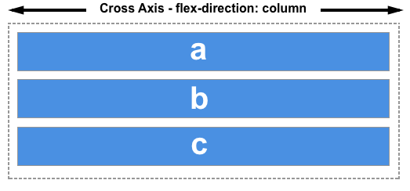

{{GlossarySidebar}}

{{glossary("flexbox", "弹性盒子")}}的交叉轴和{{glossary("main axis", "主轴")}}垂直，因此如果弹性方向（{{cssxref("flex-direction")}}）是行（`row`）或反向行（`row-reverse`），那么交叉轴就是从上至下地垂直走向的。

如果你的主轴是列（`column`）或者反向列（`column-reverse`），那么交叉轴就是水平走向的。

交叉轴上的对齐由通过弹性容器的 `align-items` 属性控制，或者通过单独弹性元素上的 `align-self` 属性来决定的对齐方式。在多行弹性容器中，交叉轴上有多余控件的话，你还可以用 `align-content` 来控制行的间距。

## 参见

### 属性参考

- {{cssxref("align-content")}}
- {{cssxref("align-items")}}
- {{cssxref("align-self")}}
- {{cssxref("flex-wrap")}}
- {{cssxref("flex-direction")}}
- {{cssxref("flex")}}
- {{cssxref("flex-basis")}}
- {{cssxref("flex-flow")}}
- {{cssxref("flex-grow")}}
- {{cssxref("flex-shrink")}}
- {{cssxref("justify-content")}}
- {{cssxref("order")}}

### 拓展阅读

- CSS 弹性容器指南：
- [弹性布局的基本概念](/zh-CN/docs/Web/CSS/CSS_flexible_box_layout/Basic_concepts_of_flexbox)
- [对齐弹性容器中的弹性项目](/zh-CN/docs/Web/CSS/CSS_flexible_box_layout/Aligning_items_in_a_flex_container)
- [掌握弹性项目的包装](/zh-CN/docs/Web/CSS/CSS_flexible_box_layout/Mastering_wrapping_of_flex_items)

- [术语](/zh-CN/docs/Glossary)

  - {{Glossary("Flex")}}
  - {{Glossary("Flex Container")}}
  - {{Glossary("Flex Item")}}
  - {{Glossary("Grid")}}
