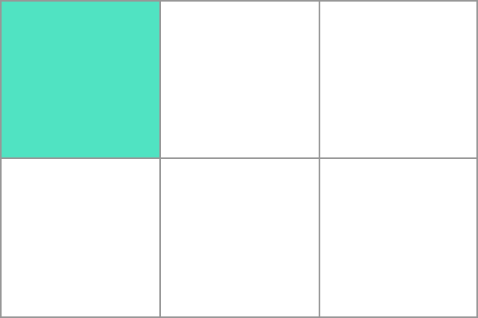

{{GlossarySidebar}}

在[Grid 布局](/zh-CN/docs/Web/CSS/CSS_grid_layout)中，**网络单元格**是 CSS 网格中的最小单元。它是四条{{glossary("grid lines","网格线")}}之间的空间，概念上非常像表格单元格。



如果不使用网格布局提供的方法去放置网格容器的项目，这些项目将通过自动布局算法被放置到每个网格单元格中。将创建额外的行或列{{glossary("grid tracks", "轨道")}}以创建足够的单元格来保存所有项目。

在例子中，我们创建了一个三列轨道的网格。五个项目被放置到网格单元格中，它们沿着初始行依次被放置到三个网格单元格中，然后为剩下的两个创建了一个新行。

## 示例

```css hidden
* {
  box-sizing: border-box;
}

.wrapper {
  border: 2px solid #f76707;
  border-radius: 5px;
  background-color: #fff4e6;
}

.wrapper > div {
  border: 2px solid #ffa94d;
  border-radius: 5px;
  background-color: #ffd8a8;
  padding: 1em;
  color: #d9480f;
}
```

```css
.wrapper {
  display: grid;
  grid-template-columns: repeat(3, 1fr);
  grid-auto-rows: 100px;
}
```

```html
<div class="wrapper">
  <div>One</div>
  <div>Two</div>
  <div>Three</div>
  <div>Four</div>
  <div>Five</div>
</div>
```

{{ EmbedLiveSample('示例', '300', '280') }}

## 参见

### 属性参考

- {{cssxref("grid-template-columns")}}
- {{cssxref("grid-template-rows")}}
- {{cssxref("grid-auto-rows")}}
- {{cssxref("grid-auto-columns")}}

### 扩展阅读

- CSS 网格布局指南：_[网格布局的基本概念](/zh-CN/docs/Web/CSS/CSS_grid_layout/Basic_concepts_of_grid_layout)_
- CSS 网格布局规范中[网格单元格的定义](https://drafts.csswg.org/css-grid/#grid-track-concept)
