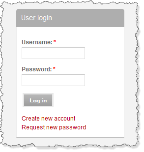

{{GlossarySidebar}}

SQL 注入（SQL Injection）利用了未能验证用户输入的 Web 应用程序。黑客可以通过 Web 应用程序传递恶意 SQL 命令，以便由后端数据库执行。

SQL 注入可以获得对数据库的未经授权的访问，或直接从数据库检索信息。许多数据泄露事件都是由于 SQL 注入造成的。

[](https://cdn.acunetix.com/wp_content/uploads/2010/09/sql_inj_xss.gif)

## 如何实现



输入用户名和密码后，在用户界面背后的 SQL 查询类似如下：

```sql
"SELECT Count(*) FROM Users WHERE Username=' " + txt.User.Text+" ' AND Password=' "+ txt.Password.Text+" ' ";
```

假定用户输入用户名为 admin，密码为 passwd123，在点击登录按钮后，会运行这样的 SQL 查询：

```sql
"SELECT Count(*) FROM Users WHERE Username=' admin ' AND Password=' passwd123 ' ";
```

如果凭证是正确的，那么用户就被允许登录，所以这是一个非常简单的（因此也是不安全的）机制。黑客利用这种不安全性来获得未经授权的访问。

黑客可以使用一个简单的字符串，称为"神奇的字符串"：

**Username: _admin_**

**Password: _anything 'or'1'='1_**

在点击登录按钮后，会运行这样的 SQL 查询：

```sql
"SELECT Count(*) FROM Users WHERE Username=' admin ' AND Password=' anything 'or'1'='1 ' ";
```

只要仔细看看上述查询的密码部分就知道了。

```plain
Password=' anything 'or'1'='1 '
```

密码不是"anything"，因此 password=anything 的结果是 FALSE，但 '1'='1' 是一个恒真语句，因此返回 TRUE 值。最后，由于 OR 运算符的作用，条件部分的值（FALSE OR TRUE）为 TRUE，所以成功绕过了认证。仅仅由于一个简单的字符串（"魔法字符串"），整个数据库就被破坏了。

## 如何防御

在执行对用户凭证的查询之前，要做一些改变，比如说：

```sql
$id = $_GET['id']

(1) $id = Stripslashes($id)

(2) $id = mysql_real_escape_String($id)
```

语句（1）将输入字符串中的每个单引号（'）被替换为双引号（"），并且语句（2）在每个单引号（'）之前添加正斜杠（/）实现转义操作。修改之后，"魔法字符串"就无法绕过认证，而你的数据库则能够保持安全。

## 参见

- 维基百科上的 [SQL 注入](https://zh.wikipedia.org/zh-cn/SQL注入)词条
- OWASP（开放 Web 应用安全项目）上的 [SQL 注入解释](https://owasp.org/www-community/attacks/SQL_Injection)
