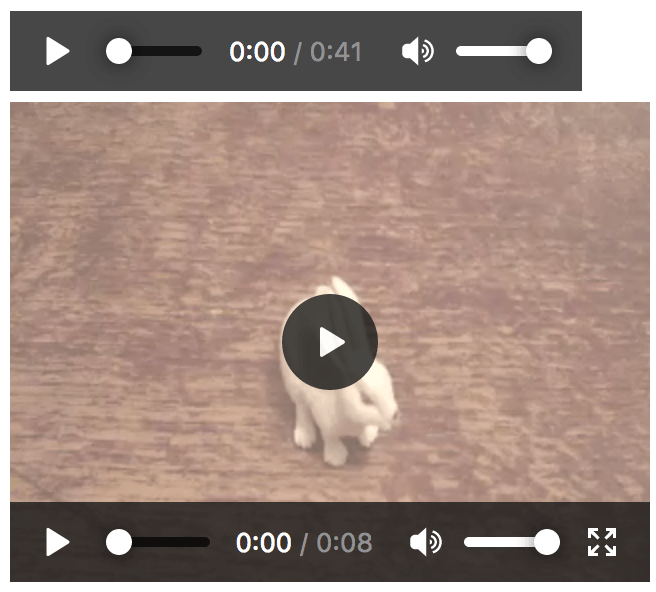
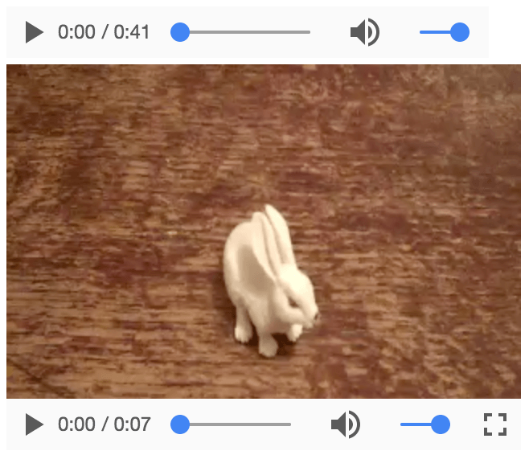

{{LearnSidebar}}{{PreviousMenuNext("Learn/Accessibility/WAI-ARIA_basics","Learn/Accessibility/Mobile", "Learn/Accessibility")}}

可能导致无障碍问题（accessibility problems）的另一类内容是多媒体 ——视频，音频和图像内容需要提供适当的文本替代方式，以便辅助技术及其用户能够理解它们。本文展示了具体内容。

<table class="learn-box standard-table">
  <tbody>
    <tr>
      <th scope="row">先决条件：</th>
      <td>
        基本的计算机素养，对 HTML，CSS 和 JavaScript 的基本理解，<a
          href="/zh-CN/docs/Learn/Accessibility/What_is_accessibility"
          >对无障碍</a
        >
        的理解。
      </td>
    </tr>
    <tr>
      <th scope="row">目的：</th>
      <td>了解多媒体背后的无障碍问题，以及如何克服这些问题。</td>
    </tr>
  </tbody>
</table>

## 多媒体和无障碍

到目前为止，在这个模块中，我们已经查看了各种内容以及需要做些什么来确保其无障碍，从简单的文本内容到数据表，图像，本机控件（如表单元素和按钮）以及更复杂的标记结构（具有 [WAI-ARIA](/zh-CN/docs/Learn/Accessibility/WAI-ARIA_basics)属性）。

另一方面，这篇文章着眼于另一个一般的内容类别，可以说它不容易确保对多媒体的无障碍。图像，视频，[`<canvas>`](/zh-CN/docs/Web/HTML/Element/canvas)元素，Flash 电影等不易被屏幕阅读器理解或被键盘导航，我们需要帮助他们。

但不要绝望 - 在这里我们将帮助你浏览可用于使多媒体更容易访问的技术。

## 简单图像

我们已经介绍了 HTML 图像的简单文本替代 [HTML: A good basis for accessibility](/zh-CN/docs/Learn/Accessibility/HTML) –– 你可以参考其中了解详细信息。简而言之，应确保在可能的情况下，视觉内容具有替代文本，供屏幕阅读器拾取和读取给其用户。

示例：

```html

```

## 可访问的音频和视频控件

基于 Web 的音频/视频执行控件不应该成为问题,对吗?让我们来调查一下。

### 本地 HTML5 控件的问题

HTML5 视频和音频实例甚至附带一组内置控件，允许你直接在盒子控制媒体。例如 (请参阅[本地控件.html](om/mdn/learning-area/blob/master/accessibility/multimedia/native-controls.html) 源代码和[实时演示](http://mdn.github.io/learning-area/accessibility/multimedia/native-controls.html)):

```html
<audio controls>
  <source src="viper.mp3" type="audio/mp3" />
  <source src="viper.ogg" type="audio/ogg" />
  <p>
    Your browser doesn't support HTML5 audio. Here is a
    <a href="viper.mp3">link to the audio</a> instead.
  </p>
</audio>

<br />

<video controls>
  <source src="rabbit320.mp4" type="video/mp4" />
  <source src="rabbit320.webm" type="video/webm" />
  <p>
    Your browser doesn't support HTML5 video. Here is a
    <a href="rabbit320.mp4">link to the video</a> instead.
  </p>
</video>
```

控件属性提供播放/暂停按钮、搜索栏等 - 你期望从媒体播放器获得的基本控件。它看起来像在 Firefox 和 Chrome:





但是，这些控件存在问题：

- 在除 Opera 以外任何浏览器中，它们不可通过键盘访问。
- 不同的浏览器为原生控件提供了不同的样式和功能，且不可赋予它们样式，这意味着它们难以遵从网站样式指南。

为了解决这个问题，我们可以创建自己的自定义控件。让我们来看看如何。

### 创建自定义音频和视频控件

HTML5 视频和音频共享 API — HTML Media Element — 允许你将自定义功能映射到按钮和其他控件––这两个控件都是你自己定义的。

让我们从上面获取视频示例，并向其添加自定义控件。

#### 基本设置

首先，获取我们的 [custom-controls-start.html](https://github.com/mdn/learning-area/blob/main/accessibility/multimedia/custom-controls-start.html)、[custom-controls.css](https://github.com/mdn/learning-area/blob/main/accessibility/multimedia/custom-controls.css)、 [rabbit320.mp4](https://raw.githubusercontent.com/mdn/learning-area/main/accessibility/multimedia/rabbit320.mp4) 和 [rabbit320.webm](https://raw.githubusercontent.com/mdn/learning-area/main/accessibility/multimedia/rabbit320.webm)文件的副本，并将它们保存在硬盘上的新目录中。

创建一个名为 main.js 的新文件并将其保存在同一目录中。

首先，让我们在 HTML 中查看视频播放器的 HTML:

```html
<section class="player">
  <video controls>
    <source src="rabbit320.mp4" type="video/mp4" />
    <source src="rabbit320.webm" type="video/webm" />
    <p>
      Your browser doesn't support HTML5 video. Here is a
      <a href="rabbit320.mp4">link to the video</a> instead.
    </p>
  </video>

  <div class="controls">
    <button class="playpause">Play</button>
    <button class="stop">Stop</button>
    <button class="rwd">Rwd</button>
    <button class="fwd">Fwd</button>
    <div class="time">00:00</div>
  </div>
</section>
```

#### JavaScript 基本设置

我们在视频下方插入了一些简单的控制按钮。当然，这些控件在默认情况下不会执行任何操作。要添加功能，我们将使用 JavaScript。

我们首先需要存储对每个控件的引用––将以下内容添加到 JavaScript 文件的顶部：

```js
const playPauseBtn = document.querySelector(".playpause");
const stopBtn = document.querySelector(".stop");
const rwdBtn = document.querySelector(".rwd");
const fwdBtn = document.querySelector(".fwd");
const timeLabel = document.querySelector(".time");
```

接下来，我们需要获取对视频/音频播放器本身的引用––在前面的代码行下方添加此行代码：

```js
const player = document.querySelector("video");
```

这包含对{{domxref("HTMLMediaElement")}}对象的引用，该对象具有几个有用的属性和方法，可用于将功能连接到我们的按钮。

在开始创建按钮功能之前，让我们删除本地控件，以免它们妨碍我们的自定义控件。在 JavaScript 的底部再次添加以下内容：

```js
player.removeAttribute("controls");
```

这样做，而不是仅仅不包括控件属性摆在首位有一个优势，如果我们的 JavaScript 失败，用户仍然有一些控件可用。

#### 连接按钮

首先，让我们设置播放/暂停按钮。我们可以使用一个简单的条件函数在播放和暂停之间切换，如下所示。将其添加到代码底部：

```js
playPauseBtn.onclick = () => {
  if (player.paused) {
    player.play();
    playPauseBtn.textContent = "Pause";
  } else {
    player.pause();
    playPauseBtn.textContent = "Play";
  }
};
```

接下来，将此代码添加到底部，该代码控制停止按钮：

```js
stopBtn.onclick = () => {
  player.pause();
  player.currentTime = 0;
  playPauseBtn.textContent = "Play";
};
```

在 {{domxref("HTMLMediaElement")}} 上没有可用的 `stop()` 函数，因此我们改为`pause()`它，同时将当前时间设置为 0。

接下来，我们的快退和快进按钮–– 将以下块添加到代码的底部：

```js
rwdBtn.onclick = () => {
  player.currentTime -= 3;
};

fwdBtn.onclick = () => {
  player.currentTime += 3;
  if (player.currentTime >= player.duration || player.paused) {
    player.pause();
    player.currentTime = 0;
    playPauseBtn.textContent = "Play";
  }
};
```

这些非常简单，每次单击它们时，只需将 3 秒添加到`currentTime`。在真正的视频播放器中，你可能想要一个更精细的查找栏或类似功能。

请注意，当按下 Fwd 按钮时，我们还会检查`currentTime`是否超过总媒体的`duration`,或者媒体是否未播放。如果任一条件为 true，我们只需停止视频，以避免用户界面出错，如果他们试图在视频未播放时快进，或快进通过视频结束。

最后，将以下内容添加到代码末尾，以控制显示的时间：

```js
player.ontimeupdate = () => {
  const minutes = Math.floor(player.currentTime / 60);
  const seconds = Math.floor(player.currentTime - minutes * 60);
  const minuteValue = minutes < 10 ? `0${minutes}` : minutes;
  const secondValue = seconds < 10 ? `0${seconds}` : seconds;

  const mediaTime = `${minuteValue}:${secondValue}`;
  timeLabel.textContent = mediaTime;
};
```

每次更新时间 (每秒一次) 时，我们都会触发此功能。它算出给定的当前时间值 (以秒为单位) 的分钟和秒数，如果分钟或秒值小于 10，则添加前导 0，然后创建显示读出并将其添加到时间标签。

#### 阅读延伸

这为你提供了如何向视频/音频播放器实例添加自定义播放器功能的基本想法。有关如何向视频/音频播放器添加更复杂的功能(包括旧版浏览器的 Flash 回退) 的详细信息，请参阅：

- [Audio and video delivery](/zh-CN/docs/Web/Apps/Fundamentals/Audio_and_video_delivery)
- [Video player styling basics](/zh-CN/docs/Web/Apps/Fundamentals/Audio_and_video_delivery/Video_player_styling_basics)
- [Creating a cross-browser video player](/zh-CN/docs/Web/Apps/Fundamentals/Audio_and_video_delivery/cross_browser_video_player)

我们还创建了一个高级示例，以演示如何创建面向对象的系统，该系统可查找页面上的每个视频和音频播放器 (无论有多少个视频和音频播放器),并将自定义控件添加到其中。请参阅 [custom-controls-oojs](http://mdn.github.io/learning-area/accessibility/multimedia/custom-controls-OOJS/)（[查看其源码](https://github.com/mdn/learning-area/tree/main/accessibility/multimedia/custom-controls-OOJS)）。

## 音频脚本

要为聋人提供访问音频内容的机会，你确实需要创建文本脚本。这些可以以某种方式与音频一样包含在与音频相同的页面上，也可以包含在单独的页面上并链接到

在实际创建脚本方面，你的选项包括：

- 商业服务––你可以向专业人士支付报酬进行转录，例如 [Scribie](https://scribie.com/)、[Casting Words](https://castingwords.com/)或 [Rev](https://www.rev.com/)公司。询问并征求意见，以确保你找到一家信誉良好的公司，你可以有效地合作。
- 社区/草根/自我转录 – 如果你是工作场所中活跃社区或团队的一员，你可以请求他们帮助翻译。你甚至可以自己去做。
- 自动服务 – 提供自动服务，例如，当你将视频上传到 YouTube 时，你可以选择生成自动字幕/脚本。根据语音音频的清晰程度，生成的脚本质量将有很大差异。

和生活中的大多数事情一样，你倾向于得到你所付出的;不同的服务在准确性和制作成绩单所花时间方面会有所不同。如果你支付一个有信誉的公司做转录，你可能会得到它迅速和高质量的。如果你不想付钱，你很可能会以较低的质量完成，并且/或缓慢完成。

发布音频资源是不行的，但承诺稍后会发布脚本 - 此类承诺通常不会兑现，这将削弱你和你的用户之间的信任。如果你演示的音频类似于面对面会议或现场演讲表演，则可以在演出期间做笔记，与音频一起完整发布笔记，然后寻求帮助，以便稍后清理笔记。

### 脚本示例

如果使用自动服务，则可能需要使用该工具提供的用户界面。例如，查看 [Audio Transcription Sample 1](https://www.youtube.com/watch?v=zFFBsj97Od8)并选择" _More > Transcript_"。

如果要创建自己的用户界面来显示音频和相关脚本，你可以随心所欲地执行此操作，但将其包含在可显示/可隐藏面板中可能有意义;请参阅我们的 [audio-transcript-ui](http://mdn.github.io/learning-area/accessibility/multimedia/audio-transcript-ui/) 示例（另请参阅[其源码](https://github.com/mdn/learning-area/tree/main/accessibility/multimedia/audio-transcript-ui)）。

### 音频描述

在音频附带视频的情况下，你需要提供某种音频说明来描述该额外内容。

在许多情况下，这只会采取视频的形式，在这种情况下，你可以使用本文下一节中介绍的技术实现字幕。

但是，有一些边缘情况。例如，你可能有一个会议的音频录制，该录音引用了附带的资源，如电子表格或图表。在这种情况下，应确保资源与音频和脚本一起提供，并在成绩单中提及它们的位置专门链接到这些资源。这当然会帮助所有用户，而不仅仅是聋人。

> **备注：** 音频脚本通常有助于多个用户组。除了让聋人用户访问音频中包含的信息外，还考虑一个带宽连接较低的用户，他们会发现下载音频不方便。还要考虑在嘈杂的环境中 (如酒吧或酒吧) 中的用户，他们试图访问信息，但无法通过噪音听到信息。

## 视频文本轨道

要使聋人、盲人甚至其他用户组 (如低带宽用户或不理解视频录制的语言的用户) 可以访问视频，你需要在视频内容中包括文本轨道。

> **备注：** 文本轨道对于潜在的任何用户也很有用，而不仅仅是那些残障用户。例如，有些用户可能无法听到音频，因为他们处于嘈杂的环境中 (如显示体育游戏时的拥挤的酒吧),或者如果其他人在安静的地方 (如图书馆),则可能不想打扰其他人。

这不是一个新概念 ––电视服务已经关闭了字幕相当长的时间了：


许多国家/地区提供以英语为母语的字幕的英语电影,例如,DVD 上通常提供不同的语言字幕


不同类型的文本轨道具有不同的目的。你遇到的主要情况是：

- 标题 ––对于听不到音轨 (包括所讲的单词，还有环境信息，如说话、以及用来营造喜怒气氛的音乐等) 的聋人用户而言是有利的。
- 字幕––为不懂所讲语言的用户提供音频对话框的翻译。
- 说明–– 这些描述包括无法观看视频的盲人的描述，例如场景的外观。
- 章节标题––旨在帮助用户导航媒体资源的章节标记

### 实现 HTML5 视频文本轨道

使用 HTML5 视频显示的文本轨道需要用 WebVTT 编写，WebVTT 是一种文本格式，其中包含多个文本字符串以及元数据，例如你希望在视频中显示每个文本字符串的时间，甚至限制样式/定位信息。这些文本字符串称为提示。

典型的 WebVTT 文件如下所示：

```
WEBVTT

1
00:00:22.230 --> 00:00:24.606
This is the first subtitle.

2
00:00:30.739 --> 00:00:34.074
This is the second.

  ...
```

要将此信息与 HTML 媒体播放一起显示，你需要：

- 将其保存为 .vtt 文件，放在一个合理的地方。
- 使用 {{htmlelement("track")}} 元素链接到 .vtt 文件。`<track>` 应放在 `<audio>` 或 `<video>` 内，但在 `<source>` 元素之后。使用 [`kind`](/zh-CN/docs/Web/HTML/Element/track#kind) 属性指定提示是字幕、标题还是说明。此外，使用 [`srclang`](/zh-CN/docs/Web/HTML/Element/track#srclang) 告诉浏览器编写字幕所用的语言。

下面是一个示例：

```html
<video controls>
  <source src="example.mp4" type="video/mp4" />
  <source src="example.webm" type="video/webm" />
  <track kind="subtitles" src="subtitles_en.vtt" srclang="en" />
</video>
```

这将产生显示字幕的视频，如下所示：


有关详细信息，请阅读 [Adding captions and subtitles to HTML5 video](/zh-CN/docs/Web/Apps/Fundamentals/Audio_and_video_delivery/Adding_captions_and_subtitles_to_HTML5_video)。你可以找到与本文一起使用本文的 [the example](http://iandevlin.github.io/mdn/video-player-with-captions/),本文由 Ian Devlin 编写 (请参阅 [source code](https://github.com/iandevlin/iandevlin.github.io/tree/master/mdn/video-player-with-captions))。此示例使用一些 JavaScript 允许用户在不同的字幕之间进行选择。请注意，要打开字幕，你需要按"CC"按钮并选择一个选项 - 英语、德语或西班牙语。

> **备注：** 文本轨道和转录也可以帮助你使用{{glossary("SEO")}},因为搜索引擎在文本上尤其繁荣。文本轨道甚至允许搜索引擎通过视频直接链接到一个点部分。

## 其他多媒体内容

以上各节未涵盖你可能要放在网页上的所有类型的多媒体内容。你可能还需要处理使用其他可用技术创建的游戏、动画、幻灯片、嵌入式视频和内容，例如：

- [HTML5 canvas](/zh-CN/docs/Web/API/Canvas_API)
- Flash
- Silverlight

对于此类内容，你需要根据案例处理辅助功能问题。在某些情况下，它不是那么糟糕，例如：

- 如果你使用 Flash 或 Silverlight 等插件技术嵌入音频内容，你可能只需以与上面在[脚本示例](#脚本示例)部分中所示的相同方式提供音频脚本。
- 如果你使用 Flash 或 Silverlight 等插件技术嵌入视频内容，则可以利用这些技术可用的字幕/字幕技术。例如，参考 [Flash captions](http://www.adobe.com/accessibility/products/flash/captions.html)、[Using the Flash-Only Player API for Closed Captioning](https://support.brightcove.com/en/video-cloud/docs/using-flash-only-player-api-closed-captioning) 或 [Playing Subtitles with Videos in Silverlight](https://blogs.msdn.microsoft.com/anilkumargupta/2009/05/01/playing-subtitles-with-videos-in-silverlight/).

然而，其他多媒体不是那么容易使访问。例如，如果你正在处理沉浸式 3D 游戏或虚拟现实应用，那么为此类体验提供文本替代方案确实非常困难，你可能会认为盲人用户实际上并不在此类应用的目标受众范围内。

但是，你可以确保此类应用具有足够的颜色对比度和清晰的显示，以便对视力低下/色盲的人来说可以感知，并且还可以使其键盘可访问。请记住，辅助功能就是尽可能多地做，而不是一直追求 100% 的无障碍，这通常是不可能的。

## 总结

本章概述了多媒体内容的无障碍问题，以及一些实用的解决方案。

{{PreviousMenuNext("Learn/Accessibility/WAI-ARIA_basics","Learn/Accessibility/Mobile", "Learn/Accessibility")}}
