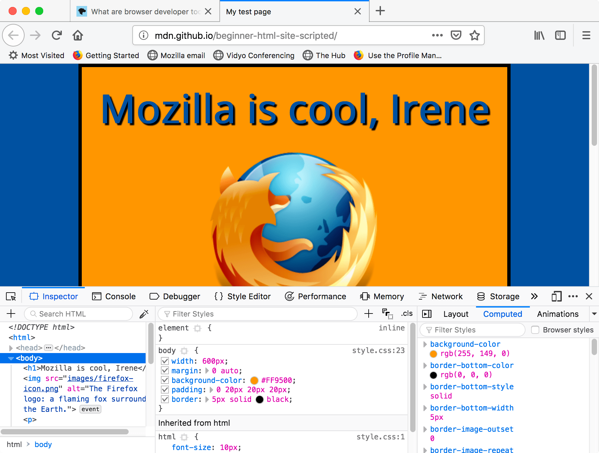
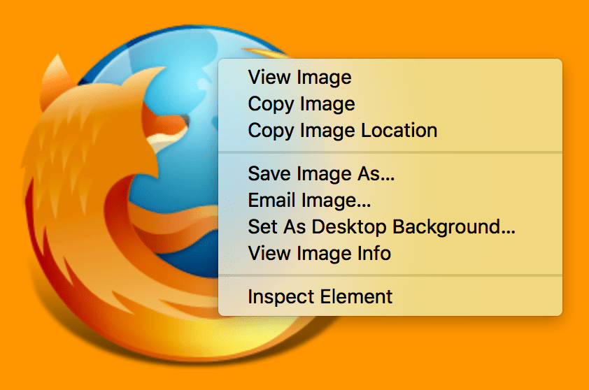

每一个现代网络浏览器都包含一套强大的开发工具套件。这些工具可以检查当前加载的 HTML、CSS 和 JavaScript，显示每个资源页面的请求以及载入所花费的时间。本文阐述了如何利用浏览器的开发工具的基本功能。

> **备注：** 在你运行下面的例子之前，打开我们在 [Web 开发入门](/zh-CN/docs/Learn/Getting_started_with_the_web)系列文章中建立的[初学者示例网站](http://mdn.github.io/beginner-html-site-scripted/)。你应该按照下面的步骤打开。

## 如何在浏览器中打开开发者工具

开发者工具内置在你的浏览器的子窗口之中，大概像这样：



**如何打开它？有三种方式：**

- **_键盘快捷键_** _Ctrl + Shift + I_，除了以下的特例

  - **Internet Explorer.** _F12_
  - **Mac OS X.** _⌘ + ⌥ + I_

- **_菜单栏_**

  - **Firefox**：菜单  ➤ _Web 开发者_ ➤ _切换工具箱（译者注：此处修改为最新的 Firefox Quantum），或者工具栏中的_ ➤ _Web 开发者_ ➤ _切换工具箱_
  - **Chrome**：菜单 _➤ 更多工具 ➤ 开发者工具_
  - **Safari**：_Develop ➤ Show Web Inspector_。如果你看不到 _Develop_ 菜单，去到*Safari ➤ Preferences ➤ Advanced*，然后点击*Show Develop menu in menu bar* 复选框。
  - **Opera**. _Developer ➤ Web Inspector_

- **右键菜单**：右键单击网页中的一个项目上（在 Mac 上按 Ctrl 点击），并从弹出的菜单中选择`检查元素`（译者注：选择`检查`（Chrome）或`查看元素`（Firefox））。（这种方法的好处是：该方法直接将你右击的元素的代码突出显示）。



检查器（Inspector）：DOM 浏览器和 CSS 编辑器

开发者工具在打开时默认为检查器页面，如下图所示。这个工具可以让你看到你的网页的 HTML 运行时的样子，以及哪些 CSS 规则被应用到了页面上元素。它还允许你立即修改 HTML 和 CSS 并在浏览器中实时观察修改的结果。


如果你看不到调试器，

- 点击“检查”选项卡。
- 在 Internet Explorer 中，点击 DOM Explorer，或按 Ctrl + 1。
- 在 Safari 中，控制就不是很清楚了，但是你如果你没有选择的东西出现在窗口看到 HTML。按下按钮查看 CSS 样式。

### 探索 DOM 检查器

首先在 DOM 检查器中右键单击（按 Ctrl 点击）一个 HTML 元素，看上下文菜单。菜单选项各不相同，但主要功能是相同的：


- **删除节点**（或删除元素）：删除当前元素**。**
- **编辑 HTML**（或添加属性/编辑文本）：让你更改 HTML 和看到在变化的结果。对于调试和测试非常有用。
- **:hover/:active/:focus**（悬停/激活/聚焦）：强制切换元素状态以查看显示外观。
- **复制/复制为 HTML**：复制当前选定的 HTML。
- 一些浏览器也有复制 CSS 路径和复制 XPath，允许你选择复制当前的 HTML 元素 CSS 选择器或 XPath 表达式。

现在试着编辑一些你的 DOM。双击元素，或在页面内容里右键单击它并选择编辑 HTML。你可以做出任何你想要的改变，但你不能保存。

### 探索 CSS 编辑器

默认情况下，CSS 编辑器显示当前所选元素应用的 CSS 规则：

这些功能特别有用：

- 应用于当前元素的规则以相关度排序。越特定的规则显示的越靠前。
- 点击每个声明旁边的复选框，看看如果删除声明会发生什么。
- 点击每个简写属性旁边的小箭头显示属性的普通等效项。
- 单击属性名称或值以显示一个文本框，你可以在其中键入新值以获取样式更改的实时预览。
- 每个规则旁边是规则定义的文件名和行号。单击该规则将使开发工具跳转到自己的视图中显示，通常可以编辑和保存。
- 你还可以单击任何规则的关闭大括号，以在新行上显示一个文本框，你可以在其中为页面写入一个全新的声明。

你会注意到 CSS 查看器顶部的一些可点击的选项卡：

- _计算：显示当前所选元素的计算样式（浏览器应用的最终归一化值）。_
- _盒子模型：这可以直观地表示当前元素的框模型，所以你可以一目了然地看到应用了什么填充，边框和边距，以及它的内容有多大。_
- 字体：在 Firefox 中，“字体”选项卡显示应用于当前元素的字体。

### 了解更多

了解更多 Inspector 在不同的浏览器中的细节：

- [Firefox Page inspector](/zh-CN/docs/Tools/Page_Inspector)
- [IE DOM Explorer](http://msdn.microsoft.com/en-us/library/ie/dn255008%28v=vs.85%29.aspx)
- [Chrome DOM inspector](https://developer.chrome.com/devtools/docs/dom-and-styles) (Opera 的 inspector 和它一样)
- [Safari DOM inspector and style explorer](https://developer.apple.com/library/safari/documentation/AppleApplications/Conceptual/Safari_Developer_Guide/ResourcesandtheDOM/ResourcesandtheDOM.html#//apple_ref/doc/uid/TP40007874-CH3-SW1)

## JavaScript 调试器

你可在 JavaScript 调试器中查看变量的值，或者设置断点。断点的作用是让程序在你指定的位置暂停，以便你来调试程序并确定问题所在。


如何打开调试器：

火狐，谷歌，IE，Edge：<kbd>F12</kbd>

Safari：开打开发者工具，然后选择 "Debugger" 标签。

### 尝一尝调试器的味

火狐的调试器有三个面板

#### 文件列表

第一个面板位于左边，它包涵着你正在调试的网页的文件列表。从列表中选中你要操作的文件。通过点击选中一个文件，可以在调试中间的面板看到它的内容。


#### 源码

在你想要停止执行的位置设置间断点。在下面图片中，高亮的第 18 行就是被设置的断点。


#### “监视表达式”和“断点”

右边的面板会显示你添加的监视表达式与断点。

在下图中，第一个区域，**监视表达式**，显示了变量 listItem 已经被添加，你可以展开列表查看里面的值。

接下来的部分，**断点 标签**，列出了页面上设置的断点。在 example.js（上上个图中）中，一个断点被定位在语句 `listItems.push(inputNewItem.value);` 上。

最后两个部分，只在代码运行时才出现。

**调用栈** 区向你显示哪个代码执行后会达到当前行。你能看到代码处理了一次鼠标点击后，停在了断点处。

最后一部分，**Scopes**，显示了在代码执行过程中，可见变量值的变化。例如，在下面图片中，你可以看到对象在 addItemClick 函数中是如何变化的。


### 再了解一些

了解不同浏览器中的 JavaScript 调试器：

- [Firefox JavaScript Debugger](/zh-CN/docs/Tools/Debugger)
- [Microsoft Edge Debugger](https://docs.microsoft.com/en-us/microsoft-edge/devtools-guide/debugger)
- [Chrome Debugger](https://developers.google.com/web/tools/chrome-devtools/javascript/)
- [Safari Debugger](https://developer.apple.com/safari/tools/)

## JavaScript 控制台

JavaScript 控制台是一个非常有用的工具，用于调试没有按预期运行的 JavaScript。它允许你针对浏览器当前加载的页面运行 JavaScript 行，并报告浏览器尝试执行代码时遇到的错误。要在任何浏览器中访问控制台，只需按控制台按钮。 （在 Internet Explorer 中，按 Ctrl + 2.）这将给你一个如下所示的窗口：


要查看会发生什么，请尝试逐个输入以下代码片段（然后按 Enter 键）:

```js
alert("hello!");
```

```js
document.querySelector("html").style.backgroundColor = "purple";
```

```js
var my_image = document.createElement("img");

//下面的 url 已经不再可用，这里注释掉，后面补上了一个可以 url
//且 myImage 在文章开始给的“初学者示例网址”存在声明冲突，所以改为 my_image
//myImage.setAttribute('src','https://farm4.staticflickr.com/3455/3372925208_e1f2aae4e3_b.jpg');
my_image.setAttribute(
  "src",
  "https://media.giphy.com/media/3o6ozhxFlr4Ung40RG/giphy.gif",
);

document.querySelector("h1").appendChild(my_image);
```

现在尝试输入以下错误的代码版本，看看你得到什么。

```js
alert('hello!);
```

```js
document.cheeseSelector("html").style.backgroundColor = "purple";
```

```js
var my_Image = document.createElement("img");
myBanana.setAttribute(
  "src",
  "https://media.giphy.com/media/3o6ozhxFlr4Ung40RG/giphy.gif",
);
document.querySelector("h1").appendChild(my_Image);
```

你将开始看到浏览器返回的错误类型。通常这些错误是相当神秘的，但是应该很简单的把这些问题解决出来！

### 了解更多

了解更多 JavaScript 控制台在不同浏览器中的细节：

- [Firefox Web Console](/zh-CN/docs/Tools/Web_Console)
- [IE JavaScript console](http://msdn.microsoft.com/en-us/library/ie/dn255006%28v=vs.85%29.aspx)
- [Chrome JavaScript Console](https://developer.chrome.com/devtools/docs/console) (Opera 与它相同)
- [Safari Console](https://developer.apple.com/library/safari/documentation/AppleApplications/Conceptual/Safari_Developer_Guide/Console/Console.html#//apple_ref/doc/uid/TP40007874-CH6-SW1)

## 参见

- [Debugging HTML](/zh-CN/docs/Learn/HTML/Introduction_to_HTML/Debugging_HTML)
- [Debugging CSS](/zh-CN/docs/Learn/CSS/Introduction_to_CSS/Debugging_CSS)
