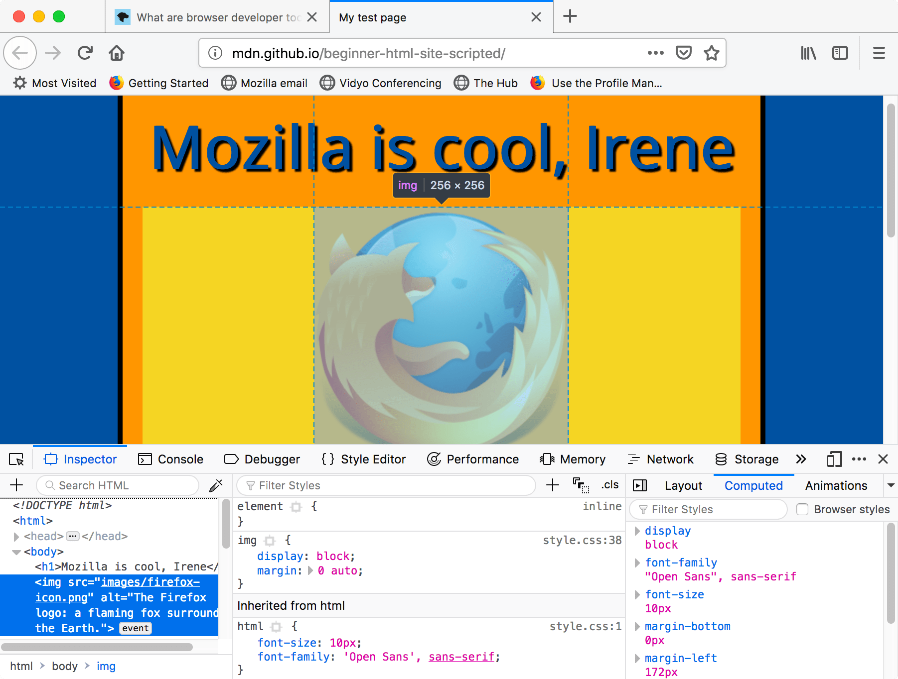
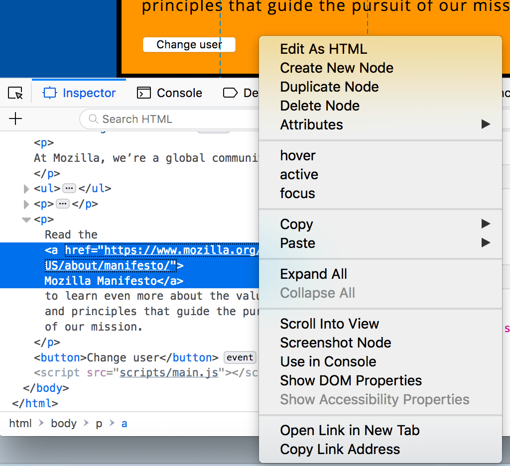
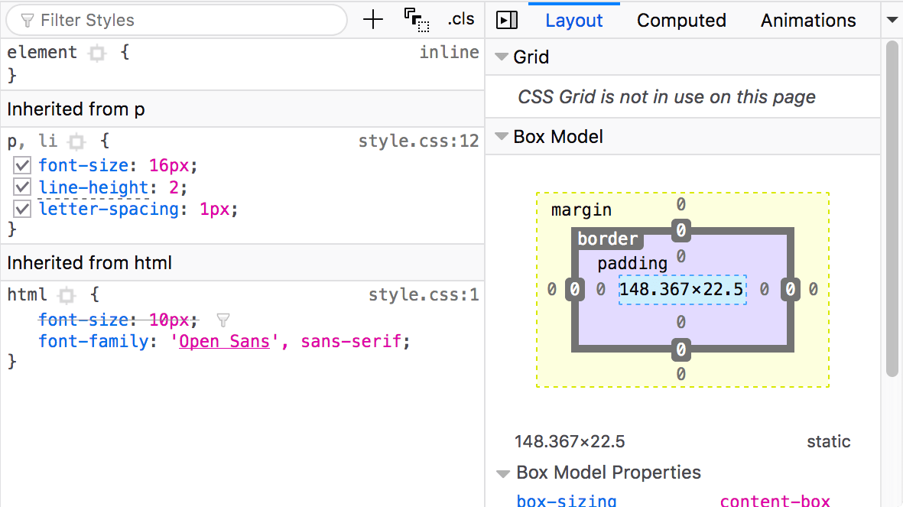
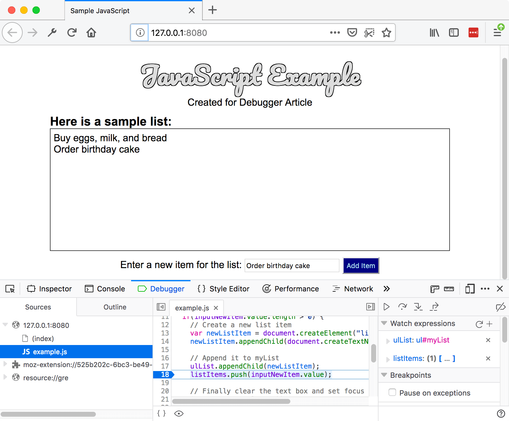
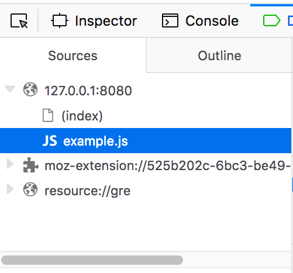
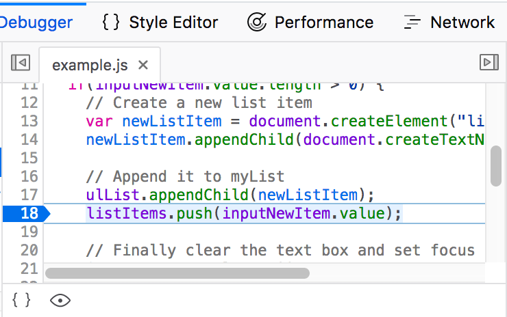
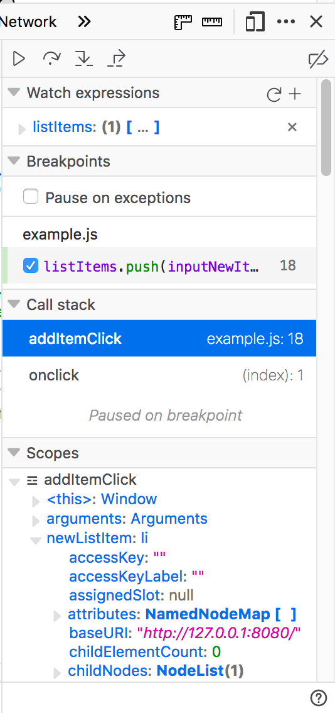

{{QuicklinksWithSubPages("/zh-CN/docs/Learn/Common_questions")}}

每一个现代网络浏览器都包含一套强大的开发工具套件。这些工具可以检查当前加载的 HTML、CSS 和 JavaScript，显示每个资源页面的请求以及载入所花费的时间。本文阐述了如何利用浏览器的开发工具的基本功能。

> [!NOTE]
> 在你运行下面的例子之前，打开我们在 [Web 开发入门](/zh-CN/docs/Learn/Getting_started_with_the_web)系列文章中建立的[初学者示例网站](http://mdn.github.io/beginner-html-site-scripted/)。你应该按照下面的步骤打开。

## 如何在浏览器中打开开发者工具

开发者工具内置在浏览器的子窗口之中，大概像这样，具体取决于所使用的浏览器：


如何打开它？有三种方式：

- **_键盘快捷键_**

  - **Windows：** _<kbd>Ctrl</kbd> + <kbd>Shift</kbd> + <kbd>I</kbd>_ 或 <kbd>F12</kbd>
  - **macOS：** _<kbd>⌘</kbd> + <kbd>⌥</kbd> + <kbd>I</kbd>_

- **_菜单栏_**

  - **Firefox：** 菜单  _➤ 更多工具 ➤ Web 开发者工具_
  - **Chrome：** _➤ 更多工具 ➤ 开发者工具_
  - **Safari：** _开发 ➤ 显示网页检查器_。如果你看不到*开发*菜单，去到 _Safari ➤ 设置 ➤ 高级_，然后点击*显示网页开发者功能*复选框。
  - **Opera：** _开发者 ➤ 开发者工具_

- **_右键菜单：_** 右键单击网页中的一个项目上（在 Mac 上按 Ctrl 同时点击），并从弹出的菜单中选择*检查元素*。（_这种方法的好处_：该方法直接将你右击的元素的代码突出显示）。


## 检查器（Inspector）：DOM 浏览器和 CSS 编辑器

开发者工具在打开时默认为检查器页面，如下图所示。这个工具可以让你看到你的网页的 HTML 运行时的样子，以及哪些 CSS 规则被应用到了页面上元素。它还允许你立即修改 HTML 和 CSS 并在浏览器中实时观察修改的结果。



如果你*看不到*调试器，

- 点击“检查”标签页。
- 在 Chrome、Microsoft Edge 或 Opera 中，点击元素。
- 在 Safari 中，控件的呈现并不是那么清晰，但如果你没有选择其他内容显示在窗口中，你应该能看到 HTML。点击“样式”按钮查看 CSS。

### 探索 DOM 检查器

首先在 DOM 检查器中右键单击（按 Ctrl 点击）一个 HTML 元素，看上下文菜单。菜单选项各不相同，但主要功能是相同的：



- **删除节点**（或*删除元素*）：删除当前元素。
- **编辑 HTML**（或*添加属性*/_编辑文本_）：让你更改 HTML 并即时查看结果。对于调试和测试非常有用。
- **:hover/:active/:focus**（悬停/激活/聚焦）：强制切换元素状态以查看显示外观。
- **复制/复制为 HTML**：复制当前选定的 HTML。
- 一些浏览器也有*复制 CSS 路径*和*复制 XPath*，允许你选择复制当前的 HTML 元素 CSS 选择器或 XPath 表达式。

现在试着编辑一些你的 DOM。双击元素，或在页面内容里右键单击它并选择编辑 HTML。你可以做出任何你想要的改变，但你不能保存。

### 探索 CSS 编辑器

默认情况下，CSS 编辑器显示当前所选元素应用的 CSS 规则：



这些功能特别有用：

- 应用于当前元素的规则以相关度排序。越特定的规则显示的越靠前。
- 点击每个声明旁边的复选框，看看如果删除声明会发生什么。
- 点击每个简写属性旁边的小箭头显示属性的普通等效项。
- 单击属性名称或值以显示一个文本框，你可以在其中键入新值以获取样式更改的实时预览。
- 每个规则旁边是规则定义的文件名和行号。单击该规则将使开发工具跳转到自己的视图中显示，通常可以编辑和保存。
- 你还可以单击任何规则的关闭大括号，以在新行上显示一个文本框，你可以在其中为页面写入一个全新的声明。

你会注意到 CSS 查看器顶部的一些可点击的选项卡：

- _计算值_：显示当前所选元素的计算样式（浏览器应用的最终归一化值）。
- _布局_：在 Firefox 中，这包含两个部分：
  - _盒模型_：这可以直观地表示当前元素的盒模型，所以你可以一目了然地看到应用了什么内边距、边框和外边距，以及它的内容有多大。
  - _网格_：如果你正在检查的页面使用了 CSS 网格布局，这个部分允许你查看网格的详细信息。
- _字体_：在 Firefox 中，*字体*标签页显示应用于当前元素的字体。

### 了解更多

了解更多 Inspector 在不同的浏览器中的细节：

- [Firefox 页面检查器](https://firefox-source-docs.mozilla.org/devtools-user/page_inspector/index.html)
- [Chrome DOM 检查器](https://developer.chrome.google.cn/docs/devtools/dom?hl=zh-cn)（Opera 的 inspector 和它一样）
- [Safari DOM 检查器和样式浏览器](https://developer.apple.com/library/safari/documentation/AppleApplications/Conceptual/Safari_Developer_Guide/ResourcesandtheDOM/ResourcesandtheDOM.html#//apple_ref/doc/uid/TP40007874-CH3-SW1)

## JavaScript 调试器

你可在 JavaScript 调试器中查看变量的值，或者设置断点。断点的作用是让程序在你指定的位置暂停，以便你来调试程序并确定问题所在。



如何打开调试器：

**Firefox**：选择  ➤ _Web 开发者_ ➤ _调试器_ 或按 <kbd>Ctrl</kbd> + <kbd>Shift</kbd> + <kbd>S</kbd> 打开 JavaScript 调试器。如果工具已经显示，点击**调试器**标签。

**Chrome**：打开开发者工具，然后选择**源代码/来源**标签。（Opera 的操作方式相同。）

**Safari**：打开开发者工具，然后选择“调试器”标签。

### 探索调试器

Firefox 的 JavaScript 调试器有三个面板。

#### 文件列表

第一个面板位于左边，它包含你正在调试的网页的文件列表。从列表中选中你要操作的文件。单击以选择该文件，并在调试器的中间面板中查看其内容。



#### 源码

在你想要停止执行的位置设置断点。在下面图片中，高亮的第 18 行就是被设置的断点。



#### 监视表达式和断点

右边的面板会显示你添加的监视表达式与断点。

在下图中，第一个区域，**监视表达式**，显示了变量 listItem 已经被添加，你可以展开列表查看里面的值。

接下来的部分，**断点**，列出了页面上设置的断点。在 example.js 中，一个断点被设置在语句 `listItems.push(inputNewItem.value);` 上。

最后两个部分，只在代码运行时才出现。

**调用堆栈**区向你显示哪个代码执行后会达到当前行。你能看到代码处理了一次鼠标点击后，停在了断点处。

最后一部分，**作用域**，显示了在代码执行过程中，可见变量值的变化。例如，在下面图片中，你可以看到对象在 addItemClick 函数中是如何变化的。



### 了解更多

了解不同浏览器中的 JavaScript 调试器：

- [Firefox JavaScript 调试器](https://firefox-source-docs.mozilla.org/devtools-user/debugger/index.html)
- [Microsoft Edge 调试器](https://docs.microsoft.com/archive/microsoft-edge/legacy/developer/devtools-guide/debugger)
- [Chrome 调试器](https://developers.google.com/web/tools/chrome-devtools/javascript/)
- [Safari 调试器](https://developer.apple.com/safari/tools/)

## JavaScript 控制台

JavaScript 控制台是一个非常有用的工具，用于调试没有按预期运行的 JavaScript。它允许你针对浏览器当前加载的页面运行 JavaScript 行，并报告浏览器尝试执行代码时遇到的错误。要在任何浏览器中访问控制台：

如果开发者工具已经打开，点击或按下控制台标签。

如果没有，Firefox 允许你直接使用 <kbd>Ctrl</kbd> + <kbd>Shift</kbd> + <kbd>K</kbd> 打开控制台，或使用菜单命令：菜单  _➤ Web 开发者 ➤ Web 控制台_，或 _工具 ➤ Web 开发者 ➤ Web 控制台_。在其他浏览器中，打开开发者工具，然后点击控制台标签。

这将为你提供一个如下所示的窗口：


要查看会发生什么，请尝试逐个输入以下代码片段（然后按 Enter 键）:

```js
alert("hello!");
```

```js
document.querySelector("html").style.backgroundColor = "purple";
```

```js
const loginImage = document.createElement("img");
loginImage.setAttribute(
  "src",
  "https://raw.githubusercontent.com/mdn/learning-area/master/html/forms/image-type-example/login.png",
);
document.querySelector("h1").appendChild(loginImage);
```

现在尝试输入以下错误的代码版本，看看你得到什么。

```js-nolint example-bad
alert('hello!);
```

```js example-bad
document.cheeseSelector("html").style.backgroundColor = "purple";
```

```js example-bad
const loginImage = document.createElement("img");
banana.setAttribute(
  "src",
  "https://raw.githubusercontent.com/mdn/learning-area/master/html/forms/image-type-example/login.png",
);
document.querySelector("h1").appendChild(loginImage);
```

你将开始看到浏览器返回的错误类型。通常这些错误是相当神秘的，但是应该很简单的把这些问题解决出来！

### 了解更多

了解更多 JavaScript 控制台在不同浏览器中的细节：

- [Firefox Web 控制台](https://firefox-source-docs.mozilla.org/devtools-user/web_console/index.html)
- [Chrome JavaScript 控制台](https://developer.chrome.google.cn/docs/devtools/console?hl=zh-cn)（Opera 与它相同）
- [Safari 控制台](https://developer.apple.com/library/safari/documentation/AppleApplications/Conceptual/Safari_Developer_Guide/Console/Console.html#//apple_ref/doc/uid/TP40007874-CH6-SW1)

## 参见

- [HTML 调试](/zh-CN/docs/Learn/HTML/Introduction_to_HTML/Debugging_HTML)
- [CSS 调试](/zh-CN/docs/Learn/CSS/Building_blocks/Debugging_CSS)
