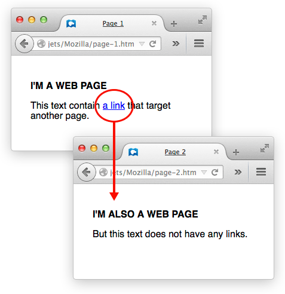

{{QuicklinksWithSubPages("/zh-CN/docs/Learn/Common_questions")}}

通过这篇文章，我们将了解什么是超链接以及超链接的重要性。

<table class="learn-box standard-table">
  <tbody>
    <tr>
      <th scope="row">前提：</th>
      <td>
        你该知道
        <a href="/zh-CN/docs/learn/How_the_Internet_works"
          >互联网是怎样工作的 </a
        >，并且熟悉
        <a
          href="/zh-CN/docs/learn/常见问题/网页，网站，网页服务器和搜索引擎的区别是什么？"
          >网页，网站，网络服务器和搜索引擎间的区别</a
        >
      </td>
    </tr>
    <tr>
      <th scope="row">目标：</th>
      <td>了解 Web 上的超链接概念以及超链接的重要性。</td>
      <td></td>
    </tr>
  </tbody>
</table>

## 概述

超链接（Hyperlink），通常简称为链接（link），是网络背后的核心概念。为了解释什么是链接，我们需要回到网络架构的底层。

早在 1989 年，网络发明人蒂姆·伯纳斯 - 李（Tim Berners-Lee）就提出了网站的三大支柱：

1. {{Glossary("URL")}}, 跟踪 Web 文档的地址系统
2. {{Glossary("HTTP")}}, 一个传输协议，以便在给定 URL 时查找文档
3. {{Glossary("HTML")}}, 允许嵌入超链接的文档格式

正如你在三大支柱中所看到的，网络上的一切都围绕着文档以及如何访问它们。Web 的最初目的是提供一种简单的方式来访问，阅读和浏览文本文档。从那时起，网络已经发展到提供图像，视频和二进制数据的访问，但是这些改进几乎没有改变三大支柱。

在 Web 之前，很难访问文档并从一个文档跳转到另一个文档。人类可以理解的 URL 已经使得文档容易被访问，但是你很难通过输入一个长 URL 来访问一个文档。超链接改变了这一切。链接可以将任何文本与 URL 相关联，因此用户只要激活链接就可以到达目标文档。

默认情况下，链接是一段具有下划线的蓝色文本，在视觉上与周围的文字明显不同。用手指触击或用鼠标点击一个链接会激活链接；你如果使用键盘，那么按 Tab 键直到链接处于焦点，然后按 Enter 键或空格键来激活链接。

链接是一个突破，它使得网络变得非常有用和成功。在本文的其余部分，我们讨论各种类型的链接及链接在现代网页设计中的重要性。

## 深入探索

正如我们所说的，链接是一段链接到 URL 的文本，我们使用链接来跳转到另一个文档。关于链接，有一些细节值得考虑：

### 链接的类型

- 内链
  - : 内链是你的网页之间的链接。没有内部链接，就没有网站（当然，除非是只有一页的网站）。
- 外链
  - : 外链是从你的网页链接到其他人的网页的链接。没有外部链接，就没有 web，因为 web 是网页的网络。使用外部链接提供除你自己维护的内容之外的信息。
- 传入链接
  - : 传入链接是从其他人的网页链接到你的网页的链接。这只是从被链接者的角度看到的外部链接。请注意，当有人链接到你的网站时，你不必链接回去。

当你建立一个网站时，集中精力处理内部链接，因为这些使你的网站可用。权衡链接的数量，既不要太多也不要太少。我们将在另一篇文章中讨论网站导航的设计问题，但是一般情况下，无论何时添加一个新网页，都要确保至少有一个其他网页链接到新网页。另一方面，如果你的网站的页面多于十个，那么每个页面都需要链接到其他页面。

当你刚开始的时候，你不必担心外部链接和传入链接，但是如果你想让搜索引擎找到你的网站，这些链接就非常重要。（请参阅下面的更多细节。）

### 锚

**大多数链接将两个网页相连。而锚将一个网页中的两个段落相连。** 当你点击指向锚点的链接时，浏览器跳转到当前文档的另一部分，而不是加载新文档。但是，你可以像使用其他链接一样制作和使用锚点。

### 链接和搜索引擎

链接对你的用户和搜索引擎都很重要。每次搜索引擎抓取一个网页时，他们都会按照网页上提供的链接对网站进行索引。搜索引擎不仅可以通过链接来发现网站的各种页面，还可以使用链接的可见文本来确定哪些搜索查询适合到达目标网页。

所以链接会影响搜索引擎链接到你的网站的方式。麻烦的是，很难衡量搜索引擎的活动。公司自然希望他们的网站在搜索结果中排名很高，所有研究结果至少可以说明一些事情：

- 链接的可见文本会影响哪些搜索查询会找到给定的网址。
- 一个网页所拥有的链接越多，它在搜索结果中排名越高。
- 外部链接影响源和目标网页的搜索排名，但有多少不明确。

[SEO](http://en.wikipedia.org/wiki/Search_engine_optimization) (search engine optimization) 是如何使网站在搜索结果中排名高的研究。改善网站的链接使用是一种有用的搜索引擎优化技术。

## 下一步

所以现在当然你想要建立一些链接的网页！

- 为了获得更多的理论背景，了解 [URL 以及其结构](/zh-CN/docs/Learn/Common_questions/What_is_a_URL),因为每个链接都指向一个 URL.
- 想要一些更实际的东西？我们的 [HTML 介绍](/zh-CN/docs/Learn/HTML/Introduction_to_HTML) 模块中的[创建超链接](/zh-CN/docs/Learn/HTML/Introduction_to_HTML/Creating_hyperlinks) 解释了如何实现详细的超链接
