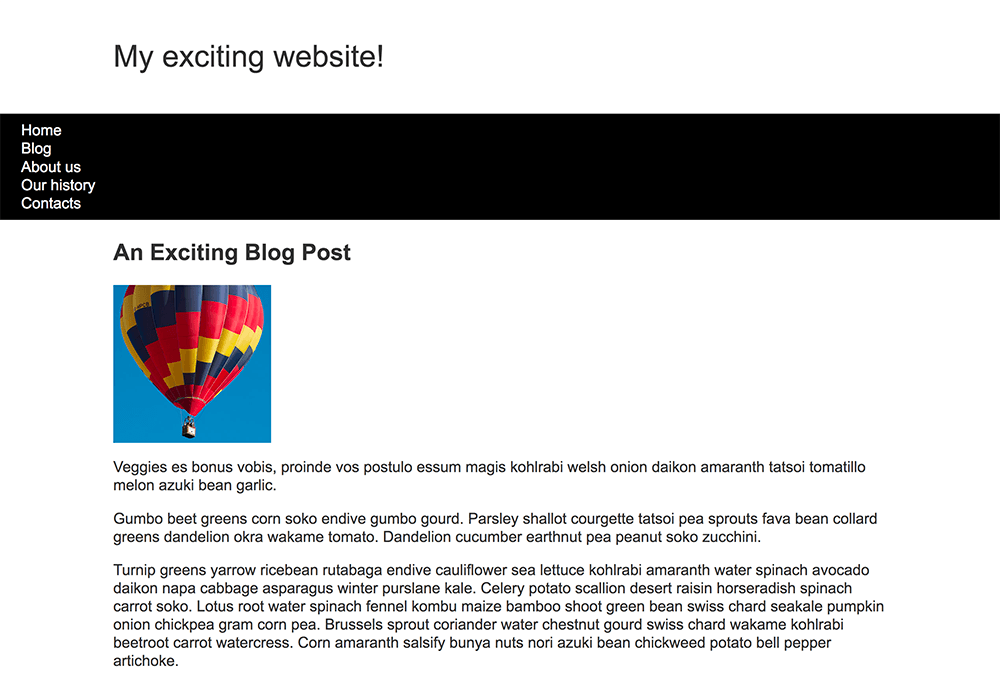

{{LearnSidebar}}
{{PreviousMenu("Learn/CSS/CSS_layout/Supporting_Older_Browsers", "Learn/CSS/CSS_layout")}}

如果你已经完成了本模块的学习，那么你就已经掌握了今天进行 CSS 布局所需要的基本知识，并且也可以使用旧的 CSS。这个任务将通过使用各种技术开发一个简单的网页布局来测试你的一些知识。

<table>
  <tbody>
    <tr>
      <th scope="row">任务需知：</th>
      <td>
在尝试此评估之前，你应该已经阅读了本模块中的所有文章。
</td>
    </tr>
    <tr>
      <th scope="row">任务目标：</th>
      <td>
测试对 CSS 弹性盒、栅格、浮动和定位布局方法的基本理解。
</td>
    </tr>
  </tbody>
</table>

## 从这里开始

你可以在[这里](https://github.com/mdn/learning-area/tree/main/css/css-layout/fundamental-layout-comprehension)下载基本的 HTML、CSS 和六张图片素材。

将 HTML 文档和样式表文件保存到你自己计算机的目录中，并将图像添加到名为 `images` 的文件夹中，在浏览器中打开 `index.html` 文件应该会提供一个具有基本样式但没有布局的页面，该页面应该类似下面所示的图像。

此页面开始于浏览器在正常流中显示的布局的所有内容。

另外，你可以使用像 [Glitch](https://glitch.com/) 这样的网站来做评估，把 HTML 和 CSS 代码粘贴进去。注意，如果你使用在线编辑器，你将需要上传图片并替换 `src` 属性中的值，以指向新的图片位置。如果你使用的在线编辑器没有单独的 CSS 面板，可以随意将其放在文档头部的 `<style>` 元素中。

> **备注：** 如果你卡住了，向我们请求协助——你可以在页面底部的[评估或更多帮助](#评估或更多帮助)获取指引。

## 项目简介

我们已经为你提供了一些原始的 HTML、基本的 CSS 文件和图像——现在你需要设计布局页面。

### 目标

你需要实现你自己的布局。下面是你应该完成的目标：

1. 在一行中显示导航选项，并且选项之间拥有相同的空间。
2. 导航条应随着内容一起滚动并且在触碰到视口顶部之后于顶部固定。
3. 文章内的图片应该被文本包围。
4. {{htmlelement("article")}} 与 {{htmlelement("aside")}} 元素应该为双列布局。它们的列尺寸应该是弹性的，以便在浏览器窗口收缩得更小的时候能够变窄。
5. 照片应该以有 1px 间隔的两列网格显示出来。

在实现布局的过程中你不需要修改 HTML，下面是你应该使用的技术：

- Positioning
- Float
- Flexbox
- CSS Grid Layout

你能够用好几种方法来实现这些目标，完成一件事的方法并不只有一个。尝试不同的方式，并且看看哪个最有效。尝试之后写下笔记，你可以在本练习的帖子中或者 [#mdn](irc://irc.mozilla.org/mdn) IRC 频道讨论你实现它们的方式。

## 评估

如果这个评估是一系列课程的一部分，你应该可以让你的老师或导师为你批改。如果你是自学，可以很容易地在 [Learning Area Discourse thread](https://discourse.mozilla-community.org/t/learning-web-development-marking-guides-and-questions/16294) 或 [Mozilla IRC](https://wiki.mozilla.org/IRC) 的 [#mdn](irc://irc.mozilla.org/mdn) IRC 频道回复得到批改指南。请先自己试着做——作弊学不到任何东西！

{{PreviousMenu("Learn/CSS/CSS_layout/Supporting_Older_Browsers", "Learn/CSS/CSS_layout")}}
