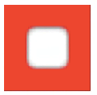
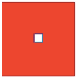
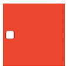
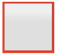
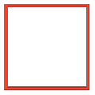

{{LearnSidebar}}{{PreviousMenuNext("Learn/Forms/Styling_web_forms", "Learn/Forms/UI_pseudo-classes", "Learn/Forms")}}

在本文中，我们将看到 [HTML](/zh-CN/docs/HTML) 表单怎样使用 [CSS](/zh-CN/docs/CSS) 装饰难以定制的表单小部件。如[前面章节](/zh-CN/docs/HTML/Forms/Styling_HTML_forms) 所示，文本域和按钮完全可以使用 CSS，现在我们将深入探索 HTML 表单样式。

在继续之前，让我们回忆一下两种表单小部件：

- bad
  - : 这个元素很难设计，需要一些复杂的技巧，有时还涉及到高级的 CSS3 的知识。
- ugly
  - : 忘记使用 CSS 来设计这些元素吧。你最多能做一点点事情，还不能保证可以跨浏览器，而且在它们出现时永远不能做到完全的受控。

## CSS 表现力

除了文本框和按钮之外，使用其他表单小部件的主要问题是在许多情况下，CSS 的表现不能满足设计复杂的小部件的要求。

HTML 和 CSS 最新的发展扩展了 CSS 的表现力：

- [CSS 2.1](http://www.w3.org/TR/CSS21/selector.html#dynamic-pseudo-classes) 非常受限，只给出三个伪类：

  - {{cssxref(":active")}}
  - {{cssxref(":focus")}}
  - {{cssxref(":hover")}}

- [CSS Selector Level 3](http://www.w3.org/TR/css3-selectors/) 增加了三个与 HTML 表单相关的伪类：

  - {{cssxref(":enabled")}}
  - {{cssxref(":disabled")}}
  - {{cssxref(":checked")}}
  - {{cssxref(":indeterminate")}}

- [CSS Basic UI Level 3](http://dev.w3.org/csswg/css3-ui/#pseudo-classes) 也增加了几个伪类用于描述小部件的状态：

  - {{cssxref(":default")}}
  - {{cssxref(":valid")}}
  - {{cssxref(":invalid")}}
  - {{cssxref(":in-range")}}
  - {{cssxref(":out-of-range")}}
  - {{cssxref(":required")}}
  - {{cssxref(":optional")}}
  - {{cssxref(":read-only")}}
  - {{cssxref(":read-write")}}

- [CSS Selector Level 4](http://dev.w3.org/csswg/selectors4/) 目前处于积极应用和重点讨论的状态，但并不打算为表单做更多的改善：

  - {{cssxref(":user-error")}} 只是改进了伪类{{cssxref(":invalid")}}。

所有这一切是一个好的开端，但是有两个问题。首先，一些浏览器不需要实现 CSS 2.1 之上的特性。其次在设计像日期选择器这样的复杂的小部件时，这些实在不够好。

浏览器厂家在 CSS 表现力在表单方面的扩展做了一些尝试，在某些情况下，知道什么可用也挺不错的。

> **警告：** 尽管 这些尝试很有趣，但**它们是非标准的，也就是不可靠的。**. 如果你使用它们 (也许你并不常用)，你要自己承担风险，使用非标准的属性[对于 Web 并不是好事](http://www.alistapart.com/articles/every-time-you-call-a-proprietary-feature-css3-a-kitten-dies/) 。

- [Mozilla CSS 扩展](/zh-CN/docs/CSS/CSS_Reference/Mozilla_Extensions)

  - {{cssxref(":-moz-placeholder")}}
  - {{cssxref(":-moz-submit-invalid")}}
  - {{cssxref(":-moz-ui-invalid")}}
  - {{cssxref(":-moz-ui-valid")}}

- [WebKit CSS 扩展](/zh-CN/docs/CSS/CSS_Reference/Webkit_Extensions)

  - {{cssxref("::-webkit-input-placeholder")}}
  - [其他](http://trac.webkit.org/wiki/Styling%20Form%20Controls)

- [Microsoft CSS 扩展](http://msdn.microsoft.com/en-us/library/ie/hh869403%28v=vs.85%29.aspx)

  - [`:-ms-input-placeholder`](http://msdn.microsoft.com/en-us/library/ie/hh772745%28v=vs.85%29.aspx)

### 控制表单元素的外观

基于 WebKit(Chrome, Safari) 和 Gecko(Firefox) 的浏览器提供更高级的 HTML 部件定制。它们也实现了跨平台，因此需要一种方式把原生小部件转换为用户可设置样式的小部件。

为此，它们使用了专有属性：{{cssxref("-webkit-appearance")}}或{{cssxref("-moz-appearance")}}。**这些属性是非标准的，不应该使用**。事实上，它们在 WebKit 和 Gecko 中的表现也是不相同的。然而，有一个值很好用：`none`，用这个值，你（几乎完全）能控制一个已知小部件的样式。

因此，如果你在应用一个元素的样式时遇到麻烦，可以尝试使用那些专有属性。我们下面有一些例子，这个属性最成功的例子是 WebKit 浏览器中的搜索域的样式：

```html
<form>
  <input type="search" />
</form>
```

```css
<style>
input[type=search] {
    border: 1px dotted #999;
    border-radius: 0;

    -webkit-appearance: none;
}
</style>
```

{{EmbedLiveSample("控制表单元素的外观", 250, 40)}}

> **备注：** 当我们谈及 Web 技术的时总是很难预测未来。扩展 CSS 表现力是很困难的，其他规范也做了一些探索性的工作，如 [Shadow DOM](http://dvcs.w3.org/hg/webcomponents/raw-file/tip/spec/shadow/index.html) 提供了一些观点。可完全设置样式的表单的问题还远未结束。

## 举例

### 复选框和单选按钮

独自设计复选框或单选按钮的样式是让人抓狂的。例如由于浏览器反应各不相同，在修改复选框和单选按钮的大小时，并不保证确实能改变它们。

#### 一个简单的测试用例

让我们研究一下下面的测试用例：

```html
<span><input type="checkbox" /></span>
```

```css
span {
  display: inline-block;
  background: red;
}

input[type="checkbox"] {
  width: 100px;
  height: 100px;
}
```

这里是不同的浏览器的处理方式：

| 浏览器                            | 视图                              |
| --------------------------------- | --------------------------------- |
| Firefox 57 (Mac OSX)              |      |
| Firefox 57 (Windows 10)           |  |
| Chrome 63 (Mac OSX)               |       |
| Chrome 63 (Windows 10)            |   |
| Internet Explorer 11 (Windows 10) |             |
| Edge 16 (Windows 10)              |             |

#### 更复杂的例子

由于 Opera 和 Internet Explorer 没有像{{cssxref("-webkit-appearance")}}或{{cssxref("-moz-appearance")}}这样的特性，使用它们是不合适的。幸运的是，CSS 有足够多的表现方式可以找到解决方法。让我们做一个很普通的例子：

```html
<form>
  <fieldset>
    <p>
      <input type="checkbox" id="first" name="fruit-1" value="cherry" />
      <label for="first">I like cherry</label>
    </p>
    <p>
      <input
        type="checkbox"
        id="second"
        name="fruit-2"
        value="banana"
        disabled />
      <label for="second">I can't like banana</label>
    </p>
    <p>
      <input type="checkbox" id="third" name="fruit-3" value="strawberry" />
      <label for="third">I like strawberry</label>
    </p>
  </fieldset>
</form>
```

带有一些基本的样式：

```css
body {
  font: 1em sans-serif;
}

form {
  display: inline-block;

  padding: 0;
  margin: 0;
}

fieldset {
  border: 1px solid #ccc;
  border-radius: 5px;
  margin: 0;
  padding: 1em;
}

label {
  cursor: pointer;
}

p {
  margin: 0;
}

p + p {
  margin: 0.5em 0 0;
}
```

> **备注：** 下面的内容（仅限样式化 checkbox 部分）与英文版出入极大，猜测已经是过时内容

现在，让我们设计一个定制复选框的样式

计划用自己的图像替换原生的复选框，首先需要准备复选框在所有状态下的图像，那些状态是：未选、已选、禁用不选、禁用已选。该图像将用作 CSS 精灵：


一开始要隐藏初始复选框。可以简单的把它们从页面视图中拿开。这里要考虑两个重要的事情：

- 不能用`display:none`来隐藏复选框，因为后面我们需要把复选框对用户可见。而使用`display:none`，用户不能再访问这个复选框，这就表示复选框不能选择或不选择。
- 我们将使用 CSS3 选择器来实现定制的样式，为了支持旧版浏览器，可以在所有选择器前设置{{cssxref(":root")}}伪类。目前所有我们需要支持的浏览器都支持{{cssxref(":root")}}伪类，但是其他的并不能保证。这是一个过滤旧的 Internet Explorer 的便利方式的例子。那些旧版浏览器将看到传统的复选框，而新式的浏览器可以看到定制的复选框。

```css
:root input[type="checkbox"] {
  /* original check box are push outside the viexport */
  position: absolute;
  left: -1000em;
}
```

现在加上自己的图像就可以摆脱原来的复选框了，为此，要在初始的复选框后面加上{{HTMLElement("label")}}元素，并使用它的{{cssxref(":before")}}伪元素。因此在下面章节中，要使用 [selector 属性](/zh-CN/docs/CSS/Attribute_selectors) 来选择复选框，然后使用 [adjacent sibling selector](/zh-CN/docs/CSS/Adjacent_sibling_selectors) 来选择原有复选框后面的`label`。最后，访问{{cssxref(":before")}}伪元素来设计复选框显示定制样式。

```css
:root input[type="checkbox"] + label:before {
  content: "";
  display: inline-block;
  width: 16px;
  height: 16px;
  margin: 0 0.5em 0 0;
  background: url("https://developer.mozilla.org/files/4173/checkbox-sprite.png")
    no-repeat 0 0;

  /* The following is used to adjust the position of
   the check boxes on the text baseline */

  vertical-align: bottom;
  position: relative;
  bottom: 2px;
}
```

在初始复选框上使用{{cssxref(":checked")}}和{{cssxref(":disabled")}}伪类来改变定制复选框的状态。因为使用了 CSS 精灵，我们需要做的只是修改背景的位置。

```css
:root input[type="checkbox"]:checked + label:before {
  background-position: 0 -16px;
}

:root input[type="checkbox"]:disabled + label:before {
  background-position: 0 -32px;
}

:root input[type="checkbox"]:checked:disabled + label:before {
  background-position: 0 -48px;
}
```

最后一件（但是很重要的）事情：当用户使用键盘从一个表单小部件导航到另一个表单小部件时，每个小部件都应该被显式聚焦。因为我们隐藏了初始的复选框，我们必须自己实现这个特性，让用户知道定制复选框在表单中的位置，下列的 CSS 实现了它们聚焦。

```css
:root input[type="checkbox"]:focus + label:before {
  outline: 1px dotted black;
}
```

你可以在线查看结果：

{{EmbedLiveSample("更复杂的例子", 250, 130)}}

### Dealing with the select nightmare

{{HTMLElement("select")}} 元素被认为是一个 "丑陋的" 组件，因为不可能保证它在跨平台时样式化的一致性。然而，有些事情是可能的。废话少说，让我们来看一个例子：

```html
<select>
  <option>Cherry</option>
  <option>Banana</option>
  <option>Strawberry</option>
</select>
```

```css
select {
  width: 80px;
  padding: 10px;
}

option {
  padding: 5px;
  color: red;
}
```

下面的表格显示了在两种情况下不同浏览器的处理方式。头两列就是上面的例子。后面两列使用了其他的定制 CSS，可以对小部件的外观进行更多的控制：

```css
select,
option {
  -webkit-appearance: none; /* To gain control over the appearance on WebKit/Chromium */
  -moz-appearance: none; /* To gain control over the appearance on Gecko */

  /* To gain control over the appearance on and Trident (IE)
     Note that it also works on Gecko and has partial effects on WebKit */
  background: none;
}
```

<table>
  <thead>
    <tr>
      <th colspan="1" rowspan="2" scope="col">Browser</th>
      <th colspan="2" scope="col">Regular rendering</th>
      <th colspan="2" scope="col">Tweaked rendering</th>
    </tr>
    <tr>
      <th scope="col">closed</th>
      <th scope="col">open</th>
      <th scope="col">closed</th>
      <th scope="col">open</th>
    </tr>
  </thead>
  <tbody>
    <tr>
      <td>Firefox 57 (Mac OSX)</td>
      <td>
        
      </td>
      <td>
        
      </td>
      <td>
        
      </td>
      <td>
        
      </td>
    </tr>
    <tr>
      <td>Firefox 57 (Windows 10)</td>
      <td>
        
      </td>
      <td>
        
      </td>
      <td>
        
      </td>
      <td>
        
      </td>
    </tr>
    <tr>
      <td>Chrome 63 (Mac OSX)</td>
      <td>
        
      </td>
      <td>
        
      </td>
      <td>
        
      </td>
      <td>
        
      </td>
    </tr>
    <tr>
      <td>Chrome 63 (Windows 10)</td>
      <td>
        
      </td>
      <td>
        
      </td>
      <td>
        
      </td>
      <td>
        
      </td>
    </tr>
    <tr>
      <td>Opera 49 (Mac OSX)</td>
      <td>
        
      </td>
      <td>
        
      </td>
      <td>
        
      </td>
      <td>
        
      </td>
    </tr>
    <tr>
      <td>IE11 (Windows 10)</td>
      <td>
        
      </td>
      <td>
        
      </td>
      <td>
        
      </td>
      <td>
        
      </td>
    </tr>
    <tr>
      <td>Edge 16 (Windows 10)</td>
      <td>
        
      </td>
      <td>
        
      </td>
      <td>
        
      </td>
      <td>
        
      </td>
    </tr>
  </tbody>
</table>

如你所见，计时使用了`-*-appearance`属性的帮助，任然有一些遗留的问题：

- 不同的操作系统和浏览器对属性{{cssxref("padding")}} 属性的处理各不相同。
- Internet Explorer 旧版本不允许平滑样式
- Firefox 没有实现下拉箭头的样式。
- 如果要在下拉列表内实现{{HTMLElement("option")}}元素样式，Chrome 和 Opera 浏览器的表现在不同的系统中是不一样的。

在我们的例子中，只使用了三个 CSS 属性，在考虑使用更多 CSS 属性时，可以想象是很混乱的。正如我们看到的，CSS 始终不适合用来修改这些小部件的外观，但是仍然可以用来稍微做一些事情。如果愿意的话，可以演示一下在不同操作系统和浏览器之间的区别。

我们也可以帮助了解在下一章节中哪个属性更合适：[Properties compatibility table for form widgets](/zh-CN/docs/Properties_compatibility_table_for_forms_widgets)

## 走向更完美表单之路：有用的库和 polyfills（腻子）

虽然对于复选框和单选按钮而言，CSS 的表示方式足够丰富，但是对更高级的小部件来说差距仍然很大。即使可以用{{HTMLElement("select")}}元素作一些事情，但是对 file 小部件的样式完全没用。对于日期选择器也同样如此。

要实现对表单小部件的完全控制，你别无选择，只能选择依靠 JavaScript。在文章 [How to build custom form widgets](/zh-CN/docs/HTML/Forms/How_to_build_custom_form_widgets) 中，我们将看到具体的做法，其中还有一些非常有用的库：

- [Uni-form](http://sprawsm.com/uni-form/)是一个对采用 CSS 样式的表单标记实现标准化的框架，在使用 jQuery 时，还提供一些附加特性，但这是可选的。
- [Formalize](http://formalize.me/)是对公共 JavaScript 框架的扩展（如 jQuery, Dojo, YUI 等），有助于规范和定制表单。
- [Niceforms](http://www.emblematiq.com/lab/niceforms/)是一个独立的 JavaScript 方法，能提供 web 表单的完整定制。

下面的库不止应用于表单，他们在处理 HTML 表单时是非常有趣的：

- [jQuery UI](http://jqueryui.com/)做了一些有趣的改进，可以定制象日期选择器（特别关注无障碍）这样的小部件。
- [Twitter Bootstrap](http://twitter.github.com/bootstrap/base-css.html#forms) 在规范表单时是非常有用的。
- [WebShim](http://afarkas.github.com/webshim/demos/demos/webforms.html) 是一个大型工具，可以用来处理浏览器对 HTML5 的支持。对 web 表单部分确实有用。

记住，使用 CSS 和 JavaScript 是有副作用的。所以在选择使用那些库时，应该在脚本失败的情况下能回滚样式表。脚本失败的原因很多，尤其在手机应用中，因此你需要尽可能好的设计你的 Web 站点或应用。

## 总结

虽然 HTML 表单使用 CSS 仍有一些困难，但通常也有方法绕过它们。即使没有清楚的，通用的解决方案，但新式的浏览器也提供了新的可能性。目前最好的方法是更多的学习不同浏览器支持 CSS 的方式，并应用于 HTML 表单小部件。

在本指南的下一章节中，我们将探讨现代浏览器中用于为不同表单状态添加样式的可用的 [UI 伪类](/zh-CN/docs/Learn/Forms/UI_pseudo-classes)。

{{PreviousMenuNext("Learn/Forms/Styling_web_forms", "Learn/Forms/UI_pseudo-classes", "Learn/Forms")}}

### 进阶内容

- [如何构建自定义表单控件](/zh-CN/docs/Learn/Forms/How_to_build_custom_form_controls)
- [通过 JavaScript 发送表单](/zh-CN/docs/Learn/Forms/Sending_forms_through_JavaScript)
- [表单控件的属性兼容性列表](/zh-CN/docs/Learn/Forms/Property_compatibility_table_for_form_controls)
