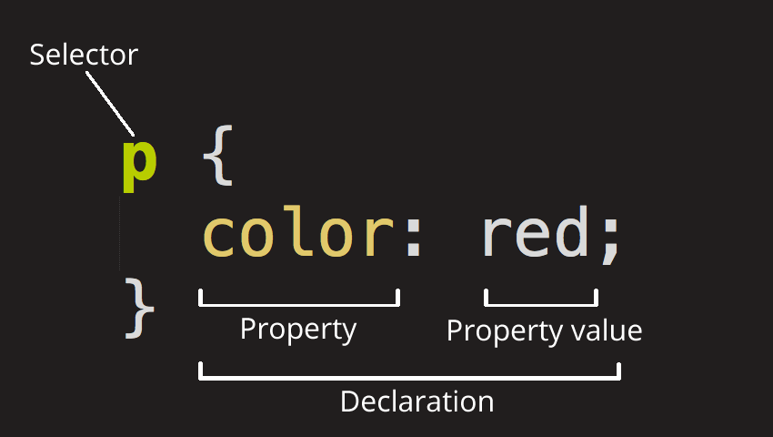

{{LearnSidebar}}

{{PreviousMenuNext("Learn/Getting_started_with_the_web/HTML_basics", "Learn/Getting_started_with_the_web/JavaScript_basics", "Learn/Getting_started_with_the_web")}}

CSS（Cascading Style Sheets，层叠样式表）是为 web 内容添加样式的代码。本节将介绍 CSS 的基础知识，并解答像这样的问题：怎样将文本设置为红色？怎样将内容显示在屏幕的特定位置？怎样用背景图片或颜色来装饰网页？

## 什么是 CSS？

和 HTML 类似，CSS 也不是真正的编程语言，甚至不是标记语言。**CSS 是一门样式表语言**，这也就是说人们可以用它来选择性地为 HTML 元素添加样式。举例来说，这个 CSS 代码选择了所有的段落文字，并将它们设置为红色。

```css
p {
  color: red;
}
```

让我们来试一试！在文本编辑器中，将上述的三行 CSS 代码粘贴到一个新的文件中，将文件命名为 `style.css` 并保存到 `styles` 文件夹下。

为了使代码发挥作用，我们仍然需要将上述 CSS 样式应用到你的 HTML 文档中。否则，这些样式不会改变 HTML 的外观。（如果你没有完成前几节的实践，请复习[处理文件](/zh-CN/docs/Learn/Getting_started_with_the_web/Dealing_with_files) 和 [HTML 基础](/zh-CN/docs/Learn/Getting_started_with_the_web/HTML_basics)。）

1. 打开 `index.html` 文件，然后将下面一行粘贴到文档头部（也就是 {{HTMLElement("head")}} 和 `</head>` 标签之间）。

   ```html
   <link href="styles/style.css" rel="stylesheet" />
   ```

2. 保存 `index.html` 并用浏览器将其打开。应该看到以下页面：

如果段落文字变红，那么祝贺你，CSS 样式已经生效了。

### “CSS 规则集”详解

让我们来剖析一下红色段落文字的 CSS 代码，了解它是如何工作的：



整个结构称为 **规则集**（*规则集*通常简称*规则*），注意各个部分的名称：

- 选择器（Selector）
  - : HTML 元素的名称位于规则集开始。它选择了一个或多个需要添加样式的元素（在这个例子中就是 {{HTMLElement("p")}} 元素）。要给不同元素添加样式，只需要更改选择器。
- 声明（Declaration）
  - : 一个单独的规则，如 `color: red;` 用来指定添加样式元素的**属性**。
- 属性（Properties）
  - : 改变 HTML 元素样式的途径（本例中 `color` 就是 {{htmlelement("p")}} 元素的属性）。CSS 中，由编写人员决定修改哪个属性以改变规则。
- 属性的值（Property value）
  - : 在属性的右边，冒号后面即**属性的值**，它从指定属性的众多外观中选择一个值（我们除了 `red` 之外还有很多属性值可以用于 `color` ）。

注意其他重要的语法：

- 除了选择器部分，每个规则集都应该包含在成对的大括号里（`{}`）。
- 在每个声明里要用冒号（`:`）将属性与属性值分隔开。
- 在每个规则集里要用分号（`;`）将各个声明分隔开。

如果要同时修改多个属性，只需要将它们用分号隔开，就像这样：

```css
p {
  color: red;
  width: 500px;
  border: 1px solid black;
}
```

### 选择多个元素

也可以选择多种类型的元素并为它们添加一组相同的样式。将不同的选择器用逗号分开。例如：

```css
p,
li,
h1 {
  color: red;
}
```

### 不同类型的选择器

选择器有许多不同的类型。上面只介绍了**元素选择器**，用来选择 HTML 文档中给定的元素。但是选择操作可以更加具体。下面是一些常用的选择器类型：

<table class="standard-table no-markdown">
  <thead>
    <tr>
      <th scope="col">选择器名称</th>
      <th scope="col">选择的内容</th>
      <th scope="col">示例</th>
    </tr>
  </thead>
  <tbody>
    <tr>
      <td>元素选择器（也称作标签或类型选择器）</td>
      <td>所有指定类型的 HTML 元素</td>
      <td><code>p</code><br />选择 <code>&#x3C;p></code></td>
    </tr>
    <tr>
      <td>ID 选择器</td>
      <td>
        具有特定 ID 的元素。单一 HTML 页面中，每个 ID 只对应一个元素，一个元素只对应一个 ID
      </td>
      <td>
        <code>#my-id</code><br />选择 <code>&#x3C;p id="my-id"></code> 或
        <code>&#x3C;a id="my-id"></code>
      </td>
    </tr>
    <tr>
      <td>类选择器</td>
      <td>
        具有特定类的元素。单一页面中，一个类可以有多个实例
      </td>
      <td>
        <code>.my-class</code><br />选择
        <code>&#x3C;p class="my-class"></code> 和
        <code>&#x3C;a class="my-class"></code>
      </td>
    </tr>
    <tr>
      <td>属性选择器</td>
      <td>拥有特定属性的元素</td>
      <td>
        <code>img[src]</code><br />选择
        <code>&#x3C;img src="myimage.png"></code> 但不是
        <code>&#x3C;img></code>
      </td>
    </tr>
    <tr>
      <td>伪类选择器</td>
      <td>
        特定状态下的特定元素（比如鼠标指针悬停于链接之上）
      </td>
      <td>
        <code>a:hover</code><br />选择仅在鼠标指针悬停在链接上时的 <code>&#x3C;a></code> 元素
      </td>
    </tr>
  </tbody>
</table>

选择器的种类远不止于此，更多信息请参阅 MDN 的[选择器指南](/zh-CN/docs/Learn/CSS/Building_blocks/Selectors)。

## 字体和文本

在探索了一些 CSS 基础后，我们来把更多规则和信息添加至 `style.css` 中，从而让示例更美观。

1. 第一步，找到之前在[你的网站会是什么样子？](/zh-CN/docs/Learn/Getting_started_with_the_web/What_will_your_website_look_like) 中保存的 [Google Font 输出的地址](/zh-CN/docs/Learn/Getting_started_with_the_web/What_will_your_website_look_like#字体)。并以 {{htmlelement("link")}} 元素的形式添加进 `index.html` 文档头部（ {{HTMLElement("head")}} 和 `</head>` 之间的任意位置）。代码如下：

   ```html
   <link
     href="https://fonts.googleapis.com/css?family=Open+Sans"
     rel="stylesheet" />
   ```

   这段代码将你的页面链接到一个样式表，该样式表将 Open Sans 字体家族与你的网页一起加载。

2. 接下来，删除 `style.css` 文件中已有的规则。虽然测试是成功的，但是红字看起来并不太舒服。
3. 添加以下几行（如下图所示），用你在[你的网站会是什么样子？](/zh-CN/docs/Learn/Getting_started_with_the_web/What_will_your_website_look_like#字体)中选择的 `font-family` 替换 `font-family`。`font-family` 属性指的是你想用于文本的字体。这个规则为整个页面定义了一个全局的基本字体和字体大小。由于 {{HTMLElement("html")}} 是整个页面的父元素，它里面的所有元素都继承相同的 `font-size` 和 `font-family`。

   ```css
   html {
     font-size: 10px; /* px 表示“像素（pixels）”: 基础字号为 10 像素 */
     font-family: "Open Sans", sans-serif; /* 这应该是你从 Google Fonts 得到的其余输出。 */
   }
   ```

   > **备注：** CSS 文档中所有位于 `/*` 和 `*/` 之间的内容都是 **CSS 注释**。浏览器在渲染代码时会忽略注释。CSS 注释是一种让你写下关于你的代码或逻辑的有用注解的方式。

4. 接下来为 HTML 主体内的元素（{{htmlelement("Heading_Elements", "h1")}}、{{htmlelement("li")}} 和 {{htmlelement("p")}}）设置字体大小。我们也将标题居中显示。最后，扩充下方的第二个规则集，为正文设置行高和字间距，从而提高页面的可读性。

   ```css
   h1 {
     font-size: 60px;
     text-align: center;
   }

   p,
   li {
     font-size: 16px;
     line-height: 2;
     letter-spacing: 1px;
   }
   ```

可以随时调整这些 `px` 值来获得满意的结果，以下是大体效果：


## CSS：一切皆盒子

编写 CSS 时你会发现，你的工作好像是围绕着一个一个盒子展开的——设置尺寸、颜色、位置，等等。页面里大部分 HTML 元素都可以被看作若干层叠的盒子。


照片来自 [https://www.geograph.org.uk/photo/3418115](https://www.geograph.org.uk/photo/3418115) ，[Jim Barton](https://www.geograph.org.uk/profile/26362) [cc-by-sa/2.0](https://creativecommons.org/licenses/by-sa/2.0/) 版权所有

CSS 布局主要是基于*盒子模型*。在你的页面上占用空间的每个盒子都有类似的属性：

- `padding`（内边距）：是指内容周围的空间。在下面的例子中，它是段落文本周围的空间。
- `border`（边框）：是紧接着内边距的线。
- `margin`（外边距）：是围绕元素边界外侧的空间。


这里还使用了：

- `width`：元素的宽度
- `background-color`：元素内容和内边距底下的颜色
- `color`：元素内容（通常是文本）的颜色
- `text-shadow`：为元素内的文本设置阴影
- `display`：设置元素的显示模式（继续阅读文章以了解更多细节）

开始在页面中添加更多 CSS 吧！大胆将这些新规则都添加到 `style.css` 的底部，而不要纠结改变属性值会带来什么结果。

### 更改页面颜色

```css
html {
  background-color: #00539f;
}
```

这条规则为整个页面设置了背景颜色。将颜色代码修改为设置为[在“我的网站将会是什么样子？”中所计划的颜色](/zh-CN/docs/Learn/Getting_started_with_the_web/What_will_your_website_look_like#主题颜色)。

### 文档体样式

```css
body {
  width: 600px;
  margin: 0 auto;
  background-color: #ff9500;
  padding: 0 20px 20px 20px;
  border: 5px solid black;
}
```

这里有对于 {{htmlelement("body")}} 元素的几条声明，我们来逐条查看：

- `width: 600px;` 强制页面永远保持 600 像素宽。
- `margin: 0 auto;` 当你在 `margin` 或 `padding` 这样的属性上设置两个值时，第一个值影响元素的*上下*方向（在这个例子中设置为 `0`）；第二个值影响*左右*方向。(这里，`auto` 是一个特殊的值，它将可用的水平空间平均分配给左和右）。如 [Margin 语法](/zh-CN/docs/Web/CSS/margin#语法)中所记载的那样，你也可以使用一个、两个、三个或四个值。
- `background-color: #FF9500;`  如前文所述，指定元素的背景颜色。我们给 body 用了一种略微偏红的橘色以与深蓝色的 {{htmlelement("html")}} 元素形成反差，你也可以尝试其他颜色。
- `padding: 0 20px 20px 20px;` 我们给内边距设置了四个值来让内容四周产生一点空间。这一次我们不设置上方的内边距，设置右边，下方，左边的内边距为 20 像素。值以上、右、下、左的顺序排列。与 `margin` 一样，你也可以像 [Padding 语法](/zh-CN/docs/Web/CSS/padding#语法)中所记载的那样，使用一个、两个、三个或四个值。
- `border: 5px solid black;` 这是为边框的宽度、样式和颜色设置的值。在本例中，它是一个在主体的所有侧面的 5 像素宽的纯黑色边框。

### 定位页面主标题并添加样式

```css
h1 {
  margin: 0;
  padding: 20px 0;
  color: #00539f;
  text-shadow: 3px 3px 1px black;
}
```

你可能已经注意到，在正文的顶部有一个难看的间隙。这是因为浏览器对 {{htmlelement("Heading_Elements", "h1")}} 元素（以及其他元素）应用了默认样式。这可能看起来是个坏主意，但其目的是为没有样式的页面提供基本的可读性。为了消除这种间隙，我们用设置 `margin: 0;` 来覆盖浏览器的默认样式。

接下来，我们将标题的顶部和底部内边距设置为 20 像素。

之后，我们将标题文本设置为与 HTML 背景颜色相同的颜色。

最后，`text-shadow` 对元素的文本内容施加阴影。它的四个值是：

- 第一个像素值设置阴影与文本的**水平偏移量**：它横移的距离。
- 第二个像素值设置阴影与文本的**垂直偏移量**：它向下移动的距离。
- 第三个像素值设置阴影的**模糊半径**。一个更大的值会产生一个更模糊的阴影。
- 第四个值设置阴影的基色。

试着用不同的值进行试验，看看它是如何改变外观的。

### 图像居中

```css
img {
  display: block;
  margin: 0 auto;
}
```

最后，我们把图像居中来使页面更美观。可以复用 body 的 `margin: 0 auto` ，但有一些差异，需要额外的设置来使CSS发挥作用。

{{htmlelement("body")}} 元素是**块级**元素，意味着它占据了页面的空间并且能够赋予外边距和其他改变间距的值。而图片是**行级**元素，不具备块级元素的一些功能。所以为了使图像有外边距，我们必须使用 `display: block` 给予其块级行为。

> **备注：** 以上说明假定所选图片小于页面宽度（600 像素）。更大的图片会溢出 body 并占据页面的其他位置。要解决这个问题，可以：
> 1）使用 [图片编辑器](https://en.wikipedia.org/wiki/Raster_graphics_editor) 来减小图片宽度；
> 2）用 CSS 限制图片大小，即减小 `` 元素 {{cssxref("width")}} 属性的值。

> **备注：** 如果你暂时不能理解 `display: block` 和块级元素与行级元素的差别也没关系；随着你对 CSS 学习的深入，你将明白这个问题。`display` 属性的更多信息请查看 [display 属性参考页面](/zh-CN/docs/Web/CSS/display) 。

## 小结

如果你按部就班完成本文的实践，那么最终可以得到以下页面：


（你可以[在这里](https://mdn.github.io/beginner-html-site-styled/)查看我们的版本。）

若遇到问题，可以参考 GitHub 上的[完整示例代码](https://github.com/mdn/beginner-html-site-styled/blob/gh-pages/styles/style.css)做对比。

本章介绍的 CSS 知识非常有限，更多内容请访问[学习使用 CSS 为 HTML 添加样式](/zh-CN/docs/Learn/CSS)。

{{PreviousMenuNext("Learn/Getting_started_with_the_web/HTML_basics", "Learn/Getting_started_with_the_web/JavaScript_basics", "Learn/Getting_started_with_the_web")}}
