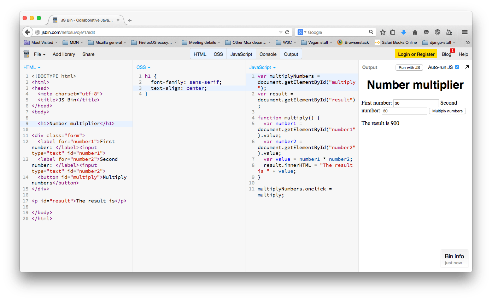
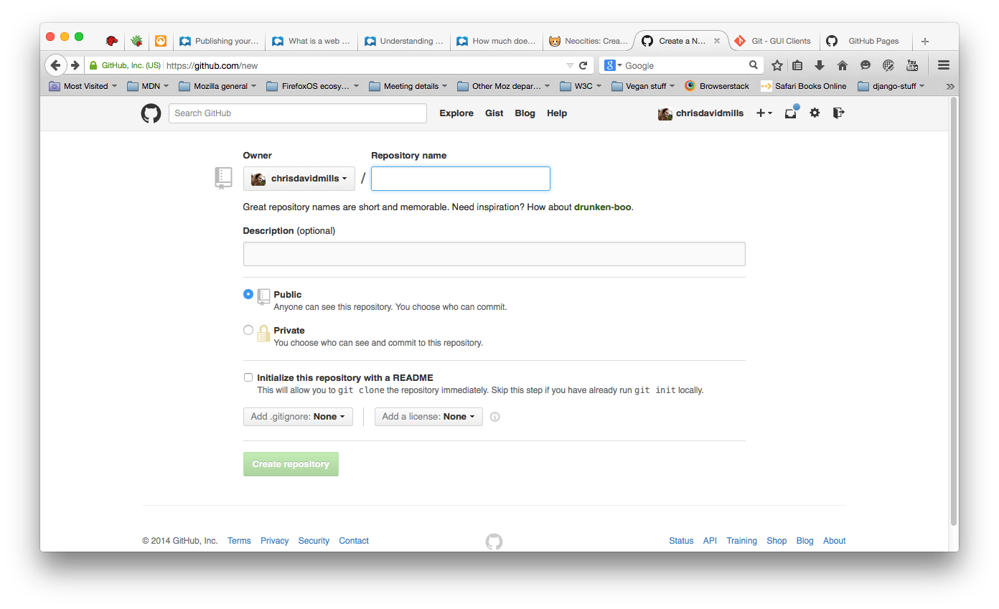

{{LearnSidebar}}{{PreviousMenuNext("Learn/Getting_started_with_the_web/JavaScript_basics", "Learn/Getting_started_with_the_web/How_the_Web_works", "Learn/Getting_started_with_the_web")}}

一旦完成了代码编写和构成网站的文件的组织工作，你就需要把它们全部放在网上，这样人们才能找到它。本文描述如何以最简便的方式将你的简单示例上线至网络。

## 有哪些方法可供选择？

发布一个网站并不是三言两语就能简单说明的，这主要是因为我们有很多种方法去完成它。本文并不试图讲述所有可能的方法，而是先阐述三种适合初学者的方法的优缺点。然后实操一种对许多读者而言立马能用的方法。

### 获取托管服务和域名

想要对内容和网站外观拥有更多的控制，大多数人会选择购买 Web 托管服务和域名：

- Web 托管服务是指在托管服务提供商的 [Web 服务器](/zh-CN/docs/Learn/Common_questions/Web_mechanics/What_is_a_web_server)上租用的文件空间。你将网站文件上传到 Web 服务器，然后 Web 服务器向网站用户提供网站内容。
- [域名](/zh-CN/docs/Learn/Common_questions/Web_mechanics/What_is_a_domain_name)是一个可以让人们访问的独一无二的地址，比如 `https://www.mozilla.org` 或 `https://www.bbc.co.uk`。你可以从**域名注册商**租借域名，期限自定。

许多专业的网站通过这种方法接入互联网。

此外，你需要一个{{Glossary("FTP", "文件传输协议")}}程序（更多详情请参见[在互联网上做一件事要花费多少？：软件](/zh-CN/docs/Learn/Common_questions/Tools_and_setup/How_much_does_it_cost#软件)）将网站文件上传到服务器。不同的 FTP 程序使用方式不一样，但通常情况下，你需要使用托管服务提供商给你的详细信息（比如用户名、密码、主机名）登录到 Web 服务器。然后程序会在两个窗口里分别显示本地文件和服务器文件，这样你就可以来回传输文件：

#### 寻找托管服务和域名的建议

- 我们不会推荐任何商业化的托管服务提供商或域名注册商。要找到托管服务提供商和域名注册商，只需要搜索“Web 托管服务”和“域名”。所有这种类型的公司都允许你查看你想要的域名是否可用。
- 你的家庭或办公的{{Glossary("ISP", "网络服务提供商")}}可能会为小型的网站提供一些受限的托管服务。尽管能使用的功能有限，但非常适合你的第一个网站。
- 也有一些可用的免费服务比如 [Neocities](https://neocities.org/)、[Google Sites](https://sites.google.com/)、[Blogger](https://www.blogger.com) 和 [WordPress](https://wordpress.com/)。重复一遍，一分钱一分货，不过它们对于你的第一个网站是很理想的。
- 许多公司会提供托管服务和域名。

### 使用在线工具如 GitHub 或 Google App Engine

有一些工具能让你在线发布网站：

- [GitHub](https://github.com/) 是一个“社交编程”网站。它允许你上传代码库并将其储存在 [Git](https://git-scm.com/) 版本控制系统里。然后你可以在代码项目上进行协作，系统默认是开源的，也就是说世界上任何人都可以找到你 GitHub 上的代码、使用你的代码、学习你的代码、改善你的代码。GitHub 有一个非常有用的特性叫 [GitHub Pages](https://pages.github.com/)，允许你发布网站。
- [Google App Engine](https://cloud.google.com/appengine/) 是一个让你在 Google 的基础架构上构建和运行应用程序的强大的平台——无论你是需要从头开始构建一个多级的 web 应用程序还是托管一个静态网站。更多信息请参阅[如何在 Google App Engine 上托管你的网站？](/zh-CN/docs/Learn/Common_questions/Tools_and_setup/How_do_you_host_your_website_on_Google_App_Engine)。

尽管这类工具通常是免费的，但你只能使用有限的功能。

### 使用像 CodePen 这样基于 Web 的集成开发环境

有许多仿真一个网站开发环境的 web 应用，能够输入 HTML、CSS 和 JavaScript 代码然后像显示网页一样显示代码的结果——都在一个浏览器标签页中。一般来说，这些工具相对简单，对学习很有帮助，便于分享代码（例如，你想向其他办公室的同事分享技术或者寻求除错帮助），以及免费（基础特性免费）。它们在一个独一无二的网址显示你提交的网页。不过，功能有限并且这些应用程序通常不提供资源（如图像）的托管空间。

使用一下以下几种工具，看看你最喜欢哪一个：

- [JSFiddle](https://jsfiddle.net/)
- [Glitch](https://glitch.com/)
- [JS Bin](https://jsbin.com/)
- [CodePen](https://codepen.io/)

## 通过 GitHub 发布

现在，让我们通过 GitHub Pages 向你演示发布网站是如此的简单。

1. 首先， [注册一个 GitHub 账号，](https://github.com/) 并验证你的邮箱地址。
2. 接下来，你需要[创建一个仓库](https://github.com/new)来存放文件。
3. 在这个页面上，在 _Repository name_ 输入框里输入 _username_.github.io，username 是你的用户名。比如，我们的朋友 bobsmith 会输入 _bobsmith.github.io。
   同时勾选_ _Initialize this repository with a README_，然后点击 _Create repository_。
4. 然后，将你的网站文件夹里的内容拖拽到你的仓库，再点击 _Commit changes_。

   > [!NOTE]
   > 确保你的文件夹有一个 `index.html` 文件。

5. 现在将你的浏览器转到 _username_.github.io 在线查看你的网站。假如用户名为 _chrisdavidmills_, 请转到 [_chrisdavidmills_.github.io](https://chrisdavidmills.github.io/)。

   > [!NOTE]
   > 你的网站可能需要几分钟的时间才能投入使用。如果它不能立即工作，等待几分钟，然后再试一次。

想要了解更多，请看 [GitHub Pages Help](https://docs.github.com/en/pages/getting-started-with-github-pages).

## 延展阅读

- [什么是 web 服务器？](/zh-CN/docs/Learn/Common_questions/Web_mechanics/What_is_a_web_server)
- [什么是域名？](/zh-CN/docs/Learn/Common_questions/Web_mechanics/What_is_a_domain_name)
- [在互联网上做一件事要花费多少？](/zh-CN/docs/Learn/Common_questions/Tools_and_setup/How_much_does_it_cost)
- [Deploy a Website](https://www.codecademy.com/learn/deploy-a-website)：Codeacademy 提供的一个很好的教程，它比本文更深入一些，还展示了一些其他技术。

{{PreviousMenuNext("Learn/Getting_started_with_the_web/JavaScript_basics", "Learn/Getting_started_with_the_web/How_the_Web_works", "Learn/Getting_started_with_the_web")}}
