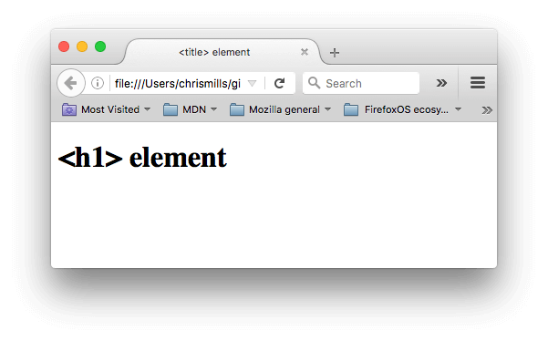
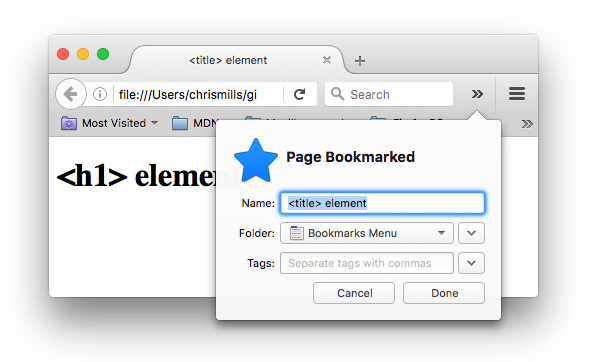
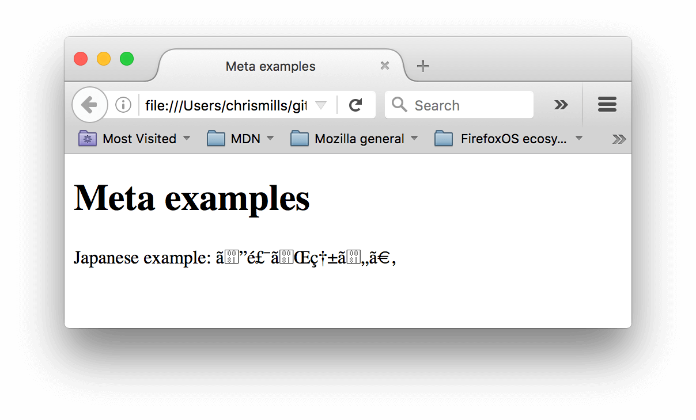
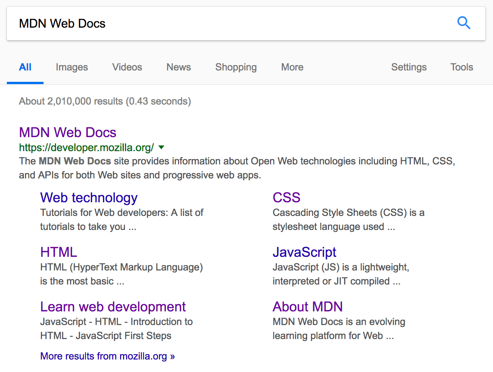

{{LearnSidebar}}{{PreviousMenuNext("Learn/HTML/Introduction_to_HTML/Getting_started", "Learn/HTML/Introduction_to_HTML/HTML_text_fundamentals", "Learn/HTML/Introduction_to_HTML")}}

在页面加载完成的时候，HTML 文档中的{{glossary("Head", "头部")}}是不会显示在 web 浏览器的。它包含了诸如页面的 {{htmlelement("title")}}（标题）、指向 {{glossary("CSS")}} 的链接（如果你选择用 CSS 来为 HTML 内容添加样式）、指向自定义网页图标的链接和其他的元数据（描述 HTML 的数据，比如作者和描述文档的重要关键词）等信息。Web 浏览器将使用文档{{glossary("Head", "头部")}}的信息正确渲染 HTML 文档。本文将涵盖上述内容并拓展，以便为你的标记工作打下良好基础。

<table>
  <tbody>
    <tr>
      <th scope="row">预备知识：</th>
      <td>初步了解 HTML（参见 <a href="/zh-CN/docs/Learn/HTML/Introduction_to_HTML/Getting_started">开始学习 HTML</a>）。</td>
    </tr>
    <tr>
      <th scope="row">学习目标：</th>
      <td>学习 HTML 头部的概念、用途、所包含的重要项目，以及它对 HTML 文档所起的作用。</td>
    </tr>
  </tbody>
</table>

## 什么是 HTML 头部

让我们简单回顾一下[上一章节的 HTML 文档](/zh-CN/docs/Learn/HTML/Introduction_to_HTML/Getting_started#剖析html文档)：

```html
<!DOCTYPE html>
<html lang="zh-CN">
  <head>
    <meta charset="utf-8" />
    <title>我的测试页面</title>
  </head>
  <body>
    <p>这是我的页面</p>
  </body>
</html>
```

HTML 头部包含 HTML {{htmlelement("head")}} 元素的内容，与 {{htmlelement("body")}} 元素内容不同，页面在浏览器加载后它的内容不会在浏览器中显示，它的作用是保存页面的一些{{glossary("Metadata", "元数据")}}。上述示例的头部非常简短：

```html
<head>
  <meta charset="utf-8" />
  <title>我的测试页面</title>
</head>
```

然而，大型页面的头部会相当大。可以试着到一些喜欢的网站上，使用[开发者工具](/zh-CN/docs/Learn/Common_questions/Tools_and_setup/What_are_browser_developer_tools)查看网页的头部内容。我们在这里的目的不是向你展示如何使用所有可能放在头部的东西，而是教你如何熟悉使用你想要包括在头部的主要元素。让我们开始吧。

## 添加标题

之前已经讲过 {{htmlelement("title")}} 元素，它可以为文档添加标题。但别和 {{htmlelement("h1")}} 元素搞混了，{{htmlelement("h1")}} 是为 body 添加顶级标题的。有时候 {{htmlelement("h1")}} 也叫作网页标题，但是二者并不相同。

- {{htmlelement("h1")}} 元素在页面加载完毕时显示在页面中，通常只出现一次，用来标记页面内容的标题（故事名称、新闻摘要等等）。
- {{htmlelement("title")}} 元素是一项元数据，用于表示整个 HTML 文档的标题（而不是文档内容）。

### 主动学习：一个简单的示例

1. 为了开始这个练习，我们希望你到我们的 GitHub 库中下载一份 [title-example.html 网页](https://github.com/mdn/learning-area/blob/main/html/introduction-to-html/the-html-head/title-example.html)副本。要做到这一点，你可以选择下面两种操作之一：

   1. 使用你的代码编辑器，从页面中拷贝粘贴代码到一个新的文本文件中，然后将其保存到一个适当的地方。
   2. 按下 GitHub 页面中的“Raw”按钮（可能会在浏览器新标签中显示源代码），从浏览器的菜单中选择 *另存为...*，然后选择一个地方来保存这个文件。

2. 在浏览器中打开文件，你会看到类似这样效果：

   

   现在很明显的可以看到 `<h1>` 和 `<title>` 出现的地方！

3. 你应该尝试着在你的代码编辑器中打开这些代码，编辑这些元素的内容，然后在你的浏览器中刷新页面。祝你玩得开心。

`<title>` 元素也被以其他的方式使用着。比如说，如果你尝试为某个页面添加书签（在 Firefox 浏览器中，点击*书签 > 将当前标签页添加到书签*，或点击地址栏末尾的星标），你会看到 `<title>` 的内容被作为建议的书签名。



正如你即将在下面看到的那样，`<title>` 元素的内容也被用在搜索的结果中。

## 元数据：\<meta> 元素

元数据就是描述数据的数据，而 HTML 有一个“官方的”方式来为一个文档添加元数据——{{htmlelement("meta")}} 元素。当然，其他在这篇文章中提到的东西也可以被当作元数据。有很多不同种类的 `<meta>` 元素可以被包含进你的页面的 \<head> 元素，但是现在我们还不会尝试去解释所有类型，这只会引起混乱。我们会解释一些你常会看到的类型，先让你有个概念。

### 指定文档中的字符编码

在上面的示例中，这行是被包含的：

```html
<meta charset="utf-8" />
```

这个元素简单的指定了文档的字符编码——在这个文档中被允许使用的字符集。`utf-8` 是一个通用的字符集，它包含了任何人类语言中的大部分的字符，意味着该 web 页面可以显示任意的语言；所以对于你的每一个页面都使用这个设置会是一个好主意！比如说，你的页面可以很好的处理英文和日文：


假如你将字符集设置为 `ISO-8859-1`（拉丁字母表的字符集），那么页面将出现乱码：



> **备注：** 一些浏览器（比如 Chrome）会自动修正错误的编码，所以根据你所使用的浏览器不同，你或许不会看到这个问题。无论如何，你仍然应该为你的页面手动设置编码为 `utf-8`，来避免在其他浏览器中可能出现的问题。

### 主动学习：体验字符编码

为了开始这个练习，回到你在上一节中获得的有关 `<title>` 元素的简单 HTML 模板（[title-example.html 页面](https://github.com/mdn/learning-area/blob/main/html/introduction-to-html/the-html-head/title-example.html)），试着改变其字符集的值为 `ISO-8859-1`，然后将日文添加到页面中。这就是我们使用的代码：

```html
<p>Japanese example: ご飯が熱い。</p>
```

### 添加作者和描述

许多 `<meta>` 元素包含了 `name` 和 `content` 属性：

- `name` 指定了 meta 元素的类型；说明该元素包含了什么类型的信息。
- `content` 指定了实际的元数据内容。

这两个 meta 元素对于定义你的页面的作者和提供页面的简要描述是很有用的。让我们看一个例子：

```html
<meta name="author" content="Chris Mills" />
<meta
  name="description"
  content="The MDN Web Docs Learning Area aims to provide
complete beginners to the Web with all they need to know to get
started with developing web sites and applications." />
```

指定作者在某些情况下是很有用的：如果你需要联系页面的作者，问一些关于页面内容的问题。一些内容管理系统能够自动获取页面作者的信息，然后用于某些用途。

指定一个包括与你的页面内容有关的关键词的描述是有用的，因为它有可能使你的页面在搜索引擎进行的相关搜索中出现得更多（这些行为在术语上被称为：[搜索引擎优化](/zh-CN/docs/Glossary/SEO) 或 {{glossary("SEO")}}）。

### 主动学习：在搜索引擎中 description 的使用

description 也被使用在搜索引擎显示的结果页中。下面通过一个例子来说明：

1. 访问 [MDN Web 文档的首页](/zh-CN/)。
2. 查看网页源代码（通过鼠标右键点击网页在弹出的菜单中选择*查看网页源代码*）。
3. 找到 description meta 标签。就和如下展示的这样（可能会时常改变）：

   ```html
   <meta
     name="description"
     content="The MDN Web Docs site
     provides information about Open Web technologies
     including HTML, CSS, and APIs for both Web sites and
     progressive web apps." />
   ```

4. 现在，在你喜欢的搜索引擎里搜索“MDN Web Docs”（下图展示的是在谷歌搜索里的情况）。你会看到 description `<meta>` 和 `<title>` 元素如何在搜索结果里显示——很值得这样做哦！

    

> **备注：** 在谷歌搜索里，在主页面链接下面，你将看到一些相关子页面——这些是站点链接，可以在 [Google's webmaster tools](https://search.google.com/search-console/about) 配置——这是一种可以使你的站点对搜索引擎更友好的方式。

> **备注：** 许多 `<meta>` 特性已经不再使用。例如，keyword `<meta>` 元素（`<meta name="keywords" content="fill, in, your, keywords, here">`，为搜索引擎提供关键词，用于确定该页面与不同搜索词的相关性）已经被搜索引擎忽略了，因为作弊者填充了大量关键词到 keyword，错误地引导搜索结果。

### 其他类型的元数据

当你在网站上查看源码时，你也会发现其他类型的元数据。你在网站上看到的许多功能都是专有创作，旨在向某些网站（如社交网站）提供可使用的特定信息。

例如，Facebook 编写的元数据协议 [Open Graph Data](https://ogp.me/) 为网站提供了更丰富的元数据。在 MDN Web 文档源代码中，你会发现：

```html
<meta
  property="og:image"
  content="/mdn-social-share.png" />
<meta
  property="og:description"
  content="The Mozilla Developer Network (MDN) provides
information about Open Web technologies including HTML, CSS, and APIs for both Web sites
and HTML Apps." />
<meta property="og:title" content="Mozilla Developer Network" />
```

上面代码展现的一个效果就是，当你在 Facebook 上链接到 MDN Web 文档时，该链接将显示一个图像和描述：这为用户提供更丰富的体验。


Twitter 还拥有自己的类型的专有元数据协议（称为 [Twitter Cards](https://developer.twitter.com/en/docs/twitter-for-websites/cards/overview/abouts-cards)），当网站的 URL 显示在 twitter.com 上时，它具有相似的效果。例如下面：

```html
<meta name="twitter:title" content="Mozilla Developer Network" />
```

## 在你的站点增加自定义图标

为了进一步丰富你的网站设计，你可以在元数据中添加对自定义图标的引用，它们会在某些场景下显示。最常见的用例为 **favicon**（为“favorites icon”的缩写，在浏览器的“收藏夹”及“书签”列表中显示）。

这个不起眼的图标已经存在很多年了，16 像素的方形图标是第一种类型。你可以看见（取决于浏览器）这些图标出现在浏览器每一个打开的标签页中以及书签面板中的书签页面旁边。

页面添加网页图标的方式有：

1. 将其保存在与网站的索引页面相同的目录中，以 `.ico` 格式保存（大多数浏览器支持更通用的格式，如 `.gif` 或 `.png`）
2. 将以下行添加到 HTML 的 {{HTMLElement("head")}} 块中以引用它：

   ```html
   <link rel="icon" href="favicon.ico" type="image/x-icon" />
   ```

下面是一个 favicon 出现在书签面板中的例子：


如今还有很多其他的图标类型可以考虑。例如，你可以在 MDN Web 文档的源代码中找到它：

```html
<!-- 含有高分辨率 Retina 显示屏的第三代 iPad：-->
<link
  rel="apple-touch-icon-precomposed"
  sizes="144x144"
  href="https://developer.mozilla.org/static/img/favicon144.png" />
<!-- 含有高分辨率 Retina 显示屏的 iPhone：-->
<link
  rel="apple-touch-icon-precomposed"
  sizes="114x114"
  href="https://developer.mozilla.org/static/img/favicon114.png" />
<!-- 第一代和第二代 iPad：-->
<link
  rel="apple-touch-icon-precomposed"
  sizes="72x72"
  href="https://developer.mozilla.org/static/img/favicon72.png" />
<!-- 不含高分辨率 Retina 显示的 iPhone、iPod Touch 和 Android 2.1+ 设备：-->
<link
  rel="apple-touch-icon-precomposed"
  href="https://developer.mozilla.org/static/img/favicon57.png" />
<!-- 基本 favicon -->
<link
  rel="icon"
  href="https://developer.mozilla.org/static/img/favicon32.png" />
```

这些注释解释了每个图标的用途——这些元素涵盖的东西提供一个高分辨率图标，这些高分辨率图标当网站保存到 iPad 的主屏幕时使用。

不用担心现在实现所有这些类型的图标——这是一个相当先进的功能，不要求你有这方面的知识来通过课程的进展。这里的主要目的是让你提前了解有这一样东西，以防当你浏览其他网站的源代码时不理解源代码的含义。

> **备注：** 如果你的网站使用了内容安全策略（Content Security Policy，CSP）来增加安全性，这个策略会应用在 favicon 图标上。如果你遇到了图标没有被加载的问题，你需要确认 {{HTTPHeader("Content-Security-Policy")}} 响应头的 [`img-src` 指令](/zh-CN/docs/Web/HTTP/Headers/Content-Security-Policy/img-src) 没有阻止访问图标。

## 在 HTML 中应用 CSS 和 JavaScript

如今，几乎你使用的所有网站都会使用 {{glossary("CSS")}} 来让网页更加炫酷，并使用 {{glossary("JavaScript")}} 来让网页有交互功能，比如视频播放器、地图、游戏以及更多功能。这些应用在网页中很常见，它们分别使用 {{htmlelement("link")}} 元素以及 {{htmlelement("script")}} 元素。

- {{htmlelement("link")}} 元素经常位于文档的头部，它有 2 个属性，`rel="stylesheet"` 表明这是文档的样式表，而 `href` 包含了样式表文件的路径：

  ```html
  <link rel="stylesheet" href="my-css-file.css" />
  ```

- {{htmlelement("script")}} 元素也应当放在文档的头部，并包含 `src` 属性来指向需要加载的 JavaScript 文件路径，同时最好加上 `defer` 以告诉浏览器在解析完成 HTML 后再加载 JavaScript。这样可以确保在加载脚本之前浏览器已经解析了所有的 HTML 内容。这样你就不会因为 JavaScript 试图访问页面上不存在的 HTML 元素而产生错误。实际上有很多方法来处理在你的页面上加载 JavaScript，但对于现代浏览器来说，这是最可靠的方法（对于其他方法，请阅读[脚本加载策略](/zh-CN/docs/Learn/JavaScript/First_steps/What_is_JavaScript#脚本调用策略)）。

  ```html
  <script src="my-js-file.js" defer></script>
  ```

> **备注：** `<script>` 元素看起来像一个{{glossary("void element","空元素")}}，但它并不是，因此需要一个结束标记。还可以选择将脚本放入 `<script>` 元素中，而不是指向外部脚本文件。

### 主动学习：在网页中应用 CSS 和 JavaScript

1. 开始操作之前，先拷贝我们的 [meta-example.html](https://github.com/mdn/learning-area/blob/main/html/introduction-to-html/the-html-head/meta-example.html)、[script.js](https://github.com/mdn/learning-area/blob/main/html/introduction-to-html/the-html-head/script.js) 和 [style.css](https://github.com/mdn/learning-area/blob/main/html/introduction-to-html/the-html-head/style.css) 文件，并把它们保存到本地电脑的同一目录下，确保使用了正确的文件名和文件格式。
2. 使用浏览器和文字编辑器同时打开你的 HTML 文件。
3. 根据上面的信息，添加 {{htmlelement("link")}} 和 {{htmlelement("script")}} 元素到你的 HTML 文件中，这样你的 HTML 就可以应用 CSS 和 JavaScript 了。

如果按照上述步骤正确地执行，当你保存 HTML 文件并重新刷新浏览器的话，你会发现页面已经变样了：


- JavaScript 在页面中添加了一个空列表。现在当你点击列表中的任何地方，浏览器会弹出一个对话框要求你为新列表项输入一些文本内容。当你点击 OK 按钮，刚刚那个新的列表项会添加到页面上；当你点击那些已有的列表项，会弹出一个对话框允许你修改列表项的文本。
- CSS 使页面背景变成了绿色，文本变得大了一点。它还将 JavaScript 添加到页面中的一些内容进行了样式化。（带有黑色边框的红色条是 CSS 添加到 JavaScript 生成的列表中的样式）

> **备注：** 如果你卡在这个练习当中，无法正常应用 CSS 和 JavaScript，试着查看一下我们的 [css-and-js.html](https://github.com/mdn/learning-area/blob/main/html/introduction-to-html/the-html-head/css-and-js.html) 页面实例。

## 为文档设定主语言

最后，值得一提的是可以（而且有必要）为站点设定语言，这个可以通过添加 [lang 属性](/zh-CN/docs/Web/HTML/Global_attributes/lang)到 HTML 开始的标签中来实现（就像 [meta-example.html](https://github.com/mdn/learning-area/blob/main/html/introduction-to-html/the-html-head/meta-example.html) 那样），如下所示：

```html
<html lang="zh-CN">
  …
</html>
```

这在很多方面都很有用。如果你的 HTML 文档的语言设置好了，那么你的 HTML 文档就会被搜索引擎更有效地索引（例如，允许它在特定于语言的结果中正确显示），对于那些使用屏幕阅读器的视障人士也很有用（例如，法语和英语中都有“six”这个单词，但是发音却完全不同）。

你还可以将文档的分段设置为不同的语言。例如，我们可以把日语部分设置为日语，如下所示：

```html
<p>Japanese example: <span lang="ja">ご飯が熱い。</span>.</p>
```

这些代码是根据 [ISO 639-1](https://zh.wikipedia.org/wiki/ISO_639-1) 标准定义的。你可以在 [HTML 和 XML 的语言标签](https://www.w3.org/International/articles/language-tags/)找到更多相关内容。

## 总结

已经到了我们快速学习 HTML 头部的尾声——你还能学到更多的相关的，但是现阶段详尽的讲的太多会令人无聊且困惑，我们只希望你现在在这学到最基本的概念！下一篇我们将要学习 [HTML 文字处理基础](/zh-CN/docs/Learn/HTML/Introduction_to_HTML/HTML_text_fundamentals)。

{{PreviousMenuNext("Learn/HTML/Introduction_to_HTML/Getting_started", "Learn/HTML/Introduction_to_HTML/HTML_text_fundamentals", "Learn/HTML/Introduction_to_HTML")}}
