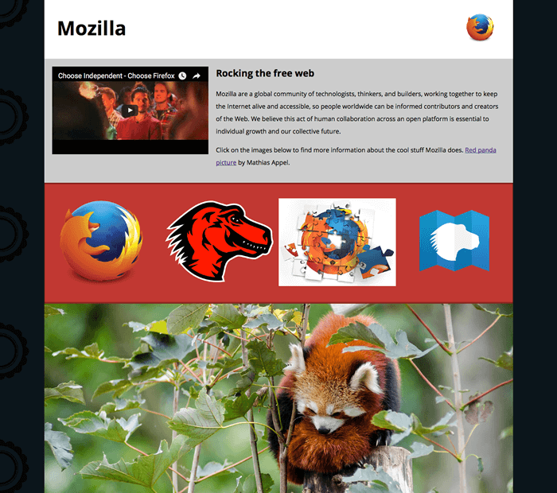

{{LearnSidebar}}{{PreviousMenu("Learn/HTML/Multimedia_and_embedding/Responsive_images", "Learn/HTML/Multimedia_and_embedding")}}

在这个测验中，我们将测试你对于本模块文章所讨论的技术的掌握程度，让你将一些有关于 Mozilla 的图片和视频添加到一个漂亮的页面上！

<table class="learn-box standard-table">
  <tbody>
    <tr>
      <th scope="row">学习本章节的要求：</th>
      <td>
        在开始这个测验之前，你应该了解了
        <a href="/zh-CN/docs/Learn/HTML/Multimedia_and_embedding"
          >多媒体与嵌入</a
        >
        模块的其他文章。
      </td>
    </tr>
    <tr>
      <th scope="row">目的：</th>
      <td>
        测试这些知识的掌握程度：在页面中嵌入图片和视频，框架，和 HTML
        响应式图片技术。
      </td>
    </tr>
  </tbody>
</table>

## 起点

为了开始这次测验，你需要从 [mdn-splash-page-start](https://github.com/roy-tian/learning-area/tree/master/html/multimedia-and-embedding/mdn-splash-page-start) 这个 GitHub 目录下下载 HTML 和图片。保存在你本地设备上。

访问 [originals](https://github.com/roy-tian/learning-area/tree/master/html/multimedia-and-embedding/mdn-splash-page-start/originals) 文件夹中不同的图片文件，然后用同样的方法将它们下载到本地。现在，你需要将这些图片文件保存到不同的目录下，因为在这些图片准备好被使用之前，你需要使用图像编辑器来处理这些图片。

> **备注：** 这个示例的 HTML 文件包含一些页面的 CSS 样式。你不需要去碰 CSS 的内容，而只是 {{htmlelement("body")}} 元素中的 HTML 部分，只要你插入了正确的标记，样式就会正确显示。

## 项目概要

在这个测验中，我们为你呈现了一个接近完成了的 Mozilla 醒目页面，旨在说明一些关于 Mozilla 的有趣的事情，以及提供一些更一步的资源链接。但目前还没有添加任何视频或图片，这份工作就交给你了！你需要添加一些图片、视频等多媒体元素，好让页面变得更漂亮和更有意义。下一小节详细描述了你需要做的工作：

### 准备图片

使用你最爱的图片编辑器，创建下面几张图片的 400px 宽的版本和 120px 宽的版本：

- `firefox_logo-only_RGB.png`
- `firefox-addons.jpg`
- `mozilla-dinosaur-head.png`

给它们取个有意义的名字，例如`firefoxlogo400.png` 和`firefoxlogo120.png`。

这些图片将和 `mdn.svg` 一起作为`further-info`区内资源链接的图标和网站页眉的火狐图标。将这些图片副本保存在与 `index.html`文件的同一个目录下。

接着，创建一个 1200px 宽的 `red-panda.jpg`风景图片版本，和一个 600px 宽的肖像版本，用来显示更近镜头下的熊猫。同样地，为它们取一个你可以轻松分辨出来的名字。将它们的副本保存在与 `index.html`文件相同的目录下。

> **备注：** 你应该在看起来还行的前提下尽量优化 JPG 和 PNG 图片的大小，[tinypng.com](https://tinypng.com/)为此提供了很好的服务。

### 为 header 添加一个图标

在 {{htmlelement("header")}} 元素中添加一个 {{htmlelement("img")}} 元素，嵌入一个小尺寸版本的火狐图标。

### 为主 article 添加一个视频

就在 {{htmlelement("article")}} 元素中（开放标签下面），嵌入一个 Bilibili 视频（<https://www.bilibili.com/video/BV1rs411d7hC?p=2>），使用 Bilibili 生成嵌入代码。视频的宽度应该是 400px。

### 为 further info 的链接添加响应式图片

在 `further-info` 类的 {{htmlelement("div")}}里你会看到四个 {{htmlelement("a")}} 元素，每个都指向一个有趣的、关于 Mozilla 的页面。为了完成这一部分，你需要在每个{{htmlelement("a")}} 元素里插入一个 {{htmlelement("img")}} 元素，需要包含合适的 [`src`](/zh-CN/docs/Web/HTML/Element/img#src)、[`alt`](/zh-CN/docs/Web/HTML/Element/img#alt)、[`srcset`](/zh-CN/docs/Web/HTML/Element/img#srcset) 和 [`sizes`](/zh-CN/docs/Web/HTML/Element/img#sizes) 属性。

我们希望每张图片（除了某个本身就是响应式的）在浏览器的视口的宽度小于等于 480px 时使用的 120px 宽的图片，其他情况下选择 400px 的版本。

确保正确的链接匹配了正确的图片！

> **备注：** 为了正确的测试 `srcset`/`sizes` 示例，你需要把你的网站上传到服务器（使用 [Github pages](/zh-CN/docs/Learn/Common_questions/Tools_and_setup/Using_GitHub_pages) 是一个简单免费的方法），访问服务器上的网页，你就可以使用浏览器开发者工具来测试它们是否正常工作，如 [响应式图片：有用的开发工具](/zh-CN/Learn/HTML/Multimedia_and_embedding/Responsive_images#Useful_developer_tools)中所说

### 一张小熊猫的艺术照

在`red-panda`类的{{htmlelement("div")}} 中，我们希望插入一个{{htmlelement("picture")}}元素，在视口宽度小于等于 600px 时使用那张比较小的纵向的熊猫图片，在其他情况下则使用大的横向的图片。

## 示例

下面的截图展示了在正确标记后，醒目页面在宽屏和窄屏下的样子。（可 [在线查看](https://roy-tian.github.io/learning-area/html/multimedia-and-embedding/mdn-splash-page-finished/)）

## 评估

如果这个评估是一系列课程的一部分，你应该可以让你的老师或导师为你批改。如果你是自学，可以很容易地在 [discussion thread about this exercise](https://discourse.mozilla.org/t/mozilla-splash-page-assignment/24679)或 [Mozilla IRC](https://wiki.mozilla.org/IRC)的[#mdn](irc://irc.mozilla.org/mdn) IRC 频道回复得到批改指南。请先自己试着做——作弊学不到任何东西！

{{PreviousMenu("Learn/HTML/Multimedia_and_embedding/Responsive_images", "Learn/HTML/Multimedia_and_embedding")}}
