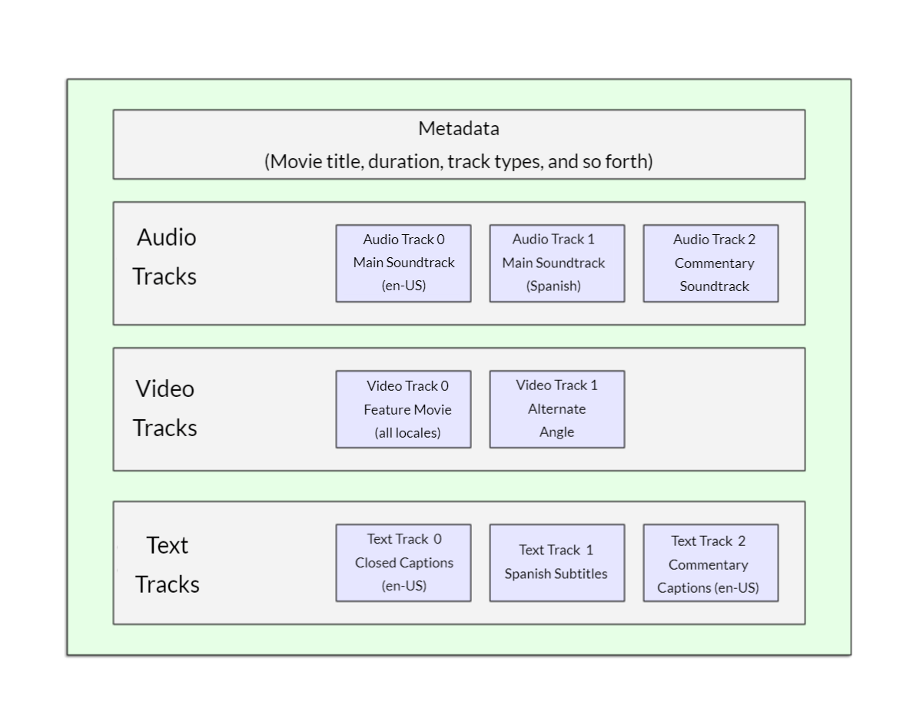
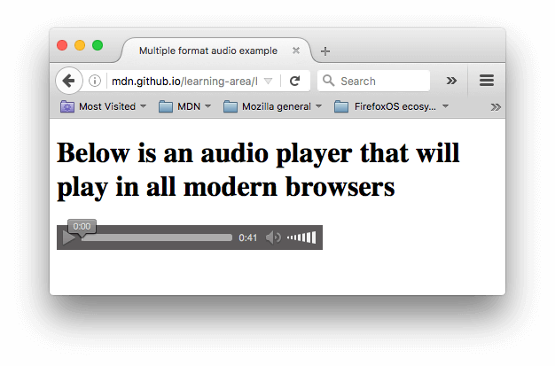

{{LearnSidebar}}{{PreviousMenuNext("Learn/HTML/Multimedia_and_embedding/Images_in_HTML", "Learn/HTML/Multimedia_and_embedding/Other_embedding_technologies", "Learn/HTML/Multimedia_and_embedding")}}

现在我们已经可以轻松地为网页添加简单的图像，下一步我们开始为 HTML 文档添加音频和视频播放器。在这篇文章中，我们会使用 {{htmlelement("video")}} 和 {{htmlelement("audio")}} 元素来完成这件事；然后我们还会了解如何为视频添加标题/字幕。

<table>
  <tbody>
    <tr>
      <th scope="row">前提：</th>
      <td>
        <a
          href="/zh-CN/docs/Learn/Getting_started_with_the_web/Installing_basic_software"
          >已安装基本软件</a
        >，具备<a
          href="/zh-CN/docs/Learn/Getting_started_with_the_web/Dealing_with_files"
          >处理文件</a
        >的基本知识，熟悉 HTML 基础知识（如在<a
         href="/zh-CN/docs/Learn/HTML/Introduction_to_HTML/Getting_started"
          >入门 HTML </a
        >中介绍的内容）以及 <a
         href="/zh-CN/docs/Learn/HTML/Multimedia_and_embedding/Images_in_HTML"
          >HTML 中的图像</a
        >。
      </td>
    </tr>
    <tr>
      <th scope="row">目标：</th>
      <td>
        学习如何将视频和音频内容嵌入网页，并为视频添加标题/字幕。
      </td>
    </tr>
  </tbody>
</table>

## web 中的音频和视频

最早的在线视频和音频的流行得益于专有的基于插件的技术，如 [Flash](https://zh.wikipedia.org/zh-cn/Adobe_Flash) 和 [Silverlight](https://zh.wikipedia.org/zh-cn/Microsoft_Silverlight)。这两种技术存在安全性和无障碍问题，现已过时，取而代之的是原生的 HTML 解决方案，该解决方案包括 {{htmlelement("video")}} 和 {{htmlelement("audio")}} 元素以及用于控制它们的 {{Glossary("JavaScript")}} {{Glossary("API")}}。在这里，我们不讨论有关 JavaScript 的问题，仅仅讲解有关 HTML 的基础。

我们不会教你如何制作音频和视频，因为那需要完全不同的技术。如果你没有音频和视频的话，也没有关系，我们为你提供了[示例音频和视频文件以及示例代码](https://github.com/mdn/learning-area/tree/main/html/multimedia-and-embedding/video-and-audio-content)供你实验。

> [!NOTE]
> 在开始之前，你应当了解一些在线视频提供商，例如 [YouTube](https://www.youtube.com/) 、[Dailymotion](http://www.dailymotion.com/) 、[Vimeo](https://vimeo.com/) 还有 [Bilibili](https://www.bilibili.com)，以及在线音频提供商，例如 [Soundcloud](https://soundcloud.com/)。这些公司可以让你以方便、简单的方式来托管和消费视频，所以你不必担心庞大的带宽消耗。在线视频提供商甚至提供现成的代码用于为你的 web 网页嵌入视频/音频。如果你使用这样的服务，你便可以避免在这篇文章中我们讨论的一些难题。在下一篇文章中，我们将会再讨论这样的服务。

### \<video> 元素

你可以借助 {{htmlelement("video")}} 元素来轻松地嵌入视频。一个简单的例子如下：

```html
<video src="rabbit320.webm" controls>
  <p>
    你的浏览器不支持 HTML 视频。可点击<a href="rabbit320.mp4">此链接</a>观看。
  </p>
</video>
```

值得注意的特性有：

- [`src`](/zh-CN/docs/Web/HTML/Element/video#src)
  - : 同 {{htmlelement("img")}} 元素的使用方式相同，`src`（来源）属性指向你想要嵌入到网页中的视频资源，它们的运作方式完全相同。
- [`controls`](/zh-CN/docs/Web/HTML/Element/video#controls)
  - : 用户应当能够控制视频和音频的播放（这对于患有[癫痫](https://zh.wikipedia.org/wiki/癫痫#病因)的人来说尤为重要）。你必须使用 `controls` 属性来让视频或音频包含浏览器自带的控制界面，或者使用适当的 [JavaScript API](/zh-CN/docs/Web/API/HTMLMediaElement) 构建自己的界面。至少，界面必须包括启动和停止媒体以及调整音量的方法。
- `<video>` 元素内的段落
  - : 这个叫做**后备内容**，当浏览器不支持 `<video>` 元素的时候，就会显示这段内容，借此我们能够对旧的浏览器提供回退。你可以添加任何后备内容，在这个例子中我们提供了一个指向这个视频文件的链接，从而使用户至少可以访问到这个文件，而不会局限于浏览器的支持。

已嵌入视频文件的网页样式如下：


你可以[尝试实时示例](https://mdn.github.io/learning-area/html/multimedia-and-embedding/video-and-audio-content/simple-video.html)，或者查看[源代码](https://github.com/mdn/learning-area/blob/main/html/multimedia-and-embedding/video-and-audio-content/simple-video.html)。

### 使用多个播放源以提高兼容性

以上的例子中有一个问题，那就是不同浏览器对视频/音频格式的支持程度不一样，导致你可能无法播放某些视频/音频。幸运的是，你有办法防止这个问题发生。

#### 媒体文件的内容

我们先来快速的了解一下相关术语。像 MP3、MP4 还有 WebM 这些格式叫做[**容器格式**](/zh-CN/docs/Web/Media/Formats/Containers)。他们定义了构成媒体文件的音频轨道和视频轨道的储存结构，其中还包含描述这个媒体文件的元数据，以及使用什么编解码器对其通道进行编码等等。

一个包含电影的 WebM 文件，其主要包括一个主视频轨道和一个备用视角轨道，以及相应的英语和西班牙语音轨，还有英语解说音轨，如下图所示。文件还包括用于电影的闭路字幕文本轨道、西班牙语字幕以及解说的英文字幕。



容器中的音频和视频轨道存储着按照相应编解码器格式编码的数据。音频轨道使用不同于视频轨道的格式进行编码。每条音频轨道都采用[音频编解码器](/zh-CN/docs/Web/Media/Formats/Audio_codecs)编码，而视频轨道则使用（你可能已经猜到了）[视频编解码器](/zh-CN/docs/Web/Media/Formats/Video_codecs)编码。我们之前提到过，不同浏览器支持不同的视频和音频格式，以及不同的容器格式，如 MP3、MP4 和 WebM，这些容器可以包含不同类型的视频和音频。

例如：

- WebM 容器通常包括了 Vorbis 或 Opus 音频和 VP8/VP9 视频。这在所有的现代浏览器中都支持，除了某些老版本浏览器。
- MP4 容器通常包括 AAC 或 MP3 音频和 H.264 视频。这在所有的现代浏览器中都支持。
- Ogg 容器倾向于使用 Vorbis 音频和 Theora 视频。其在 Firefox 和 Chrome 当中受到完美的支持，不过这个容器已经被更强大的 WebM 格式所取代。

有一些特殊情况。例如，对于某些类型的音频，通常编解码器的数据存储没有容器或简化容器。其中一个例子就是 FLAC 编解码器，它通常存储在 FLAC 文件中，FLAC 文件只是 FLAC 的原始轨迹。

另一种情况是一直流行的 MP3 文件。“MP3 文件”实际上是存储在 MPEG 或 MPEG-2 容器中的 MPEG-1 音频层 III（MPEG-1 Audio Layer III，MP3）音频轨道。这一点特别有趣，因为尽管大多数浏览器不支持在 {{HTMLElement("video")}} 和 {{HTMLElement("audio")}} 元素中使用 MPEG 媒体，但由于 MP3 的流行，它们可能仍然支持 MP3。

音频播放器倾向于直接播放音轨，例如 MP3 和 Ogg 文件。它们不需要容器。

#### 浏览器所支持的媒体文件

> [!NOTE]
> 一些流行的格式，如 MP3 和 MP4/H.264，尽管非常出色，但它们受到专利的限制；也就是说，有一些专利涵盖了它们所基于的某些或全部技术。在美国，MP3 直到 2017 年都受到专利保护，而 H.264 至少到 2027 年仍受专利保护。
>
> 由于这些专利，浏览器如果希望实现对这些编解码器的支持，通常必须支付巨额的许可费用。此外，一些人更倾向于避免使用受限制的软件，而只使用开放格式。由于这些法律和偏好原因，web 开发者往往不得不支持多种格式以满足他们的整个用户群。

刚刚所说的编解码器主要用于将音频和视频压缩成可管理的文件（原始的音频和视频文件非常大）。浏览器支持多种[**编解码器**](/zh-CN/docs/Glossary/Codec)，如 Vorbis 和 H.264，它们用于已压缩的音视频与二进制数据的相互转换。不同的编解码器和不同的容器都有各自的优缺点，这会影响你做出选择。

由于每种浏览器支持的容器文件格式和编解码器都有所不同，情况变得更加复杂。为了尽可能确保你的网站或应用能在用户的浏览器上正常工作，你可能需要提供多种格式的媒体文件。如果你的网站没有提供任何用户的浏览器支持的格式，那么你的媒体内容将无法播放。

由于确保你的应用程序中的媒体内容能在你想要覆盖的每一种浏览器、平台和设备上都正常显示有些复杂，因此选择最合适的编解码器和容器组合可能会是一项挑战。为了选择最适合你需求的容器文件格式，请参考[选择正确的容器](/zh-CN/docs/Web/Media/Formats/Containers#选择正确的容器)；要为你的内容和目标受众选择合适的媒体编解码器，请参考[选择视频编解码器](/zh-CN/docs/Web/Media/Formats/Video_codecs#选择视频编解码器)以及[选择音频编解码器](/zh-CN/docs/Web/Media/Formats/Audio_codecs#选择音频编解码器)。

当然，这里有一点需要注意：移动浏览器和桌面浏览器对格式的支持可能不一样。此外，桌面和移动浏览器都*可能*外包媒体播放处理（可能是全部媒体也可能是仅仅是那些它无法内部处理的特定类型）。因此，媒体支持在一定程度上依赖于用户安装了哪些软件。

我们该怎么做呢？请请看如下[更新后的例子](https://github.com/mdn/learning-area/blob/main/html/multimedia-and-embedding/video-and-audio-content/multiple-video-formats.html)（也可以[在这里体验](https://mdn.github.io/learning-area/html/multimedia-and-embedding/video-and-audio-content/multiple-video-formats.html)）：

```html
<video controls>
  <source src="rabbit320.mp4" type="video/mp4" />
  <source src="rabbit320.webm" type="video/webm" />
  <p>你的浏览器不支持此视频。可点击<a href="rabbit320.mp4">此链接</a>观看</p>
</video>
```

在这里我们将 `src` 属性从 `<video>` 元素中移除，转而将它放在几个单独的 {{htmlelement("source")}} 元素当中，这些元素分别指向各自的资源。在本例当中，浏览器会检查 {{HTMLElement("source")}} 元素，并且播放第一个与其自身 codec 相匹配的媒体。WebM 和 MP4 这两种格式在目前已经足够，只要视频支持这两种格式，那么其在大多数平台和浏览器上都能正确播放。

每个 `<source>` 元素都含有 [`type`](/zh-CN/docs/Web/HTML/Element/source#type) 属性，这个属性是可选的，但是建议你添加这个属性——它包含了 `<source>` 指定的 {{glossary("MIME type","MIME 类型")}}，同时浏览器也会通过检查这个属性来迅速的跳过那些不支持的格式。如果你没有添加 `type` 属性，浏览器会尝试加载每一个文件，直到找到一个能正确播放的格式，但是这样会消耗掉大量的时间和资源。

请参考我们的[媒体类型和格式指南](/zh-CN/docs/Web/Media/Formats)，以选择最适合你的需求的容器和编解码器，同时查找合适的 MIME 类型以指定每种媒体类型。

### 其他 \<video> 特性

有许多你可以用在 HTML 视频上的特性，请看我们的下一个例子：

```html
<video
  controls
  width="400"
  height="400"
  autoplay
  loop
  muted
  preload="auto"
  poster="poster.png">
  <source src="rabbit320.mp4" type="video/mp4" />
  <source src="rabbit320.webm" type="video/webm" />
  <p>你的浏览器不支持此视频。可点击<a href="rabbit320.mp4">此链接</a>观看</p>
</video>
```

这串代码将会给我们呈现出如下用户界面：


特性包括：

- [`width`](/zh-CN/docs/Web/HTML/Element/video#width) 和 [`height`](/zh-CN/docs/Web/HTML/Element/video#height)
  - : 你可以用属性控制视频的尺寸，也可以用 {{Glossary("CSS")}} 来控制视频尺寸。无论使用哪种方式，视频都会保持它原始的长宽比——也叫做**纵横比**。如果你设置的尺寸没有保持视频原始长宽比，那么视频边框将会拉伸，而未被视频内容填充的部分，将会显示默认的背景颜色。
- [`autoplay`](/zh-CN/docs/Web/HTML/Element/video#autoplay)
  - : 这个属性会使音频和视频内容立即播放，即使页面的其他部分还没有加载完全。建议不要在你的网站上自动播放视频（或音频），因为用户可能会反感。
- [`loop`](/zh-CN/docs/Web/HTML/Element/video#loop)
  - : 这个属性可以让视频（或者音频）文件在结束时再次开始播放。这个也可能很恼人，同样不建议使用，除非有必要。
- [`muted`](/zh-CN/docs/Web/HTML/Element/video#muted)
  - : 这个属性会导致媒体播放时，默认关闭声音。
- [`poster`](/zh-CN/docs/Web/HTML/Element/video#poster)
  - : 这个属性指向了一个图像的 URL，这个图像会在视频播放前显示。通常用于粗略的预览或者广告。
- [`preload`](/zh-CN/docs/Web/HTML/Element/video#preload)

  - : 这个属性被用来缓冲较大的文件，有三个值可选：

    - `"none"`：不缓冲文件
    - `"auto"`：页面加载后缓存媒体文件
    - `"metadata"`：仅缓冲文件的元数据

你可以[在 GitHub 体验以上的例子](https://mdn.github.io/learning-area/html/multimedia-and-embedding/video-and-audio-content/extra-video-features.html)，也可以[查看源代码](https://github.com/mdn/learning-area/blob/main/html/multimedia-and-embedding/video-and-audio-content/extra-video-features.html)。注意我们在体验的版本中并没有使用 `autoplay` 属性——如果页面一加载就开始播放视频的话，就不会看到封面（poster）了。

### \<audio> 元素

{{htmlelement("audio")}} 元素与 {{htmlelement("video")}} 元素的使用方式几乎完全相同，只有一些细微的差别，比如下面的边框不同，一个典型的例子如下：

```html
<audio controls>
  <source src="viper.mp3" type="audio/mp3" />
  <source src="viper.ogg" type="audio/ogg" />
  <p>你的浏览器不支持该音频，可点击<a href="viper.mp3">此链接</a>收听。</p>
</audio>
```

这串代码将会产生如下的效果：



> [!NOTE]
> 你可以在 GitHub [运行音频示例](https://mdn.github.io/learning-area/html/multimedia-and-embedding/video-and-audio-content/multiple-audio-formats.html)（也可以查看[音频播放器源代码](https://github.com/mdn/learning-area/blob/main/html/multimedia-and-embedding/video-and-audio-content/multiple-audio-formats.html)）。

因为音频播放器没有视觉部件，它所占用的空间比视频播放器要小（你只需要显示出能控制音频播放的控件）。其他一些 HTML `<audio>` 与 `<video>` 的差异如下：

- {{htmlelement("audio")}} 元素不支持 `width`/`heigth` 属性——由于其并没有视觉部件，也就没有内容要设置 `width`/`height`。
- 它同时也不支持 `poster` 属性——同样，因为没有视觉部件。

除此之外，`<audio>` 元素支持所有 `<video>` 元素的特性——你可以回顾上面的章节来了解更多的有关信息。

## 显示视频文本

现在，我们将讨论一个略微先进的概念，这个概念将会十分的有用。许多人不想（或者不能）听到 Web 上的音频/视频内容，至少在某些情况下是这样的，比如：

- 许多人患有听觉障碍（通常来说是很难听清声音的人，或者聋人），他们不能听见音频中的声音。
- 还有一些人无法听音频，因为他们在一个非常嘈杂的环境当中（比如在拥挤的酒吧内恰好赶上了球赛）。
- 在某些环境下播放音频会分散注意力或造成干扰（比如在图书馆或伴侣正在休息时），这种情况下，拥有字幕就显得非常实用了。
- 有一些人他们不会说视频当中的语言，因此他们需要文字记录或者是翻译来帮助他们理解媒体内容。

为这些人提供音频/视频中话语的文字记录，将会对他们有很大的帮助。幸运的是，借助 HTML 视频，我们可以做到这一点。我们只需使用 [WebVTT](/zh-CN/docs/Web/API/WebVTT_API) 文件格式和 {{htmlelement("track")}} 元素即可。

> [!NOTE]
> “转录（transcribe）”是指将视频/音频中说的话记录成文字形式，转录的结果称为“文字记录（transcript）”。

WebVTT 是一个格式，用来编写文本文件，这个文本文件包含了众多的字符串，这些字符串会带有一些元数据，它们可以用来描述这个字符串将会在视频中显示的时间，甚至可以用来描述这些字符串的样式以及定位信息（尽管有限制）。这些字符串叫做 **cue** ，你可以根据不同的需求来显示不同类型的 cue，最常见的如下：

- subtitles
  - : 外语材料的翻译字幕，来帮助那些听不懂音频中说的什么的人理解音频当中的内容。
- captions
  - : 同步翻译对白，或是描述一些有重要信息的声音，来帮助那些不能听音频的人理解音频中的内容。
- 定时描述
  - : 由媒体播放器朗读的文本，其向盲人或其他视力受损用户描述重要的视觉内容。

一个典型的 WebVTT 文件如下：

```plain
WEBVTT

1
00:00:22.230 --> 00:00:24.606
第一段字幕

2
00:00:30.739 --> 00:00:34.074
第二段

…
```

要让其与 HTML 媒体一起显示，你需要做如下工作：

1. 将其保存为 `.vtt` 文件，放在服务器可以提供服务的地方（见下文），例如和 HTML 文件放在同一文件夹。
2. 用 {{htmlelement("track")}} 标签链接 `.vtt` 文件，`<track>` 标签需放在 `<audio>` 或 `<video>` 标签当中，同时需要放在所有 `<source>` 标签之后。使用 [`kind`](/zh-CN/docs/Web/HTML/Element/track#kind) 属性来指明是 `subtitles`、`captions` 还是 `descriptions`。然后，使用 [`srclang`](/zh-CN/docs/Web/HTML/Element/track#srclang) 来告诉浏览器你是用什么语言来编写的 subtitles。最后，添加 [`label`](/zh-CN/docs/Web/HTML/Element/track#label)，以帮助读者在查找时识别语言。

如下是例子：

```html
<video controls>
  <source src="example.mp4" type="video/mp4" />
  <source src="example.webm" type="video/webm" />
  <track kind="subtitles" src="subtitles_es.vtt" srclang="es" label="Spanish" />
</video>
```

为了尝试这种方法，需要在[本地 HTTP 服务器](/zh-CN/docs/Learn/Common_questions/Tools_and_setup/set_up_a_local_testing_server)上托管文件。在浏览器的输出中，会看到一个显示字幕的视频，有点像这样：


更多细节，包括如何添加标签，请阅读[为 HTML 视频添加标题和字幕](/zh-CN/docs/Web/Media/Audio_and_video_delivery/Adding_captions_and_subtitles_to_HTML5_video)。在 Github 上可以找到[与本文相关的样例](https://iandevlin.github.io/mdn/video-player-with-captions/)，它们由 Ian Devlin 编写（或者[查看源代码](https://github.com/iandevlin/iandevlin.github.io/tree/master/mdn/video-player-with-captions)）。这个样例使用了 JavaScript 代码，用户借此可以选择不同的字幕。注意，若想要显示字幕，你需要点击“CC”按钮，并且选择某个选项（English、Deutsch 或 Español）。

> [!NOTE]
> 文本轨道还可以帮助你进行 {{glossary("SEO")}}，因为搜索引擎对文字特别感兴趣。搜索引擎甚至可以借助文本轨道直接链接到视频中的某个位置。

## 主动练习：嵌入你自己的视频与音频

在这个实践学习当中，我们希望你能够走出去，并且记录一些你自己的视频和音频——如今，大多数手机都能够非常方便的记录视频和音频，并且如果你可以将它上传到你的电脑上面，你可以使用它。你可能需要做一些格式转换，如果是视频的话，你需要将它们转化为 WebM 或者 MP4，如果是音频的话，你需要将它们转化为 MP3 或者 Ogg。不过你并不需要担心，有许多的程序都能够帮你轻松解决这些问题，例如 [Miro 视频转换器](http://www.mirovideoconverter.com/)和 [Audacity](https://sourceforge.net/projects/audacity/)。我们非常希望你能够亲自动手。

如果你无法取得任何的音频或者视频，你可以使用我们为你提供的[示例音频和视频文件](https://github.com/mdn/learning-area/tree/main/html/multimedia-and-embedding/video-and-audio-content) 来练习。同时你也可以使用我们的代码来作为参考。

我们希望你能够：

1. 将你的音频和视频文件保存在你电脑上的一个新目录中。
2. 在相同的路径下，创建一个新的 HTML 文件，命名为 `index.html`。
3. 在页面上添加 {{HTMLElement("audio")}} 和 {{HTMLElement("video")}} 元素；让它们显示浏览器默认的控件。
4. 在当中添加 {{HTMLElement("source")}} 标签，并添加 [`type`](/zh-CN/docs/Web/HTML/Element/source#type) 属性，以便于浏览器能够找到其能够支持的格式并加载它。
5. 在 `<video>` 元素中添加 `poster` 属性，这会在视频播放之前显示。尽情创作属于自己的海报图形吧。

另外，你可以尝试研究一下文本音轨，试着为你的视频添加一些字幕。

## 技能测试！

你已经完成了这篇教程的学习，但你是否还记得教程里最重要的内容呢？在继续之前，你可以通过一些测试来验证你是否已经掌握了这些内容，请参见[技能测试：内嵌多媒体](/zh-CN/docs/Learn/HTML/Multimedia_and_embedding/Video_and_audio_content/Test_your_skills:_Multimedia_and_embedding)。需要注意，这个测试中的第三个问题可能会需要一些之后讲到的技术，所以我们建议你尝试之前阅读一下[下一篇教程](/zh-CN/docs/Learn/HTML/Multimedia_and_embedding/Other_embedding_technologies)。

## 总结

我们祝愿你可以沉浸在 Web 网站的音频和视频当中，下一篇文章，我们将会学习到[另外一种在 web 页面中嵌入内容的方法](/zh-CN/docs/Learn/HTML/Multimedia_and_embedding/Other_embedding_technologies)，比如使用 {{htmlelement("iframe")}} 或者 {{htmlelement("object")}}。

## 参见

- HTML 媒体元素：{{htmlelement("audio")}}、{{htmlelement("video")}}、{{htmlelement("source")}} 和 {{htmlelement("track")}}
- [向视频添加字幕和标题](/zh-CN/docs/Web/Media/Audio_and_video_delivery/Adding_captions_and_subtitles_to_HTML5_video)
- [音频和视频传送](/zh-CN/docs/Web/Media/Audio_and_video_delivery)：使用 HTML 和 JavaScript 在网页上放置音频和视频的详细信息。
- [音频和视频操作](/zh-CN/docs/Web/Media/Audio_and_video_manipulation)：使用 JavaScript 对音频和视频进行详细操作的指南（例如添加滤镜）。
- [Web 媒体技术](/zh-CN/docs/Web/Media)
- [web 上的媒体类型和格式指南](/zh-CN/docs/Web/Media/Formats)
- [事件参考 > 媒体](/zh-CN/docs/Web/Events#media)

{{PreviousMenuNext("Learn/HTML/Multimedia_and_embedding/Images_in_HTML", "Learn/HTML/Multimedia_and_embedding/Other_embedding_technologies", "Learn/HTML/Multimedia_and_embedding")}}
