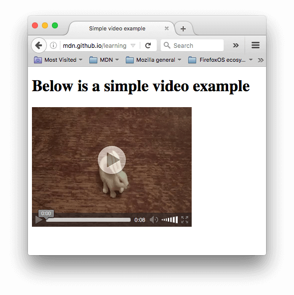
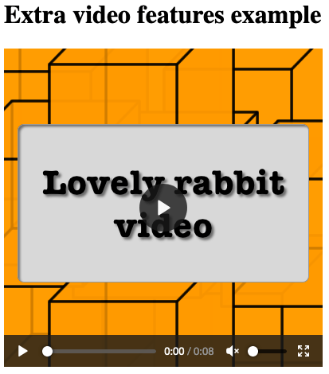
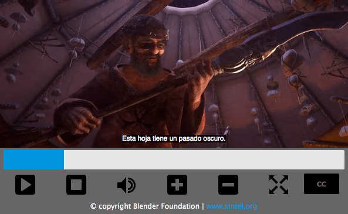

{{LearnSidebar}}{{PreviousMenuNext("Learn/HTML/Multimedia_and_embedding/Images_in_HTML", "Learn/HTML/Multimedia_and_embedding/Other_embedding_technologies", "Learn/HTML/Multimedia_and_embedding")}}

现在我们可以轻松的为一个网页添加简单的图像，下一步我们开始为 HTML 文档添加音频和视频播放器。在这篇文章中，我们会使用 {{htmlelement("video")}} 和 {{htmlelement("audio")}} 元素来做到这件事；然后我们还会看看如何为你的视频添加字幕。

<table class="learn-box standard-table">
  <tbody>
    <tr>
      <th scope="row">预备知识：</th>
      <td>
        基础计算机能力，<a
          href="/zh-CN/docs/Learn/Getting_started_with_the_web/Installing_basic_software"
          >基础的软件安装</a
        >，基础的<a
          href="/zh-CN/docs/Learn/Getting_started_with_the_web/Dealing_with_files"
          >文件处理</a
        >知识，基础的 HTML 知识 (阅读
        <a href="/zh-CN/docs/learn/HTML/Introduction_to_HTML/Getting_started"
          >开始学习 HTML</a
        >
        ) 以及
        <a href="/zh-CN/docs/Learn/HTML/Multimedia_and_embedding/Images_in_HTML"
          >HTML 中的图片</a
        >。
      </td>
    </tr>
    <tr>
      <th scope="row">学习目标：</th>
      <td>学习如何在一个网页中嵌入音频和视频，以及如何为视频添加字幕。</td>
    </tr>
  </tbody>
</table>

## web 中的音频和视频

web 开发者们一直以来想在 Web 中使用音频和视频，自 21 世纪初以来，我们的带宽开始能够支持任意类型的视频（视频文件比文本和图片要大的多）。在早些时候，传统的 web 技术（如 HTML）不能够在 Web 中嵌入音频和视频，所以一些像 [Flash](https://en.wikipedia.org/wiki/Adobe_Flash) (后来有 [Silverlight](https://en.wikipedia.org/wiki/Microsoft_Silverlight) ) 的专利技术在处理这些内容上变得很受欢迎。这些技术能够正常的工作，但是却有着一系列的问题，包括无法很好的支持 HTML/CSS 特性、安全问题，以及可行性问题。

传统的解决方案能够解决许多这样的问题，前提是它能够正确的工作。幸运的是，几年之后 {{glossary("HTML5")}} 标准提出，其中有许多的新特性，包括 {{htmlelement("video")}} 和 {{htmlelement("audio")}} 标签，以及一些 {{Glossary("JavaScript")}} 和 {{Glossary("API","APIs")}} 用于对其进行控制。在这里，我们不讨论有关 JavaScript 的问题，仅仅讲解有关 HTML 的基础。

我们不会教你如何制作音频和视频，因为那需要完全不同的技术。我们已经为你的试验提供了一些视频和音频的文件（[示例音频和视频文件以及示例代码的链接](https://github.com/mdn/learning-area/tree/main/html/multimedia-and-embedding/video-and-audio-content)），以防止你自己没有。

> **备注：** 在你开始之前，你应当了解一些 {{glossary("OVP","OVPs")}} (在线视频提供商) 例如 [YouTube](https://www.youtube.com/) 、[Dailymotion](http://www.dailymotion.com) 、[Vimeo](https://vimeo.com/)、[Bilibili](https://www.bilibili.com)等，以及在线音频提供商例如 [Soundcloud](https://soundcloud.com/)。这些公司提供方便、简单的方式来支持视频，所以你不必担心庞大的带宽消耗。OVPS 甚至提供现成的代码用于为你的 web 网页嵌入视频/音频。如果你使用这样的服务，你便可以避免在这篇文章中我们将讨论的一些难题。在下一篇文章中，我们将会再讨论这样的服务。

### \<video> 元素

{{htmlelement("video")}} 允许你轻松地嵌入一段视频。一个简单的例子如下：

```html
<video src="rabbit320.webm" controls>
  <p>你的浏览器不支持 HTML5 视频。可点击<a href="rabbit320.mp4">此链接</a>观看</p>
</video>
```

当中的一些属性如下：

- [`src`](/zh-CN/docs/Web/HTML/Element/video#src)
  - : 同 {{htmlelement("img")}} 标签使用方式相同，`src` 属性指向你想要嵌入网页当中的视频资源，他们的使用方式完全相同。
- [`controls`](/zh-CN/docs/Web/HTML/Element/video#controls)
  - : 用户必须能够控制视频和音频的回放功能。你可以使用 `controls` 来包含浏览器提供的控件界面，同时你也可以使用合适的 [JavaScript API](/zh-CN/docs/Web/API/HTMLMediaElement) 创建自己的界面。界面中至少要包含开始、停止以及调整音量的功能。
- `<video>` 标签内的内容
  - : 这个叫做**后备内容** — 当浏览器不支持 `<video>` 标签的时候，就会显示这段内容，这使得我们能够对旧的浏览器提供回退内容。你可以添加任何后备内容，在这个例子中我们提供了一个指向这个视频文件的链接，从而使用户至少可以访问到这个文件，而不会局限于浏览器的支持。

已嵌入视频文件的网页样式如下：



你可以点击[这里](https://mdn.github.io/learning-area/html/multimedia-and-embedding/video-and-audio-content/simple-video.html)查看网页，或者点击[这里](https://github.com/mdn/learning-area/blob/main/html/multimedia-and-embedding/video-and-audio-content/simple-video.html)查看源代码。

### 使用多个播放源以提高兼容性

以上的例子中有一个问题，你可能已经注意到了，如果你尝试使用像 Safari 或者 Internet Explorer 这些浏览器来访问上面的链接。视频并不会播放，这是因为不同的浏览器对视频格式的支持不同。幸运的是，你有办法防止这个问题发生。

#### 媒体文件的内容

我们先来快速的了解一下术语。像 MP3、MP4、WebM 这些术语叫做[容器格式](/zh-CN/docs/Web/Media/Formats/Containers)。他们定义了构成媒体文件的音频轨道和视频轨道的储存结构，其中还包含描述这个媒体文件的元数据，以及用于编码的编码译码器等等。

一个格式为 WebM 的电影包含视频轨道，音频轨道和文本轨道，其中视频轨道包含一个主视频轨道和一个可选的 Angle 轨道；音频轨道包含英语和西班牙语的音频轨道，还有一个英语评论的音频轨道；文字轨道包含英语和西班牙语的字幕轨道，如下图所示：


为了编解码器（codec）编码媒体，容器中的音频和视频轨道以适合的格式保存。音频轨道和视频轨道使用不同的格式。每个音频轨道都使用[音频编解码器](/zh-CN/docs/Web/Media/Formats/Audio_codecs)进行编码，而视频轨道则使用（您可能已经猜到了）[视频编解码器](/zh-CN/docs/Web/Media/Formats/Video_codecs)进行编码。如前所述，不同的浏览器支持不同的视频和音频格式，以及不同的容器格式（如 MP3、MP4 和 WebM，这些格式又可以包含不同类型的视频和音频）。

例如：

- WebM 容器通常包括了 Opus 或 Vorbis 音频和 VP8/VP9 视频。这在所有的现代浏览器中都支持，除了他们的老版本。
- MP4 容器通常包括 AAC 以及 MP3 音频和 H.264 视频。这在所有的现代浏览器中都支持，还有 Internet Explorer。
- 老式的 Ogg 容器往往支持 Ogg Vorbis 音频和 Ogg Theora 视频。主要在 Firefox 和 Chrome 当中支持，不过这个容器已经被更强大的 WebM 容器所取代。

有一些特殊情况。例如，对于某些类型的音频，通常编解码器的数据存储没有容器或简化容器。其中一个例子就是 FLAC 编解码器，它通常存储在 FLAC 文件中，FLAC 文件只是 FLAC 的原始轨迹。

另一种情况是一直流行的 MP3 文件。"MP3 文件"实际上是存储在 MPEG 或 MPEG-2 容器中的 MPEG-1 音频层 III（MPEG-1 Audio Layer III，MP3）音频轨道。这一点特别有趣，因为尽管大多数浏览器不支持在{{HTMLElement("video")}}和{{HTMLElement("audio")}}元素中使用 MPEG 媒体，但由于 MP3 的流行，它们可能仍然支持 MP3。

音频播放器将会直接播放音频文件，例如 MP3 和 Ogg 文件。这些不需要容器。

#### 浏览器所支持的媒体文件

你也许会疑惑为什么会有这样的情况存在。**MP3** (音频格式) 和 **MP4/H.264** (视频格式) 是被广泛支持的两种格式，并且质量良好。然而，他们却有专利的阻碍 — MP3 的专利会持续到 2017 年（就在我翻译这篇文章的当天，MP3 专利解除了），而 H.264 会持续到 2027 年早期。意思也就是说浏览器若想要支持这些格式，就得支付高额的费用。此外，许多人反对软件技术垄断，支持开放的格式。这就是为什么我们需要准备不同的格式来兼容不同的浏览器。

刚刚所说的格式主要用于将音频和视频压缩成可管理的文件（原始的音频和视频文件非常大）。浏览器包含了不同的 **{{Glossary("Codec","Codecs")}}**,，如 Vorbis 和 H.264，它们用来将已压缩的音频和视频转化成二进制数字。不同的编码器和不同的容器都有各自的优缺点，在你更了解它们后，你可以自己选择使用哪个编码器和容器。

浏览器并不全支持相同的 codecs，所以你得使用几个不同格式的文件来兼容不同的浏览器。如果你使用的格式都得不到浏览器的支持，那么媒体文件将不会播放。

要使你的媒体文件在不同平台，不同设备的浏览器上都可观看，这需要多种编码器组合使用，但是这是一种非常麻烦的事，所以可以参考[选择合适的容器](/zh-CN/docs/Web/Media/Formats/Containers#choosing_the_right_container)来选择最适合的容器格式，同样地，参考[选择视频编解码器](/zh-CN/docs/Web/Media/Formats/Video_codecs#选择视频编解码器)和[选择音频编解码器](/zh-CN/docs/Web/Media/Formats/Audio_codecs#选择音频编解码器)选择编码格式

需要记住的另一件事：同一款浏览器，移动版与桌面版支持的格式可能会有不同。最重要的是，它们都可以减轻媒体播放的处理负担（对于所有媒体或仅针对其内部无法处理的特定类型）。这意味着设备的媒体支持还部分取决于用户安装了什么软件。

我们该怎么做呢？请看如下例子（你可以点击这里[查看](https://mdn.github.io/learning-area/html/multimedia-and-embedding/video-and-audio-content/multiple-video-formats.html)网页，或者点击这里[查看](https://github.com/mdn/learning-area/blob/gh-pages/html/multimedia-and-embedding/video-and-audio-content/multiple-video-formats.html)源代码）：

```html
<video controls>
  <source src="rabbit320.mp4" type="video/mp4">
  <source src="rabbit320.webm" type="video/webm">
  <p>你的浏览器不支持 HTML5 视频。可点击<a href="rabbit320.mp4">此链接</a>观看</p>
</video>
```

现在我们将 `src` 属性从 `<video>` 标签中移除，转而将它放在几个单独的标签 {{htmlelement("source")}} 当中。在这个例子当中，浏览器将会检查 `<source>` 标签，并且播放第一个与其自身 codec 相匹配的媒体。你的视频应当包括 WebM 和 MP4 两种格式，这两种在目前已经足够支持大多数平台和浏览器。

每个 `<source>` 标签页含有一个 `type` 属性，这个属性是可选的，但是建议你添加上这个属性 — 它包含了视频文件的 {{glossary("MIME type","MIME types")}} ，同时浏览器也会通过检查这个属性来迅速的跳过那些不支持的格式。如果你没有添加 `type` 属性，浏览器会尝试加载每一个文件，直到找到一个能正确播放的格式，这样会消耗掉大量的时间和资源。

> **备注：** 你可以在这里（[HTML 媒体格式支持](/zh-CN/docs/Web/HTML/Supported_media_formats)）查看有关 {{glossary("MIME type","MIME types")}} 的支持。

### 其他 \<video> 特性

这里有许多你可以用在 HTML5 `<video>` 上的特性，请看我们的第三个例子：

```html
<video controls width="400" height="400"
       autoplay loop muted
       poster="poster.png">
  <source src="rabbit320.mp4" type="video/mp4">
  <source src="rabbit320.webm" type="video/webm">
  <p>你的浏览器不支持 HTML5 视频。可点击<a href="rabbit320.mp4">此链接</a>观看</p>
</video>
```

这串代码将会给我们呈现出如下页面：



新的特性：

- [`width`](/zh-CN/docs/Web/HTML/Element/video#width) 和 [`height`](/zh-CN/docs/Web/HTML/Element/video#height)
  - : 你可以用属性控制视频的尺寸，也可以用 {{Glossary("CSS")}} 来控制视频尺寸。无论使用哪种方式，视频都会保持它原始的长宽比 — 也叫做**纵横比**。如果你设置的尺寸没有保持视频原始长宽比，那么视频边框将会拉伸，而未被视频内容填充的部分，将会显示默认的背景颜色。
- [`autoplay`](/zh-CN/docs/Web/HTML/Element/video#autoplay)
  - : 这个属性会使音频和视频内容立即播放，即使页面的其他部分还没有加载完全。建议不要应用这个属性在你的网站上，因为用户们会比较反感自动播放的媒体文件。
- [`loop`](/zh-CN/docs/Web/HTML/Element/video#loop)
  - : 这个属性可以让音频或者视频文件循环播放。同样不建议使用，除非有必要。
- [`muted`](/zh-CN/docs/Web/HTML/Element/video#muted)
  - : 这个属性会导致媒体播放时，默认关闭声音。
- [`poster`](/zh-CN/docs/Web/HTML/Element/video#poster)
  - : 这个属性指向了一个图像的 URL，这个图像会在视频播放前显示。通常用于粗略的预览或者广告。
- [`preload`](/zh-CN/docs/Web/HTML/Element/video#preload)

  - : 这个属性被用来缓冲较大的文件，有 3 个值可选：

    - `"none"` ：不缓冲
    - `"auto"` ：页面加载后缓存媒体文件
    - `"metadata"` ：仅缓冲文件的元数据

你可以点击[这里](https://mdn.github.io/learning-area/html/multimedia-and-embedding/video-and-audio-content/extra-video-features.html)查看以上的例子，也可以点击[这里](https://github.com/mdn/learning-area/blob/gh-pages/html/multimedia-and-embedding/video-and-audio-content/extra-video-features.html)查看源代码。注意我们并没有使用 autoplay 属性在这个版本的例子中 — 如果当页面一加载就开始播放视频的话，就不会看到 poster 属性的效果了。

### \<audio> 标签

{{htmlelement("audio")}} 标签与 {{htmlelement("video")}} 标签的使用方式几乎完全相同，有一些细微的差别比如下面的边框不同，一个典型的例子如下：

```html
<audio controls>
  <source src="viper.mp3" type="audio/mp3">
  <source src="viper.ogg" type="audio/ogg">
  <p>你的浏览器不支持 HTML5 音频，可点击<a href="viper.mp3">此链接</a>收听。</p>
</audio>
```

这串代码将会产生如下的效果：


> **备注：** 你可以点击这里[查看](http://mdn.github.io/learning-area/html/multimedia-and-embedding/video-and-audio-content/multiple-audio-formats.html)以上例子，或者点击[这里](https://github.com/mdn/learning-area/blob/gh-pages/html/multimedia-and-embedding/video-and-audio-content/multiple-audio-formats.html)查看源代码。

音频播放器所占用的空间比视频播放器要小，由于它没有视觉部件 — 你只需要显示出能控制音频播放的控件。一些与 HTML5 `<video>` 的差异如下：

- {{htmlelement("audio")}} 标签不支持 `width`/`height` 属性 — 由于其并没有视觉部件，也就没有可以设置 `width`/`height` 的内容。
- 同时也不支持 `poster` 属性 — 同样，没有视觉部件。

除此之外，`<audio>` 标签支持所有 `<video>` 标签拥有的特性 — 你可以回顾上面的章节来了解更多的有关信息。

### 重新播放媒体

任何时候，你都可以在 Javascript 中调用 {{domxref("HTMLMediaElement.load", "load()")}} 方法来重置媒体。如果有多个由 {{HTMLElement("source")}} 标签指定的媒体来源，浏览器会从选择媒体来源开始重新加载媒体。

```js
const mediaElem = document.getElementById("my-media-element");
mediaElem.load();
```

### 音轨增删事件

你可以监控媒体元素中的音频轨道，当音轨被添加或删除时，你可以通过监听相关事件来侦测到。具体来说，通过监听 {{domxref("AudioTrackList")}} 对象的 `addtrack` 事件（即 {{domxref("HTMLMediaElement.audioTracks")}} 对象），你可以及时对音轨的增加做出响应。

```js
const mediaElem = document.querySelector("video");
mediaElem.audioTracks.onaddtrack = function(event) {
  audioTrackAdded(event.track);
}
```

你可以在我们的 {{domxref("TrackEvent")}} 文档中找到更多有用的信息。

## 显示音轨文本

现在，我们将讨论一个略微先进的概念，这个概念将会十分的有用。许多人不想（或者不能）听到 Web 上的音频/视频内容，至少在某些情况下是这样的，比如：

- 许多人患有听觉障碍（通常来说是很难听清声音的人，或者聋人），所以他们不能听见音频中的声音。
- 另外的情况可能是由于人们并不能听音频，可能是因为他们在一个非常嘈杂的环境当中（比如在一个拥挤的酒吧内恰好赶上了球赛），也可能是由于他们并不想打扰到其他人（比如在一个十分安静的地方，例如图书馆）。
- 有一些人他们不说音频当中的语言，所以他们听不懂，因此他们想要一个副本或者是翻译来帮助他们理解媒体内容。

给那些听不懂音频语言的人们提供一个音频内容的副本岂不是一件很棒的事情吗？所以，感谢 HTML5 `<video>` 使之成为可能，有了 [WebVTT](/zh-CN/docs/Web/API/Web_Video_Text_Tracks_Format) 格式，你可以使用 {{htmlelement("track")}} 标签。

> **备注：** "副本"的意思是指，用文本记录下音频的内容。

WebVTT 是一个格式，用来编写文本文件，这个文本文件包含了众多的字符串，这些字符串会带有一些元数据，它们可以用来描述这个字符串将会在视频中显示的时间，甚至可以用来描述这些字符串的样式以及定位信息。这些字符串叫做 **cues** ，你可以根据不同的需求来显示不同的样式，最常见的如下：

- subtitles
  - : 通过添加翻译字幕，来帮助那些听不懂外国语言的人们理解音频当中的内容。
- captions
  - : 同步翻译对白，或是描述一些有重要信息的声音，来帮助那些不能听音频的人们理解音频中的内容。
- timed descriptions
  - : 将文字转换为音频，用于服务那些有视觉障碍的人。

一个典型的 WebVTT 文件如下：

```plain
WEBVTT

1
00:00:22.230 --> 00:00:24.606
第一段字幕

2
00:00:30.739 --> 00:00:34.074
第二段

  ...
```

让其与 HTML 媒体一起显示，你需要做如下工作：

1. 以 .vtt 后缀名保存文件。
2. 用 {{htmlelement("track")}} 标签链接 .vtt 文件， `<track>` 标签需放在 `<audio>` 或 `<video>` 标签当中，同时需要放在所有 `<source>` 标签之后。使用 [`kind`](/zh-CN/docs/Web/HTML/Element/track#kind) 属性来指明是哪一种类型，如 subtitles、captions、descriptions。然后，使用 [`srclang`](/zh-CN/docs/Web/HTML/Element/track#srclang) 来告诉浏览器你是用什么语言来编写的 subtitles。

如下：

```html
<video controls>
    <source src="example.mp4" type="video/mp4">
    <source src="example.webm" type="video/webm">
    <track kind="subtitles" src="subtitles_en.vtt" srclang="en">
</video>
```

上面这串代码会显示一段带有字幕的视频，如下：



如果你想了解更多细节，你可以阅读 [Adding captions and subtitles to HTML5 video](/zh-CN/Apps/Build/Audio_and_video_delivery/Adding_captions_and_subtitles_to_HTML5_video)。在 Github 上你可以找到与本文相关的样例，他们由 Ian Devlin 编写，点击[这里](https://iandevlin.github.io/mdn/video-player-with-captions/)可以查看该样例，或者点击[这里](https://github.com/iandevlin/iandevlin.github.io/tree/master/mdn/video-player-with-captions)查看源代码。这个样例使用了 JavaScript 代码，它使得用户可以选择不同的字幕。注意，若想要显示字幕，你需要点击 "CC" 按钮，并且选择一种语言 — English, Deutsch, 或 Español。

> **备注：** 文本轨道会使你的网站更容易被搜索引擎抓取到（{{glossary("SEO")}}），由于搜索引擎的文本抓取能力非常强大，使用文本轨道甚至可以让搜索引擎通过视频的内容直接链接。

## 实践学习：在你的网站上嵌入你自己的视频或音频。

在这个实践学习当中，我们希望你能够走出去，并且记录一些你自己的视频或者音频 — 如今，大多数手机都能够非常方便的记录视频或者音频，并且你可以将他们上传到你的电脑上面，你可以使用这些功能来记录你的视频或音频。在这时候，你可能需要做一些格式转换，如果是视频的话，你需要将它们转化为 WebM 或者 MP4，如果是音频的话，你需要将它们转化为 MP3 或者 Ogg。不过你并不需要担心，有许多的程序都能够帮你解决这些问题，例如 [Miro Video Converter](http://www.mirovideoconverter.com/) 和 [Audacity](https://sourceforge.net/projects/audacity/)。我们非常希望你能够亲自动手实现它。

如果你无法取得任意的音频或者视频，你可以使用我们已经为你提供的样本（[示例音频和视频文件](https://github.com/mdn/learning-area/tree/main/html/multimedia-and-embedding/video-and-audio-content)）。同时你也可以使用我们的代码来作为参考。

我们希望你能够：

1. 将你的音频或者视频文件保存在你电脑上的一个新目录中。
2. 创建一个新的 HTML 文件在相同的路径下，命名为 index.html。
3. 在页面上添加 `<audio>` 和 `<video>` 标签；并使用浏览器默认的控件来显示它们。
4. 在当中添加 `<source>` 标签，并添加 `type` 属性，以便于浏览器能够找到其能够支持的格式并加载它。
5. 在 `<video>` 标签中添加 `poster` 属性，这会显示在视频播放之前。

另外，你可以尝试研究一下文本音轨，试着为你的视频添加一些字幕。

## 测试你的技能！

恭喜你，你已经完成了这篇教程的学习，但你是否还记得教程里最重要的内容呢？在继续之前，你可以通过一些测试来验证你是否已经掌握了这些内容，请参见[测试你的技能：内嵌多媒体](/zh-CN/docs/Learn/HTML/Multimedia_and_embedding/Video_and_audio_content/Test_your_skills:_Multimedia_and_embedding)。需要注意倒是，这个测试中的第三个问题可能会需要一些之后讲到的技术，所以我们建议你尝试之前阅读一下[下一篇教程](/zh-CN/docs/Learn/HTML/Multimedia_and_embedding/其他嵌入技术)。

## 总结

我们祝愿你可以沉浸在 Web 网站的音频和视频当中，下一篇文章，我们将会学习到另外一种在 web 页面中嵌入内容的方法，比如使用 {{htmlelement("iframe")}} 或者 {{htmlelement("object")}}。

## 相关资料

- {{htmlelement("audio")}}
- {{htmlelement("video")}}
- {{htmlelement("source")}}
- {{htmlelement("track")}}
- [Adding captions and subtitles to HTML5 video](/zh-CN/Apps/Build/Audio_and_video_delivery/Adding_captions_and_subtitles_to_HTML5_video)
- [Audio and Video delivery](/zh-CN/docs/Web/Apps/Fundamentals/Audio_and_video_delivery):：这里面包含了许多使用 HTML 和 JavaScript 在页面中添加音频或视频的资料。
- [Audio and Video manipulation](/zh-CN/docs/Web/Apps/Fundamentals/Audio_and_video_manipulation): 这里面包含了许多使用 JavaScript 来控制音频或视频的资料。
- Automated options to [translate multimedia](http://www.inwhatlanguage.com/blog/translate-video-audio/).

{{PreviousMenuNext("Learn/HTML/Multimedia_and_embedding/Images_in_HTML", "Learn/HTML/Multimedia_and_embedding/Other_embedding_technologies", "Learn/HTML/Multimedia_and_embedding")}}
