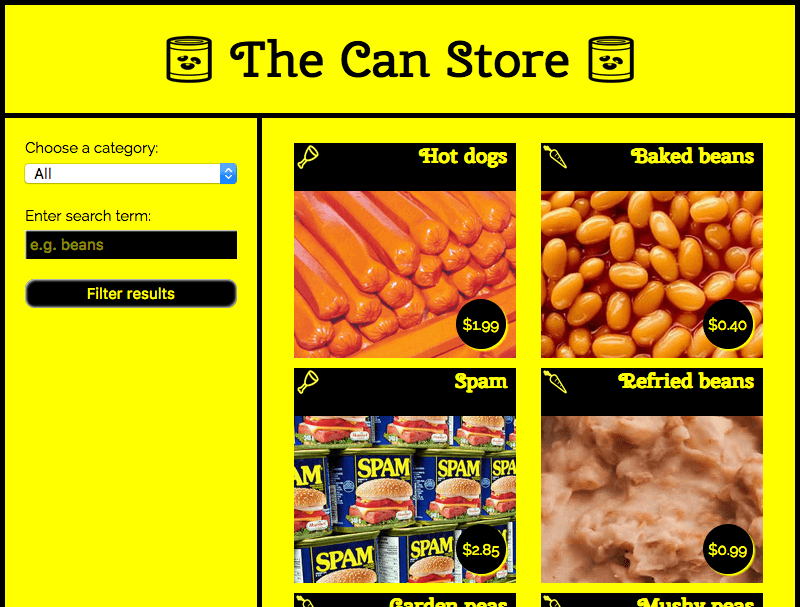

{{LearnSidebar}}{{PreviousMenuNext("Learn/JavaScript/Client-side_web_APIs/Manipulating_documents", "Learn/JavaScript/Client-side_web_APIs/Third_party_APIs", "Learn/JavaScript/Client-side_web_APIs")}}

现代网站和应用中另一个常见的任务是从服务端获取个别数据来更新部分网页而不用加载整个页面。这看起来是小细节却对网站性能和行为产生巨大的影响。所以我们将在这篇文章介绍概念和技术使它成为可能，尤其是 [Fetch API](/zh-CN/docs/Web/API/Fetch_API)。

<table>
  <tbody>
    <tr>
      <th scope="row">预备条件：</th>
      <td>
        JavaScript 基础（参见
        <a href="/zh-CN/docs/Learn/JavaScript/First_steps">JavaScript 第一步</a>、<a
          href="/zh-CN/docs/Learn/JavaScript/Building_blocks"
          >创建代码块</a
        >、<a
          href="/zh-CN/docs/Learn/JavaScript/Objects">JavaScript 对象</a>）、<a
          href="/zh-CN/docs/Learn/JavaScript/Client-side_web_APIs/Introduction"
          >客户端 API 基础</a
        >
      </td>
    </tr>
    <tr>
      <th scope="row">目标：</th>
      <td>
        了解如何从服务器获取数据并使用它来更新网页内容。
      </td>
    </tr>
  </tbody>
</table>

## 这里有什么问题？

网页由 HTML 页面和（通常也有）各种其他文件组成，例如样式表、脚本和图像。Web 加载页面的基本模型为：你的浏览器向服务器发起一个或多个 HTTP 请求以获取显示网页所需的文件，然后服务器响应请求的文件。如果你访问另一个页面，浏览器会请求新的文件，服务器则会响应这些请求。


这个模型适用于许多站点。但请考虑一个几乎是以数据驱动的网站，例如[温哥华图书馆](https://www.vpl.ca/)这样的图书馆网站。你可以将此类网站视作数据库的用户界面。它可能会允许你搜索特定类型的书籍，或者根据你之前借过的书籍向你推荐你可能喜欢的书籍。在你这样操作时，它需要使用新的书集来更新用于显示的页面。但请注意，大部分的页面内容（包括页眉、侧边栏和页脚等元素）将保持不变。

传统模型的问题在于我们必须获取并加载整个页面，即使我们只需要更新页面的一部分也是如此。这是低效的，而且会带来糟糕的用户体验。

因此，与传统模型不同，许多网站使用 JavaScript API 从服务器请求数据，并在不重新加载页面的情况下更新页面。因此，当用户搜索新产品时，浏览器仅请求更新页面所需的数据——例如要显示的新书集。


这里主要的 API 是 [Fetch API](/zh-CN/docs/Web/API/Fetch_API)。它允许页面中运行的 JavaScript 向服务器发起 [HTTP](/zh-CN/docs/Web/HTTP) 请求来获取特定的资源。当服务器提供了这些资源时，JavaScript 可以使用这些数据更新页面（通常是通过使用 [DOM 操作 API](/zh-CN/docs/Learn/JavaScript/Client-side_web_APIs/Manipulating_documents)）。请求的数据通常是 [JSON](/zh-CN/docs/Learn/JavaScript/Objects/JSON)，这是一种很好的传输结构化的格式，但也可以是 HTML 或纯文本。

这是数据驱动网站（如 Amazon、YouTube、eBay 等）的常见模式。使用此模型，使得：

- 页面更新更加迅速，你不必等待页面刷新，这意味这网站的体验更加流畅、响应更加迅速。
- 每次更新时下载的数据更少，这意味着浪费的带宽更少。这在使用宽带连接的台式机上可能不是什么问题，但在移动设备或没有高速互联网连接的国家/地区则是一个主要问题。

> **备注：** 在早期，这种通用技术被称为[异步](/zh-CN/docs/Glossary/Asynchronous)的 JavaScript 与 XML 技术（因而也被称作 [Ajax](/zh-CN/docs/Glossary/AJAX)）。但现在通常不是这种情况，相反你更有可能请求 JSON，不过由于结果依然相同，我们通常依旧使用术语“Ajax”来描述该技术。

为了进一步加快速度，某些网站还会在首次请求时将资源和数据存储在用户的计算机上，这意味这在后续的访问中，会使用这些内容的本地版本，而不是在每次重新加载页面时都下载新的副本。内容仅在更新后才会从服务器重新加载。

## Fetch API

让我们看几个 Fetch API 的示例。

### 获取文本内容

对于此示例，我们将从几个不同的文本文件中请求数据，并使用它们来填充内容区域。

这一系列文件将假定为我们的数据库；在实际的应用程序中，我们更有可能使用服务端语言（如 PHP、Python 或 Node）从数据库中获取数据。但在这里，我们希望保持简单并专注于客户端部分。

要开始此示例，请在计算机的新的目录中创建 [fetch-start.html](https://github.com/mdn/learning-area/blob/main/javascript/apis/fetching-data/fetch-start.html) 和四个文本文件（[verse1.txt](https://github.com/mdn/learning-area/blob/main/javascript/apis/fetching-data/verse1.txt)、[verse2.txt](https://github.com/mdn/learning-area/blob/main/javascript/apis/fetching-data/verse2.txt)、[verse3.txt](https://github.com/mdn/learning-area/blob/main/javascript/apis/fetching-data/verse3.txt) 和 [verse4.txt](https://github.com/mdn/learning-area/blob/main/javascript/apis/fetching-data/verse4.txt)）的本地拷贝。在这个示例中，当你在下拉菜单中选择一个选项时，我们会获取不同的诗歌（你可能会认识）。

在 {{htmlelement("script")}} 元素中，添加以下代码。这会存储对 {{htmlelement("select")}} 和 {{htmlelement("pre")}} 元素的引用，并对 `<select>` 元素添加一个事件监听器，以便在用户选择一个新的值时，新值将作为参数传递给名为 `updateDisplay()` 的函数。

```js
const verseChoose = document.querySelector("select");
const poemDisplay = document.querySelector("pre");

verseChoose.addEventListener("change", () => {
  const verse = verseChoose.value;
  updateDisplay(verse);
});
```

下面让我们定义 `updateDisplay()` 函数。首先，将以下内容放在你之前的代码块下方——这是该函数的空壳。

```js-nolint
function updateDisplay(verse) {

}
```

让我们将通过构造一个指向我们要加载的文本文件的相对 URL 来开始编写函数，因为我们稍后需要它。任何时候 {{htmlelement("select")}} 元素的值都与所选的 {{htmlelement("option")}} 内的文本相同（除非在值属性中指定了不同的值）——例如“Verse 1”。相应的诗歌文本文件是“verse1.txt”，并与 HTML 文件位于同一目录中，因此只需要文件名即可。

但是，web 服务器往往是区分大小写的，且文件名没有空格。要将“Verse 1”转换为“verse1.txt”，我们需要将 `V` 转换为小写、删除空格，并在末尾添加“.txt”。这可以通过 {{jsxref("String.replace", "replace()")}}、{{jsxref("String.toLowerCase", "toLowerCase()")}} 和[模板字符串](/zh-CN/docs/Web/JavaScript/Reference/Template_literals)来完成。在 `updateDisplay()` 函数中添加以下代码：

```js
verse = verse.replace(" ", "").toLowerCase();
const url = `${verse}.txt`;
```

最后，我们可以开始使用 Fetch API 了：

```js
// 调用 `fetch()`，传入 URL。
fetch(url)
  // fetch() 返回一个 promise。当我们从服务器收到响应时，
  // 会使用该响应调用 promise 的 `then()` 处理器。
  .then((response) => {
    // 如果请求没有成功，我们的处理器会抛出错误。
    if (!response.ok) {
      throw new Error(`HTTP 错误：${response.status}`);
    }
    // 否则（如果请求成功），我们的处理器通过调用
    // response.text() 以获取文本形式的响应，
    // 并立即返回 `response.text()` 返回的 promise。
    return response.text();
  })
  // 若成功调用 response.text()，会使用返回的文本来调用 `then()` 处理器，
  // 然后我们将其拷贝到 `poemDisplay` 框中。
  .then((text) => (poemDisplay.textContent = text))
  // 捕获可能出现的任何错误，
  // 并在 `poemDisplay` 框中显示一条消息。
  .catch((error) => (poemDisplay.textContent = `获取诗歌失败：${error}`));
```

这里有很多内容需要展开。

首先，Fetch API 的入口点是一个名为 {{domxref("fetch", "fetch()")}} 的全局函数，它以 URL 为参数（其使用另一个可选参数来进行自定义设置，但我们在这里不使用它）。

接下来，`fetch()` 是一个异步 API，会返回一个 {{jsxref("Promise")}}。如果你不知道什么是 Promise，请参阅[异步 JavaScript](/zh-CN/docs/Learn/JavaScript/Asynchronous) 章节，然后再回到这里。你会发现那篇文章也介绍了 `fetch()` API！

因为 `fetch()` 返回一个 Promise，所以我们将一个函数传递给它返回的 Promise 的 {{jsxref("Promise/then", "then()")}} 方法。此方法会在 HTTP 请求收到服务器的响应时被调用。在它的处理器中，我们检查请求是否成功，并在请求失败时抛出一个错误。否则，我们调用 {{domxref("Response/text", "response.text()")}} 以获取文本形式的响应正文。

`response.text()` *也*是异步的，所以我们返回它返回的 Promise，并向新的 Promise 的 `then()` 方法传递一个函数。这个函数会在响应文本可用时被调用，在这个函数中，我们会使用该文本更新 `<pre>` 块。

最后，我们在最后链式调用 {{jsxref("Promise/catch", "catch()")}} 处理器，以捕获我们调用的异步函数或其他处理器中抛出的任何错误。

此示例的一个问题是，它在第一次加载时不会显示任何诗歌。要解决此问题，请在代码的最后（`</script>` 结束标签之前）添加以下两行代码，以默认加载第一首诗歌，并确保 {{htmlelement("select")}} 元素始终显示正确的值：

```js
updateDisplay("Verse 1");
verseChoose.value = "Verse 1";
```

### 在服务端运行示例

如果只是使用本地文件运行示例，现代浏览器将不会执行 HTTP 请求。这是因为安全限制（更多关于 Web 安全性的限制，请参阅[网站安全](/zh-CN/docs/Learn/Server-side/First_steps/Website_security)）。

为了解决这个问题，我们需要通过在本地 Web 服务器上运行它来测试这个示例。要了解如何实现这一点，请阅读[我们的设置本地测试服务器指南](/zh-CN/docs/Learn/Common_questions/set_up_a_local_testing_server)。

### 罐头商店

在这个示例中，我们创建了一个名为 The Can Store 的示例站点——它是一个虚构的超市，仅销售罐头食品。你可以[在 GitHub 上找到这个可用示例](https://mdn.github.io/learning-area/javascript/apis/fetching-data/can-store/)，并[查看源代码](https://github.com/mdn/learning-area/tree/main/javascript/apis/fetching-data/can-store) 。



默认情况下，站点会显示所有产品，但你可以使用左侧边栏中的表单控件按类别或搜索词或两者进行筛选。

有很多复杂的代码按类别和搜索词来过滤产品、操作字符串以便数据在 UI 中正确显示，等等。我们不会在本文中讨论所有的这些，但是你可以在代码中找到大量的注释（见 [can-script.js](https://github.com/mdn/learning-area/blob/main/javascript/apis/fetching-data/can-store/can-script.js)）。

但是，我们会解释 Fetch 代码的含义。

第一个使用 Fetch 的代码块可以在 JavaScript 的开头找到：

```js
fetch("products.json")
  .then((response) => {
    if (!response.ok) {
      throw new Error(`HTTP 错误：${response.status}`);
    }
    return response.json();
  })
  .then((json) => initialize(json))
  .catch((err) => console.error(`Fetch 错误：${err.message}`));
```

`fetch()` 函数返回一个 Promise。如果成功完成，第一个 `.then()` 代码块中的函数包含通过网络返回的响应（`response`）。

在此函数中，我们：

- 检查服务器是否返回错误（例如 [`404 Not Found`](/zh-CN/docs/Web/HTTP/Status/404)）。如果返回了错误，我们抛出一个错误。
- 对响应调用 {{domxref("Response.json","json()")}}。它会将数据检索为 [JSON 对象](/zh-CN/docs/Learn/JavaScript/Objects/JSON)。然后我们返回 `response.json()` 返回的 promise。

接着，我们将一个函数传递给返回的 Promise 的 `then()` 方法。该函数会被传入一个包含 JSON 格式的响应数据的对象，我们将这个对象传递给 `initialize()` 函数。该函数会开始在用户界面中显示所有产品的过程。

为了处理错误，我们将一个 `.catch()` 代码块串联到 Promise 链的末尾。如果 Promise 由于某种原因失败了，它就会被运行。在该代码块中，我们包含一个接收 `err` 对象的函数。该 `err` 对象可用于报告已发生错误的性质，在本例中，我们仅使用了 `console.log()`。

然而，一个完整的网站会通过在用户屏幕上显示一条消息，可能还会提供这种情况的补救选项来更优雅地处理此类错误，但我们在这里不需要比 `console.error()` 更复杂的东西。

你可以自己测试失败的情况：

1. 创建示例文件的本地副本。
2. 通过 Web 服务器运行代码（如上所述，[在服务端运行示例](#在服务端运行示例)）。
3. 修改要获取的文件的路径，比如“produc.json”（确保你拼写的是错误的）。
4. 现在在你的浏览器上加载索引文件（通过 `localhost:8000`）然后查看你浏览器的开发者控制台。你将看到一条类似于“Fetch 错误：HTTP 错误：404”的消息。

第二个 Fetch 块可以在 `fetchBlob()` 函数中找到：

```js
fetch(url)
  .then((response) => {
    if (!response.ok) {
      throw new Error(`HTTP 错误：${response.status}`);
    }
    return response.blob();
  })
  .then((blob) => showProduct(blob, product))
  .catch((err) => console.error(`Fetch 错误：${err.message}`));
```

它的工作原理和前一个差不多，除了我们放弃 {{domxref("Response.json","json()")}} 而使用 {{domxref("Response.blob","blob()")}}——在本例中，我们希望以图像文件的形式返回响应，为此使用的数据格式是 [Blob](/zh-CN/docs/Web/API/Blob)——这个词是“二进制大对象”的缩写，基本上可以用来表示大型类文件对象——比如图像或视频文件。

一旦我们成功地接收到我们的 blob，我们将其传入到用于显示图像的 `showProduct()` 函数中。

## XMLHttpRequest API

有时，尤其是在旧的代码中，你会看到另一个名为 [`XMLHttpRequest`](/zh-CN/docs/Web/API/XMLHttpRequest)（经常会被简写为“XHR”）的 API，它也用于发送 HTTP 请求。其早于 Fetch API，而且是第一个广泛用于实现 AJAX 的 API。如果可以，我们建议你使用 Fetch：它是一个更简单的 API，而且比 `XMLHttpRequest` 的特性更多。我们不再详细介绍使用 `XMLHttpRequest` 的示例，但我们将向你展示罐头商店示例的第一个请求的 `XMLHttpRequest` 版本：

```js
const request = new XMLHttpRequest();

try {
  request.open("GET", "products.json");

  request.responseType = "json";

  request.addEventListener("load", () => initialize(request.response));
  request.addEventListener("error", () => console.error("XHR error"));

  request.send();
} catch (error) {
  console.error(`XHR error ${request.status}`);
}
```

这里有五个阶段：

1. 创建一个新的 `XMLHttpRequest` 对象。
2. 调用它的 [`open()`](/zh-CN/docs/Web/API/XMLHttpRequest/open) 以进行初始化。
3. 为其添加 [`load`](/zh-CN/docs/Web/API/XMLHttpRequest/load_event) 事件的事件监听器，其会在响应加载完成时触发。在监听器中，我们调用 `initialize()` 函数。
4. 为其添加 [`error`](/zh-CN/docs/Web/API/XMLHttpRequest/error_event) 事件的事件监听器，其会在请求失败时触发。
5. 发送请求。

我们还必须将整个事件包装在 [try...catch](/zh-CN/docs/Web/JavaScript/Reference/Statements/try...catch) 块中，以便处理 `open()` 或 `send()` 可能抛出的错误。

希望你会觉得 Fetch API 是对此的改进。特别是，在看完我们对两者的错误处理之后。

## 概述

本文介绍了如何使用 Fetch 从服务器获取数据。

## 参见

虽然本文中讨论了许多不同的主题，但是这些主题仅是触及了表面。有关这些主题的更多详细信息，请尝试阅读以下文章：

- [使用 Fetch](/zh-CN/docs/Web/API/Fetch_API/Using_Fetch)
- [Promise](/zh-CN/docs/Web/JavaScript/Reference/Global_Objects/Promise)
- [使用 JSON 数据](/zh-CN/docs/Learn/JavaScript/Objects/JSON)
- [HTTP 概述](/zh-CN/docs/Web/HTTP/Overview)
- [服务器端网页编程](/zh-CN/docs/Learn/Server-side)

{{PreviousMenuNext("Learn/JavaScript/Client-side_web_APIs/Manipulating_documents", "Learn/JavaScript/Client-side_web_APIs/Third_party_APIs", "Learn/JavaScript/Client-side_web_APIs")}}
