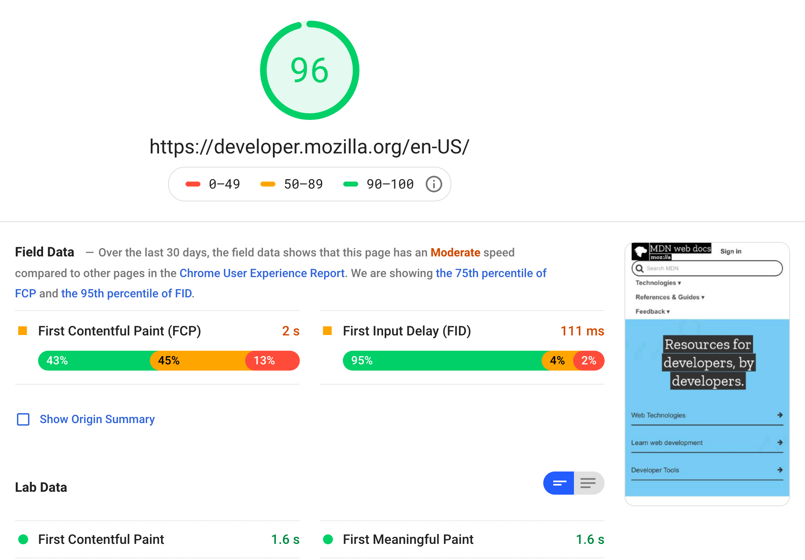

{{LearnSidebar}} {{PreviousMenuNext("Learn/Performance/Perceived_performance", "Learn/Performance/Multimedia", "Learn/Performance")}}

测量性能提供了一个重要的指标，以帮助你评估应用程序、网站或 web 服务的成功程度。

例如，你可以使用性能指标来确定你的应用程序与竞争对手相比如何表现，或者你可以比较应用程序在各个版本之间的性能。你选择的度量指标应与你的用户、网站和业务目标相关。它们应以一致的方式收集和测量，并以非技术利益相关者可以消费和理解的格式进行分析。

本文介绍了可用于衡量和优化网站性能的 web 性能指标。

<table>
  <tbody>
    <tr>
      <th scope="row">前提：</th>
      <td>
        基本计算机素养，
        <a
          href="/zh-CN/docs/Learn/Getting_started_with_the_web/Installing_basic_software"
          >已安装基本软件</a
        >，以及
        <a href="/zh-CN/docs/Learn/Getting_started_with_the_web"
          >客户端网络技术的基本知识</a
        >。
      </td>
    </tr>
    <tr>
      <th scope="row">目标：</th>
      <td>
        

            提供关于可以通过不同的 web 性能 API 和工具来收集的性能指标的信息，并介绍可以用来展示这些数据的工具。
        

      </td>
    </tr>
  </tbody>
</table>

## 性能 API

编写 web 代码时，有大量的 [web API](/zh-CN/docs/web/API) 可用，使你可以创建自己的性能测量工具。

你可以使用[导航计时 API](/zh-CN/docs/web/API/Navigation_timing_API)来测量客户端 web 性能，包括卸载上一个页面所需的时间、域名查找所需的时间、执行窗口加载处理程序所花费的总时间等。你可以将该 API 用于与下图中显示的所有导航事件相关的度量。

[性能 API](/zh-CN/docs/web/API/Performance_API/Using_the_Performance_API)，它为当前页面提供了访问性能相关信息的能力，包括[性能时间轴 API](/zh-CN/docs/web/API/Performance_Timeline)、[导航计时 API](/zh-CN/docs/web/API/Navigation_timing_API)、[用户计时 API](/zh-CN/docs/web/API/User_Timing_API)和[资源计时 API](/zh-CN/docs/web/API/Resource_Timing_API)。这些接口允许准确测量 JavaScript 任务完成所需的时间。

[PerformanceEntry](/zh-CN/docs/web/API/PerformanceEntry) 对象是性能时间轴的一部分。性能条目可以通过在应用程序的显式点创建性能_{{domxref("PerformanceMark","mark")}}_或_{{domxref("PerformanceMeasure","measure")}}_（例如，通过调用{{domxref("Performance.mark","mark()")}}方法直接创建。性能条目还可以通过间接方式创建，例如加载资源，如图像。

[PerformanceObserver API](/zh-CN/docs/web/API/PerformanceObserver)可用于观察性能测量事件，并在浏览器的性能时间轴中记录新的[性能条目](/zh-CN/docs/web/API/PerformanceEntry)时通知你。

虽然本文并没有深入介绍这些 API 的使用，但了解它们的存在是有用的。你还可以参考[导航和计时](/zh-CN/docs/web/Performance/Navigation_and_resource_timings)文章，以获取有关使用性能 web API 的更多示例。

## 工具和指标

有许多不同的工具可用于帮助你提高性能。这些工具通常可以分为两类：

- 指示或测量性能的工具，如 [PageSpeed Insights](https://pagespeed.web.dev/)或 Firefox 的[网络监视器](https://firefox-source-docs.mozilla.org/devtools-user/network_monitor/index.html)和[性能监视器](https://firefox-source-docs.mozilla.org/devtools-user/performance/index.html)。这些工具向你展示你的 web 应用程序或网站加载有多快或多慢。它们还指出可以改进以优化你的 web 应用程序的领域。
- 更新代码以使你的 web 应用程序或网站性能更好的工具。例如，捆绑工具将你的代码打包成单个文件，以减少 HTTP 请求数量，或者缩小器从你的代码中删除所有空白以使文件更小。

在本课程中，我们将讨论这两类工具。除了讨论性能指标，我们还将讨论用于衡量你的网站性能是否在改善的指标。

### 通用性能报告工具

像 [PageSpeed Insights](https://pagespeed.web.dev/)这样的工具可以衡量网站的性能。你可以输入一个 URL，并在几秒钟内获得一份性能报告。报告包含有关你的网站在移动设备和桌面设备上的表现的分数。这是了解你已经做得很好的地方以及可以改进的地方的良好开始。

撰写本文时，MDN 的性能报告摘要看起来类似于以下内容：

性能报告包含有关用户在页面上显示任何内容之前需要等待多长时间、显示页面需要下载多少字节等信息。它还会让你知道测量的值是否被认为是好的或坏的。

[webpagetest.org](https://webpagetest.org)是另一个可以自动测试你的网站并返回有用指标的工具示例。

尝试现在运行你最喜欢的网站，使用 webpagetest.org 和 PageSpeed Insights，查看分数如何。

### 网络工具

大多数浏览器都有可用的工具，你可以使用这些工具来针对已加载的页面进行运行，以确定它们的性能如何。例如，Firefox 的[网络监视器](https://firefox-source-docs.mozilla.org/devtools-user/network_monitor/index.html)返回有关从网络下载的所有素材的详细信息，以及显示每个下载所花费的时间的时间图。

你还可以使用[性能监视器](https://firefox-source-docs.mozilla.org/devtools-user/performance/index.html)在执行不同操作时测量 web 应用程序或网站用户界面的性能。这表明了可能会减慢你的 web 应用程序或网站的功能。

## 结语

本文简要介绍了 web 性能指标，以帮助你了解可以在 web 应用程序或网站上测量的内容。接下来，你将了解感知性能以及一些技术，以减轻或完全掩盖不可避免的性能损失对用户造成的影响。

{{PreviousMenuNext("Learn/Performance/Perceived_performance", "Learn/Performance/Multimedia", "Learn/Performance")}}
