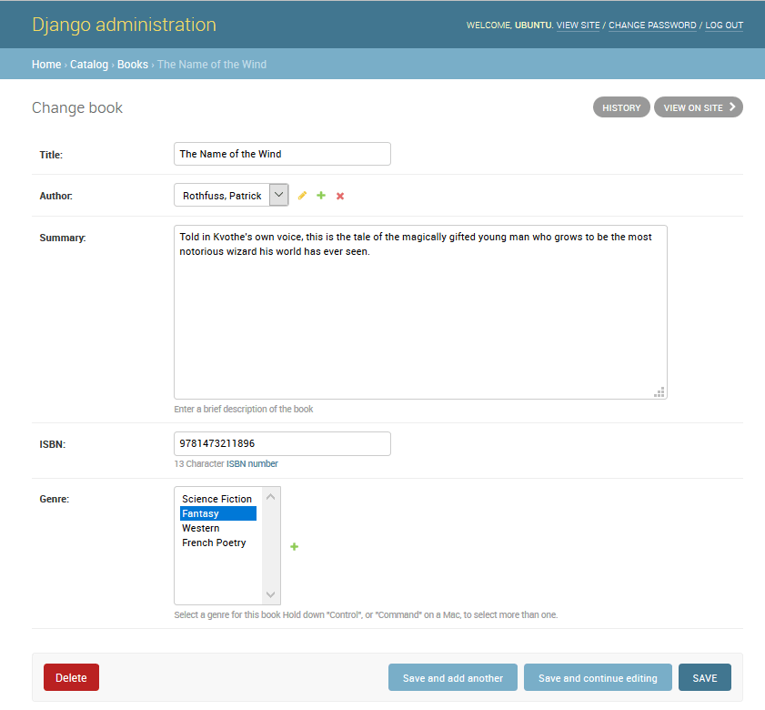
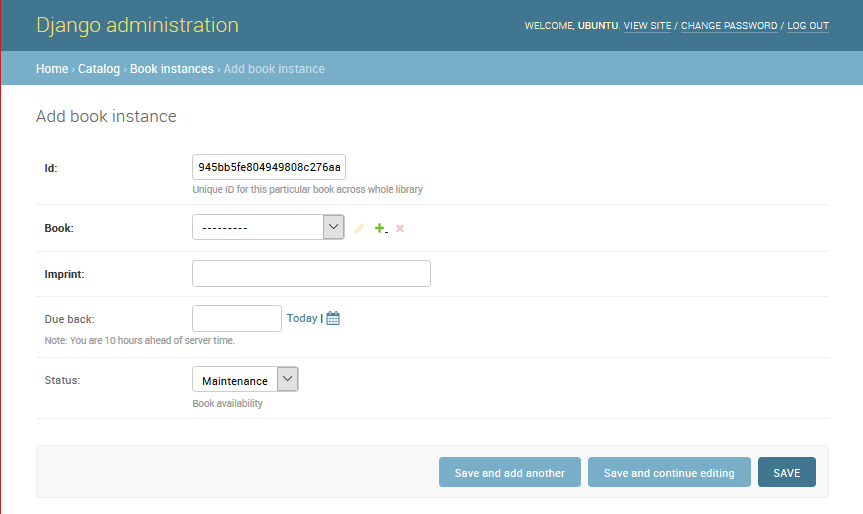
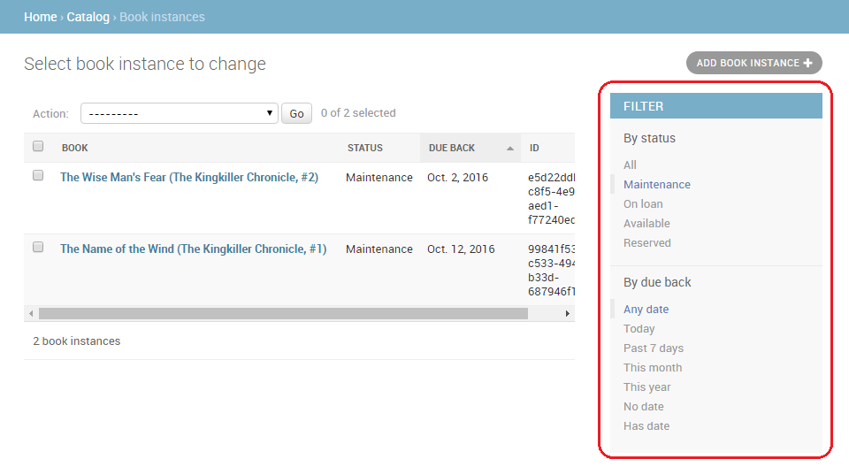
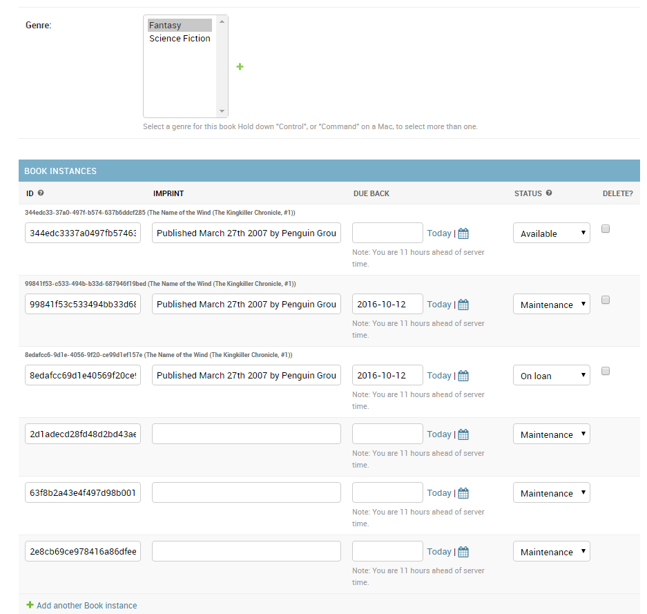

{{LearnSidebar}}{{PreviousMenuNext("Learn/Server-side/Django/Models", "Learn/Server-side/Django/Home_page", "Learn/Server-side/Django")}}

好了，我们已经为本地图书馆网站 [LocalLibrary](/zh-CN/docs/Learn/Server-side/Django/Tutorial_local_library_website) 创建了模型，我们接下来使用 Django 管理站点去添加 一些“真“书数据。首先我们展示如何用管理站点注册模型，然后展示如何登录和创建一些数据。本文最后，我们介绍你可以进一步改进管理站点的建议。

<table class="learn-box standard-table">
  <tbody>
    <tr>
      <th scope="row">前提：</th>
      <td>
        完成：
        <a href="/zh-CN/docs/Learn/Server-side/Django/Models"
          >Django Tutorial Part 3: 使用模型</a
        >。
      </td>
    </tr>
    <tr>
      <th scope="row">目的：</th>
      <td>
        <p>
          了解关于管理站点的优点与缺点，并且可以使用它为我们模型创建一些记录。
        </p>
      </td>
    </tr>
  </tbody>
</table>

## 综述

Django 管理应用程序可以使用你的模型自动构建可用于创建，查看，更新和删除记录的站点区域。这可以在开发过程中节省大量的时间，从而很容易测试你的模型，并了解你是否拥有正确的数据。根据网站的类型，管理应用程序也可用于管理生产中的数据。Django 项目建议仅用于内部数据管理（即仅供管理员或组织内部人员使用），因为以模型为中心的方法不一定是所有用户最好的界面，并且暴露了大量不必要的细节关于模型。

[创建基础项目时，](/zh-CN/docs/Learn/Server-side/Django/skeleton_website)自动完成所有将你的网站中的管理应用程序包含在内的配置文件（有关所需实际依赖关系的信息 (如有需要请看 [Django docs here](https://docs.djangoproject.com/en/1.10/ref/contrib/admin/)). 其结果是，你必须做你的模型添加到管理应用程序是 注册 他们。在本文末尾，我们将简要介绍如何进一步配置管理区域以更好地显示我们的模型数据。

注册模型后，我们将展示如何创建一个新的“超级用户”，登录到该网站，并创建一些书籍，作者，书籍实例和流派。这些将有助于测试我们将在下一个教程中开始创建的视图和模板。

## 注册模型

首先，在目录应用程序 (**/locallibrary/catalog/admin.py**) 中打开 **admin.py** 。此时此刻它看起来像这样—注意它已经导入了 django.contrib.admin：

```python
from django.contrib import admin

# Register your models here.
```

通过将以下文本复制到文件的底部来注册模型。该代码简单地导入模型，调用 **admin.site.register** 来注册它们。

```python
from .models import Author, Genre, Book, BookInstance

admin.site.register(Book)
admin.site.register(Author)
admin.site.register(Genre)
admin.site.register(BookInstance)
```

> **备注：** 如果你接受创建模型以表示书籍的自然语言的挑战 ([see the models tutorial article](/zh-CN/docs/Learn/Server-side/Django/Models)), 导入并注册。

这是在网站上注册模型或多模型的简单方法，管理站点是高度可定制的，我们将进一步讨论注册模型的其他方式。

## 创建一个超级用户

为了登录管理员站点，我们需要启动工作人员状态的用户账户。为了查看和创建记录，我们还需要该用户具有所有对象的记录。你可以创建一个“超级用户”账号，该账号具有完全访问该站点和所有必需的权限可以使用`manage.py`

调用接下来的命令，在同样的目录下，`manage.py` 创建超级用户。你将被提示输入用户名，电子邮件地址，和强密码。

```bash
python3 manage.py createsuperuser
```

一旦命令完成，一个新超级用户将被添加到数据库。现在重新启动开发服务器，以便我们可以测试登录名：

```bash
python3 manage.py runserver
```

## 登入并使用该网站

登录网站，打开 `/admin` (e.g. [http://127.0.0.1:8000/admin](http://127.0.0.1:8000/admin/))
和进入你的新超级用户名和密码凭据（你将被重定向到 登录页面，然后在你进入你的详细信息后回到 `/admin` URL

这部分网站展示我们所有的模型，按安装的应用程序分组。你可以点击模型名称来进入到 它所有相关详细记录的页面，你可以进一步点击这些记录进行编辑。你也可以直接点击每个模型旁边的添加链接，开始创建该类型的记录。


点击图书右侧的添加链接来新建一本书（这将显示一个类似下面的对话框）。注意每个字段标题，使用的小部件的类型以及**help_text**（如果有的话）你要在模型中匹配指定的值。

输入字段的值，你可以创建一个新的作者或类型通过 按 `+` 按钮（或者如果你已经创建选项，选择已有的值）。完成后，你可以按 **保存**，**保存并添加另一个**，或**保存并继续编辑**来保存记录。


> **备注：** 在这里，我们希望你花费一点时间添加一些书，作者，类型（如：幻想）到你的应用。确保每个作者和类型都包含几本不同的书籍（这会是你的列表和详细视图在文章系列中后期使用时更有趣）。

我们完成添加书籍，在顶部标签中，点击 **Home** 链接将回到主管理页面。然后点击 **Books** 链接显示当前书籍的列表（或其他链接之一，以查看其他型号列表）。现在你已经添加了几本书，列表可能与下面的截图类似。显示每本书的标题；这是书模型 \_\_str\_\_() 方法返回的值，在上一文章中提到。


从该列表中，你可以通过选中不需要的图书旁边的复选框来删除图书，从“操作”下拉列表中选择“删除”操作，然后按 Go 按钮。你也可以通过按下 ADD BOOK 按钮添加新书。

你可以通过在链接中选择其名称来编辑书籍。一本书的编辑页面如下所示，与“添加”页面几乎相同。主要的区别是页面标题（更改书）和添加 删除，历史和`VIEW ON SITE`按钮（最后一个按钮出现，因为我们定义了`get_absolute_url()`我们的模型中的 方法）。



现在回到主页（使用主页链接的导航痕迹），然后查看作者 和类型 列表 - 你应该已经有很多创建从添加新书，但可以自由添加一些更多。

你不会有任何书籍实例，因为这些不是从图书创建的（虽然你可以从 **BookInstance** - 创建一个书 - 这是 ForeignKey 字段的性质）。返回主页，然后按关联的添加按钮显示下面的添加书实例屏幕。请注意，全球唯一的 ID，可用于单独标识库中单书的副本。



为你的书创建一些记录。将状态设置为可用于至少一些记录，并为其他记录贷款。如果状态 不可 用，则还设置未来到期日期。

而已！你现在已经学会了如何 设置和使用管理站点。你还创建书的记录，BookInstance，Genre，和 Author 我们就可以一次我们创造我们自己的观点和模板使用。

## 高级配置

Django 使用注册模型的信息为创建基本管理站点做了非常好的工作：

- 每个模型都有一个单独的记录列表，由使用模型 \_\_str\_\_()
  方法创建的字符串标识，并链接到详细视图/表单进行编辑。默认，视图最上面有一个操作菜单，可用于对记录执行批量删除操作。
- 进行编辑和添加记录的模型详细记录表单包含 模型的所有字段，以其声明顺序垂直布置。

你可以进一步自定义界面，使它更容易使用，你可以改进的一些想法：

- 视图列表：

  - 添加每个记录显示的其他字段/信息
  - 添加过滤器以根据日期或某些其他选择值（例如图书货款状态）选择列出哪些记录。
  - 在列表视图中的操作菜单中添加其他选项，并选择此菜单在表单上显示的位置。

- 详细视图

  - 选择要显示（或排除）的字段，以及其顺序，分组，是否可编辑，使用的小部件，方向等。
  - 将相关字段添加到记录以允许内联编辑（例如：添加在创建作者记录时添加和编辑图书记录的功能）。

在本节中，我们将看一些改进本地图书馆界面的更改，其中包括添加更多信息 Book 和 Author 模型列表，以及改进编辑视图的布局。我们不会改变 Language 和 Genre 模拟演示，因为它们只有一个字段，所以这样没有真正的好处。

你可以 在 [The Django Admin site](https://docs.djangoproject.com/en/1.10/ref/contrib/admin/) 中找到所以管理员网站自定义选项的完整参考。

### 注册 一个 ModelAdmin 类

在管理界面去改变一个模型的展示方式，当你定义了 [ModelAdmin](https://docs.djangoproject.com/en/dev/ref/contrib/admin/#modeladmin-objects) 类（描述布局）和将其注册到模型中。

让我们开始作者模型。打开 **admin.py** 在目录应用程序 (**/locallibrary/catalog/admin.py**)。注释你的原始注册（前缀为#）在 **Author** 模型

```js
# admin.site.register(Author)
```

现在添加一个 AuthorAdmin 和注册，如下

```python
# Define the admin class
class AuthorAdmin(admin.ModelAdmin):
    pass

# Register the admin class with the associated model
admin.site.register(Author, AuthorAdmin)
```

我们再为**Book** 添加 **ModelAdmin** 类 和 **BookInstance** 类。我们需要注释我们原始注册：

```js
#admin.site.register(Book)
#admin.site.register(BookInstance)
```

现在创建和注册新的模型；为了演示的目的，我们将使用`@register 装饰器来注册模型（这和 admin.site.register()` 语法作用一样）。

```python
# Register the Admin classes for Book using the decorator

@admin.register(Book)
class BookAdmin(admin.ModelAdmin):
    pass

# Register the Admin classes for BookInstance using the decorator

@admin.register(BookInstance)
class BookInstanceAdmin(admin.ModelAdmin):
    pass
```

可以看到我们现在 的 类都是空的（“pass”），所以管理操作并不会改变，我们现在对这些类进行扩展，以定义我们针对模型的管理行为。

### 配置列表视图

该 本地图书馆 目前列出的所以作者都使用从模型生成的对象名称的`__str__()` 方法。如果只是几个作者，这无关紧要。但一旦你有许多作者，这可能会重复。要区分它们，或仅仅因为你想要显示有关每个作者的更多有趣的信息，你可以使用 [list_display](https://docs.djangoproject.com/en/dev/ref/contrib/admin/#django.contrib.admin.ModelAdmin.list_display) 向视图添加其他字段。

用下面的代码替代 你 **AuthorAdmin** 的类。在元组中声明要显示列表中的字段名称以所需的顺序排列，如图（这些和原始模型中指定的名称相同）。

```python
class AuthorAdmin(admin.ModelAdmin):
    list_display = ('last_name', 'first_name', 'date_of_birth', 'date_of_death')
```

重新启动站点并导航到作者列表。现在应该显示上述字段，如下所示：


对于我们的 Book 模型，我们将另外显示**author**和**genre**。这 author 是一个**ForeignKey**字段（一对多）的关系，所以将由`__str()__`相关记录的值表示。用**BookAdmin**下面的版本替换课程。

```python
class BookAdmin(admin.ModelAdmin):
    list_display = ('title', 'author', 'display_genre')
```

不幸的是，我们不能直接指定 **list_display** 中的 **genre** 字段，因为它是一个**ManyToManyField** （Django 可以防止这种情况，因为在这样做时会有大量的数据库访问“成本”）。相反，我们将定义一个 `display_genre` 函数来获取信息作为一个字符串（这是我们上面调用的函数;下面我们将定义它）。

> **备注：** 在**genre**这里获取可能不是一个好主意，因为数据库操作的“成本”。我们向你展示了如何在模型中调用函数的其他原因非常有用 - 例如在列表中的每个项目旁边添加一个“删除”链接。

将以下代码添加到 Book 模型（**models.py**）中。这将从 genre 字段的前三个值（如果存在）创建一个字符串，并创建一个`short_description`可以在此方法的管理站点中使用的字符串。

```python
    def display_genre(self):
        """
        Creates a string for the Genre. This is required to display genre in Admin.
        """
        return ', '.join([ genre.name for genre in self.genre.all()[:3] ])
    display_genre.short_description = 'Genre'
```

保存模型并更新管理员后，重新启动站点并转到图书列表页面; 你应该看到像下面这样的书籍清单：


该 Genre 模型（和 Language 模式，如果你定义一个）都有一个单一的领域，所以没有一点为他们创造更多的显示领域的附加模型。

> **备注：** 值得更新 BookInstance 模型列表，至少显示状态和预期的返回日期。我们已经补充说，作为本文末尾的挑战！

### 添加列表过滤器

一旦列表中有很多项目，就可以过滤哪些项目被显示出来。这是通过在`list_filter`属性中列出字段来完成的。用`BookInstanceAdmin`下面的代码片段替换你当前的 类。

```python
class BookInstanceAdmin(admin.ModelAdmin):
    list_filter = ('status', 'due_back')
```

列表视图现在将在右侧包含一个过滤器框。请注意如何选择日期和状态来过滤值：



### 整理细节视图布局

默认情况下，详细视图按照其在模型中声明的顺序垂直排列所有字段。你可以更改声明的顺序，哪些字段显示（或排除），区段是否用于组织信息，字段是水平还是垂直显示，甚至是管理窗体中使用的编辑窗口小部件。

> **备注：** LocalLibrary 模型比较简单，因此我们不需要更改布局; 不管怎样，我们会做一些改变，只是为了向你展示如何。

#### 控制哪些字段被显示和布局

更新你的 `AuthorAdmin` 类以添加`fields`行，如下所示（粗体）：

```python
class AuthorAdmin(admin.ModelAdmin):
    list_display = ('last_name', 'first_name', 'date_of_birth', 'date_of_death')
    fields = ['first_name', 'last_name', ('date_of_birth', 'date_of_death')]
```

在`fields` 属性列表只是要显示在表格上那些领域，如此才能。字段默认情况下垂直显示，但如果你进一步将它们分组在元组中（如上述“日期”字段中所示），则会水平显示。

重新启动你的应用程序并转到作者详细信息视图 - 现在应该如下所示：


> **备注：** 你还可以使用`exclude`属性来声明要从表单中排除的属性列表（将显示模型中的所有其他属性）。

#### 剖切细节视图

你可以使用 [fieldsets](https://docs.djangoproject.com/en/dev/ref/contrib/admin/#django.contrib.admin.ModelAdmin.fieldsets) 属性添加“部分”以在详细信息表单中对相关的模型信息进行分组。

在 `BookInstance`模型中，我们有相关的书是什么（即信息 `name`、`imprint` 和 `id`），并且当将可用（`status`、`due_back`）。我们可以通过将粗体文本添加到我们的`BookInstanceAdmin`类中来将其添加到不同的部分。

```python
@admin.register(BookInstance)
class BookInstanceAdmin(admin.ModelAdmin):
    list_filter = ('status', 'due_back')

    fieldsets = (
        (None, {
            'fields': ('book','imprint', 'id')
        }),
        ('Availability', {
            'fields': ('status', 'due_back')
        }),
    )
```

每个部分都有自己的标题（或者 None 如果你不想要一个标题）和字典中的一个相关的元组 - 描述的格式很复杂，但是如果你看上面的代码片段，那么它们很容易理解。

重新启动并导航到书籍实例视图; 表格应如下所示：


### 关联记录的内联编辑

有时，可以同时添加关联记录是有意义的。例如，将书籍信息和有关你在同一详细信息页面上的特定副本的信息同时显示可能是有意义的。

你可以通过声明 [inlines](https://docs.djangoproject.com/en/dev/ref/contrib/admin/#django.contrib.admin.ModelAdmin.inlines), 类型 [TabularInline](https://docs.djangoproject.com/en/dev/ref/contrib/admin/#django.contrib.admin.TabularInline) (水平布局 ) or [StackedInline](https://docs.djangoproject.com/en/dev/ref/contrib/admin/#django.contrib.admin.StackedInline) (垂直布局，就像默认布局) 这样做。你可以通过在你的以下的粗体中添加以下行，将内容中的`BookInstance`信息添加到我们的 Book 详细信息中`BookAdmin`：

```python
class BooksInstanceInline(admin.TabularInline):
    model = BookInstance

@admin.register(Book)
class BookAdmin(admin.ModelAdmin):
    list_display = ('title', 'author', 'display_genre')
    inlines = [BooksInstanceInline]
```

尝试重新启动你的应用程序，然后查看图书的视图 - 在底部你应该看到与本书相关的图书实例：



在这种情况下，我们所做的就是声明我们的`tablular`内联类，它只是从内联模型添加所有字段。你可以为布局指定各种附加信息，包括要显示的字段，其顺序，是否只读等。（有关详细信息，请参阅 [TabularInline](https://docs.djangoproject.com/en/dev/ref/contrib/admin/#django.contrib.admin.TabularInline) ).

> **备注：** 这个功能有一些痛苦的限制！在上面的屏幕截图中，我们有三个现有的书籍实例，其次是新的书籍实例的三个占位符（看起来非常相似！）。默认情况下没有备用书实例会更好，只需使用“添加另一个书”实例链接添加它们，或者可以`BookInstance`从这里列出作为不可读的链接。第一个选项可以通过`extra`在`BookInstanceInline`模型中将属性设置为 0 来完成，自己尝试一下。

## 挑战自己

我们在本节学到了很多东西，所以现在是时候尝试一些事情了。

1. 对于 `BookInstance`列表视图，添加代码以显示书籍，状态，到期日期和 ID（而不是默认`__str__()`文本）。
2. 添加的在线上市 Book 项目的 Author 使用，因为我们做了同样的做法详细视图`Book/ BookInstance`。

## 概要

而已！你现在已经了解了如何以最简单和改进的形式设置管理站点，如何创建超级用户以及如何导航管理站点以及查看，删除和更新记录。一路上，你创建了一堆书籍，BookInstances，流派和作者，一旦我们创建了自己的视图和模板，我们就可以列出和展示。

## 进阶阅读

- [Writing your first Django app, part 2: Introducing the Django Admin](https://docs.djangoproject.com/en/1.10/intro/tutorial02/#introducing-the-django-admin) (Django docs)
- [The Django Admin site](https://docs.djangoproject.com/en/1.10/ref/contrib/admin/) (Django Docs)

{{PreviousMenuNext("Learn/Server-side/Django/Models", "Learn/Server-side/Django/Home_page", "Learn/Server-side/Django")}}
