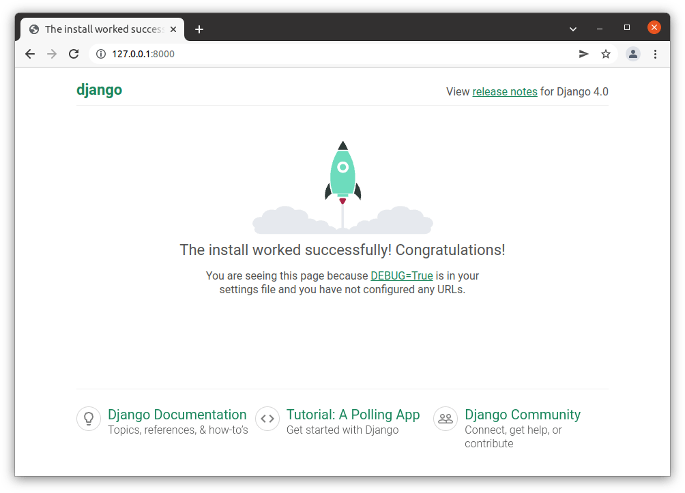

{{LearnSidebar}}{{PreviousMenuNext("Learn/Server-side/Django/Introduction", "Learn/Server-side/Django/Tutorial_local_library_website", "Learn/Server-side/Django")}}

现在，你知道什么是 Django。
那么我们将向你展示如何在 Windows，Linux（Ubuntu）和 Mac OSX 上设置和测试 Django 开发环境—无论你常用哪种操作系统，本文能给你开发 Django 应用所需的一切。

<table class="learn-box standard-table">
  <tbody>
    <tr>
      <th scope="row">先决条件：</th>
      <td>
        知道如何在你开发所用的计算机操作系统中，打开终端/命令行和安装软件包。
      </td>
    </tr>
    <tr>
      <th scope="row">目的：</th>
      <td>在你的计算机中运行 Django（1.10）开发环境。</td>
    </tr>
  </tbody>
</table>

## Django 开发环境概述

Django 使你可以轻松配置自己的电脑，以便开始开发网络应用。本节解释你可以从开发环境中获得什么，并提供一些设置和配置选项的概述。本文的其余部分介绍了在**Ubuntu**，**Mac** OSX 和**Windows**上安装 Django 开发环境的 **推荐方法**，以及如何测试。

### 什么是 Django 开发环境？

开发环境是本地计算机上的 Django 安装，在将 Django 应用程序部署到生产环境之前，你可以使用它来开发和测试 Django 应用程序。

Django 本身提供的主要工具是一组用于创建和使用 Django 项目的 Python 脚本，以及可在你电脑的 web 浏览器中测试本地 Django web 应用（在你的计算机，而不是在外部的 web 服务器）。

还有其他外部工具，它们构成了开发环境的一部分，我们将不再赘述。这些包括 [文本编辑器](/zh-CN/docs/Learn/Common_questions/Available_text_editors) 或编辑代码的 IDE，以及像 [Git](https://git-scm.com/) 这样的源代码控制管理工具，用于安全地管理不同版本的代码。我们假设你已经安装了一个文本编辑器。

### 什么是 Django 设置选项？

Django 在安装和配置方面非常灵活。Django 可以：

- 安装在不同的操作系统上。
- 通过源代码、Python 包索引（PyPi）进行安装，而大多数情况下，是通过主机的包管理应用程序安装的。
- 配置为使用几个数据库之一，可能还需要单独安装和配置。
- 在主系统的 Python 环境或在单独的 Python 虚拟环境中运行。

每个选项都需要略微不同的配置和设置。以下小节解释了你的一些选择。在本文的其余部分中，我们将介绍 Django 在几个操作系统上的设置，并且在本教程的剩余模块中将假设你已进行该设置。

> **备注：** 其他可能的安装选项在官方 Django 文档中介绍。[相应文件 点击这里](#furtherreading).

#### 支持哪些操作系统？

Django web 应用程序能运行在几乎任何可以运行 Python3 的计算机上：Windows，Mac OSX，Linux/Unix，Solaris，仅举几例。几乎任何计算机都具备在开发期间运行 Django 所需的性能。

在本文中。我们将提供 Windows，macOS 和 Linux/Unix 的说明。

#### 你应该使用什么版本的 Python?

我们建议你使用最近发行的版本，在本文档写作的时候是 Python 3.8.2。

事实上，Python 3.5 以及更新的版本都可以用来开发，不过对 Python 3.5 的支持可能会在未来的版本更新中被移除。

我们建议你使用最新版本的 Python 3，除非该站点依赖于仅适用于 Python 2 的第三方库。本文将介绍如何为 Python 3 安装环境（Python 2 的等效设置将非常相似）。

> **备注：** Python 2.7 无法用于当前的 Django 发行版本（Django 1.11.x 系列是最后支持 Python 2.7 的版本）。

#### 我们在哪里下载 Django?

有三个地方可以下载 Django:

- Python 包资源库 (PyPi)。并用 **pip** 工具进行安装，这是获取 Django 最新稳定版本的最佳方式。
- 计算机软件包管理器。与操作系统捆绑在一起的 Django 发行版是一种常见的安装途径。请注意，打包的版本可能很老，且只能安装到系统 Python 环境中（而这可能不是你想要的）。
- 源代码。你可以从源代码获得并安装最新版本的 Django。这并不推荐给初学者，但是当你准备好开始贡献给 Django 项目本身的时候，它是必需的。

本文介绍如何从 PyPi 安装 Django 的最新稳定版本。

#### 哪个数据库？

Django 支持四个主要数据库（PostgreSQL，MySQL，Oracle 和 SQLite），还有一些社区库可以为其他流行的 SQL 和 NOSQL 数据库提供不同级别的支持。我们建议你为生产和开发选择相同的数据库（尽管 Django 使用其对象关系映射器（ORM）抽象了许多数据库之间的差异，但是仍然存在本可以避免的[潜在问题](https://docs.djangoproject.com/en/1.10/ref/databases/) ).

对于本文（和本模块的大部分），我们将使用将数据存储在文件中的 SQLite 数据库。SQLite 旨在用作轻量级数据库，不能支持高并发。然而，这确实是只读的应用程序的绝佳选择。

> **备注：** 当你使用标准工具（django-admin）启动你的网站项目时，Django 将默认使用 SQLite。用来入门时，这是一个很好的选择，因为它不需要额外的配置和设置。

#### 安装本机系统还是 Python 虚拟环境中？

当你安装 Python3 时，将获得一个由所有 Python3 代码共享的全局环境。虽然你可以在该环境中安装任何你喜欢的 Python 包，但是每次只能安装每个包的一个特定版本。

> **备注：** 安装到全局环境的 Python 应用程序可能会相互冲突（例如如果它们依赖于同一包的不同版本）。

如果你把 Django 安装到默认/全局环境中，那么在该计算机上将只能定位到 Django 的一个版本。如果你想创建新的网站 (使用最新版本的 Django)，同时仍然维护依赖旧版本的网站，这可能是个问题。

因此，经验丰富的 Python/Django 开发人员通常在独立 Python 虚拟环境中运行 Python 应用程序。这样就可以在一台计算机上实现多个不同的 Django 环境。Django 开发团队同样建议你使用 Python 虚拟环境。

本模块假设已经将 Django 安装到虚拟环境中，下面我们会演示如何进行。

## 安装 Python 3

为了使用 Django，你需要在你的操作系统中安装 Python。如果你使用 Python3，那么你同样需要 [Python 包管理工具](https://pypi.python.org/pypi) — _pip3_ — 用来管理 (安装，更新和删除) 被 Django 和其他 Python 应用程序使用的 Python 软件包／库。

本节简要介绍了如何检查有哪些版本的 Python，并根据需要安装适用于 **Ubuntu Linux 16.04,macOS, and Windows 10**的新版本。

> **备注：** 根据你的平台，你还可以从操作系统自己的软件包管理器或其他机制安装 Python / pip。对于大多数平台，你可以从<https://www.python.org/downloads/>下载所需的安装文件，并使用该平台特定的方法进行安装。

### Ubuntu 18.04

Ubuntu Linux 18.04 LTS 默认包含 Python 3.6.6。你可以通过在 Bash 终端中运行以下命令来确认这一点：

```bash
python3 -V
    Python 3.6.6
```

然而，在默认情况下，为 Python 3（包括 Django）安装软件包的 Python 包管理工具**不可用。你**可以在**bash**终端中使用以下命令安装 **pip3**：

```bash
sudo apt-get install python3-pip
```

### macOS

macOS 的"El Capitan" 及其他最新版本不包含 Python 3。你可以通过在 bash 终端中运行一下命令来确认：

```bash
python3 -V
 -bash: python3: command not found
```

你可以轻松地从 [python.org](https://www.python.org/) 安装 Python 3（以及 pip3 工具）:

1. 下载所需的安装程序：

   1. 点击 <https://www.python.org/downloads/>
   2. 选择 **Download Python 3.8.2** (具体的版本号可能不同)。

2. 使用 Finder 找到安装包，然后双击运行，并按照提示进行安装。

之后可以通过检查 Python3 版本确认是否安装成功，如下所示：

```bash
python3 -V
 Python 3.8.2
```

你也可以通过列出可用的包来检查 pip3 是否安装了：

```bash
pip3 list
```

### Windows 10

windows 默认不包含 Python, 但你可以从 [python.org](https://www.python.org/) 轻松地安装它（以及 pip3 工具）：

1. 下载所需版本：

   1. 点击 <https://www.python.org/downloads/>
   2. 选择 **Download Python 3.8.2** (具体的版本号可能不同)。

2. 双击现在的文件并按照提示安装 Python。
3. 确保勾选了"Add Python to PATH"选项。

你可以在命令提示符中输入以下内容来验证是否安装了 Python:

```bash
python -V
    Python 3.8.2
```

Windows 安装程序默认包含 pip3 (Python 包管理器)。同样在命令提示符中输入以下内容来列出已安装的包：

```bash
pip3 list
```

> **备注：** 安装包应该已把运行上述命令所需的一切设置完成。但如果你得到的消息是找不到 Python，那么你可能忘记将 Python 添加到系统路径中了。你可以通过再次运行安装包，选择"Modify"，并在下一页面中勾选 "Add Python to environment variables"来修复这个问题。

## 在 Python 虚拟环境中使用 Django

我们使用 [virtualenvwrapper](https://virtualenvwrapper.readthedocs.io/en/latest/index.html)（Linux 及 macOS）和 [virtualenvwrapper-win](https://pypi.python.org/pypi/virtualenvwrapper-win)（WIndows）来创建 Python 虚拟环境，而它们又使用了 [virtualenv](/zh-CN/docs/Python/Virtualenv)。封装工具创建了一个一致的接口来管理各个平台上的接口。

### 安装虚拟环境软件

#### Ubuntu 虚拟环境设置

安装了 Python 和 pip 之后，你就可以安装 virtualenvwrapper（包括了 virtualenv）。可以在[这里](http://virtualenvwrapper.readthedocs.io/en/latest/install.html)找到正式的安装指南，或按照以下指导操作。

使用 pip3 安装该工具：

```bash
sudo pip3 install virtualenvwrapper
```

然后将以下代码行添加到 shell 启动文件的末尾 (这是主目录中的一个隐藏文件，名字是.bashrc)。这些文件设置了虚拟环境应该存在的位置、开发项目目录的位置以及与这个包一起安装的脚本的位置。

```bash
export WORKON_HOME=$HOME/.virtualenvs
export VIRTUALENVWRAPPER_PYTHON=/usr/bin/python3
export VIRTUALENVWRAPPER_VIRTUALENV_ARGS=' -p /usr/bin/python3 '
export PROJECT_HOME=$HOME/Devel
source /usr/local/bin/virtualenvwrapper.sh
```

> **备注：** `VIRTUALENVWRAPPER_PYTHON` 和 `VIRTUALENVWRAPPER_VIRTUALENV_ARGS`变量指向 Python3 的常规安装位置，`source /usr/local/bin/virtualenvwrapper.sh`指向`virtualenvwrapper.sh`脚本的一般安装位置。如果你在测试时发现*virtualenv*无法正常工作，则要检查的一件事是 Python 和该脚本是否在预期的位置（然后适当更改启动文件）。
>
> 你可以使用`which virtualenvwrapper.sh` 和 `which python3`命令为你的系统找到正确的安装位置。

然后通过在终端中运行以下命令重载启动文件：

```bash
source ~/.bashrc
```

此时，你应该能看到一些脚本正在运行，如下所示：

```
virtualenvwrapper.user_scripts creating /home/ubuntu/.virtualenvs/premkproject
virtualenvwrapper.user_scripts creating /home/ubuntu/.virtualenvs/postmkproject
...
virtualenvwrapper.user_scripts creating /home/ubuntu/.virtualenvs/preactivate
virtualenvwrapper.user_scripts creating /home/ubuntu/.virtualenvs/postactivate
virtualenvwrapper.user_scripts creating /home/ubuntu/.virtualenvs/get_env_details
```

然后你就可以使用 `mkvirtualenv`命令创建一个新的虚拟环境。

#### macOS 虚拟环境设置

在 macOS 上设置*virtualenvwrapper* 几乎和在 Ubuntu 上是一样的（你同样可以按照以下指导操作，或在[这里](https://virtualenvwrapper.readthedocs.io/en/latest/install.html)找到正式的安装指南）。

使用*pip*安装*virtualenvwrapper*(并绑定*virtualenv*)，如下所示。

```bash
sudo pip3 install virtualenvwrapper
```

然后将以下代码行添加到 shell 启动文件的末尾：

```bash
export WORKON_HOME=$HOME/.virtualenvs
export VIRTUALENVWRAPPER_PYTHON=/usr/bin/python3
export PROJECT_HOME=$HOME/Devel
source /usr/local/bin/virtualenvwrapper.sh
```

> **备注：** `VIRTUALENVWRAPPER_PYTHON` 和 `VIRTUALENVWRAPPER_VIRTUALENV_ARGS`变量指向 Python3 的常规安装位置，`source /usr/local/bin/virtualenvwrapper.sh`指向`virtualenvwrapper.sh`脚本的一般安装位置。如果你在测试时发现*virtualenv*无法正常工作，则要检查的一件事是 Python 和该脚本是否在预期的位置（然后适当更改启动文件）。
>
> 例如，在 macOS 上的一个安装测试中，启动文件中必须有以下几行代码：
>
> ```bash
> export WORKON_HOME=$HOME/.virtualenvs
> export VIRTUALENVWRAPPER_PYTHON=/Library/Frameworks/Python.framework/Versions/3.7/bin/python3
> export PROJECT_HOME=$HOME/Devel
> source /Library/Frameworks/Python.framework/Versions/3.7/bin/virtualenvwrapper.sh
> ```
>
> 你可以使用`which virtualenvwrapper.sh` 和 `which python3`命令为你的系统找到正确的安装位置。

此处使用和 Ubuntu 相同的代码行，但是启动文件是主目录中叫做 **.bash_profile** 的隐藏文件。

> **备注：** 如果找不到 **.bash_profile** 进行编辑，也可以使用 nano 在终端中打开它，命令看起来类似于：
>
> ```bash
> cd ~  # Navigate to my home directory
> ls -la #List the content of the directory. YOu should see .bash_profile
> nano .bash_profile # Open the file in the nano text editor, within the terminal
> # Scroll to the end of the file, and copy in the lines above
> # Use Ctrl+X to exit nano, Choose Y to save the file.
> ```

然后通过在终端中运行以下命令重载启动文件：

```bash
source ~/.bashrc
```

此时，你应该能看到一些脚本正在运行（和 Ubuntu 中同样的脚本）。然后你就可以使用 `mkvirtualenv`命令创建一个新的虚拟环境。

#### Windows 10 虚拟环境设置

安装 [virtualenvwrapper-win](https://pypi.python.org/pypi/virtualenvwrapper-win) 甚至比设置*virtualenvwrapper* 更简单，因为你无需配置工具用来存储虚拟环境信息的位置（有一个默认值）。你需要做的只是在命令提示符中运行以下命令：

```bash
pip3 install virtualenvwrapper-win
```

然后你就可以使用 `mkvirtualenv`命令创建一个新的虚拟环境。

### 创建虚拟环境

一旦你成功安装了 _virtualenvwrapper_ 或 _virtualenvwrapper-win_，那么在所有平台中使用虚拟环境的方法是非常相似的。

现在你可以使用 `mkvirtualenv`命令创建一个新的虚拟环境。在运行此命令时，你将看到正在设置的环境（你所看到的只略微与平台相关）。命令完成后，新的虚拟环境将被激活——你能看到提示符的开头就是括号中的环境名称（以下我们展示的是 Ubuntu 的，但是在 Windows/macOS 上，末行时相似的|）

```bash
$ mkvirtualenv my_django_environment

Running virtualenv with interpreter /usr/bin/python3
...
virtualenvwrapper.user_scripts creating /home/ubuntu/.virtualenvs/t_env7/bin/get_env_details
(my_django_environment) ubuntu@ubuntu:~$
```

现在你已进入虚拟环境，可以进行 Django 安装并开始开发。

> **备注：** 从现在开始，在本文 (实际上是该模块) 中，请假定所有命令都在类似于我们上面设置的 Python 虚拟环境中运行。

### 使用一个虚拟环境

你应该知道一些其他有用的命令 (在工具的文档中还有更多，但这些是你将经常使用的命令)：

- `deactivate` —退出当前的 Python 虚拟环境
- `workon` — 列出可用的所有虚拟环境
- `workon name_of_environment` —激活特定的 Python 虚拟环境
- `rmvirtualenv name_of_environment` — 移除特定的虚拟环境

## 安装 Django

一旦你创建了一个虚拟环境，并且使用`workon` 进入了它，就可以使用 pip3 来安装 Django。

```bash
pip3 install django
```

你可以通过运行以下命令来测试 Django 是否安装（这只是用来测试 Python 是否可以找到 Django 模块）：

```bash
# Linux/macOS
python3 -m django --version
    1.10.10

# Windows
py -3 -m django --version
    1.10.10
```

> **备注：** 如果上面的 Windows 命令没有显示 django 模块，请尝试：
>
> ```bash
> python -m django --version
> ```
>
> 在 Windows 中，Python 3 脚本是通过在命令前面加上`py -3`来启动的，尽管该脚本可能会因你的特定安装而有所不同。如果遇到命令问题，请尝试省略`-3`修饰符。在 Linux /macOS 中，命令是 python3。

> **警告：** 本模块的其余部分使用 Linux 命令来调用 Python 3（`python3`）。如果你在 Windows 上工作，只需将此前缀替换为： `py -3`

## 测试你的安装

上面的测试工作并不是很有趣。一个更有趣的测试是创建一个框架项目并查看它的工作情况。要做到这一点，先在你的命令提示符/终端导航到你想存储你**Django**应用程序的位置。为你的测试站点创建一个文件夹并进入其中。

```bash
mkdir django_test
cd django_test
```

然后，你可以像所展示的一样使用 django-admin 工具创建一个名为“_mytestsite_”的新框架站点。创建网站后，你可以 CD 到此文件夹，并将在其中找到管理项目的主要脚本，名为**manage.py**。

```bash
django-admin startproject mytestsite
cd mytestsite
```

我们可以在这个文件夹中使用**manager.py**和`runserver`命令运行*开发 web 服务器*，如下所示。

```bash
$ python3 manage.py runserver
Performing system checks...

System check identified no issues (0 silenced).

You have 15 unapplied migration(s). Your project may not work properly until you apply the migrations for app(s): admin, auth, contenttypes, sessions.
Run 'python manage.py migrate' to apply them.

December 16, 2018 - 07:06:30
Django version 2.2.12, using settings 'mytestsite.settings'
Starting development server at http://127.0.0.1:8000/
Quit the server with CONTROL-C.
```

> **备注：** 上面的命令显示了 Linux /macOS 命令。你可以忽略关于“15 unapplied migration(s)”的警告！

一旦服务器运行，你可以通过本地 Web 浏览器打开`http://127.0.0.1:8000/`来查看该站点。你应该看到一个如下所示的网站：



## 概要

现在，你的计算机中已经启动并运行了一个 Django 开发环境。

在测试部分，你还简要地了解了如何使用`django-admin startproject`创建一个新的 Django 网站，并使用开发 web 服务器 (`python3 manager .py runserver`) 在浏览器中运行它。在下一篇文章中，我们将对此过程进行扩展，构建一个简单但完整的 web 应用程序。

## 看看瞧瞧

- [快速安装指南](https://docs.djangoproject.com/en/1.10/intro/install/)(Django docs)
- [如何安装 Django — 完整指南](https://docs.djangoproject.com/en/1.10/topics/install/) (Django docs) - 包含有关如何删除 Django 的信息
- [如何安装 Django 在 Windows](https://docs.djangoproject.com/en/1.10/howto/windows/) (Django docs)

{{PreviousMenuNext("Learn/Server-side/Django/Introduction", "Learn/Server-side/Django/Tutorial_local_library_website", "Learn/Server-side/Django")}}
