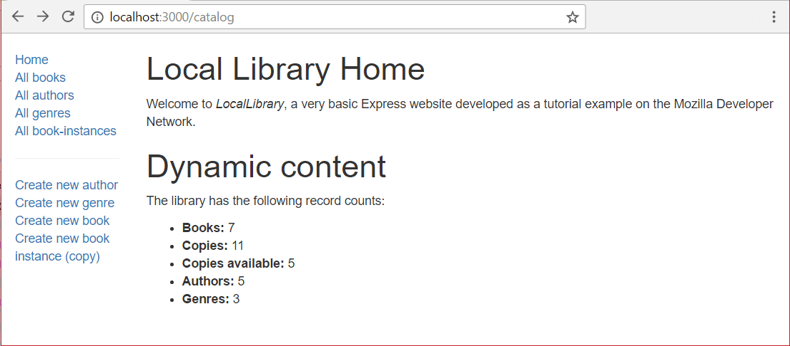

我们创建的第一个页面，是网站的主页面，可以从网站的根目录 (`'/'`) ，或者 catalog 的根目录 (`catalog/`) 访问。这将呈现一些网站的静态文字描述，以及动态计算数据库中不同记录类型的“计数”。

我们已经为主页创建了一个路由。为了完成页面，我们需要更新控制器函数，以从数据库中提取记录的“计数”，并创建一个可用于呈现页面的视图（模板）。

> [!NOTE]
> 我们将会使用 Mongoose 来获取数据库的信息。在继续学习之前，你可能希望重新阅读 [Mongoose 入门](/zh-CN/docs/Learn/Server-side/Express_Nodejs/mongoose#mongoose_入门)中有关[搜索记录](/zh-CN/docs/Learn/Server-side/Express_Nodejs/mongoose#搜索记录)的部分。

## 路由

在[前面的教程](/zh-CN/docs/Learn/Server-side/Express_Nodejs/routes)中，我们创建了索引页的路由。此处要提醒的是，所有的路由函数都定义在 **/routes/catalog.js** 中：

```js
// GET 分类主页
router.get("/", book_controller.index); // 实际上，它映射到 /catalog/，因为我们导入路由时使用了 /catalog 前缀
```

在 **/controllers/bookController.js** 中，定义回调函数参数 (`book_controller.index`) ：

```js
exports.index = asyncHandler(async (req, res, next) => {
  res.send("NOT IMPLEMENTED: Site Home Page");
});
```

我们扩展这个控制器函数，以从我们的模型获取信息，然后使用模板（视图）渲染它。

## 控制器

索引控制器函数需要获取以下有关信息，即数据库中有多少`Book`，`BookInstance`，可用的`BookInstance`，`Author`和`Genre`记录，将这些数据渲染到模板中，以创建 HTML 页面，然后将其返回到 HTTP 响应中。

打开 **/controllers/bookController.js**。在文件的顶部，你应该可以看到导出的 `index()` 函数。

```js
const Book = require("../models/book");
const asyncHandler = require("express-async-handler");

exports.index = asyncHandler(async (req, res, next) => {
  res.send("NOT IMPLEMENTED: Site Home Page");
});
```

用以下代码片段替换上面的所有代码。这要做的第一件事，是导入（`require()`）所有模型。我们需要这样做，因为我们将使用它们来获取记录的计数。这部分代码也同样需要“express-async-handler”，它可以[捕获路由处理器函数抛出的异常](/zh-CN/docs/Learn/Server-side/Express_Nodejs/routes#处理路由函数中的异常)。

```js
const Book = require("../models/book");
const Author = require("../models/author");
const Genre = require("../models/genre");
const BookInstance = require("../models/bookinstance");

const asyncHandler = require("express-async-handler");

exports.index = asyncHandler(async (req, res, next) => {
  // 并行获取书的详细信息、书实例、作者和体裁的数量
  const [
    numBooks,
    numBookInstances,
    numAvailableBookInstances,
    numAuthors,
    numGenres,
  ] = await Promise.all([
    Book.countDocuments({}).exec(),
    BookInstance.countDocuments({}).exec(),
    BookInstance.countDocuments({ status: "Available" }).exec(),
    Author.countDocuments({}).exec(),
    Genre.countDocuments({}).exec(),
  ]);

  res.render("index", {
    title: "Local Library Home",
    book_count: numBooks,
    book_instance_count: numBookInstances,
    book_instance_available_count: numAvailableBookInstances,
    author_count: numAuthors,
    genre_count: numGenres,
  });
});
```

我们使用 [`countDocuments()`](<https://mongoosejs.com/docs/api/model.html#Model.countDocuments()>) 方法来获取每个模型的实例个数。可以在模型上调用该方法，并使用一组可选的条件进行匹配，然后返回一个 `Query` 对象。紧接着我们可以调用 [`exec()`](https://mongoosejs.com/docs/api/query.html#Query.prototype.exec) 来进行查询操作，其返回一个 `Promise` 对象，该 Promise 对象要么兑现结果，要么在出现数据库错误时被拒绝。

因为对文档数量查询的操作相互独立，因此我们使用 [`Promise.all()`](/zh-CN/docs/Web/JavaScript/Reference/Global_Objects/Promise/all) 来并行地运行这些查询请求。该方法返回一个新的 Promise，因此我们可以使用 [`await`](/zh-CN/docs/Web/JavaScript/Reference/Operators/await) 来等待其的完成（*此函数*的执行会在 `await` 处阻塞）。当所有查询完成时，`all()` 返回的 promise 会兑现，便会继续执行路由处理函数，并使用数据库查询的结果填充数组。

成功时，回调函数调用 [`res.render()`](https://expressjs.com/en/4x/api.html#res.render)，指定名为“**index**”的视图（模板），以及一个对象包含了要插入其中的数据（这包括我们模型计数的结果对象）。数据以键值对的形式提供，可以使用键在模板中访问。

> [!NOTE]
> 在 Pug 模板中，如果使用了未传入的键或变量，它将被渲染为空字符串，并且会在表达式中被求值为 `false`。而其他的模板语言也可能会要求你为所使用的所有对象传递值。

请注意，我们的代码之所以非常简单，是因为我们可以假设数据库查询成功。如果任何操作失败，抛出的异常将会被 `asyncHandler()` 捕获然后被传递给链中的下一个（`next`）中间件处理器。

## 视图

打开 **/views/index.pug**，并用底下文字取代它的内容。

```pug
extends layout

block content
  h1= title
  p Welcome to #[em LocalLibrary], a very basic Express website developed as a tutorial example on the Mozilla Developer Network.

  h1 Dynamic content

  p The library has the following record counts:

  ul
    li #[strong Books:] !{book_count}
    li #[strong Copies:] !{book_instance_count}
    li #[strong Copies available:] !{book_instance_available_count}
    li #[strong Authors:] !{author_count}
    li #[strong Genres:] !{genre_count}
```

这个视图很简单。我们扩展了 **layout.pug** 基本模板，覆盖了名为 '**content**' 的模块 `block`。第一个`h1`标题，将是传递给`render()`函数的`title` 变量的转义文本 — 请注意 '`h1=`' 的使用方式，将使得接下來的文本，被视为 JavaScript 表达式。然后我们放入一个介绍本地图书馆的段落。

在动态内容标题下，我们检查从`render()`函数传入的错误变量，是否已定义。如果是这样，我们列出这个错误。如果不是，我们从`data`变量中，获取并列出每个模型的副本数量。

> [!NOTE]
> 我们没有转义计数值 (i.e. 我们使用 `!{}` 语法) ，因为计数值已经被计算过了。如果信息是由终端用户提供的，那么我们就会转义該变量，以用于显示。

## 它看起来像是？

此处，我们应该已经创建了呈现 index 页面，所需要的每样东西。运行本地图书馆应用，并打开浏览器访问 `http://localhost:3000/`。如果每样东西都设定正确了，你的网站看起来应该像底下的截图。



> [!NOTE]
> 你将无法使用侧边栏链接，因为这些网页的网址，视图和模板尚未定义。例如，如果你尝试，取决于你点击的链接，你将获取“NOT IMPLEMENTED: Book list”等错误。在“控制器”文件中的不同控制器中，会指定这些字符串文字（将被合适的数据替换）。

## 下一步

- 回到 [Express 教程 5：呈现图书馆数据](/zh-CN/docs/Learn/Server-side/Express_Nodejs/Displaying_data)
- 继续阅读教程 5 下个子章节：[书本列表页面](/zh-CN/docs/Learn/Server-side/Express_Nodejs/Displaying_data/Book_list_page)
