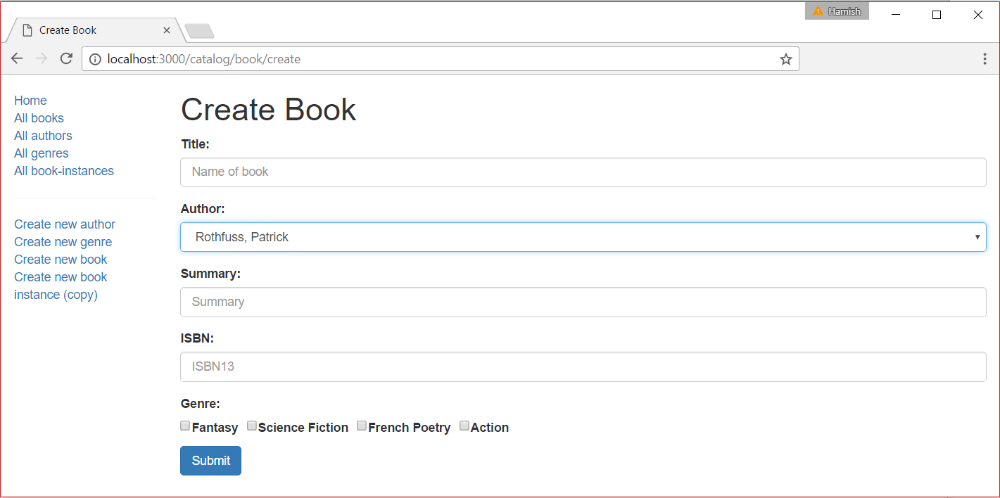

此子文档显示如何定义页面/表单以创建 `Book` 对象。这比相同的作者 `Author` 或种类 `Genre` 页面稍微复杂一点，因为我们需要在我们的书本表单中，获取并显示可用的作者和种类记录。

## 导入验证和清理方法

打开 **/controllers/bookController.js**，并在文件顶部添加以下行：

```js
const { body, validationResult } = require("express-validator/check");
const { sanitizeBody } = require("express-validator/filter");
```

## 控制器—get 路由

找到导出的 `book_create_get()` 控制器方法，并将其替换为以下代码。

```js
// Display book create form on GET.
exports.book_create_get = function (req, res, next) {
  // Get all authors and genres, which we can use for adding to our book.
  async.parallel(
    {
      authors: function (callback) {
        Author.find(callback);
      },
      genres: function (callback) {
        Genre.find(callback);
      },
    },
    function (err, results) {
      if (err) {
        return next(err);
      }
      res.render("book_form", {
        title: "Create Book",
        authors: results.authors,
        genres: results.genres,
      });
    },
  );
};
```

这使用异步模块 async（[教程 5：显示数据库中的数据](/zh-CN/docs/Learn/Server-side/Express_Nodejs/Displaying_data)），来获取所有作者和种类对象。然后将它们作为名为 `authors` 和 `genres` 的变量（以及页面标题 `title`），传递给视图 `book_form.pug`。

## 控制器—post 路由

找到导出的 `book_create_post()` 控制器方法，并将其替换为以下代码。

```js
// Handle book create on POST.
exports.book_create_post = [
  // Convert the genre to an array.
  (req, res, next) => {
    if (!(req.body.genre instanceof Array)) {
      if (typeof req.body.genre === "undefined") req.body.genre = [];
      else req.body.genre = new Array(req.body.genre);
    }
    next();
  },

  // Validate fields.
  body("title", "Title must not be empty.").isLength({ min: 1 }).trim(),
  body("author", "Author must not be empty.").isLength({ min: 1 }).trim(),
  body("summary", "Summary must not be empty.").isLength({ min: 1 }).trim(),
  body("isbn", "ISBN must not be empty").isLength({ min: 1 }).trim(),

  // Sanitize fields (using wildcard).
  sanitizeBody("*").trim().escape(),
  sanitizeBody("genre.*").escape(),
  // Process request after validation and sanitization.
  (req, res, next) => {
    // Extract the validation errors from a request.
    const errors = validationResult(req);

    // Create a Book object with escaped and trimmed data.
    var book = new Book({
      title: req.body.title,
      author: req.body.author,
      summary: req.body.summary,
      isbn: req.body.isbn,
      genre: req.body.genre,
    });

    if (!errors.isEmpty()) {
      // There are errors. Render form again with sanitized values/error messages.

      // Get all authors and genres for form.
      async.parallel(
        {
          authors: function (callback) {
            Author.find(callback);
          },
          genres: function (callback) {
            Genre.find(callback);
          },
        },
        function (err, results) {
          if (err) {
            return next(err);
          }

          // Mark our selected genres as checked.
          for (let i = 0; i < results.genres.length; i++) {
            if (book.genre.indexOf(results.genres[i]._id) > -1) {
              results.genres[i].checked = "true";
            }
          }
          res.render("book_form", {
            title: "Create Book",
            authors: results.authors,
            genres: results.genres,
            book: book,
            errors: errors.array(),
          });
        },
      );
      return;
    } else {
      // Data from form is valid. Save book.
      book.save(function (err) {
        if (err) {
          return next(err);
        }
        //successful - redirect to new book record.
        res.redirect(book.url);
      });
    }
  },
];
```

此代码的结构和行为，几乎与创建种类 `Genre` 或作者 `Author` 对象完全相同。首先，我们验证并清理数据。如果数据无效，那么我们将重新显示表单，以及用户最初输入的数据，和错误消息列表。如果数据有效，我们将保存新的 `Book` 记录，并将用户重定向到 `Book` 详细信息页面。

与其他表单处理代码相关的第一个主要区别，是我们使用通配符，一次修剪和转义所有字段（而不是单独清理它们）：

```js
sanitizeBody('*').trim().escape(),
```

与其他表单处理代码相关的下一个主要区别，是我们如何清理种类 `Genre` 信息。表单返回一个 `Genre` 项的数组（而对于其他字段，它返回一个字符串）。为了验证信息，我们首先将请求转换为数组（下一步需要）。

```js
// Convert the genre to an array.
(req, res, next) => {
    if(!(req.body.genre instanceof Array)){
        if(typeof req.body.genre==='undefined')
        req.body.genre=[];
        else
        req.body.genre=new Array(req.body.genre);
    }
    next();
},
```

然后，我们在清理器中使用通配符（\*）来单独验证每个种类数组条目。下面的代码显示了 - 这转换为“清理关键种类 `genre` 下的每个项目”。

```js
sanitizeBody('genre.*').trim().escape(),
```

与其他表单处理代码的最终区别，在于我们需要将所有现有的种类和作者传递给表单。为了标记用户已经检查过的种类，我们遍历所有种类，并将 `checked='true'` 参数，添加到我们的 POST 数据中（如下面的代码片段中所示）。

```js
// Mark our selected genres as checked.
for (let i = 0; i < results.genres.length; i++) {
  if (book.genre.indexOf(results.genres[i]._id) > -1) {
    // Current genre is selected. Set "checked" flag.
    results.genres[i].checked = "true";
  }
}
```

## 视图

创建 **/views/book_form.pug**，并复制下面的文本。

```plain
extends layout

block content
  h1= title

  form(method='POST' action='')
    div.form-group
      label(for='title') Title:
      input#title.form-control(type='text', placeholder='Name of book' name='title' required='true' value=(undefined===book ? '' : book.title) )
    div.form-group
      label(for='author') Author:
      select#author.form-control(type='select', placeholder='Select author' name='author' required='true' )
        for author in authors
          if book
            option(value=author._id selected=(author._id.toString()==book.author ? 'selected' : false) ) #{author.name}
          else
            option(value=author._id) #{author.name}
    div.form-group
      label(for='summary') Summary:
      input#summary.form-control(type='textarea', placeholder='Summary' name='summary' value=(undefined===book ? '' : book.summary) required='true')
    div.form-group
      label(for='isbn') ISBN:
      input#isbn.form-control(type='text', placeholder='ISBN13' name='isbn' value=(undefined===book ? '' : book.isbn) required='true')
    div.form-group
      label Genre:
      div
        for genre in genres
          div(style='display: inline; padding-right:10px;')
            input.checkbox-input(type='checkbox', name='genre', id=genre._id, value=genre._id, checked=genre.checked )
            label(for=genre._id) #{genre.name}
    button.btn.btn-primary(type='submit') Submit

  if errors
    ul
      for error in errors
        li!= error.msg
```

视图结构和行为与 **genre_form.pug** 模板几乎相同。

主要区别在于，我们如何实现选择类型字段：作者 `Author` 和种类 `Genre`。

- 种类集合显示为复选框，使用我们在控制器中设置的检查值 `checked`，来确定是否应该选中该框。
- 作者集合显示为单选下拉列表。在这种情况下，我们通过比较当前作者选项的 id 与用户先前输入的值（作为 `book` 变量传入），来确定要显示的作者。这在上面突出显示！

  > **备注：** 如果提交的表单中存在错误，那么，当要重新呈现表单时，新的书本作者仅使用字符串（作者列表中选中选项的值）进行标识。相比之下，现有的书本作者的 `_id` 属性不是字符串。因此，要比较新的和现有的，我们必须将每个现有书本作者的 `_id`，强制转换为字符串，如上所示。

## 它看起來像是？

运行应用程序，将浏览器打开到 `http://localhost:3000/`，然后选择 Create new book 链接。如果一切设置正确，你的网站应该类似于以下屏幕截图。提交有效的图书后，应将其保存，然后你将进入图书详细信息页面。



## 下一步

回到 [Express 教程 6: 使用表单](/zh-CN/docs/Learn/Server-side/Express_Nodejs/forms)

继续教程 6 的下一个部分：[创建书本实例表单](/zh-CN/docs/Learn/Server-side/Express_Nodejs/forms/Create_BookInstance_form)
