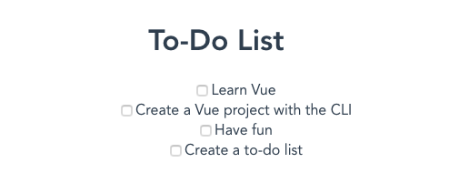

{{LearnSidebar}}{{PreviousMenuNext("Learn/Tools_and_testing/Client-side_JavaScript_frameworks/Vue_first_component","Learn/Tools_and_testing/Client-side_JavaScript_frameworks/Vue_methods_events_models", "Learn/Tools_and_testing/Client-side_JavaScript_frameworks")}}

现在我们已经有了一个可以工作的组件。接下来我们将添加更多的 `ToDoItem` 组件到我们的应用中。本文我们会添加一系列待办事项到 `App.vue` 组件并使用 `v-for` 指令遍历它们，将它们的每一项展示在 `ToDoItem` 组件中。

<table>
  <tbody>
    <tr>
      <th scope="row">预备条件：</th>
      <td>
        <p>
          熟悉核心 <a href="/zh-CN/docs/Learn/HTML">HTML</a>、<a
            href="/zh-CN/docs/Learn/CSS"
            >CSS</a
          > 和 <a href="/zh-CN/docs/Learn/JavaScript">JavaScript</a> 语言，了解<a
            href="/zh-CN/docs/Learn/Tools_and_testing/Understanding_client-side_tools/Command_line"
            >终端/命令行</a
          >知识。
        </p>
        <p>
          Vue 组件是由管理应用程序数据的 JavaScript 对象和映射到基础 DOM
          结构的基于 HTML 的模板语法组成的。为了进行安装并使用 Vue
          的一些更高级的功能（例如"单文件组件（SFC）"或渲染功能），你将需要一个装有
          node + npm 的终端。
        </p>
      </td>
    </tr>
    <tr>
      <th scope="row">目标：</th>
      <td>
        了解如何循环浏览一个数据数组，并在多个组件中渲染。
      </td>
    </tr>
  </tbody>
</table>

## 利用 v-for 指令渲染列表

一个有效的待办事项列表需要有多个被渲染的 to-do 项，Vue 中的 [`v-for`](https://cn.vuejs.org/api/built-in-directives.html#v-for) 可以用来实现这种效果。它是 Vue 自带的指令，用于在 template 中实现循环，我们可以利用它将数组中的各项重复渲染成指定的特征。我们将利用它迭代待办事项列表，将其中的每一项展示为单独的 `ToDoItem` 组件。

### 添加一些需要渲染的数据

首先我们需要准备一个待办事项数组。添加 `data` 属性到 `App.vue` 组件对象中，它包含一个 `ToDoItems` 字段，其值是待办事项数组。在最终完成添加新的待办事项功能之前，我们可以先 mock 一些待办项目，每个待办项目可以用一个对象表示，这个对象含有 `label` 和 `done` 属性。

像下面这样添加一些待办项目让我们可以利用 `v-for` 来对它们进行渲染。

```js
export default {
  name: "app",
  components: {
    ToDoItem,
  },
  data() {
    return {
      ToDoItems: [
        { label: "Learn Vue", done: false },
        { label: "Create a Vue project with the CLI", done: true },
        { label: "Have fun", done: true },
        { label: "Create a to-do list", done: false },
      ],
    };
  },
};
```

现在我们有了一个列表，可以用 `v-for` 去展示它们了。指令的作用方式和元素的属性类似，就 `v-for` 而言，它类似 JavaScript 中的 [`for...in`](/zh-CN/docs/Web/JavaScript/Reference/Statements/for...in) 循环——`v-for="item in items"`——`items` 是你要迭代的列表，`item` 是数组中当前元素的引用。

`v-for` 获取每个迭代的元素，并渲染它和它的子元素。在我们的例子中，我们用 `<li>` 的形式展示每一个待办事项，接下来我们会通过每个待办事项传递数据到其对应的 `ToDoItem` 组件。

### Key 属性

在进行数据传递之前，我们要了解下 `key` 属性，它和 `v-for` 一起使用，用来帮助 Vue 标识列表中的元素，这样 Vue 就不需要在列表变化时重新创建它们。为了确保它适当地重新使用列表元素，它需要在你附加 `v-for` 的同一个元素上有一个独特的"key"。

为了确保 Vue 能够准确地比较 `key` 属性，它们需要是字符串或数字值。虽然使用名字字段很好，但这个字段最终将由用户输入控制，这意味着我们不能保证名字是唯一的。然而，我们可以使用 `lodash.uniqueid()`，就像我们在上一篇文章中做的那样。

1. 使用导入 `ToDoItem` 组件相同的方法导入 `lodash.uniqueid` 到 `App` 组件。

   ```js
   import uniqueId from "lodash.uniqueid";
   ```

2. 添加 `id` 字段到 `ToDoItems` 数组的每一个元素中，并且将他们赋值为 `uniqueId('todo-')`。

   此时，`App.vue` 中的 `<script>` 元素内容应该如下：

   ```js
   import ToDoItem from "./components/ToDoItem.vue";
   import uniqueId from "lodash.uniqueid";
   export default {
     name: "app",
     components: {
       ToDoItem,
     },
     data() {
       return {
         ToDoItems: [
           { id: uniqueId("todo-"), label: "Learn Vue", done: false },
           {
             id: uniqueId("todo-"),
             label: "Create a Vue project with the CLI",
             done: true,
           },
           { id: uniqueId("todo-"), label: "Have fun", done: true },
           { id: uniqueId("todo-"), label: "Create a to-do list", done: false },
         ],
       };
     },
   };
   ```

3. 在你的 `App.vue` 模板中添加 `v-for` 指令和 `key` 属性到 `<li>` 元素：

   ```html
   <ul>
     <li v-for="item in ToDoItems" :key="item.id">
       <to-do-item label="My ToDo Item" :done="true"></to-do-item>
     </li>
   </ul>
   ```

    这样修改后，`<li>` 标签中的 JavaScript 表达式就可以访问 `item` 了，这意味着我们可以使用 `v-bind` 来传递 `item` 对象的字段给 `ToDoItem` 组件了。这非常有用，我们想让列表中的待办事项的 `label` 值展示到它的 label 中，而不是显示一个静态的"My Todo Item"。此外，我们想让它们的 checked 状态反映它们的 `done` 字段，而不是总设置为 `done="true"`。

4. 把 `label="My ToDo Item"` 改成 `:label="item.label"`, `:done="false"` 改成 `:done="item.done"`，像下面这样：

   ```html
   <ul>
     <li v-for="item in ToDoItems" :key="item.id">
       <to-do-item :label="item.label" :done="item.done"></to-do-item>
     </li>
   </ul>
   ```

现在当你去看运行着的 app 时，你会发现待办事项显示了它们自己正确的名字，如果你查看源码的话，你会发现输入都有了唯一的 `id`，它取自 `App` 组件中的对象。



## 让我们来一点小重构

在这里我们可以做一个小小的重构。我们可以把 `id` 变成一个 prop，而不是在 `ToDoItem` 组件中为复选框生成它。虽然这不是严格意义上的需要，但它使我们更容易管理，因为我们已经需要为每个 todo 项目创建一个唯一的 `id`。

1. 添加一个新的 prop `id` 到 `ToDoItem` 组件。
2. 标记它为 required，类型是 `String`。
3. 为防止命名冲突，删除掉 `data` 属性中的 `id` 字段。
4. 现在不需要再使用 `uniqueId` 了，所以需要删除掉 `import uniqueId from 'lodash.uniqueid';` 这行，否则你的应用会报错。

现在，`ToDoItem` 中的 `<script>` 内容应该如下所示：

```js
export default {
  props: {
    label: { required: true, type: String },
    done: { default: false, type: Boolean },
    id: { required: true, type: String },
  },
  data() {
    return {
      isDone: this.done,
    };
  },
};
```

现在，在 `App.vue` 组件中将 `item.id` 作为 prop 传递给 `ToDoItem` 组件。你的 `App.vue` template 应该如下所示：

```html
<template>
  <div id="app">
    <h1>My To-Do List</h1>
    <ul>
      <li v-for="item in ToDoItems" :key="item.id">
        <to-do-item
          :label="item.label"
          :done="item.done"
          :id="item.id"></to-do-item>
      </li>
    </ul>
  </div>
</template>
```

你渲染后的站点看起来是没有变化的，但是这次重构使得 `item.id` 像其他参数一样，作为 prop 从 `App.vue` 传递给 `ToDoItem`。现在代码变得更有逻辑性和一致性。

## 总结

整篇文章就到这里了。我们现在有了样例数据，然后我们用循环将每一项渲染成 `ToDoItem`。

接下来我们需要让用户可以输入它们自己的待办事项，想做到这一点，我们需要一个文本输入 `<input>`，当用户输入数据时触发事件，在事件响应函数中需要将数据添加到待办事项列表并且重新渲染列表，我们还需要一个模型操控数据。我们将在下一篇文章中获取这些知识。

{{PreviousMenuNext("Learn/Tools_and_testing/Client-side_JavaScript_frameworks/Vue_first_component","Learn/Tools_and_testing/Client-side_JavaScript_frameworks/Vue_methods_events_models", "Learn/Tools_and_testing/Client-side_JavaScript_frameworks")}}
