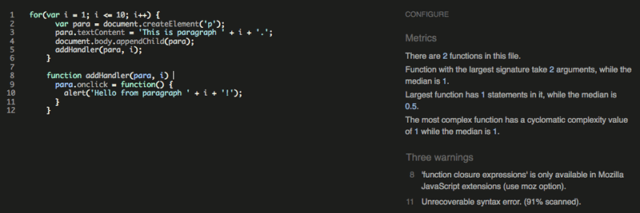
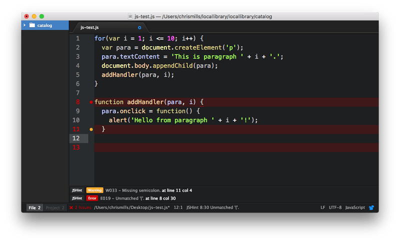
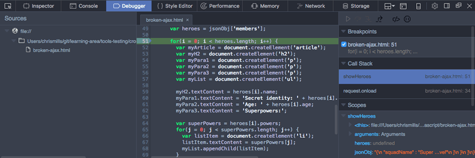

{{LearnSidebar}}
{{PreviousMenuNext("Learn/Tools_and_testing/Cross_browser_testing/HTML_and_CSS","Learn/Tools_and_testing/Cross_browser_testing/Accessibility", "Learn/Tools_and_testing/Cross_browser_testing")}}

现在我们了解一些常见的浏览器 JavaScript 问题，并且看看如何修复它们。这个包括如何使用浏览器开发工具跟踪和修复问题、使用 Polyfill 或第三方库解决问题以及如何让一些现代 JavaScript 的特性也能在旧的浏览器下面工作等。

<table>
  <tbody>
    <tr>
      <th scope="row">预备知识：</th>
      <td>
        熟练使用 <a href="/zh-CN/docs/Learn/HTML">HTML</a>、<a href="/zh-CN/docs/Learn/CSS">CSS</a> 和 <a href="/zh-CN/docs/Learn/JavaScript">JavaScript</a> 语言，了解<a href="/zh-CN/docs/Learn/Tools_and_testing/Cross_browser_testing/Introduction"
          >跨浏览器测试的核心概念</a
        >。
      </td>
    </tr>
    <tr>
      <th scope="row">目标：</th>
      <td>
        可以分析一些常见的 JavaScript 跨浏览器问题，使用合适的工具和技术修复它们。
      </td>
    </tr>
  </tbody>
</table>

## JavaScript 存在的问题

从历史上看，JavaScript 早就已经受到跨浏览器兼容性问题的困扰。早在 20 世纪 90 年代，当时的主要浏览器选择（Internet Explorer 和 Netscape）的脚本以不同的语言风格实现（Netscape 使用 JavaScript，IE 使用 JScript，还提供 VBScript 作为选项），虽然至少 JavaScript 和 JScript 在某种程度上是兼容的（都基于 {{glossary("ECMAScript")}} 规范），但往往以相互冲突、不兼容的方式实现，给开发者带来很多恶梦。

这种不兼容问题一直持续到 21 世纪初，因为旧的浏览器仍然在使用，仍然需要支持。这也是 [jQuery](https://jquery.com/) 这样的库出现的主要原因之一——抽象出浏览器实现的差异（例如见[如何进行 HTTP 请求](/zh-CN/docs/Web/Guide/AJAX/Getting_Started#第一步——发送_http_请求)中的代码片段），所以开发人员只需要写一点简单的代码（见 [`jQuery.ajax()`](https://api.jquery.com/jquery.ajax/)），jQuery（或你使用的任何库）将在底层处理这些差异，而无需开发人员考虑这些。

从那时起，情况有了明显的改善；现代浏览器在支持“经典的 JavaScript 功能”方面做得很好，而且随着支持老式浏览器的要求降低，使用这种代码的要求也在减少（尽管这样，请记住，它们并没有完全消失）。

这些天来，大多数的跨浏览器 JavaScript 问题是这样的：

- 劣质的浏览器嗅探代码、特性检测代码和供应商前缀的使用阻碍了浏览器运行它们本来可以很好使用的代码。
- 开发者在他们的代码中使用了新的 JavaScript 功能、现代网络 API 等，并发现这些功能在旧的浏览器中无法使用。

我们将在下文进一步探究这个问题。

## 修复一般的 JavaScript 问题

正如我们在关于 HTML/CSS 的[前一篇文章](/zh-CN/docs/Learn/Tools_and_testing/Cross_browser_testing/HTML_and_CSS#首先：解决一般问题)中所说，你应该先确保你的代码能够正常工作，然后再去集中解决跨浏览器问题。如果你还不熟悉[如何查找 JavaScript 代码的错误](/zh-CN/docs/Learn/JavaScript/First_steps/What_went_wrong)的基本内容，你应该在继续学习之前学习这篇文章。有一些常见的 JavaScript 问题是你要注意的，比如说：

- 基本的语法和逻辑问题（再次重申，请参阅[如何查找 JavaScript 代码的错误](/zh-CN/docs/Learn/JavaScript/First_steps/What_went_wrong)）。
- 确保变量等被定义在正确的范围内，并且你不会遇到在不同地方声明的项目之间的冲突（见[函数作用域和冲突](/zh-CN/docs/Learn/JavaScript/Building_blocks/Functions#函数作用域和冲突)）。
- 对 [this](/zh-CN/docs/Web/JavaScript/Reference/Operators/this) 的困惑，表现在它适用于什么范围，因此它的值是否是你所期望的。你可以阅读[“this”的含义](/zh-CN/docs/Learn/JavaScript/Objects/Basics#this的含义)，它做了一点浅显的介绍；你还应该研究像[这样](https://github.com/mdn/learning-area/blob/7ed039d17e820c93cafaff541aa65d874dde8323/javascript/oojs/assessment/main.js#L143)的例子，它显示了一个典型的模式，即把 `this` 作用域保存到一个单独的变量中，然后在嵌套函数中使用这个变量，这样你就可以确定你把功能应用到正确的 `this` 作用域。
- 在使用全局变量进行迭代的循环中不正确地使用函数（更普遍的是“弄错作用域”）。例如，在 [bad-for-loop.html](https://mdn.github.io/learning-area/tools-testing/cross-browser-testing/javascript/bad-for-loop.html) 中（见[源代码](https://github.com/mdn/learning-area/blob/main/tools-testing/cross-browser-testing/javascript/bad-for-loop.html)），我们使用一个用 `var` 定义的变量循环了 10 次，每次都创建一个段落并给它添加一个 [onclick](/zh-CN/docs/Web/API/Element/click_event) 事件处理器。当点击时，我们希望每个段落都能显示一个包含其编号（创建时的 `i` 值）的警告信息。但是，它们都报告 `i` 为 11，因为 `for` 循环在调用嵌套函数之前就完成了所有的迭代。

  > **备注：** 最简单的解决方案是用 `let` 而不是 `var` 来声明迭代变量，这样与函数相关的 `i` 的值对每个迭代都是唯一的。不幸的是，这在 IE11 中不能正常工作，这就是为什么我们没有在“好的” for 循环中使用这种方法。

- 在试图使用它们返回的值之前，确保异步操作已经返回。例如，[这个 Ajax 例子](/zh-CN/docs/Web/Guide/AJAX/Getting_Started#第三步——简单的示例)在尝试使用响应之前，会检查以确保请求已经完成，响应已经返回。由于 JavaScript 语言中引入了 [Promise](/zh-CN/docs/Web/JavaScript/Reference/Global_Objects/Promise)，这种操作变得更加容易处理。

> **备注：** [Buggy JavaScript Code: The 10 Most Common Mistakes JavaScript Developers Make](https://www.toptal.com/javascript/10-most-common-javascript-mistakes) 对这些常见的错误和其他问题有一些不错的讨论。

### Linter

就像 [HTML 和 CSS](/zh-CN/docs/Learn/Tools_and_testing/Cross_browser_testing/HTML_and_CSS#Linter) 所说的一样，使用 linter 可以确保撰写出质量更高，错误更少的 JavaScript 代码，它可以指出错误，也可以标记出关于不良做法的警告等，并且可以自定义为更严格或更宽松的错误/警告报告。我们推荐的 JavaScript/ECMAScript linter 是 [JSHint](https://jshint.com/) 和 [ESLint](https://eslint.org/)；它们能以多种方式使用，其中一些我们将在下面详细介绍。

#### 在线检查器

[JSHint 主页](https://jshint.com/)提供了一个在线 linter，它可以让你在左侧输入 JavaScript 代码，并在右侧提供包含指标、警告和错误的输出。



#### 代码编辑器插件

每次把代码复制并粘贴到一个网页上以检查其有效性并不方便，你真正想要的是一个能融入你的标准工作流程的 linter，而且麻烦最少。许多代码编辑器都有 linter 插件，例如 GitHub 的 [Atom](https://atom.io/) 代码编辑器就有一个 JSHint 插件。

要安装它：

1. 安装 Atom（如果你没有已经安装的最新版本）——从上述 Atom 网页链接中下载它。
2. 前往 Atom 的 _Preferences..._ 对话框（也就是说，在 Mac 中选择 _Atom > Preferences..._，或在 Windows/Linux 中选择 _File > Preferences..._ ）并选择左侧菜单中的 _Install_ 选项。
3. 在 _Search packages_ 文本字段，输入“jslint”并按下回车/换行键来查找 linting 相关软件包。
4. 你可以在列表最顶部看到 **lint**。首先使用 _Install_ 按钮安装这个软件包，因为其他 linter 都依赖它工作。然后安装 **linter-jshint** 插件。
5. 在软件包安装完成后，试着加载一个 JavaScript 文件：你会看到任何问题都在行号旁边用绿色（警告）和红色（错误）的圆圈突出显示，底部的一个单独面板提供了行号、错误信息，有时还提供了建议值或其他修复方法。

其他流行的编辑器也有类似的 linting 包可用。例如，见 [JSHint 安装页面](https://jshint.com/install/)的“文本编辑器和 IDE 的插件”部分。

#### 其他方式

还有其他的方法来使用这种 linter；你可以在 [JSHint](https://jshint.com/install/) 和 [ESLint](https://eslint.org/docs/user-guide/getting-started) 的安装页面上读到这些方法。

值得一提的是命令行的使用——你可以使用 npm（Node Package Manager——你必须先安装 [NodeJS](https://nodejs.org/zh-cn/)）将这些工具作为命令行工具来安装（可通过 CLI——命令行界面）。例如，下面的命令安装了 JSHint：

```bash
npm install -g jshint
```

然后，你可以将这些工具指向你想进行 lint 的 JavaScript 文件，比如说：


你也可以将这些工具与任务运行器/构建工具一起使用，如 [Gulp](https://gulpjs.com/) 或 [Webpack](https://webpack.github.io/)，以便在开发过程中自动对你的 JavaScript 进行 lint。（见后面文章中的[使用任务运行器来自动测试工具](/zh-CN/docs/Learn/Tools_and_testing/Cross_browser_testing/Automated_testing#使用任务运行器作为自动化测试工具)。）关于 ESLint 选项，请参见 [ESLint 集成](https://eslint.org/docs/user-guide/integrations)；Grunt 开箱即支持 JSHint，并且还有其他可用的集成，例如[JSHint loader for Webpack](https://github.com/webpack-contrib/jshint-loader)。

> **备注：** ESLint 需要比 JSHint 更多的安装和配置过程，但是它也很强大。

### 浏览器开发者工具

浏览器开发者工具有很多功能可以帮助定位 JavaScript 的问题，尤其是在开发的工程中，JavaScript 控制台会提醒一些错误信息。

下载示例文件 [broken-ajax.html](https://mdn.github.io/learning-area/tools-testing/cross-browser-testing/javascript/broken-ajax.html) 到本地（也可以在线阅读[源代码](https://github.com/mdn/learning-area/blob/main/tools-testing/cross-browser-testing/javascript/broken-ajax.html)）。

如果你打开控制台面板，你将会看到错误提示“Uncaught TypeError: can't access property "length", heroes is undefined”，标示出问题出现在代码的第 49 行。如果你看了源代码，相关的代码如下面所示：

```js
function showHeroes(jsonObj) {
  let heroes = jsonObj['members'];

  for (const hero of heroes) {
    // …
   }
 
   // …
 }
```

所以当我们试图访问 `jsonObj` 的一个属性（正如你所期望的，它应该是一个 [JSON 对象](/zh-CN/docs/Learn/JavaScript/Objects/JSON)）时，代码就崩溃了。这应该是使用下面的 XMLHttpRequest 调用从外部的 `.json` 文件获取的：

```js
let requestURL = 'https://mdn.github.io/learning-area/javascript/oojs/json/superheroes.json';
let request = new XMLHttpRequest();
request.open('GET', requestURL);
request.send();

let superHeroes = request.response;
populateHeader(superHeroes);
showHeroes(superHeroes);
```

但是它失败了。

#### Console 相关 API

你可能已经知道这段代码有什么问题，但让我们再探讨一下，看看你可以如何调查这个问题。首先，[Console](/zh-CN/docs/Web/API/Console) API 允许 JavaScript 代码与浏览器的 JavaScript 控制台交互。它有许多可用的功能，但你经常使用的主要功能是 [`console.log()`](/zh-CN/docs/Web/API/Console/log)，它可以向控制台打印一条自定义信息。

尝试将这样代码插入到第 31 行下方：

```js
console.log('Response value: ' + superHeroes);
```

在浏览器中刷新页面，你将在控制台中得到“Response value:”的输出，以及我们之前看到的相同的错误信息。

`console.log()` 输出显示，`superHeroes` 对象似乎没有包含任何东西。像这样的异步请求的一个非常常见的问题是，当你试图在 `response` 对象真正从网络上返回之前对它做一些事情。让我们通过在 `load` 事件被触发后运行代码来解决这个问题。删除 `console.log()` 行，并更新这个代码块：

```js
const superHeroes = request.response;
populateHeader(superHeroes);
showHeroes(superHeroes);
```

改成这样：

```js
request.onload = function() {
  let superHeroes = request.response;
  populateHeader(superHeroes);
  showHeroes(superHeroes);
}
```

总而言之，任何时候，只要有东西不工作了，在你的代码中的某个点上，一个值似乎不是它所要的，你就可以使用 `console.log()` 来打印出来，看看发生了什么。

#### 使用 JavaScript 调试器

不幸的是，我们仍然有同样的错误，问题并没有消失。现在让我们使用浏览器开发工具的一个更复杂的功能来调查一下这个问题，它在 Firefox 中被称为 [JavaScript 调试器](https://firefox-source-docs.mozilla.org/devtools-user/debugger/index.html)。

> **备注：** 其他浏览器中也有类似的工具；Chrome 中的 [Sources tab](https://developer.chrome.com/docs/devtools/#sources)，Safari中的调试器（见 [Safari Web 开发工具](https://developer.apple.com/safari/tools/)）等。

在 Firefox 中，调试器标签页大致如图所示：


- 在左边，你可以选择你要调试的脚本（在本例中我们只有一个）。
- 中间的面板显示了所选脚本中的代码。
- 右边的面板显示了与当前环境有关的有用细节——*断点*、*调用栈*和当前活动的*作用域*。

这类工具的主要特点是能够为代码添加断点，这些是代码执行停止的点，在这一点上，你可以检查环境的当前状态，看看正在发生什么。

让我们开始工作吧。现在错误是在第 51 行抛出的。在中间的面板上点击第 51 行，给它添加一个断点（你会看到一个蓝色的箭头出现在它的上方）。现在刷新页面（Cmd/Ctrl + R），浏览器将在第 51 行暂停执行代码。在这一点上，右侧将更新显示一些非常有用的信息。



- 在 _Breakpoints_ 下，你会看到你所设置的断点的细节。
- 在 _Call Stack_ 下，你会看到一些条目，这基本上是一系列函数的列表，这些函数被调用导致当前函数被调用。在最上面，我们有 `showHeroes()` 这个函数，我们目前在其中，其次我们有 `onload`，它存储了包含调用 `showHeroes()` 的事件处理函数。
- 在 _Scopes_ 下，你会看到我们正在看的函数的当前活动范围。我们只有三个：`showHeroes`、`block` 和 `Window`（全局作用域）。每个作用域都可以被扩展，以显示代码停止执行时作用域内的变量值。

我们可以在这里找到很多有用的信息：

1. 展开 `showHeroes` 域，你可以看到 heroes 变量是 `undefined`，表明访问 `jsonObj` 的 `members` 属性（函数的第一行）没有成功。
2. 你也可以看到，`jsonObj` 变量存储的是一个文本字符串，而不是一个 JSON 对象。
3. 再往下探索调用栈，在 _Call Stack_ 部分点击 `onload`。视图将更新，在中心面板上显示 `request.onload` 函数，并在 _Scopes_ 部分显示其作用域。
4. 如果你扩展 `onload` 范围，你会看到 `superHeroes` 变量也是一个文本字符串，而不是一个对象。问题得到解决——我们的 [`XMLHttpRequest`](/zh-CN/docs/Web/API/XMLHttpRequest) 调用是将 JSON 作为文本返回，而不是 JSON 对象。

我们希望你能自己尝试解决这个问题。有两点提示，你可以[明确告诉 XMLHttpRequest 对象返回 JSON 格式](/zh-CN/docs/Web/API/XMLHttpRequest/responseType)，或者在响应到达后[将返回的文本转换成 JSON](/zh-CN/docs/Learn/JavaScript/Objects/JSON#对象和文本间的转换)。如果你被卡住了，请参考我们的 [fixed-ajax.html](https://github.com/mdn/learning-area/blob/main/tools-testing/cross-browser-testing/javascript/fixed-ajax.html) 示例。

> **备注：** 调试器标签页还有很多我们没有讨论过的其他有用的功能，例如条件断点和观察表达式。关于更多信息，请参见[调试器](https://firefox-source-docs.mozilla.org/devtools-user/debugger/index.html)页面。

### 性能问题

随着你的应用程序变得越来越复杂，你开始使用更多的 JavaScript，并可能会遇到性能问题，特别是在较慢的设备上查看应用程序时。性能是一个很大的话题，我们没有时间在这里详细介绍它。以下是一些快速提示：

- 为了避免加载超过你需要的 JavaScript，请使用 [Browserify](https://browserify.org/) 这样的解决方案将你的脚本捆绑成一个文件。一般来说，减少 HTTP 请求的数量对性能非常有利。
- 在你将文件加载到你的生产服务器之前，通过最小化使你的文件变得更小。最小化将所有的代码压缩到一个巨大的单行中，使其占用的文件大小大大减少。这很难看，但当它完成后，你不需要阅读它！这最好使用像 [Uglify](https://github.com/mishoo/UglifyJS) 这样的最小化工具来完成（也有一个在线版本，见[JSCompress.com](https://jscompress.com/)）。
- 当使用 API 时，确保在不使用 API 特性时将其关闭；一些 API 调用可能非常耗费处理能力。例如，当显示一个视频流时，确保在你看不到它时将其关闭。当使用重复的地理定位调用跟踪设备的位置时，确保在用户停止使用时将其关闭。
- 对于性能来说，动画的成本确实很高。很多 JavaScript 库提供了由 JavaScript 编程的动画功能，但通过像 [CSS 动画](/zh-CN/docs/Web/CSS/CSS_Animations)这样的本地浏览器功能（或新生的[Web 动画 API](/zh-CN/docs/Web/API/Web_Animations_API)）做动画要比 JavaScript 更具成本效益。阅读 Brian Birtles 的 [Animating like you just don't care with Element.animate](https://hacks.mozilla.org/2016/08/animating-like-you-just-dont-care-with-element-animate/)，了解一些关于动画为何开销大的真正有用的理论，关于如何提高动画性能的提示，以及关于 Web 动画 API 的信息。

> **备注：** Addy Osmani 的 [Writing Fast, Memory-Efficient JavaScript](https://www.smashingmagazine.com/2012/11/writing-fast-memory-efficient-javascript/) 包含了大量的细节和一些提升 JavaScript 性能的优秀技巧。

## 跨浏览器 JavaScript 问题

在本节中，我们将研究一些比较常见的跨浏览器的 JavaScript 问题。我们将把它分解为：

- 使用现代核心 JavaScript 特性
- 使用现代 Web API 特性
- 使用不良的浏览器嗅探代码
- 性能问题

### 使用现代 JavaScript/API 特性

在[上一篇文章](/zh-CN/docs/Learn/Tools_and_testing/Cross_browser_testing/HTML_and_CSS#older_browsers_not_supporting_modern_features)中，我们描述了一些处理 HTML 和 CSS 错误和不被识别的特性的方法，这是由于语言的特性决定的。然而，JavaScript 并不像 HTML 和 CSS 那样宽松。如果 JavaScript 引擎遇到错误或不被识别的语法，更多的情况下它会出现错误。

在最近版本的规范中定义了许多现代 JavaScript 语言特性，这些特性在旧的浏览器中无法使用。其中有些是语法糖（基本上是用一种更简单、更漂亮的方式来写你已经可以用现有的功能来做的事情），有些则提供了有趣的新可能性。

比如说：

- [Promises](/zh-CN/docs/Web/JavaScript/Reference/Global_Objects/Promise)是一个伟大的新功能，用于执行异步操作，并确保这些操作在依赖其结果的代码被用于其他用途之前完成。举个例子，[Fetch API](/zh-CN/docs/Web/API/fetch)（相当于现代的 [XMLHTTPRequest](/zh-CN/docs/Web/API/XMLHttpRequest)）使用 promise 来获取网络上的资源，并确保在使用这些资源之前已经返回响应（例如在 {{htmlelement("img")}} 元素内显示图片）。除了 IE 以外，所有现代浏览器中都支持这种特性。
- [箭头函数](/zh-CN/docs/Web/JavaScript/Reference/Functions/Arrow_functions)为编写[匿名函数](/zh-CN/docs/Learn/JavaScript/Building_blocks/Functions#匿名函数)提供了一个更短、更方便的语法。关于一个快速的例子，请看 [arrow-function.html](https://mdn.github.io/learning-area/tools-testing/cross-browser-testing/javascript/arrow-function.html)（也请看[源代码](https://github.com/mdn/learning-area/blob/main/tools-testing/cross-browser-testing/javascript/arrow-function.html)）。除了 IE 以外，所有现代浏览器都支持这种特性。
- 在你的JavaScript代码的顶部声明[严格模式](/zh-CN/docs/Web/JavaScript/Reference/Strict_mode)，会使它在解析时有更严格的规则，这意味着会有更多的警告和错误被抛出，一些本来可以接受的东西也会被禁止。可以说，使用严格模式是一个好主意，因为它能使代码更好、更有效率。所有现代浏览器都支持严格模式。
- [类型化数组](/zh-CN/docs/Web/JavaScript/Typed_arrays)允许 JavaScript 代码访问和处理原始二进制数据，这在浏览器API开始处理原始视频和音频数据流时是必要的。它可以在 IE10 及以上版本以及所有现代浏览器中使用。

还有许多新的 API 出现在最近的浏览器版本中，而这些 API 在旧的浏览器版本中无法使用，例如：

- [IndexedDB API](/zh-CN/docs/Web/API/IndexedDB_API)、[Web Storage API](/zh-CN/docs/Web/API/Web_Storage_API) 和其他在客户端存储网页数据的 API。
- 使用单独线程运行 JavaScript 代码的 [Web Workers API](/zh-CN/docs/Web/API/Web_Workers_API)，以提升性能。
- 使用真实 3D 图形的 [WebGL API](/zh-CN/docs/Web/API/WebGL_API)。
- 提供附加音频控制功能的 [Web Audio API](/zh-CN/docs/Web/API/Web_Audio_API)。
- 用于多人、实时视频/音频连接（如视频会议）的 [WebRTC API](/zh-CN/docs/Web/API/WebRTC_API)。
- 用于在浏览器中设计虚拟现实体验的 [WebVR API](/zh-CN/docs/Web/API/WebVR_API)（例如，用 VR 硬件输入的数据控制 3D 视图）。

有几种策略可以处理浏览器之间与特性支持有关的不兼容问题；让我们来探讨一下最常见的策略。

> **备注：** 这些策略并不是独立存在的，当然，你可以根据需要将它们结合起来。例如，你可以使用特性检测来确定一种特性是否被支持；如果不被支持，你可以运行代码来加载一个 polyfill 或一个库来处理缺乏支持的问题。

#### 特性检测

功能检测背后的想法是，你可以运行一个测试来确定当前浏览器是否支持某个 JavaScript 特性，然后有条件地运行代码，在支持和不支持该功能的浏览器中提供可接受的体验。举个简单的例子，[地理位置 API](/zh-CN/docs/Web/API/Geolocation_API)（它暴露了网络浏览器所运行的设备的可用位置数据）有一个主要的使用入口——全局 [Navigator](/zh-CN/docs/Web/API/Navigator) 对象上的 `geolocation` 属性。因此，你可以通过使用类似以下的方法来检测浏览器是否支持地理位置：

```js
if ("geolocation" in navigator) {
  navigator.geolocation.getCurrentPosition((position) => {
    // 在地图上显示位置，可能用到 Google Maps API
  });
} else {
  // 也许可以让用户选择静态地图
}
```

你也可以为 CSS 特性编写这样的测试，例如测试 *[element.style.property](/zh-CN/docs/Web/API/HTMLElement/style)* 是否存在（例如：`paragraph.style.transform !== undefined`）。但对于 CSS 和 JavaScript 来说，使用一个成熟的特性检测库可能比一直写自己的更好。Modernizr 是特性检测测试的工业标准。

最后一点，不要把特性检测和**浏览器嗅探**（检测什么特定的浏览器在访问网站）混淆起来，这是一种可怕的做法，应该不惜一切代价加以阻止。更多细节请参见[使用不良的浏览器嗅探代码](#使用不良的浏览器嗅探代码)，稍后我们就会讲到。

> **备注：** 有些特征是已知不可检测的——见 Modernizr 的[不可检测特性列表](https://github.com/Modernizr/Modernizr/wiki/Undetectables)。

> **备注：** 特征检测将在本模块后面的专门文章中更详细地介绍。

#### 库

JavaScript 库本质上是第三方的代码单元，你可以将其附加到你的页面上以提供大量可以直接使用的现成功能，在这个过程中为你节省大量的时间。很多 JavaScript 库的出现，可能是因为它们的开发者正在编写一套通用的实用功能，以节省他们在编写未来项目时的时间，并决定将它们公开发布，因为其他人也可能发现它们很有用。

JavaScript 库往往有几个主要的种类（有些库包含其中的一个以上的目的）：

- 实用程序库：提供一堆功能，使平凡的任务更容易管理，不那么枯燥。例如，[jQuery](https://jquery.com/) 提供了自己的全功能选择器和 DOM 操作库，允许在 JavaScript 中进行 CSS 选择器类型的元素选择，并更容易建立 DOM。现在我们有了现代的特性，如 {{domxref("Document.querySelector()")}}、{{domxref("Document.querySelectorAll()")}}、{{domxref("Node")}} 方法，在各浏览器中可用，这就不那么重要了，但在旧的浏览器需要支持时，它仍然有用。
- 方便性库：让困难的事情更容易做。例如，直接使用 [WebGL API](/zh-CN/docs/Web/API/WebGL_API) 很复杂且很有挑战性，而 [Three.js](https://threejs.org/) 库（和其他类似的库）是建立在 WebGL 之上的，为创建普通 3D 对象、照明、纹理等提供了更容易的 API。[Service Worker API](/zh-CN/docs/Web/API/Service_Worker_API) 的使用也非常复杂，所以代码库已经开始出现，以使常见的 Service Worker 用例更容易实现（参见 [Service Worker 指导书](https://github.com/mdn/serviceworker-cookbook)，以获得一些有用的代码示例）。
- 效果库：这些库的设计是为了让你能够轻松地在你的网站上添加特殊效果。在“DHTML”是一个流行的流行语的时候，这是很有用的，实现一个效果需要很多复杂的 JavaScript，但现在的浏览器有很多内置的 CSS 功能和 API，可以更容易地实现效果。
- UI 库： 提供实现复杂的 UI 功能的方法，否则这些功能的实现和跨浏览器的工作会很困难，例如 [Foundation](https://get.foundation/)、[Bootstrap](https://getbootstrap.com/) 和[Material-UI](https://mui.com/)（后者是一套用于 React 框架的组件）。这些往往被用作整个网站布局的基础；仅仅为了一个 UI 功能而把它们放入其中往往是很困难的。
- 标准化库：给你一个简单的语法，让你轻松完成一个任务，而不必担心跨浏览器的差异。该库将在后台操作适当的 API，所以无论什么浏览器，该功能都可以使用（理论上）。例如， [LocalForage](https://github.com/localForage/localForage) 是一个用于客户端数据存储的库，它为存储和检索数据提供了一个简单的语法。在后台，它使用浏览器可用的最好的 API 来存储数据，无论是 [IndexedDB](/zh-CN/docs/Web/API/IndexedDB_API)、[Web Storage](/zh-CN/docs/Web/API/Web_Storage_API)，甚至是 Web SQL（现在已经废弃了，但在基于 Chromium 的浏览器安全上下文中仍然支持）。

在选择使用一个库时，要确保它能在你想支持的一系列浏览器中工作，并对你的实现进行彻底的测试。还要确保这个库是受欢迎的，得到良好的支持，并且不可能在下周就被淘汰。与其他开发者交谈，了解他们的建议，看看该库在 GitHub（或其他存放它的地方）上有多少活动和贡献者，等等。

库的基本用法往往包括下载库的文件（JavaScript，可能还有一些 CSS 或其他依赖项）并将其附加到你的页面上（例如通过 {{htmlelement("script")}} 元素），尽管这些库通常还有许多其他用法选择，例如将其作为 [Bower](https://bower.io/) 组件安装，或通过 [Webpack](https://webpack.github.io/) 模块捆绑器将其作为依赖项。你将阅读这些库的单独安装页面以获得更多信息。

> **备注：** 你也会在网络上遇到一些 JavaScript 框架，比如 [Ember](https://emberjs.com/) 和 [Angular](https://angularjs.org/)。库通常可用于解决个别问题并放入现有网站中，而框架则更倾向于开发复杂网络应用的完整解决方案。

#### Polyfill

Polyfill 也由第三方的 JavaScript 文件组成，你可以把它们放到你的项目中，但它们与库不同。库倾向于加强现有的功能，使一些需求可以更容易实现，而 Polyfill 提供的是根本不存在的功能。Polyfill 完全使用 JavaScript 或其他技术来建立对浏览器不支持的功能的支持。例如，你可以使用 [es6-promise](https://github.com/stefanpenner/es6-promise) 这样的 polyfill 来使 promise 在没有原生支持的浏览器中也能工作。

Modernizr 的 [HTML5 Cross Browser Polyfill](https://github.com/Modernizr/Modernizr/wiki/HTML5-Cross-Browser-Polyfills) 列表是一个有用的地方，可以找到用于不同目的的 polyfill。同样，你应该在使用它们之前对它们进行研究，确保它们能够正常工作并得到维护。

让我们来做一个练习，在这个示例中，我们将使用 Fetch polyfill 来为旧版浏览器中的 Fetch API 提供支持；但是我们也需要使用 es6-promise polyfill，因为 Fetch 大量使用了 promise，而不支持 promise 的浏览器仍然会有麻烦。

1. 为了开始工作，在一个新的目录中复制我们的 [fetch-polyfill.html](https://github.com/mdn/learning-area/blob/main/tools-testing/cross-browser-testing/javascript/fetch-polyfill.html) 示例文件和[漂亮的鲜花图片](https://github.com/mdn/learning-area/blob/main/tools-testing/cross-browser-testing/javascript/flowers.jpg)。我们将编写代码来获取花的图片并在页面中显示。
2. 接下来，在与 HTML 相同的目录中保存一份 [Fetch polyfill](https://raw.githubusercontent.com/github/fetch/master/fetch.js) 的副本。
3. 使用以下代码将 polyfill 脚本应用到页面上，将这些脚本放在现有的 {{htmlelement("script")}} 元素上方，这样当我们开始尝试使用 Fetch 时，它们就已经在页面上可用了（我们还从 CDN 加载一个 Promise polyfill，因为 IE11 确实支持 promise，这是 fetch 需要的）：

   ```html
   <script src="https://cdn.jsdelivr.net/npm/es6-promise@4/dist/es6-promise.min.js"></script>
   <script src="https://cdn.jsdelivr.net/npm/es6-promise@4/dist/es6-promise.auto.min.js"></script>
   <script src="fetch.js"></script>
   ```

4. 在原来的 {{htmlelement("script")}} 元素内添加下列代码：

   ```js
   const myImage = document.querySelector('.my-image');

   fetch('flowers.jpg').then((response) => {
     response.blob().then((myBlob) => {
       const objectURL = URL.createObjectURL(myBlob);
       myImage.src = objectURL;
     });
   });
   ```

5. 即使你在不支持 [Fetch](/zh-CN/docs/Web/API/fetch) 的浏览器中加载它，你仍然应该看到花的图像出现——这不是很酷吗？
    

> **备注：** 你可以在 [fetch-polyfill-finished.html](https://mdn.github.io/learning-area/tools-testing/cross-browser-testing/javascript/fetch-polyfill-finished.html) 找到我们的完成版（也请看[源代码](https://github.com/mdn/learning-area/blob/main/tools-testing/cross-browser-testing/javascript/fetch-polyfill-finished.html)）。

> **备注：** 在此重申，有许多不同的方法来利用你将遇到的不同的 polyfill——具体请查阅每个 polyfill 的单独文档。

你可能会想，“为什么我们总是要加载 polyfill 代码，即使我们不需要它？”这是一个很好的观点——随着你的网站变得越来越复杂，你开始使用更多的库、polyfill 等，你可能开始加载很多额外的代码，这可能开始影响性能，特别是在性能较差的设备上。只在需要时加载文件是有意义的。

做到这一点需要在你的 JavaScript 中进行一些额外的设置。你需要某种特性检测测试，检测浏览器是否支持我们要使用的特性：

```js
if (browserSupportsAllFeatures()) {
  main();
} else {
  loadScript('polyfills.js', main);
}

function main(err) {
  // 主要的应用功能
}
```

所以首先我们运行一个条件，检查函数 `browserSupportsAllFeatures()` 是否返回 true。如果是，我们就运行 `main()` 函数，它将包含我们应用程序的所有代码。`browserSupportsAllFeatures()` 看起来像这样：

```js
function browserSupportsAllFeatures() {
  return window.Promise && window.fetch;
}
```

这里我们测试浏览器中是否存在 [`Promise`](/zh-CN/docs/Web/JavaScript/Reference/Global_Objects/Promise) 对象和 [`fetch()`](/zh-CN/docs/Web/API/fetch) 函数。如果两者都存在，该函数返回 true。如果函数返回 `false`，那么我们就运行条件第二部分的代码，运行一个叫做 loadScript() 的函数，将 polyfill 加载到页面中，然后在加载完成后运行 `main()`。`loadScript()` 看起来像这样：

```js
function loadScript(src, done) {
  const js = document.createElement('script');
  js.src = src;
  js.onload = () => {
    done();
  };
  js.onerror = () => {
    done(new Error(`Failed to load script ${src}`));
  };
  document.head.appendChild(js);
}
```

这个函数创建了一个新的 `<script>` 元素，然后将其 `src` 属性设置为我们作为第一个参数指定的路径（当我们在上面的代码中调用它时，为 `'polyfills.js`）。当它加载完毕后，我们运行我们作为第二个参数指定的函数（`main()`）。如果在加载脚本的过程中出现错误，我们仍然会调用该函数，但会有一个自定义的错误，如果出现问题，我们可以检索到这个错误来帮助调试。

请注意，polyfills.js 基本上是把我们正在使用的两个 polyfill 放在一个文件里。我们是手动完成的，但也有更聪明的解决方案可以为你自动生成捆绑文件——见 [Browserify](https://browserify.org/)（见[开始学习 Browserify](https://www.sitepoint.com/getting-started-browserify/) 基本教程）。把多个 JavaScript 文件捆绑成这样是个好主意，它通过减少你需要进行的 HTTP 请求的数量来提高你网站的性能。

你可以在 [fetch-polyfill-only-when-needed.html](https://mdn.github.io/learning-area/tools-testing/cross-browser-testing/javascript/fetch-polyfill-only-when-needed.html) 中看到这段代码的运行情况（也请看[源代码](https://github.com/mdn/learning-area/blob/main/tools-testing/cross-browser-testing/javascript/fetch-polyfill-only-when-needed.html)）。我们想说明的是，我们不能为这段代码邀功，它最初是由 Philip Walton 写的。请看他的文章[只在需要时加载 Polyfill](https://philipwalton.com/articles/loading-polyfills-only-when-needed/)，了解原始代码，以及围绕这个更广泛主题的许多有用的解释）。

> **备注：** 有一些第三方选项可以考虑，例如 [Polyfill.io](https://polyfill.io/v3/api/)。这是一个元 polyfill 库，它将查看每个浏览器的功能，并根据需要应用 polyfill，这取决于你在代码中使用的 API 和 JS 特性。

#### 转译 JavaScript

对于现在想使用现代 JavaScript 功能的人来说，另一个选择是将利用 ECMAScript 6/ECMAScript 2015 功能的代码转换为能在旧版浏览器中使用的版本。

> **备注：** 这被称为“转译”——这不是在将代码编译成一个较低的层次，以便在计算机上运行（就像 C 代码那样）；相反，这是在将它改变成一种存在于类似抽象层次的语法，因此它可以以同样的方式使用，但情况略有不同（在这种情况下，将 JavaScript 的一种风格转变为另一种）。

例如，我们在文章前面谈到了箭头函数（在线示例见 [arrow-function.html](https://mdn.github.io/learning-area/tools-testing/cross-browser-testing/javascript/arrow-function.html)，也可以看看[源代码](https://github.com/mdn/learning-area/blob/main/tools-testing/cross-browser-testing/javascript/arrow-function.html)），它只在最新的浏览器上工作：

```js
addEventListener("click", () => { });
```

我们可以把它转译成一个传统的老式匿名函数，这样它就可以在老式浏览器中工作：

```js
addEventListener("click", function() { /* … */ });
```

目前推荐的 JavaScript 转译工具是 [Babel](https://babeljs.io/)。它为适合转译的语言特性提供了转译功能。对于那些不能轻易转译成旧的等价物的功能，Babel 还提供了 polyfill 来提供支持。

尝试 Babel 的最简单方法是使用其[在线版本](https://babeljs.io/repl/)，它允许你在左边输入你的源代码，并在右边输出一个转译的版本。

> **备注：** 有很多方法可以使用 Babel（如任务运行器、自动化工具等），你会在[设置页面](https://babeljs.io/docs/setup/)看到。

### 使用不良的浏览器嗅探代码

所有的浏览器都有一个**用户代理**字符串，它可以识别浏览器是什么（版本、名称、操作系统等）。历史上，开发人员使用*浏览器嗅探代码*来检测用户所使用的浏览器，并提供适当的代码以在该浏览器上工作。

以前的代码是这样的（尽管这是一个简化的例子）：

```js
let ua = navigator.userAgent;

if (ua.includes('Firefox')) {
  // 运行 Firefox 特定代码
} else if (ua.includes('Chrome')) {
  // 运行 Chrome 特定代码
}
```

这个想法似乎是有道理的——检测什么浏览器在浏览网站，并提供适合该浏览器的代码。

> **备注：** 试着打开你的 JavaScript 控制台，运行 `navigator.userAgent`，看看你会得到什么返回值。

然而，随着时间的推移，开发人员开始看到这种方法的主要问题。首先，这些代码很容易出错。如果你知道某项特性在 Firefox 10 及以下版本中不工作，并实现了代码来检测这一点，但是 Firefox 11 的发布支持了这个特性，那会怎样？Firefox 11 可能不会被支持，因为它不是 Firefox 10。你必须定期改变你所有的嗅探代码。

许多开发者实现了糟糕的浏览器嗅探代码，并且没有对其进行维护，浏览器开始被锁定，无法使用包含他们后来实施的功能的网站。这种情况变得如此普遍，以至于浏览器开始在其用户代理字符串中谎称自己是什么浏览器（或声称自己是所有浏览器），以绕过嗅探代码。浏览器还实施了一些设施，允许用户在用 JavaScript 查询时改变浏览器报告的用户代理字符串。这一切使得浏览器嗅探更加容易出错，最终毫无意义。

> **备注：** 你应该阅读 Aaron Andersen 的[浏览器用户代理字符串的历史](https://webaim.org/blog/user-agent-string-history/)，以了解对这种情况的有用和有趣的看法。

这里需要吸取的教训是，永远不要使用浏览器嗅探技术。浏览器嗅探代码在现代的唯一真正用处是，如果你在某个特定版本的浏览器中实现一个错误的修复。但即使如此，大多数错误在浏览器供应商的快速发布周期中很快就会被修复。这不会经常出现。[特性检测](#特性检测)几乎总是一个更好的选择——如果你检测一个特性是否被支持，当新的浏览器版本出现时，你不需要改变你的代码，而且测试也更可靠。

如果你在加入一个现有的项目时遇到了浏览器嗅探，看看是否可以用更合理的东西来代替它。浏览器嗅探会导致各种有趣的错误，比如 [Firefox bug 1308462](https://bugzil.la/1308462)。

### 处理 JavaScript 前缀

在上一篇文章中，我们包含了相当多的关于[处理 CSS 前缀](/zh-CN/docs/Learn/Tools_and_testing/Cross_browser_testing/HTML_and_CSS#css_回退行为)的讨论。新的 JavaScript 实现有时也会使用前缀，尽管 JavaScript 使用驼峰命名而不是像 CSS 那样使用连字符。例如，如果一个前缀被用在一个新的 jshint API 对象上，叫做 `Object`：

- Mozilla 会使用 `mozObject`
- Chrome/Opera/Safari 会使用 `webkitObject`
- Microsoft 会使用 `msObject`

这里有一个例子，取自我们的 [violent-theremin demo](https://mdn.github.io/webaudio-examples/violent-theremin/)（见[源代码](https://github.com/mdn/webaudio-examples/tree/master/violent-theremin)），它使用 [Canvas API](/zh-CN/docs/Web/API/Canvas_API) 和 [Web Audio API](/zh-CN/docs/Web/API/Web_Audio_API) 的组合来创建一个有趣（和嘈杂）的绘画工具：

```js
const AudioContext = window.AudioContext || window.webkitAudioContext;
const audioCtx = new AudioContext();
```

就 Web Audio API 而言，在 Chrome/Opera 中使用该 API 的关键入口是通过 `webkit` 前缀版本支持的（它们现在支持未前缀版本）。绕过这种情况的简单方法是为某些浏览器中带有前缀的对象创建一个新的版本，并使其等同于非前缀版本，或前缀版本（或需要考虑的任何其他前缀版本）——当前查看网站的浏览器支持哪一个，就使用哪一个。

然后我们用这个对象来操作 API，而不是用原来的对象。在这种情况下，我们正在创建一个修改过的 [AudioContext](/zh-CN/docs/Web/API/AudioContext) 构造函数，然后创建一个新的音频上下文实例，用于我们的 Web Audio 编码。

这种模式可以应用于几乎所有有前缀的 JavaScript 功能。JavaScript 库/polyfill 也使用这种代码，以尽可能地从开发人员那里抽象出浏览器的差异。

同样，前缀功能本来就不应该在生产型网站中使用——它们会在没有警告的情况下被改变或删除，并导致跨浏览器问题。如果你坚持使用前缀功能，请确保你使用正确的功能。你可以在 MDN 的参考页面和 [caniuse.com](https://caniuse.com/) 等网站上查询哪些浏览器对不同的 JavaScript/API 特性需要前缀。如果你不确定，你也可以通过直接在浏览器中做一些测试来了解。

例如，尝试进入你的浏览器的开发者控制台，开始输入

```js
window.AudioContext
```

如果你的浏览器支持这一功能，它将带有自动完成提示。

## 寻求帮助

在使用 JavaScript 的过程中，你还会遇到很多其他问题；真正需要了解的是如何在网上找到答案。请参考 HTML 和 CSS 文章的[寻找帮助部分](/zh-CN/docs/Learn/Tools_and_testing/Cross_browser_testing/HTML_and_CSS#寻找帮助)，了解我们的最佳建议。

## 总结

所以这就是 JavaScript。简单吧？也许没那么简单，但这篇文章至少应该给你一个起点，以及如何解决你将遇到的与 JavaScript 有关的问题的一些想法。

{{PreviousMenuNext("Learn/Tools_and_testing/Cross_browser_testing/HTML_and_CSS","Learn/Tools_and_testing/Cross_browser_testing/Accessibility", "Learn/Tools_and_testing/Cross_browser_testing")}}
