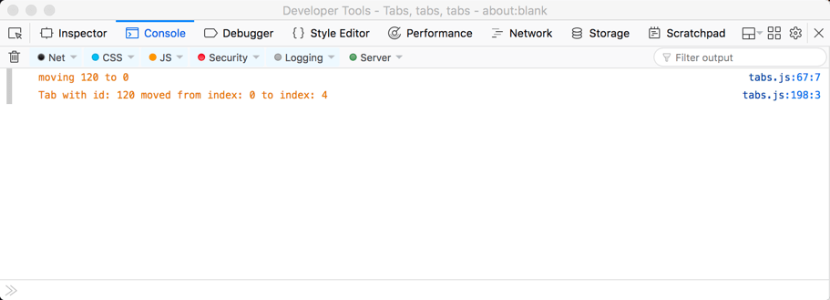

{{AddonSidebar}}

标签页（tab）允许用户在其浏览器窗口中打开多个网页，然后在这些网页之间切换。通过使用 Tabs API，你可以使用和操作这些标签页来创建实用程序，为用户提供使用标签页或提供扩展功能的新方法。

在这篇教程文章中，我们将了解如下内容：

- 使用 Tabs API 所需的权限。
- 使用 {{WebExtAPIRef("tabs.query")}} 发现有关标签及其属性的更多信息。
- 创建、复制、移动、更新、重新加载和删除标签页。
- 操纵标签的缩放大小。
- 操纵标签页的 CSS 样式。

最后，我们来看看应用程序接口提供的一些其他杂项功能。

> [!NOTE]
> 其他地方也介绍了一些 Tabs API 特性。这些方法可用于使用脚本操作标签页的内容（{{WebExtAPIRef("tabs.connect")}}、{{WebExtAPIRef("tabs.sendMessage")}} 和 {{WebExtAPIRef("tabs.executeScript")}}）。如需了解有关这些方法的更多信息，请参阅概念文章[内容脚本](/zh-CN/docs/Mozilla/Add-ons/WebExtensions/Content_scripts)和操作指南[修改网页](/zh-CN/docs/Mozilla/Add-ons/WebExtensions/Modify_a_web_page)。

## 权限和 Tabs API

对于大多数 Tabs API 函数，你不需要任何权限; 但是，有一些例外：

- 需要 `"tabs"` 权限才能访问 Tab 对象的 `Tab.url`、`Tab.title` 和 `Tab.favIconUrl` 属性。在 Firefox 中，你还需要 `"tabs"` 来按 URL 执行[查询](/zh-CN/docs/Mozilla/Add-ons/WebExtensions/API/tabs/query)。
- {{WebExtAPIRef("tabs.executeScript()")}} 或 {{WebExtAPIRef("tabs.insertCSS()")}} 需要[主机权限](/zh-CN/docs/Mozilla/Add-ons/WebExtensions/manifest.json/permissions#主机权限)。

以下是你可以在扩展程序的 manifest.json 文件中请求 `"tabs"` 权限的方法：

```json
"permissions": [
  "<all_urls>",
  "tabs"
],
```

此请求允许你在用户访问的所有网站上使用所有 Tabs API 特性。在不需要主机权限的情况下，这里还有一种请求使用 {{WebExtAPIRef("tabs.executeScript()")}} 或 {{WebExtAPIRef("tabs.insertCSS()")}} 的权限的替代方法，即 [`"activeTab"`](/zh-CN/docs/Mozilla/Add-ons/WebExtensions/manifest.json/permissions#活动标签权限) 形式。该权限提供的权限与带有 `<all_urls>` 的 `"tabs"` 相同，但有两个限制：

- 用户必须通过浏览器或页面操作、上下文菜单或快捷键与扩展进行交互。
- 它只授予活动标签页内的权限。

这种方法的好处是，用户不会收到诸如“你的扩展可以访问所有网站的数据”的权限警告。这是因为 `<all_urls>` 权限赋予了扩展在任何时间、任何标签页中执行脚本的能力，而 [`"activeTab"`](/zh-CN/docs/Mozilla/Add-ons/WebExtensions/manifest.json/permissions#活动标签权限) 则仅限于允许扩展在当前标签页中执行用户请求的操作。

## 进一步了解标签及其属性

有时你会想获得所有浏览器窗口中所有标签页的列表。还有的时候，你可能想找到符合某些特定条件的标签页子集，比如从特定标签页打开的标签页或显示特定域的页面的标签页。一旦有了标签页列表，你可能还想了解它们的更多属性。

这就是 {{WebExtAPIRef("tabs.query()")}} 的作用所在。单独使用 {{WebExtAPIRef("tabs.query()")}} 可获取所有标签页，或使用 `queryInfo` 对象指定查询条件，如标签页是否处于活动状态、是否在当前窗口中，或是否符合 17 项条件中的一项或多项。

如果只需要当前标签页的信息，可以使用 {{WebExtAPIRef("tabs.getCurrent()")}} 获取该标签页的 {{WebExtAPIRef("tabs.Tab")}} 对象。如果有标签页的 ID，则可以使用 {{WebExtAPIRef("tabs.get()")}} 获取其 {{WebExtAPIRef("tabs.Tab")}} 对象。

### 示例

为了了解 {{WebExtAPIRef("tabs.query()")}} 和 {{WebExtAPIRef("tabs.Tab")}} 是如何使用的，让我们来看看 [tabs-tabs-tabs](https://github.com/mdn/webextensions-examples/tree/main/tabs-tabs-tabs) 示例是如何在工具栏弹出按钮中添加“switch to tabs”列表的。


- manifest.json

  - : 这里是 [manifest.json](https://github.com/mdn/webextensions-examples/blob/main/tabs-tabs-tabs/manifest.json) 文件：

    ```json
    {
      "browser_action": {
        "default_title": "Tabs, tabs, tabs",
        "default_popup": "tabs.html"
      },
      "description": "A list of methods you can perform on a tab.",
      "homepage_url": "https://github.com/mdn/webextensions-examples/tree/main/tabs-tabs-tabs",
      "manifest_version": 2,
      "name": "Tabs, tabs, tabs",
      "permissions": ["tabs"],
      "version": "1.0"
    }
    ```

    > [!NOTE]
    >
    > >
    >
    > - **`tabs.html` 在 `browser_action` 中被定义为 `default_popup`**。每当用户点击扩展工具栏图标时，它就会显示出来。
    > - **tabs 包含在权限中**。这是支持标签页列表功能所必需的，因为扩展会读取标签页的标题，以便在弹出窗口中显示。

- tabs.html

  - : `tabs.html` 定义了该扩展弹出的内容：

    ```html
    <!doctype html>
    <html lang="en">
      <head>
        <meta charset="utf-8" />
        <link rel="stylesheet" href="tabs.css" />
      </head>

      <body>
        <div class="panel">
          <div class="panel-section panel-section-header">
            <div class="text-section-header">Tabs-tabs-tabs</div>
          </div>

          <a href="#" id="tabs-move-beginning">
            Move active tab to the beginning of the window
          </a>
          <br />

          <!-- Define the other menu items -->

          <div class="switch-tabs">
            <p>Switch to tab</p>
            <div id="tabs-list"></div>
          </div>
        </div>

        <script src="tabs.js"></script>
      </body>
    </html>
    ```

    它做了这些事情：

    1. 声明菜单项。
    2. 声明一个 ID 为 `tabs-list` 的空 `div` 以包含标签页列表。
    3. 调用 `tabs.js`。

- tabs.js
  - : 在 [`tabs.js`](https://github.com/mdn/webextensions-examples/blob/main/tabs-tabs-tabs/tabs.js) 文件中，我们将看到标签列表是如何创建并添加到弹出窗口的。

#### 创建弹出内容

首先，添加一个事件处理器，以便在加载 `tabs.html` 时执行 `listTabs()`：

```js
document.addEventListener("DOMContentLoaded", listTabs);
```

`listTabs()` 首先会调用 `getCurrentWindowTabs()`。在这里，{{WebExtAPIRef("tabs.query()")}} 被用来获取当前窗口中标签页的 {{WebExtAPIRef("tabs.Tab")}} 对象：

```js
function getCurrentWindowTabs() {
  return browser.tabs.query({ currentWindow: true });
}
```

现在，`listTabs()` 已准备好为弹出窗口创建内容。

首先：

1. 抓取 `<div id="tabs-list">` 元素。
2. 创建一个文档片段（将在其中创建列表）。
3. 设置计数器。
4. 清除 `<div id="tabs-list">` 元素的内容。

```js
function listTabs() {
 getCurrentWindowTabs().then((tabs) => {
    const tabsList = document.getElementById('tabs-list');
    const currentTabs = document.createDocumentFragment();
    const limit = 5;
    let counter = 0;

    tabsList.textContent = '';
```

接下来，我们将为每个标签页创建链接：

1. 循环遍历 {{WebExtAPIRef("tabs.Tab")}} 对象的前 5 个项目。
2. 为每个项目在文档片段中添加一个超链接。

   - 链接的标签（即文本）使用标签页的 `title`（如果没有 `title`，则使用 `id`）设置。
   - 链接的地址使用标签页的 `id` 设置。

```js
for (const tab of tabs) {
  if (!tab.active && counter <= limit) {
    const tabLink = document.createElement("a");

    tabLink.textContent = tab.title || tab.id;

    tabLink.setAttribute("href", tab.id);
    tabLink.classList.add("switch-tabs");
    currentTabs.appendChild(tabLink);
  }

  counter += 1;
}
```

最后，文档片段被写入 `<div id="tabs-list">` 元素：

```js
    tabsList.appendChild(currentTabs);
  });
}
```

#### 使用活动标签页

另一个相关的示例功能是“警报活动标签页”信息选项，它可将活动标签页的所有 {{WebExtAPIRef("tabs.Tab")}} 对象属性输出到警报中：

```js
else if (e.target.id === "tabs-alertinfo") {
  callOnActiveTab((tab) => {
    let props = "";
    for (const item in tab) {
      props += `${ item } = ${ tab[item] } \n`;
    }
    alert(props);
  });
}
```

其中，`callOnActiveTab()` 通过在 {{WebExtAPIRef("tabs.Tab")}} 对象中循环查找已设置为活动的项目，从而找到活动的标签页对象：

```js
document.addEventListener("click", (e) => {
  function callOnActiveTab(callback) {
    getCurrentWindowTabs().then((tabs) => {
      for (const tab of tabs) {
        if (tab.active) {
          callback(tab, tabs);
        }
      }
    });
  }
}
```

## 创建、复制、移动、更新、重新加载、删除标签页

收集了标签页的信息后，你很可能想对它们做些什么——要么为用户提供操作和管理标签页的功能，要么在扩展中实现功能。

以下是可用的功能：

- 创建新标签页（{{WebExtAPIRef("tabs.create()")}}）。
- 复制标签页（{{WebExtAPIRef("tabs.duplicate()")}}）。
- 删除标签页（{{WebExtAPIRef("tabs.remove()")}}）。
- 移动标签页（{{WebExtAPIRef("tabs.move()")}}）。
- 更新标签页的 URL（有效地浏览到新页面）（{{WebExtAPIRef("tabs.update()")}}）。
- 重新加载标签页（{{WebExtAPIRef("tabs.reload()")}}）。

> [!NOTE]
> 这些函数都需要它们要操作的标签页的 ID（一个或多个 ID）：
>
> - {{WebExtAPIRef("tabs.duplicate")}}
> - {{WebExtAPIRef("tabs.remove")}}
> - {{WebExtAPIRef("tabs.move")}}
>
> 而以下函数将作用于活动标签页（如果没有提供标签页 `id`）：
>
> - {{WebExtAPIRef("tabs.update")}}
> - {{WebExtAPIRef("tabs.reload")}}

### 教程示例

除了更新标签页的 URL 之外，[tabs-tabs-tabs](https://github.com/mdn/webextensions-examples/tree/main/tabs-tabs-tabs) 示例使用了所有这些功能。这些 API 的使用方式类似，因此我们将查看其中一个更复杂的实现，即“将活动标签页移至窗口列表开头”选项。

首先，这里演示了该功能的实际操作：

{{EmbedYouTube("-lJRzTIvhxo")}}

- manifest.json
  - : 没有一个功能需要权限才能运行，因此 [manifest.json](https://github.com/mdn/webextensions-examples/blob/main/tabs-tabs-tabs/manifest.json) 文件中没有需要突出显示的功能。
- tabs.html

  - : [`tabs.html`](https://github.com/mdn/webextensions-examples/blob/main/tabs-tabs-tabs/tabs.html) 定义了弹出窗口中显示的“菜单”，其中包括“将活动标签页移至窗口列表开头”选项，以及一系列由可视分隔符分组的 `<a>` 标记。每个菜单项都有一个 `id` ，`tabs.js` 使用该 `id` 来确定请求的是哪个菜单项。

    ```html
    <a href="#" id="tabs-move-beginning">
      Move active tab to the beginning of the window
    </a>
    <br />
    <a href="#" id="tabs-move-end">Move active tab to the end of the window</a>
    <br />

    <div class="panel-section-separator"></div>

    <a href="#" id="tabs-duplicate">Duplicate active tab</a><br />
    <a href="#" id="tabs-reload">Reload active tab</a><br />
    <a href="#" id="tabs-alertinfo">Alert active tab info</a><br />
    ```

- tabs.js

  - : 为了实现在 `tabs.html` 中定义的“菜单”，[`tabs.js`](https://github.com/mdn/webextensions-examples/blob/main/tabs-tabs-tabs/tabs.js) 在 `tabs.html` 中包含了一个点击监听器：

    ```js
    document.addEventListener("click", (e) => {
      function callOnActiveTab(callback) {
        getCurrentWindowTabs().then((tabs) => {
          for (const tab of tabs) {
            if (tab.active) {
              callback(tab, tabs);
            }
          }
        });
      }
    });
    ```

    然后，一系列 `if` 语句会查找与点击项目的 `id` 匹配的内容。

    此代码片段用于“将活动标签页移至窗口列表开头”选项：

    ```js
    if (e.target.id === "tabs-move-beginning") {
      callOnActiveTab((tab, tabs) => {
        let index = 0;
        if (!tab.pinned) {
          index = firstUnpinnedTab(tabs);
        }
        console.log(`moving ${tab.id} to ${index}`);
        browser.tabs.move([tab.id], { index });
      });
    }
    ```

    值得注意的是 `console.log()` 的使用。这样就能向[调试器](https://extensionworkshop.com/documentation/develop/debugging/)控制台输出信息，在解决开发过程中发现的问题时非常有用。

    

    移动代码首先调用 `callOnActiveTab()`，然后再调用 `getCurrentWindowTabs()`，以获取包含活动窗口标签页的 {{WebExtAPIRef("tabs.Tab")}} 对象。然后在该对象中循环查找并返回活动标签页对象：

    ```js
    function callOnActiveTab(callback) {
      getCurrentWindowTabs().then((tabs) => {
        for (const tab of tabs) {
          if (tab.active) {
            callback(tab, tabs);
          }
        }
      });
    }
    ```

#### 固定标签页

标签页的一个特点是用户可以在窗口中*固定*标签页。被固定的标签页会放在标签页列表的起始位置，并且不能移动。这意味着标签页可以移动的最早位置是任何已固定标签页之后的第一个位置。因此，`firstUnpinnedTab()` 将被调用，通过循环查看 `tabs` 对象来查找第一个未固定标签页的位置：

```js
function firstUnpinnedTab(tabs) {
  for (var tab of tabs) {
    if (!tab.pinned) {
      return tab.index;
    }
  }
}
```

现在我们拥有了移动标签页所需的一切：活动标签页对象，从中我们可以获得标签页的 `id` 和标签页要移动到的位置。因此，我们可以这样实现移动：

```js
browser.tabs.move([tab.id], { index });
```

其余功能：复制、重新加载、创建和删除标签页，实现类似。

## 改变标签页的缩放级别

下一组功能可用于获取（{{WebExtAPIRef("tabs.getZoom")}}）和设置（{{WebExtAPIRef("tabs.setZoom")}}）标签页内的缩放级别。你还可以检索缩放设置（{{WebExtAPIRef("tabs.getZoomSettings")}}），但在撰写本文档时，Firefox 还不提供设置功能（{{WebExtAPIRef("tabs.setZoomSettings")}}）。

缩放级别可在 30% 到 500% 之间（以小数 `0.3` 到 `5` 表示）。

在 Firefox 中，默认缩放设置为

- **默认缩放级别**：100%。
- **缩放模式**：自动（因此浏览器会管理缩放级别的设置）。
- **缩放更改的范围**：`"per-origin"`，这意味着当你再次访问网站时，网站会采用上次访问时设置的缩放级别。

### 教程示例

[tabs-tabs-tabs](https://github.com/mdn/webextensions-examples/tree/main/tabs-tabs-tabs) 示例包括三个缩放功能演示：放大、缩小和重置缩放。下面是该功能的实际操作：

{{EmbedYouTube("RFr3oYBCg28")}}

让我们看看缩放功能是如何实现的。

- manifest.json
  - : 缩放功能都不需要权限，因此 [manifest.json](https://github.com/mdn/webextensions-examples/blob/main/tabs-tabs-tabs/manifest.json) 文件中没有需要突出显示的功能。
- tabs.html
  - : 我们已经讨论过 [`tabs.html`](https://github.com/mdn/webextensions-examples/blob/main/tabs-tabs-tabs/tabs.html) 是如何定义该扩展的选项的，在提供缩放选项方面没有做任何新的或独特的工作。
- tabs.js

  - : [`tabs.js`](https://github.com/mdn/webextensions-examples/blob/main/tabs-tabs-tabs/tabs.js) 首先定义了缩放代码中使用的几个常量：

    ```js
    const ZOOM_INCREMENT = 0.2；
    const MAX_ZOOM = 5；
    const MIN_ZOOM = 0.3；
    const DEFAULT_ZOOM = 1；
    ```

    然后，它会使用我们之前讨论过的监听器，以便对 `tabs.html` 中的点击采取行动。

    对于放大功能，将执行以下操作：

    ```js
      else if (e.target.id === "tabs-add-zoom") {
        callOnActiveTab((tab) => {
          browser.tabs.getZoom(tab.id).then((zoomFactor) => {
            // 最大 zoomFactor 为 5，不能再高了
            if (zoomFactor >= MAX_ZOOM) {
              alert("Tab zoom factor is already at max!")；
            } else {
              let newZoomFactor = zoomFactor + ZOOM_INCREMENT；
              //如果 newZoomFactor 被设置为高于最大值，则该值不会改变。
              //它将不会改变，也不会提示已达到最大值
              newZoomFactor = newZoomFactor > MAX_ZOOM ? MAX_ZOOM : newZoomFactor；
              browser.tabs.setZoom(tab.id, newZoomFactor)；
            }
          });
        });
      }
    ```

    这段代码使用 `callOnActiveTab()` 获取活动标签页的详细信息，然后 {{WebExtAPIRef("tabs.getZoom")}} 获取标签页的当前缩放系数。当前缩放与定义的最大值（`MAX_ZOOM`）进行比较，如果标签页已达到最大缩放，就会发出警报。否则，缩放级别会递增，但仅限于最大缩放，然后使用 {{WebExtAPIRef("tabs.getZoom")}} 设置缩放。

## 改变标签页的 CSS 样式

标签 API 提供的另一项重要功能是操作标签内的 CSS 样式：为标签添加新 CSS 样式（{{WebExtAPIRef("tabs.insertCSS()")}}）或从标签移除 CSS 样式（{{WebExtAPIRef("tabs.removeCSS()")}}）。

例如，如果你想突出显示某些页面元素或更改页面的默认布局，这将非常有用。

### 教程示例

[apply-css](https://github.com/mdn/webextensions-examples/tree/main/apply-css) 示例使用这些功能为活动标签页中的网页添加红色边框。下面是该功能的实际效果：

{{EmbedYouTube("bcK-GT2Dyhs")}}

让我们来看看它是如何实现的。

- manifest.json

  - : [`manifest.json`](https://github.com/mdn/webextensions-examples/blob/main/apply-css/manifest.json) 请求使用 CSS 功能所需的权限。你需要

    - `"tabs"` 权限和[主机权限](/zh-CN/docs/Mozilla/Add-ons/WebExtensions/manifest.json/permissions#主机权限)；或者
    - `"activeTab"` 权限。

    后者最有用，因为它允许扩展在通过扩展的浏览器或页面操作、上下文菜单或快捷方式运行时，在活动标签页中使用 {{WebExtAPIRef("tabs.insertCSS()")}} 和 {{WebExtAPIRef("tabs.removeCSS()")}} 。

    ```json
    {
      "description": "Adds a page action to toggle applying CSS to pages.",

      "manifest_version": 2,
      "name": "apply-css",
      "version": "1.0",
      "homepage_url": "https://github.com/mdn/webextensions-examples/tree/main/apply-css",

      "background": {
        "scripts": ["background.js"]
      },

      "page_action": {
        "default_icon": "icons/off.svg"
      },

      "permissions": ["activeTab", "tabs"]
    }
    ```

    你会注意到，除了 `"activeTab"`，还请求了 `"tabs"` 权限。扩展脚本需要这个额外权限才能访问标签页的 URL，我们稍后会看到它的重要性。

    manifest.json 文件中的其他主要功能包括以下定义：

    - **后台脚本**，加载扩展后立即开始运行。
    - **一个“页面动作”**，它定义了一个要添加到浏览器地址栏的图标。

- background.js

  - : 启动时，[`background.js`](https://github.com/mdn/webextensions-examples/blob/main/apply-css/background.js) 会设置一些常量，以定义要应用的 CSS、“页面操作”的标题以及扩展将在其中运行的协议列表：

    ```js
    const CSS = "body { border: 20px solid red; }";
    const TITLE_APPLY = "Apply CSS";
    const TITLE_REMOVE = "Remove CSS";
    const APPLICABLE_PROTOCOLS = ["http:", "https:"];
    ```

    首次加载时，扩展会使用 {{WebExtAPIRef("tabs.query()")}} 获取当前浏览器窗口中所有标签页的列表。然后，它会调用 `initializePageAction()` 对标签页进行循环。

    ```js
    browser.tabs.query({}).then((tabs) => {
      for (const tab of tabs) {
        initializePageAction(tab);
      }
    });
    ```

    `initializePageAction` 使用 `protocolIsApplicable()` 来确定活动标签页的 URL 是否可以应用 CSS：

    ```js
    function protocolIsApplicable(url) {
      const anchor = document.createElement("a");
      anchor.href = url;
      return APPLICABLE_PROTOCOLS.includes(anchor.protocol);
    }
    ```

    如果示例可以在标签页上执行操作，`initializePageAction()` 会在使 `pageAction` 可见之前将标签页的 `pageAction`（导航栏）图标和标题设置为使用“关闭”版本：

    ```js
    function initializePageAction(tab) {
      if (protocolIsApplicable(tab.url)) {
        browser.pageAction.setIcon({ tabId: tab.id, path: "icons/off.svg" });
        browser.pageAction.setTitle({ tabId: tab.id, title: TITLE_APPLY });
        browser.pageAction.show(tab.id);
      }
    }
    ```

    接下来，`pageAction.onClicked` 的监听器会等待 `pageAction` 图标被点击，并在点击时调用 `toggleCSS`。

    ```js
    browser.pageAction.onClicked.addListener(toggleCSS);
    ```

    `toggleCSS()` 获取 `pageAction` 的标题，然后执行所述操作：

    - **对于“应用 CSS”**：

      - 将 `pageAction` 图标和标题切换为“移除”。
      - 使用 {{WebExtAPIRef("tabs.insertCSS()")}} 应用 CSS。

    - **对于“移除 CSS”**：

      - 将 `pageAction` 图标和标题切换为“应用”。
      - 使用 {{WebExtAPIRef("tabs.removeCSS()")}} 删除 CSS。

    ```js
    function toggleCSS(tab) {
      function gotTitle(title) {
        if (title === TITLE_APPLY) {
          browser.pageAction.setIcon({ tabId: tab.id, path: "icons/on.svg" });
          browser.pageAction.setTitle({ tabId: tab.id, title: TITLE_REMOVE });
          browser.tabs.insertCSS({ code: CSS });
        } else {
          browser.pageAction.setIcon({ tabId: tab.id, path: "icons/off.svg" });
          browser.pageAction.setTitle({ tabId: tab.id, title: TITLE_APPLY });
          browser.tabs.removeCSS({ code: CSS });
        }
      }

      browser.pageAction.getTitle({ tabId: tab.id }).then(gotTitle);
    }
    ```

    最后，为确保 `pageAction` 在每次更新标签页后都有效，{{WebExtAPIRef("tabs.onUpdated")}} 上的监听器会在每次更新标签页时调用 `initializePageAction()`，以检查标签页是否仍在使用可应用 CSS 的协议。

    ```js
    browser.tabs.onUpdated.addListener((id, changeInfo, tab) => {
      initializePageAction(tab);
    });
    ```

## 一些其他有趣的特性

还有一些其他 Tabs API 特性，前面的章节还没有介绍过：

- 使用 {{WebExtAPIRef("tabs.captureVisibleTab")}} 捕捉可见标签内容。
- 使用 {{WebExtAPIRef("tabs.detectLanguage")}} 检测标签页内容的主要语言。例如，这可用于将扩展用户界面的语言与运行页面的语言相匹配。

## 进一步学习

如果你想了解有关 Tabs API 的更多信息，请查阅

- [Tabs API 参考](/zh-CN/docs/Mozilla/Add-ons/WebExtensions/API/tabs)
- [扩展示例](/zh-CN/docs/Mozilla/Add-ons/WebExtensions/Examples)（很多示例使用了 Tabs API）
