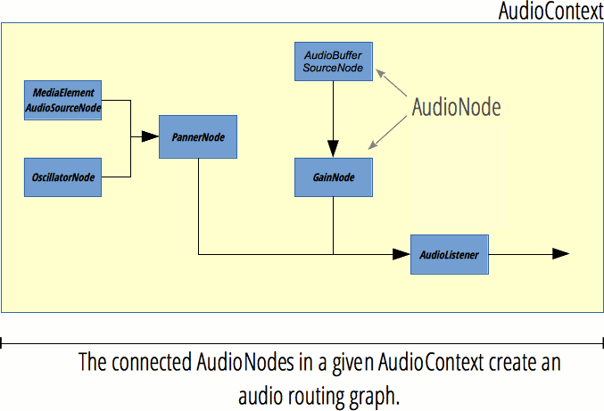

{{ APIRef("Web Audio API") }} {{SeeCompatTable}}

`AudioNode` 接口是一个处理音频的通用模块，比如：

- 一个音频源 (如，一个 HTML {{HTMLElement("audio")}} 或 {{HTMLElement("video")}} 元素，一个 {{domxref("OscillatorNode")}}，等等)；
- 一个音频地址；
- 一个中间处理模块 (如，一个过滤器，像是 {{domxref("BiquadFilterNode")}} 或是 {{domxref("ConvolverNode")}}）；
- 一个音量控制器如 {{domxref("GainNode")}})。

{{InheritanceDiagram}}

> **备注：** 一个 `AudioNode` 可以作为事件的目标，所以它实现了 {{domxref("EventTarget")}} 接口。

## 属性

- {{domxref("AudioNode.context")}} {{ReadOnlyInline}}
- : 返回相关的 {{domxref("BaseAudioContext")}}，即代表节点参与的处理图的对象。
- {{domxref("AudioNode.numberOfInputs")}} {{ReadOnlyInline}}
  - : 返回节点的输入数。源节点被定义为 `numberOfInputs` 属性 值为 `0` 的节点。
- {{domxref("AudioNode.numberOfOutputs")}} {{ReadOnlyInline}}
  - : 返回节点输出的数量。目的地节点（如 {{ domxref("AudioDestinationNode") }}）的这一属性的值为 `0`。
- {{domxref("AudioNode.channelCount")}}
  - : 一个整数，用于确定在[上混音和下混音](/zh-CN/docs/Web/API/Web_Audio_API/Basic_concepts_behind_Web_Audio_API#up-mixing_and_down-mixing)中连接到节点的任何输入时使用了多少个通道。其用法和精确定义取决于 {{domxref("AudioNode.channelCountMode")}} 的值。
- {{domxref("AudioNode.channelCountMode")}}。
  - : 一个描述节点输入和输出之间必须匹配的通道方式的枚举值。
- {{domxref("AudioNode.channelInterpretation")}}
  - : 一个描述通道含义的枚举值。该数值将定义音频的[上混音和下混音](/zh-CN/docs/Web/API/Web_Audio_API/Basic_concepts_behind_Web_Audio_API#up-mixing_and_down-mixing)会怎样进行。可能的取值是 `"speakers"` 或 `"discrete"`。

## 方法

_还实现了接口 {{domxref("EventTarget")}} 的方法_。

- {{domxref("AudioNode.connect()")}}
  - 允许我们将此节点的输出连接到另一个节点（可以是音频数据，也可以是 {{domxref("AudioParam")}} 的值）的输入。
- {{domxref("AudioNode.disconnect()")}}
  - : 允许我们断开当前节点与另一个已连接节点的连接。

## 描述

### 音频路由图



每个 `AudioNode` 都有输入和输出，多个音频节点连接在一起构成一个 _处理图_。这个图包含在一个 {{domxref("AudioContext")}} 中，每个音频节点只能属于一个音频上下文。

一个 _源节点_ 没有输入，但有一个或多个输出，可以用来生成声音。另一方面，一个 _目的地节点_ 没有输出；相反，它的所有输入直接播放在扬声器上（或者音频上下文使用的任何音频输出设备）。此外，还有 _处理节点_，它们有输入和输出。不同的 `AudioNode` 之间的确切处理方式各不相同，但通常来说，一个节点会读取它的输入，进行一些与音频相关的处理，并为它的输出生成新值，或者让音频通过（例如在 {{domxref("AnalyserNode")}} 中，处理的结果是单独访问的）。

图中的节点越多，延迟就越高。例如，如果你的图的延迟为 500 毫秒，当源节点播放声音时，你会需要等待半秒，才能在扬声器上听到声音（甚至可能因为底层音频设备的延迟而更长）。因此，如果你需要实现需要交互式音频，请尽量保持图尽可能小，并将用户控制的音频节点放在图的末尾。例如，音量控制器（`GainNode`）应该是最后一个节点，以便音量更改立即生效。

每个输入和输出都有一定数量的 _通道_。例如，单声道音频有一个通道，而立体声音频有两个通道。Web Audio API 将根据需要上混音或下混音通道数量；请查看 Web Audio 规范以获取详细信息。

有关所有音频节点的列表，请参阅 [Web Audio API](/zh-CN/docs/Web/API/Web_Audio_API) 主页。

### 创建一个音频节点

有两种可以创建音频节点的方法：通过 _constructor_ 和通过 _factory_ 方法：

```js
// constructor
const analyserNode = new AnalyserNode(audioCtx, {
  fftSize: 2048,
  maxDecibels: -25,
  minDecibels: -60,
  smoothingTimeConstant: 0.5,
});
```

```js
// factory method
const analyserNode = audioCtx.createAnalyser();
analyserNode.fftSize = 2048;
analyserNode.maxDecibels = -25;
analyserNode.minDecibels = -60;
analyserNode.smoothingTimeConstant = 0.5;
```

你可以自由使用 _constructor_ 或 _factory_ 方法，也可以混合使用这两种方法，但使用 _constructor_ 有很多好处：

- 所有参数都可以在构建时设置，而无需单独设置。
- 可以对音频节点进行[子类化](https://github.com/WebAudio/web-audio-api/issues/251)。虽然实际处理是由浏览器内部完成的，无法更改，但你可以编写一个音频节点的包装器，以提供自定义属性和方法。
- 性能略有提高：在 Chrome 浏览器和 Firefox 浏览器中，_factory_ 方法会在内部调用构造函数。

_简史：_ 第一版网络音频规范仅定义了 _factory_ 方法。经过 [2013 年 10 月的设计审查](https://github.com/WebAudio/web-audio-api/issues/250)，决定添加 _constructor_，因为与 _factory_ 方法相比，前者有很多优点。在 2016 年 8 月至 10 月期间，_constructor_ 被添加到规范中。_factory_ 方法仍继续包含在规范中，并未废弃。


## 例子

这个简单的代码片段展示了一些音频节点的创建，以及如何使用`AudioNode` 属性 和方法。你可以在 [Web Audio API](/zh-CN/docs/Web/API/Web_Audio_API) 页面中的链接找到此类用法的示例（例如 [Violent Theremin](https://github.com/mdn/webaudio-examples/tree/main/violent-theremin)）。

```js
const audioCtx = new AudioContext();

const oscillator = new OscillatorNode(audioCtx);
const gainNode = new GainNode(audioCtx);

oscillator.connect(gainNode).connect(audioCtx.destination);

oscillator.context;
oscillator.numberOfInputs;
oscillator.numberOfOutputs;
oscillator.channelCount;
```

## 规范

{{Specifications}}

## 浏览器兼容性

{{Compat}}

## 相关内容

- [使用 Web Audio API](/zh-CN/docs/Web/API/Web_Audio_API/Using_Web_Audio_API)
