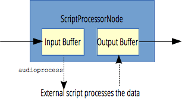

{{APIRef("Web Audio API")}}

> **备注：** 这个特性在 2014 年 8 月 29 日发布的 Web Audio API 规范中已经标记为不推荐，将很快会被[Audio Workers](/zh-CN/docs/Web/API/Web_Audio_API#Audio_Workers)代替。

`ScriptProcessorNode` 接口允许使用 JavaScript 生成、处理、分析音频。它是一个 {{domxref("AudioNode")}}， 连接着两个缓冲区音频处理模块，其中一个缓冲区包含输入音频数据，另外一个包含处理后的输出音频数据。实现了 {{domxref("AudioProcessingEvent")}} 接口的一个事件，每当输入缓冲区有新的数据时，事件将被发送到该对象，并且事件将在数据填充到输出缓冲区后结束。

输入和输出缓冲区大小在创建时定义，当 {{domxref("AudioContext.createScriptProcessor()")}} 方法被调用时 (都是由 {{domxref("AudioContext.createScriptProcessor()")}}的 `bufferSize` 参数定义). 缓冲区大小必须是在 `256` 到 `16384` 之间的 2 的次幂， 为 `256`, `512`, `1024`, `2048`, `4096`, `8192` 或者 `16384`. Small numbers lower the _latency_, but large number may be necessary to avoid audio breakup and glitches.

If the buffer size is not defined, which is recommended, the browser will pick one that its heuristic deems appropriate.

<table class="properties">
  <tbody>
    <tr>
      <th scope="row">Number of inputs</th>
      <td><code>1</code></td>
    </tr>
    <tr>
      <th scope="row">Number of outputs</th>
      <td><code>1</code></td>
    </tr>
    <tr>
      <th scope="row">Channel count mode</th>
      <td><code>"max"</code></td>
    </tr>
    <tr>
      <th scope="row">Channel count</th>
      <td><code>2</code> (not used in the default count mode)</td>
    </tr>
    <tr>
      <th scope="row">Channel interpretation</th>
      <td><code>"speakers"</code></td>
    </tr>
  </tbody>
</table>

## 属性

_从上一级继承属性，{{domxref("AudioNode")}}。_

- {{domxref("ScriptProcessorNode.bufferSize")}} {{readonlyInline}}
  - : 返回一个表示输入和输出缓冲区大小的整数。它的值可以是在`256`–`16384` 之间的 2 的次幂。

### 事件句柄

- {{domxref("ScriptProcessorNode.onaudioprocess")}}
  - : Represents the {{event("Event_handlers", "event handler")}} to be called.

## 方法

_No specific methods; inherits methods from its parent,_ _{{domxref("AudioNode")}}_.

## 示例

{{page("/zh-CN/docs/Web/API/AudioContext.createScriptProcessor","Example")}}

## 规范

自 2014 年 8 月 29 日 [Web Audio API 规范](https://webaudio.github.io/web-audio-api/#dom-baseaudiocontext-createscriptprocessor)发布以来，此特性已被弃用。它不再有望成为标准。

它已被 [AudioWorklet](/zh-CN/docs/Web/API/AudioWorklet) 和 {{domxref("AudioWorkletNode")}} 接口所取代。

## 浏览器兼容性

{{Compat}}

## See also

- [Using the Web Audio API](/zh-CN/docs/Web/API/Web_Audio_API/Using_Web_Audio_API)
