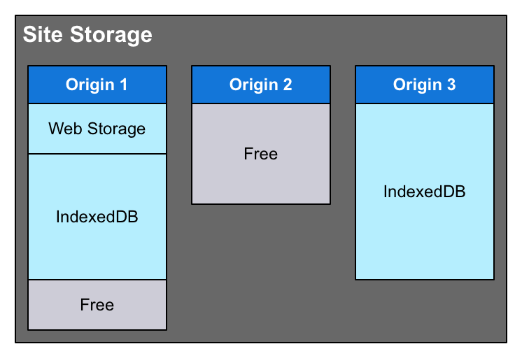

{{securecontext_header}}{{DefaultAPISidebar("Storage")}}

Web 存储标准，the Storage Standard，定义了一个通用的、共享的存储系统，供所有 API 和技术使用，以存储各个网站的内容可访问数据。Storage API 允许网站的代码、Web 应用程序知道它们可以使用、已经使用多少存储空间。空间不足时，{{Glossary("user agent", "用户代理")}}会自动清理站点数据，以便为其他用途腾出空间。而 Storage API 甚至可以控制：在执行清理之前，是否需要提醒代码或 Web 应用程序，以便作出反应。

{{AvailableInWorkers}}

站点存储——由存储标准管理的网站数据——包括以下几种：

- [IndexedDB 数据库](/zh-CN/docs/Web/API/IndexedDB_API)
- [Cache API data](/zh-CN/docs/Web/API/Cache)
- [Service Worker registrations](/zh-CN/docs/Web/API/Service_Worker_API)
- [Web Storage API data](/zh-CN/docs/Web/API/Web_Storage_API) managed using {{domxref("window.localStorage")}}
- 使用 {{domxref("History.pushState()")}} 保存的历史状态信息
- [Application caches](/zh-CN/docs/Web/HTML/Using_the_application_cache)
- [Notification data](/zh-CN/docs/Web/API/Notifications_API)
- 可维护的、其他类型的、站点可访问的，站点特定数据

## 站点存储单元

由存储标准描述并使用存储 API 进行交互的站点存储系统，由每个 {{Glossary("origin")}} 的单个**站点存储单元**（**site storage unit**）组成。实际上，每个 Web 站点或 Web 应用程序都有自己的存储单元，用于存储数据。下图显示了一个站点存储池，其中包含三个存储单元，显示了存储单元如何可以在其中存储不同的数据类型，并且可能具有不同的配额（最大存储限制）。



- 来源 1 有一些 Web Storage 数据和一些 IndexedDB 数据，还有一些空闲空间。目前它的使用量没有达到配额限制。
- 来源 2 中没有存储任何数据；它只是一个空盒子在等待内容。然而，这个来源地的配额比其他两个低。它可能是访问较少的站点，或者已知具有较低数据存储要求的站点
- 来源 3 的存储单元已被完全填满；它达到了它的配额限制，并且无法在不删除某些现有数据的情况下存储更多数据。

{{Glossary("User agent", "User agent")}} 可能使用各种技术来确定各种来源的配额。规范特别鼓励的、最有可能的方法之一，实际上是考虑各个站点的流行程度 和/或使用水平，以确定它们的配额应该是什么。还可以想象，浏览器可能会提供一个用户界面来定制这些配额。

## 存储模式

每个站点存储单元中的实际数据存储，被称为它的**框** / **盒**（**box**）。每个站点存储单元只有一个盒，盒中包含其所有数据，且有一个**盒存储模式** / **存储模式**（**box mode**），用于描述其数据保留策略。目前有两种模式：

- `"best-effort"`
  - : 用户代理将会将尽可能久地保留 box 中包含的数据，但若因存储空间不足儿必须清空 box 以释放存储压力时，用户代理**不会警告用户**。
- `"persistent"`
  - : 用户代理将会将尽可能久地保留此模式的数据，只有在所有被标记为 `"best-effort"` 的 box 都已被清理后，才会清理被标记为 `"persistent"` 的 box。如果需要考虑清除持久性框（persistent boxes），用户代理将通知用户，并根据需要提供清除一个或多个持久性框（persistent boxes）的方法。

修改某个来源的 box mode 需要取得使用 `"persistent-storage"` 特性的权限。

## 数据持久性与清理

如果站点或应用程序具有"**永久存储（`persistent-storage`）**"功能权限，则可以使用 {{domxref("StorageManager.persist()")}} 方法来请求将其 box 设为持久的。由于使用特性或其他度量，用户代理还可以决定使站点的存储单元持久化。"持久存储"功能的与权限相关的标志、算法和类型都设置为权限的标准默认值，只是整个源位置的权限状态必须相同，并且如果未"授予"权限状态（无论出于何种原因，访问持久性存储功能被拒绝），源站点存储单元的 box 模式总是"尽力"。

> **备注：** 请参考 [使用 Permissions API](/zh-CN/docs/Web/API/Permissions_API/Using_the_Permissions_API) 以了解更多关于申请与管理权限的信息。

当清除站点存储单元时，源站的框被视为单个实体；如果用户代理需要清除它并且用户批准，则清除整个数据存储，而不是提供某种仅从单个 api 清除数据的方法。

如果一个框被标记为"持久（`persistent`）" ，那么如果没有数据的源代码本身或用户明确地这样做，用户代理将不会清除内容。这包括用户选择"清除缓存"或"清除最近的历史记录"选项等场景。将特别要求用户具有删除永久性站点存储单元的权限。

## 配额与使用量的估算

The user agent determines, using whatever mechanism it chooses, the maximum amount of storage a given site can use. This maximum is the origin's **quota**. The amount of this space which is in use by the site is called its **usage**. Both of these values are estimates; there are several reasons why they're not precise:

- User agents are encouraged to obscure the exact size of the data used by a given origin, to prevent these values from being used for fingerprinting purposes.
- De-duplication, compression, and other methods to reduce the physical size of the stored data may be used.
- Quotas are conservative estimates of the space available for the origin's use, and should be less than the available space on the device to help prevent overruns.

User agents may use any method they choose to determine the size of origins' quotas, and are encouraged by the specification to provide popular or frequently-used sites with extra space.

To determine the estimated quota and usage values for a given origin, use the {{domxref("StorageManager.estimate", "navigator.storage.estimate()")}} method, which returns a promise that, when resolved, receives a {{domxref("StorageEstimate")}} that contains these figures. For example:

```js
navigator.storage.estimate().then(estimate => {
  // estimate.quota 是估得的配额
  // estimate.usage 是估得的使用量，单位为 byte 比特
});
```

## 规范

{{Specifications}}

## 浏览器兼容性

{{Compat}}

## 参见

- {{domxref("NavigatorStorage.storage", "navigator.storage")}}
- {{domxref("StorageManager")}} (the object returned by `navigator.storage`)
- [使用 Permissions API](/zh-CN/docs/Web/API/Permissions_API/Using_the_Permissions_API)
