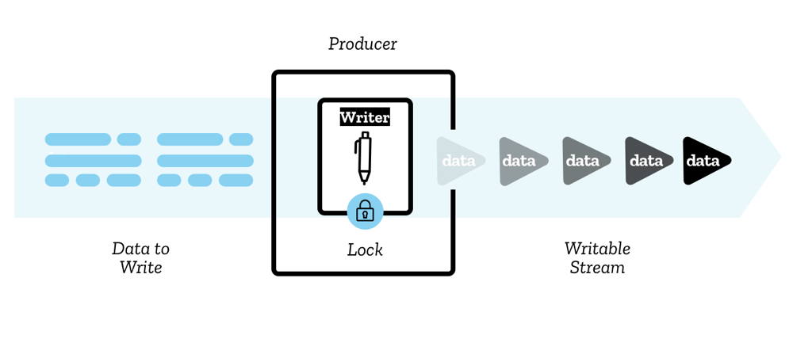

{{apiref("Streams")}}

[Streams API](/zh-CN/docs/Web/API/Streams_API) 为 Web 平台提供了一组十分有用的工具，提供了一系列对象以允许 JavaScript 访问来自网络的数据流，并根据开发人员的需要对其进行处理。与流相关的一些概念和术语可能会令你感到陌生——本文将解释你需要了解的所有内容。

## 可读流

一个可读流是一个数据源，在 JavaScript 中用一个 {{domxref("ReadableStream")}} 对象表示，数据从它的 **underlying source**（底层源）流出——底层源表示一个你希望从中获取数据，且来自网络或其他域的某种资源。

有两种类型的 underlying source：

- **Push sources** 会在你访问了它们之后，不断地主动推送数据。你可以自行开始（start）、暂停（pause）或取消（cancel）对流的访问。例如视频流和 TCP/[Web socket](/zh-CN/docs/Web/API/WebSockets_API)。
- **Pull sources** 需要在你连接到它们后，显式地请求数据。例如通过 [Fetch](/zh-CN/docs/Web/API/Fetch_API) 或 [XHR](/zh-CN/docs/Web/API/XMLHttpRequest/XMLHttpRequest) 请求访问一个文件。

数据被按序读入到许多小的片段，这些片段被称作**分块**（chunk）。**chunk** 可以是单个字节，也可以是某种更大的数据类型，例如特定大小的 [typed array](/zh-CN/docs/Web/JavaScript/Typed_arrays)。单个流的 **chunk** 可以有不同的大小和类型。

已放入到流中的分块（chunk）称作 **enqueued**——这意味着它们已经在队列中排队等待被读取。流的一个 **internal queue** 跟踪了那些尚未读取的分块（请参阅下面的**内部队列和队列策略**部分）。

流中的分块由一个 **reader** 读取——该数据处理过程一次只处理一个分块，允许你对其执行任何类型的操作。reader 加上与它一起运行的其他处理代码合称为一个 **consumer**。

另一个你将用到的对象叫做 **controller**——每个 reader 都有一个关联的 controller，用来控制流（例如，可以将流关闭）。

一个流一次只能被一个 reader 读取；当一个 reader 被创建并开始读一个流（**active reader**）时，我们说，它被 **locked**（锁定）在该流上。如果你想让另一个 reader 读这个流，则通常需要先取消第一个 reader ，再执行其他操作（你也可以 **tee**，请参阅下面的 Teeing 部分）。

注意，有两种不同类型的可读流。除了传统的可读流之外，还有一种类型叫做字节流——这是传统流的扩展版本，用于读取底层字节源。相比于传统的可读流，字节流被允许通过 BYOB reader 读取（BYOB，“带上你自己的缓冲区”）。这种 reader 可以直接将流读入开发者提供的缓冲区，从而最大限度地减少所需的复制。你的代码将使用哪种底层流（以及使用哪种 reader 和 controller）取决于流最初是如何创建的（请参阅 {{domxref("ReadableStream.ReadableStream","ReadableStream()")}} 构造函数页面）。

你可以使用现成的可读流，例如来自 fetch 请求的 {{domxref("Response.body")}}，也可以使用 {{domxref("ReadableStream.ReadableStream","ReadableStream()")}} 构造函数生成自定义的流。

## 拷贝（teeing）

尽管同一时刻只能有一个 reader 可以读取流，我们可以把流分割成两个相同的副本，这样它们就可以用两个独立的 reader 读取。该过程称为 **teeing**。

在 JavaScript 中，该过程由调用 {{domxref("ReadableStream.tee()")}} 实现——它返回一个数组，包含对原始可读流的两个相同的副本可读流，然后可以独立的使用不同的 reader 读取。

举例而言，你在 [ServiceWorker](/zh-CN/docs/Web/API/Service_Worker_API) 中可能会用到该方法，当你从服务器 fetch 资源，得到一个响应的可读流，你可能会想把这个流拆分成两个，一个流入到浏览器，另一个流入到 ServiceWorker 的缓存。由于 response 的 body 无法被消费两次，以及可读流无法被两个 reader 同时读取，你会需要两个可读流副本来实现需求。

## 可写流

一个 **可写流**（Writable stream）是一个可以写入数据的数据终点，在 JavaScript 中以一个 {{domxref("WritableStream")}} 对象表示。这是 JavaScript 层面对 **underlying sink**（底层接收器）的抽象——一个更低层次的 I/O 接收器，将原始数据写入其中。

数据由一个 **writer** 写入流中，每次只写入一个分块。分块和可读流的 reader 一样可以有多种类型。你可以用任何方式生成要被写入的块；writer 加上相关的代码称为 **producer**。

当 writer 被创建并开始写入一个流（**active writer**，译者注：该 writer 已处于活动状态）时，我们说，它被 **locked**（锁定）在该流上。同一时刻，一个 writer 只能写入一个可写流。如果你想要其他 writer 开始写入你的流，在你将 writer 附着到该流之前，你必须先中止上一个 writer。

一个 **internal queue** 跟踪已经被写入流的分块但是仍然没有被底层 sink 处理的分块。

另一个你将用到的对象叫做 controller——每个 writer 都有一个关联的 controller，用来控制流（例如，可以将流关闭）。

你可以使用 {{domxref("WritableStream.WritableStream","WritableStream()")}} 构造函数使用可写流。这些目前在浏览器中的应用非常有限。

## 链式管道传输

Streams API 使用**链式管道**（pipe chain）的结构将流传输到另一个流已经成为可能。有两种方法可以作用于它：

- {{domxref("ReadableStream.pipeThrough()")}}——通过**转换流**（transform stream）传输流，可能在传输过程中转换流。例如，他可以用于将编码或解码视频帧、压缩或解压缩数据或以其他的方式从一种数据转换成另一种数据。一个转换流由一对流组成：一个读取数据的可读流和一个写入数据的可写流，它们以适当的机制确保新数据一旦写入后即可读取。{{domxref("TransformStream")}} 是转换流的具体实现，但任意具有相同可读流和可写流属性的对象都可以传递给 `pipeThrough()`。
- {{domxref("ReadableStream.pipeTo()")}}——传输到可写流，并且作为 pipe chain 的终点。

pipe chain 的起点称为 **original source**，终点称为 **ultimate sink**。

## 背压（backpressure）

流的一个重要概念是**背压**——这是单个流或一个链式管道调节读/写速度的过程。当链中后面的一个流仍然忙碌，尚未准备好接受更多的分块时，它会通过链向上游的流发送一个信号，告诉上游的转换流（或原始源）适当地减慢传输速度，这样你就不会在任何地方遇到瓶颈。

要在可读流中使用背压技术，我们可以通过查询 controller 的 {{domxref("ReadableStreamDefaultController.desiredSize")}} 属性。如果该值太低或为负数，我们的 ReadableStream 可以告诉它的底层源停止往流中装载数据，然后我们沿着 stream chain 进行背压。

可读流在经历背压后，如果 consumer 再次想要接收数据，我们可以在构造可读流时提供 pull 方法来告诉底层源恢复往流中装载数据。

## 内置队列和排队策略

正如最初提到的，在流中一直没有处理和完成的分块由一个内置的队列跟踪。

- 就可读流而言，这些分块一直在排队，但仍然没有被读取。
- 就写入流而言，这些分块一直被写入，但仍然没有通过底层 sink 处理。

内置的队列采用一个**排队策略**，该策略规定如何基于**内置队列的状态**发出背压信号。

一般来说，该策略会将队列中的分块大小与称作 **high water mark** 的值进行比较，**high water mark** 是队列期望管理的最大分块的总和。

执行的计算是：

`high water mark - total size of chunks in queue = desired size`

**所需大小**（desired size）是流中仍然可以接收的分块数量，以保持流运行，但是小于 high water mark 的大小。当所需的大小大于0时，分块的生成将适当的减慢或者加速，以保持流尽可能快的运行。如果值降到0（或者小于 0），这意味着分块的产生快于流的处理，这可能产生问题。

举一个例子，让我们为 1 的分块大小 和为 3 的 high water mark 为例：这意味着在达到 high water mark 和运用背压之前，最多可以入队 3 个分块。
