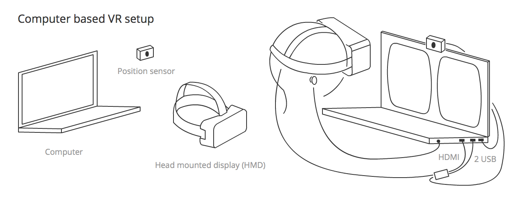
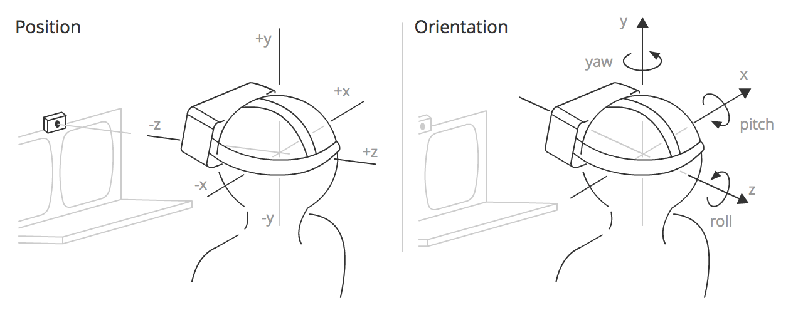
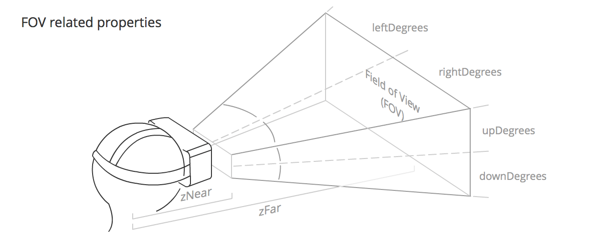
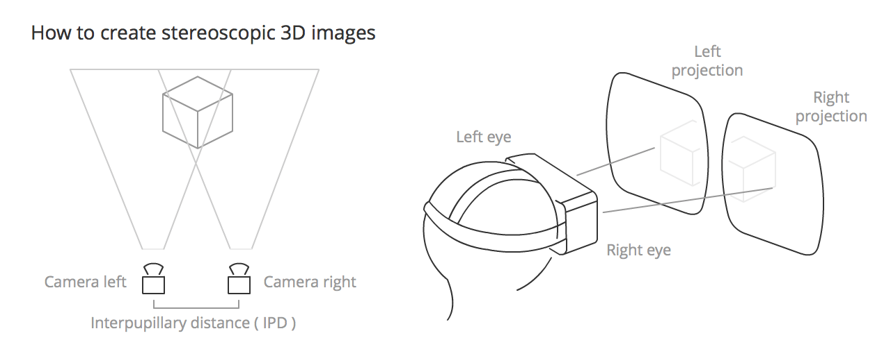

This article discusses some of the concepts and theory behind virtual reality (VR). If you are a newcomer to the area, it is worthwhile getting an understanding of these topics before you start diving into code.

这篇文章探讨了一些关于虚拟现实（VR）的概念及其背后的理论基础。如果你是一个进入这个领域的新手，在你深入学习相关代码知识前，非常有必要对于以下的话题做一定的了解。**【K】**

## The history of VR 关于 VR 的历史**【K】**

Virtual reality is nothing new — the concept goes way further back than the Oculus Rift Kickstarter campaign of 2012. People have been experimenting with it for decades.

**虚拟现实（VR）并不是一件新生的事物：这个概念甚至能追溯到，比 2012 年 Oculus Rift 在 Kickstarter campaig 上发起众筹，还要更早的时候。人们已经持续研发这种技术长达数十年。**

In 1939 the [View-Master device](https://en.wikipedia.org/wiki/View-Master) was created, allowing people to see 3D pictures. The device displayed images stored on cardboard disks containing stereoscopic 3D pairs of small color photographs. After years of development the military got interested in using such technology, and Project Headsight was born in 1961 — this involved a helmet incorporating a video screen with a head-tracking system.

**1939 年[View-Master device](https://en.wikipedia.org/wiki/View-Master)问世，它允许人们通过它观看 3D 成像的照片。这款设备播放的是，存储在圆盘硬纸板上的，成对的立体 3D 的彩色小照片。经过了许多年的研发，军方开始对使用这项技术产生了浓厚的兴趣，终于在 1961 年，名为 HEADSIGHT 的项目诞生了：它包含了一个连接头部追踪系统的显示屏的头盔。**

There were various experiments conducted over the next few decades, but it wasn't resricted to science labs and battlefields anymore. Eventually pop culture took over with movie directors showing their visions of virtual reality. Movies like Tron (1982) and The Matrix (1999) were created, where people could transfer themselves into a whole new cyber world or were trapped in one without even knowing, accepting it as the real world.

**在接下来的数十年中，出现了许多具有指导性作用的实验，但是它不再像从前那样只对科学实验室和战场开放。最终大众文化通过电影导演展现他们的视角，从而接过了虚拟现实的大旗。像【创：战纪 TRON: Legacy（1982）】和【黑客帝国 The Matrix (1999)】那样的电影被拍摄出来，在那里人们能够轻易的将自己置身于一个完全由信息构成的世界，又或者，接受让自己进入一个从未认识过的新世界，并且将它当做一个真实的存在。【K】**

The first VR gaming attempts were big and expensive — in 1991 Virtuality Group created a VR-ready arcade machine with goggles and ported popular titles like Pac-Man to virtual reality. Sega introduced their VR glasses at the Consumer Electronics Show in 1993. Companies were experimenting, but the market and consumers weren't convinced — we had to wait until 2012 to see real example of a successful VR project.

**世界上第一次 VR 游戏的尝试是既大又昂贵的：1991 年 Virtuality Group 制造了一款名为 VR-ready 的商业街机，其中装有护目镜，并且美其名曰 Pac-Man to virtual reality。随后，世嘉株式会社 (SEGA) 在 1993 的 Consumer Electronics Show 上引进了他们的 VR 眼睛设备。当时的公司都在努力尝试，但是市场和消费者并不关注和买账：之后，我们再见到真正成功的 VR 项目，就要等到最近的 2012 年了。【K】**

### VR in recent times 最近的 VR 发展**【K】**

So what's new? Virtual Reality hardware needs to deliver high-precision, low-latency data to deliver an acceptable user experience; computers running VR applications need to be powerful enough to handle all this information. It has not been until recently that such accuracy and power has been available at an afforable cost, if at all. Early VR prototypes cost tens of thousands of dollars, whereas the latest [Oculus Rift](https://www.oculus.com/rift/) developer kit is available for $350, and cheaper solutions are available, such as mobile device-based solutions like [Google Cardboard](https://www.google.com/get/cardboard/).

**那么有什么值得我们期待的呢？VR 硬件需要传输高精度的信息，在保证低延迟的情况下传递可接受的用户的体感信息；运行 VR 设备和程序的电脑，必需强大到足以维持这些庞大的信息。直到最近的这几年，如此高精度并且能量强大的设备，才能通过大众可以接受的价格被购买到。早期的 VR 原型设备，需要花费数万美元，然而最近出现的[Oculus Rift](https://www.oculus.com/rift/) developer kit 却仅售 350$，并且还有更加便宜的解决方案，比如基于手机的 VR 设备像是[Google Cardboard](https://www.google.com/get/cardboard/).【K】**

By 2015, such VRDevices gained commercial support for VR technology. Sony are developing a VR hardware kit for the PS4 (codename [Project Morpheus](http://www.cnet.com/products/sony-project-morpheus/)), Facebook bought Oculus Rift for $2 billion, Valve has created [SteamVR](http://store.steampowered.com/universe/vr) software that works with HTC's [Vive VR headset](http://www.htcvr.com/), and Google has launched a 2.0 version of its Cardboard that supports up to 6 inch phones (it is also fully compatible with iOS devices because it has a piece of conductive foam that works as a tap over the screen.)

**到了 2015 年，类似的 VR 设备吸引了大量的商业投资，进入到 VR 科技的研发中。SONY 正在 PS4 中开发一项针对 VR 的硬件工具 (编程代号 [Project Morpheus](http://www.cnet.com/products/sony-project-morpheus/)), FACRBOOK 花费 20 亿美元买下了 [Oculus Rift](https://www.oculus.com/rift/), Valve 开发了 [SteamVR](http://store.steampowered.com/universe/vr) 软件系统，能够应用于 HTC 的[Vive VR headset](http://www.htcvr.com/), 随后，谷歌发布了能够最多支持 6 英寸手机屏幕的 CARDBOARD 的 2.0 版本 (它同时完全兼容了 IOS 的设备，因为在它屏幕的背后有一块传感海绵凸起作为触碰点。)**

Samsung also launched a headset associated with Oculus called [GearVR](http://www.samsung.com/global/microsite/gearvr/gearvr_features.html), which works by connecting its Note 4 and 6S devices. This however only works with native apps, so it is not very interesting for the specific area of WebVR.

**三星公司同 Oculus 合作，也推出了它的头戴设备[GearVR](http://www.samsung.com/global/microsite/gearvr/gearvr_features.html), 这款设备可以连接旗下的 NOTE4 以及 6S 等手机。然而这款设备仅仅能够运行几款纯粹的 APP 应用，因而相对于 WEBVR 的特效领域而言，显得不是那么的有意思。【K】**

The technology itself is here, and the more expensive headsets will only get cheaper over time so more people can experience virtual reality on their own in the future.

**科技已经发展到了今天，随着时间的推移，只会有更多的昂贵的头显设备变得越来越便宜，从而另更多的人在将来能够亲自体验虚拟现实的乐趣。【K】**

### Input devices 传入设备**【K】**

Handling input for virtual reality applications is an interesting topic — it's a totally new experience for which dedicated user interfaces have to be designed. There are various approaches right now from classic keyboard and mouse, to new ones like Leap Motion. It's a matter of trial and error to see what works in given situations and what inputs fit best for your type of game.

**针对虚拟显示应用的手持传入设备，是一个非常有意思的话题：这是一种全新的体验，从而必须要设计出沉浸式的用户界面来适应它。目前为止，在这方面，从传统的键盘鼠标，一直到 LEAP MOTION 这样的新兴设备，有多种多样的途径来实现它。只有通过【试错法】最终才能窥见，哪种方式最有利于创造情景以及哪种输入设备最适合于你所玩的游戏的类型。【K】**

## VR Hardware setup 创建 VR 设备的硬件环境**【K】**

There are two main types of setup, mobile or computer-connected. Their minimum hardware set ups are as follows:

**主要有两种创建 VR 环境的类型，手机或者是 PC。以下是实现这两种环境所需要的最少的硬件支持：**

- Mobile: A Head-mounted display (HMD) is created using a smartphone — which acts as the VR display — mounted in a VR mount such as Google Cardboard, which contains the required lenses to provide stereoscopic vision of what is projected on the mobile screen.
- **手机：通过使用一部智能手机可以营造一部头显设备（HMD）-- 扮演 VR 显示器的角色 -- 安装在一个像谷歌 CARDBOARD 那样的 VR 框架中，其中包含了必需要有的透镜，用以提供投射在手机屏幕上的立体视觉效果。【K】**
- Computer-connected: A VR setup is connected to your computer — this consists of a Head Mounted Display (HMD) containing a high resolution landscape-oriented screen onto which the visuals for both the left and right eye are displayed, which also includes a lens for each eye to promote separation of the left and right eye scene (stereoscopic vision.) The setup also includes a separate position sensor that works out the position/orientation/velocity/acceleration of your head and constantly passes that information the computer.
- **电脑：将一部 VR 设备连接到你的电脑上 -- 它是由一部包含了能分别为左眼和右眼显示图像的高分辨率全景镜头所组成的头显设备所组成，同时它还包含了两块分别为双眼配备的，可以提升左右眼图像分离（立体视觉）的透镜。这套设备还包含了一套分离式的感应设备，它能够测算出你的头部的位置/方向/速度/加速度等信息，并实时的把这些信息传输给计算机。【K】**

> **备注：** Computer-connected systems sometimes don't include a position sensor, but they usually do.
>
> **注释：通过电脑连接的系统有时候不会包含定位传感装置，但是通常情况下都会有。【K】**

Other hardware that complements the VR experience includes:

**其余的帮助补充完整的 VR 体验的硬件包括：【K】**

- A hand recognition sensor: A sensor that tracks the position and movement of your hand, allowing it to become an interesting controller, and an object in VR gameworlds. The most advanced to date is the [Leap Motion](https://www.leapmotion.com/), which works with the computer (connected to the Oculus Rift) and can also work connected to a mobile device (the latter is in an experimental phase.)
- **手持传感识别器：一个可以追踪你的手部位置和运动的传感器，这使得它变成了一个非常有趣的控制器，以及一件存在于 VR 游戏世界种的物体。迄今为止，最先进的这类设备首属[Leap Motion](https://www.leapmotion.com/),它可以同电脑配合使用 (同 Oculus Rift 设备连接) 并且同时还可以和手机兼容 (暂时处于实验阶段。)**
- A gamepad: We can configurate an XBox controller or similar to work as a keyboard in the browser — this offers further possibilities of interaction with a VR webpage. There are some gamepads that work with a mobile setup — like the [MergeVR headset](http://www.mergevr.com/) — but these are connected via Bluetooth so don't work with WebVR.
- **（手机）游戏手柄：我们可以配置一套 XBOX 控制器或者类似的设备作为浏览器的键盘 -- 这种方法提供了另一种同 VR 网页互动的形式。有一些游戏手柄更可以和手机协同使用 -- 就像**[MergeVR headset](http://www.mergevr.com/)--**但是这些方法都是通过蓝牙连接设备的方法，并不能完全等同于和 WEBVR 结合。**
- An eye tracking sensor (experimental): The FOVE project is the first headset that reads subtle eye movements.
- **眼部追踪传感器（实验产品）：FOVE 项目是第一个研究用于追踪和读取人眼运动设备的项目。**
- A facial expression tracker (experimental): Researchers at the University of Southern California and Facebook's Oculus division have been testing new ways of tracking facial expressions and transferring them to a virtual character.
- **面部表情追踪设备（实验产品）：位于南加州大学和 Facebook’s Oculus 部门的研究人员，已经开始测试更多新的追踪人类面部表情并且能把他们转换成虚拟现实角色的方法。**
- A more complex positional sensor system: The SteamVR controller, combined with the [Lighthouse](http://www.roadtovr.com/steamvr-beta-update-brings-lighthouse-support-and-vr-tracking-app/) tracking system aims to achieve an experience in which you can move through a space of 10x10 square feet in a VR world.
- **更加复杂的位置传感系统：SteamVR 控制器，结合了[Lighthouse](http://www.roadtovr.com/steamvr-beta-update-brings-lighthouse-support-and-vr-tracking-app/)追踪系统，旨在实现帮助我们能在一个 10x10 square feet 的 VR 空间范围内自由活动的目的。**

## Position and orientation, velocity and acceleration

## 位置和方向，速度和加速度**【K】**

As mentioned above, the position sensor detects information concerning the HMD and constantly outputs it, allowing you to continually update a scene according to head movement, rotation, etc. But what exactly is the information?

**正如上文所提到的，那个位置传感器通过检测与 HMD 相关的信息并且实时的输出这些数据，从而允许你持续的通过改变你的头部移动，更新你身处的虚拟场景，包括旋转等动作。但是我们所说的这些信息包括些什么呢？【K】**

The output information falls into four categories:

**通过 HMD 输出的信息包含一下四种类别：【K】**

1. Position — The position of the HMD along three axes in a 3D coordinate space. x is to the left and right, y is up and down, and z is towards and away from the position sensor. In WebVR:

    **位置--HMD 设备的位置基于一个 3D 坐标空间中的三个轴--X 代表左右移动，Y 代表上下移动，Z 代表朝向和远离位置传感设备。在 WEBVR 中：**

    - x position is represented by {{domxref("VRPositionState.position")}}.x.
    - y position is represented by {{domxref("VRPositionState.position")}}.y.
    - z position is represented by {{domxref("VRPositionState.position")}}.z.

2. Orientation — The rotation of the HMD around three axes in a 3D coordinate space. Pitch is rotation around the x axis, yaw is rotation around the y axis, and roll is rotation around the z axis. In WebVR:

    **方位--HMD 设备的协同是绕着一个 3D 坐标空间中的三个轴。PITCH 负责协同 X 轴，YAW 负责协同 Y 轴，还有 ROLL 入则系统 Z 轴。在 WEBVR 中：**

    - Pitch is represented by {{domxref("VRPositionState.orientation")}}.x.
    - Yaw is represented by {{domxref("VRPositionState.orientation")}}.y.
    - Roll is represented by {{domxref("VRPositionState.orientation")}}.z.

3. Velocity — There are two types of velocity to consider in VR:

    **速度 -- 在 VR 中有两种需要被考虑的速度：**

    - Linear — The speed along any one of the axes that the HMD is traveling. This information can be accessed using {{domxref("VRPositionState.linearVelocity")}} (x, y, and z.）
    - **线速度--HMD 追踪的沿着三种轴向之一的速度。这类的信息可以被接收通过 {{domxref("VRPositionState.linearVelocity")}} (x, y, and z.)**
    - Angular — The speed at which the HMD is rotating around any one of the axes. This information can be accessed using {{domxref("VRPositionState.angularVelocity")}} (x, y, and z.)
    - **角速度 -- 就是 HMD 设备绕着三种轴向之一旋转的速度。这类的信息可以被接收通过{{domxref("VRPositionState.angularVelocity")}} (x, y, and z.)**

4. Acceleration — There are two types of acceleration to consider in VR:
    **加速度 -- 在 VR 中有两种需要被考虑的加速度：**

    - Linear — The acceleration of travel along any one of the axes that the HMD is traveling. This information can be accessed using {{domxref("VRPositionState.linearAcceleration")}} (x, y, and z.)
    - **线性加速度--HMD 设备沿着轴向追踪的加速度。这类的信息可以被接收通过{{domxref("VRPositionState.linearAcceleration")}} (x, y, and z.)**
    - Angular — The acceleration of rotation of the HMD around any one of the axes. This information can be accessed using {{domxref("VRPositionState.angularAcceleration")}} (x, y, and z.)
    - **角度加速度--HMD 设备绕着轴旋转的加速度。这类的信息可以被接收通过 {{domxref("VRPositionState.angularAcceleration")}} (x, y, and z.)**

## Field of view 视野**【K】**

The field of view (FOV) is the area that each of the user's eyes can reasonably be expected to see. It roughly takes the form of a pyramid shape, laid down on one side, with the apex inside the user's head, and the rest of the pyramid eminating from the user's eye. Each eye has it's own FOV, one slightly overlapping the other.

**VR 的视野（FOV）就是我们的双眼理论上预期能看到的区域。这个区域大致上呈现一个倒置的金字塔形状，金字塔的中轴线穿过使用者的头部，金字塔剩余的部分从使用者的双眼部位发散出去。每只眼睛都有自己的 FOV，同时其中的一个稍微同另一个重叠。**

The FOV is defined by the following values:

FOV 是通过下列的值来定义的：

- {{domxref("VRFieldOfViewReadOnly.upDegrees")}}: The number of degrees upwards that the field of view extends in.
- {{domxref("VRFieldOfViewReadOnly.rightDegrees")}}: The number of degrees to the right that the field of view extends in.
- {{domxref("VRFieldOfViewReadOnly.downDegrees")}}: The number of degrees downwards that the field of view extends in.
- {{domxref("VRFieldOfViewReadOnly.leftDegrees")}}: The number of degrees to the left that the field of view extends in.
- zNear: The distance from the middle of the user's head to the start of the visible FOV.
- zFar: The distance from the middle of the user's head to the end of the visible FOV.

The default values for these properties will differ slightly by VR hardware, although they tend to be around 53° up and down, and 47° left and right, with zNear and zFar coming in at around 0.1m and 10000m respectively.

**更具 VR 硬件的不同，这些特性的值会略有不同，然而他们基本上分别都趋向于上下 53°，左右 47°，zNear 和 zFar 两个值可以在 0.1m 到 10000m 之间变换。**

Different users will also require slightly different values for optimal viewing. It therefore makes sense to be able to calibrate these when a user starts using an app. You can detect the current value of these using the methods of the {{domxref("VREyeParameters")}} interface, and set new values using the {{domxref("HMDVRDevice.setFieldOfView()")}} method.

**不同的使用者将会为了达成尽量完美的视觉体验，而要求略有不同的特性数值。因此，我们有理由在使用者开始使用一个 APP 之前，对这些特性进行测算。你可以使用{{domxref("VREyeParameters")}} interface, and set new values using the {{domxref("HMDVRDevice.setFieldOfView()")}} method.这个方法来侦测现行的特性值。**

> **备注：** The user can potentially see all the way around them, which is a brand new concept for apps and games. Try to give people a reason to look around and see what's behind them — make them reach out and find things that are not visible at the very beginning. Describe what's behind their backs.
>
> **注释：使用者潜在的可以看到所有他们身边的事物，这是一个 APP 和游戏中出现的全新的概念。那就是，试着传达给人们一个发现他们身后事物的理由 -- 引导他们去发现那些在一开始并没有出现在他们视野中的事物。描述他们身后的世界。【K】**
>
> 【可以说这一点是 VR 概念中同其他 3D 技术区别开，非常重要的特性，就是创建和引导使用者去发现他们视野中看不见的部分】

## Concepts for VR apps VR APP 的概念**【K】**

This section discusses concepts to be aware of when developing VR apps that you've probably not had to consider before when developing regular apps for mobile or desktop.

**这个部分讨论的是，从前在我们开发普通的 APP 和手机或者 PC 应用时，不必考虑的，但是在我们开发 VR APP 的时候必须被意识到的概念。**

### Stereoscopic vision**【K】**

**立体视觉**

Stereoscopic vision is the normal vision humans and (most) animals have — the perception of two slightly differing images (one from each eye) as a single image. This results in depth perception, helping us to see the world in glorious 3D. To recreate this in VR apps, you need to render two very slightly different views side by side, which will be taken in by the left and right eyes when the user is using the HMD.

**立体视觉是大多数的动物以及人类拥有的正常的视觉效果 -- 也就是将来自每只眼睛的略有差别的图像，通过大脑的处理，感知为一张立体的图片。这种对深度的感知结果，帮助我们通过一种神奇的 3D 的视角看世界。为了在 APP 中重现这种视觉效果，你需要渲染两幅略有不同的场景，当使用者在通过使用 HMD 观看时能分别被左右眼所调用。**

### Head tracking **头部追踪【K】**

The primary technology used to make you feel present in a 360º scene, thanks to the gyroscope, accelerometer, and magnetometer (compass) included in the HMD.

**首要的使我们能够感到置身于 360° 场景中的科技，要感谢包括在 HMD 设备中的陀螺仪、加速剂、磁力计等装置。**
It has primary relevance because it makes our eyes believe we are in front of a spherical screen, giving users realistic immersion inside the app canvas.

**这种技术对于 VR 有非常重要的关联性，因为它让我们的眼睛相信我们置身于一个球形的屏幕前，它提供给使用者一种在 APP 画布中沉浸式的体验。**

### Eye strain**【K】眼部拉伤**

A term commonly used in VR because it is a major handicap of using an HMD — we are constantly fooling the eye with what we are showing in the app canvas, and this leads to the eyes doing a lot more work than they normally would, so using VR apps for any extended period of time can lead to eye strain.

**这是一个通常使用在 VR 中的术语，因为这也是使用 HMD 设备的一个副作用 -- 我们的视线历来会追踪我们在 APP 画布中被展示的内容，然而这将导致我们的眼睛超负荷的工作，因此假如我们使用 VR APP 时，有任何超时的行为，都有可能导致眼部的拉伤。**

To minimize this unwanted effect, we need to:

**为了将这些可能的影响最小化，我们可以：**

- Avoid focusing on different depths (e.g. avoid using a lot of particles with differents depths.)
- **避免聚焦不同的深度（也就是要避免使用大量的具有不同深度特性的颗粒）**
- Avoid eye convergion (e.g. if you have an object that comes towards the camera your eyes will follow and converge on it.)
- **避免长期的视线集中（如果有一个物体朝着摄像机移动过来，你的眼睛将会跟随和聚焦在它之上）**
- Use darker backgrounds with more subdued colors where possible; a bright screen will make the eyes more tired.
- **尽量使用带有舒缓颜色的深色背景；假如屏幕太亮会增加眼睛的负担。**
- Avoid rapid brightness changes.
- **避免迅速的视线的改变。**
- Avoid presenting the user with large amounts of text to read. You should also be careful with the distance between the eyes/camera and the text to read. 0.5m is uncomfortable, whereas at more than 2m the stereo effect starts to break down, so somewhere in between is advisable.
- **避免给使用者展现大量的文本内容。你应该非常注意眼睛/摄像机同文本之间的距离。0.5m 太近了，然而假如超过 2m 的话，那么立体的效果将会崩溃，所以在 0.5--2 之间的距离是合适的。**
- Be careful with the distance between objects and the camera in general. Oculus recommends 0.75m as a minimum distance of focus.
- **注意设定物体到摄像机之间的一般距离。OCULUS 建议的最小距离是 0.75m。**
- Use a pointer if the user needs to interact with an object in the scene — this will help them point to it correctly with less effort.

In general, the path of least visual effort will give the user a less tiring experience.

- **如果使用者需要和场景中的物体进行互动，那么尽量使用一个指针 -- 这将帮助他们精准和更加容易的指向那个物体。一般情况下，最少的视觉上的动作能提供给使用者最轻松的体验。**

### Motion sickness 晕动病**【K】**

If developers do not take utmost care, VR apps can actually cause their users to feel sick. This effect is produced when the stimuli their eyes are receiving is not what the body expects to receive.

**如果开发者没有非常注意的话，VR APP 将会很有可能引起它的使用者的反感。这种反应的产生是因为我们的眼睛受到了，我们的身体并不准备接收的刺激。**

To avoid bringing on motion sickness in our users (or at least minimize the effects), we need to:

**为了避免带来晕动效果给我们的使用者（或者说最大限度的减小这种反应），我们可以：**

- Always maintain head tracking (this is the most important of all, especially if it occurs in middle of the experience.)
- **总是保证头部的追踪（这是最重要的，特别是在体验过程中头部移动的时候）**
- Use constant velocity; avoid acceleration or decceleration camera movements (use linear acceleration, and avoid vs easing if you can.)
- **使用稳定的速率；避免摄像机的加速和减速运动（使用线性加速度，同时假如有可能避免 VS EASING）**
- Keep the framerate up (less than 30fps is uncomfortable.)
- **尽量提高帧速率（低于 30FPS 是不舒适的体验）**
- Avoid sharp and/or unexpected camera rotations.
- **避免尖锐的或者突然的摄像机的转动。**
- Add fixed points of reference for fixed objects (otherwise the user will believe they are on the move.)
- **为固定位置的物体添加固定的参照物（否者使用者会误认为他们在移动）**
- Do not use Depth of Field or Motion Blur post processing because you do not know where the eyes will focus.
- **不要使用景深视角和动态模糊的后期处理，因为你不知道使用者的视线会聚焦在哪里。**
- Avoid brightness changes (use low frecuency textures or fog effects to create smooth lighting transitions).Overall your eyes should not send signals to the brain that cause reflex actions in other parts of the body.
- **避免光线突然的改变（使用低频率的质感或者迷雾效果来制造光线的平滑的转变效果）。总之，就是要使你的眼睛尽量不要传输那种会引起你身体其他部位强烈反应的信号。【这是为什么呢？VR 不就是为了制造特效，求刺激么，为什么要有这么多的限制。求解释。】**

### Latency 延迟**【K】**

Latency is the time between the physical head movement and the visual display reaching the user's eyes from the screen of an HMD being updated. This is one of the most critical factors in providing a realistic experience. Humans can detect very small delays — we need to keep the latency below 20 milliseconds if they are to be imperceptible (for example a 60Hz monitor has a 16 ms response.)

**延迟指的是，头部的物理转动动作，显示设备在接收了 HMD 的信息更新后，这两者之间的时间间隔。这是一个在提供虚拟现实体验的过程中非常关键的因素。人体能感知到非常细微的延迟 -- 如果我们要让人体感知不到这种延迟，我们需要将延迟保持在 20 微妙以下（例如一个 60HZ 的显示器拥有 16ms 的返回速度。）**

The Oculus Rift headset has a letency of 20 ms or less, but woth mobile device-based setups it will depend heavily on the smartphone CPU power and other capabilities.

**Oculus Rift headset 的延迟在 20ms 甚至比这更低，但是目前这都非常依赖于智能手机的 CPU 性能和其他性能。**

### Framerate ( Frames per second / FPS ) 帧率**【K】**

Based on the Wikipedia definition, framerate is the frequency at which an imaging device produces unique consecutive images, called frames. A rate of 60fps is an acceptable rate for a smooth user experience, but depending on the performance of the machine the app is running on, or the complexity of the content you want to show, it can drastically lower. Less than 30fps is generally considered juddery, and annoying to the user.,

**根据维基百科的定义，帧率指的是一个设备产生单一连贯的图像的速率，叫做框架。60FPS 的帧率足够提供给使用者一个平稳的体验，但是更加要取决于 APP 运行的设备的表现，或者是你想要体验的 VR 内容，也有可能大大的降低。假如帧率小于了 30FPS，通常会发生严重的颤抖，并且使使用者产生厌恶感。**

One of the most difficult tasks is to maintain a constant and high framerate value, so we must optimize our code to make it as efficient as possible. It is preferable to have a decent framerate that doesn't constantly or suddenly change; for this you need to as few necessary objects moving into the scene as possible and (in the case of WebGL) try to reduce draw calls.

**最困难的任务之一就是保持一个稳定的和高帧率的值，所以我们必须优化代码从而使它发挥最大的功效。假如能够有一个合适的帧率并且不会规律的或者突然的改变，那将会是非常好的体验；因此你需要在一个场景中设置尽量少的物体（例如在 WEBGL 中）并且减小 DRAW CALLS 的值。**

### Interpupillary distance ( IPD ) 瞳孔间距**【K】**

Based on the Wikipedia definition, IPD is the distance between the centers of the pupils of the two eyes. IPD is critical for the design of binocular viewing systems, where both eye pupils need to be positioned within the exit pupils of the viewing system.

**根据维基百科的定义，IPD 是指两眼瞳孔之间的距离。IPD 对于双目视觉系统是非常重要的，因为双眼的瞳孔都必须对准这套视觉系统的瞳孔出口。**

Interpupillary distace ( IPD ) is represented by {{domxref("VREyeParameters.eyeTranslation")}} in WebVR.

**瞳孔间距（IPD）可用 {{domxref("VREyeParameters.eyeTranslation")}} 来表示。**

This value is returned by the HMD and its value may be around 60 to 70 mm; in the case of some HMDs like Oculus Rift's, you can set your own IPD. Normally we don't change this value but you can play with it to change the scale of the entire scene. For example, if your IPD is set to 6000 mm, the user would view the scene like a giant looking at a Lilliputian world.

**这个值是通过 HMD 来返回的并且它的值一般在 60-70mm 之间；在像是 Oculus Rift 这样的 HMD 设备中，你可以设置你自己的 IPD。一般我们不会去改变这个值，但是你可以通过有意的改变它从而改变你所身处的整个场景。例如，如果你将 IPD 调整到 6000mm，使用者将会看到一个好像巨人身处小人国中一样的世界。**

### Degrees of Freedom ( DoF ) 自由度**【K】**

DoF refers to the movement of a rigid body inside space. There is no uniformity in creating acronyms for this term — we can find references to 3DoF in the context of sensors that detect only rotational head tracking, and 6DoF when an input allows us to control position and orientation simultaneously. We even sometimes find 9DoF references when the hardware contains three sensors like gyroscope, accelerometer and magnetometer, but the results of the 3 x 3DoF values will actually return a 6 degrees of freedom tracking.

**DOF 指向的是空间中固态物体移动的自由度。并没有一个统一的对这个专业术语的缩写 -- 我们可以找到，在关于侦测头部转动的传感器的那篇文章中的 3DOF 的参考，还有当一个传入设备允许我们同时控制位置和方位信息时的 6DOF。我们有时候甚至会看到 9DOF 的案例，那就是当硬件中包含了三个感应装置时，如陀螺仪、加速计和磁力计，但是 3 x 3DoF 的值的接过实际上返回的，还是一个 6 纬的自由度跟踪结果。**

DoF is directly related to the tracking of the user's head movement.

**DOF 直接和使用者的头部运动追踪相关联。**

### Cone of focus 锥形焦点**【K】**

Although our field of view is much larger (approximately 180º), we need to be aware that only in a small portion of that field can you perceive symbols (the center 60º) or read text (the center 10º). If you do not have an eye tracking sensor we assume that the center of the screen is where the user is focusing their eyes.

**虽然我们的视野非常的旷阔（最大可以达到 180°），但是我们必须要意识到只有在一个小范围内，你才可以察觉到一些标识的存在（中心向外 60°）或者读取文本（中心向外 10°）。如果你没有一个眼部追踪器，那么我们建议你将使用者的视角尽量控制在屏幕中心点附近。**

This limitation is important to consider when deciding where place visuals on the app canvas — too far towards the edge of the cone of focus can lead to eye strain much ore quickly. There is a very interesting post about this (amongst other things) at MozVR.com — see [Quick VR Mockups with Illustrator](http://mozvr.com/posts/quick-vr-prototypes/).

这样的限制对于在考虑如何在 APP 画布上设置视角的时候，是非常重要的 -- 假如太过于远离锥形焦点的边缘，就可能更快更容易的导致眼部的拉伤。想要阅读 MozVR.com 上的关于这个问题的有意思的文章（还包含其他内容）-- 请点击[Quick VR Mockups with Illustrator](http://mozvr.com/posts/quick-vr-prototypes/).

### 3D Positional Audio 3D 定位音效**【K】【如 ECHO 回声 APP】**

3D positional audio refers to a group of effects that manipulate audio to simulate how it would sound in a three dimensional space.

**3D 定位音效，指的是一组控制声音去实现怎样模拟它在一个三维空间中播放的效果。**，

This directly related to the [Web Audio API](/zh-CN/docs/Web/API/Web_Audio_API), which allows us to place sounds on objects we have in the canvas or launch audio depending on the part of the scene the user is traveling towards or looking at.

**这项技术直接关系到[Web Audio API](/zh-CN/docs/Web/API/Web_Audio_API)，它可以让我们将一段声音附加到，一个我们在 VANVAS 中或者 launch audio 中的物体上，并且基于一个用户在其中可以移动或者观看的场景的一部分。**
