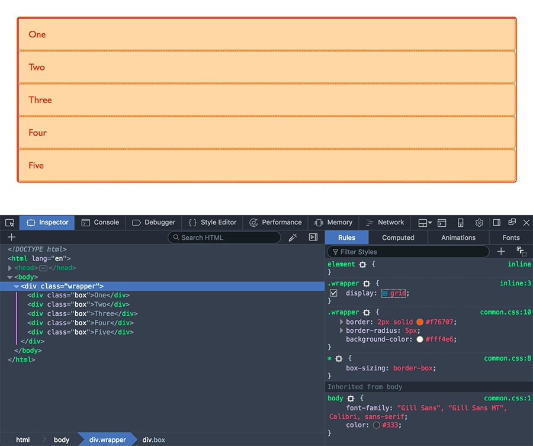
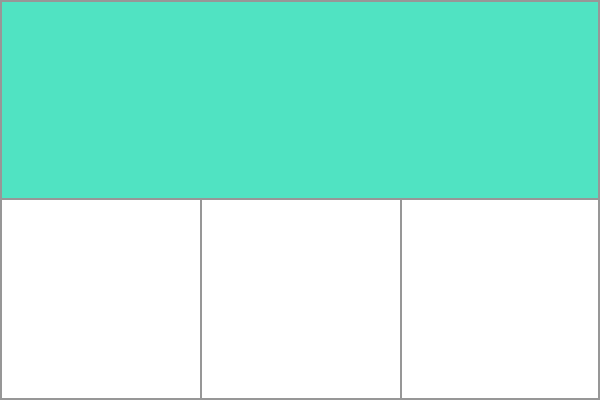
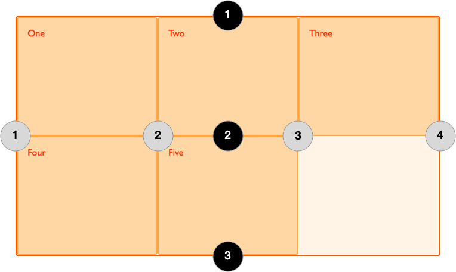

{{CSSRef}}

[CSS 网格布局](/zh-CN/docs/Web/CSS/CSS_Grid_Layout)引入了二维网格布局系统，可用于布局页面主要的区域布局或小型组件。本文介绍了 CSS 网格布局 与 CSS 网格布局规范 Level 1 中的新术语。这篇简介中所展示的每种特性，接下来将在本指南的其余部分中有更详细地介绍。

## 什么是网格？

网格是一组相交的水平线和垂直线，它定义了网格的列和行。我们可以将网格元素放置在与这些行和列相关的位置上。CSS 网格布局具有以下特点：

### 固定的位置和弹性的轨道的大小

你可以使用固定的轨道尺寸创建网格，比如使用像素单位。你也可以使用比如百分比或者专门为此目的创建的新单位 `fr`来创建有弹性尺寸的网格。

### 元素位置

你可以使用行号、行名或者标定一个网格区域来精确定位元素。网格同时还使用一种算法来控制未给出明确网格位置的元素。

### 创建额外的轨道来包含元素

可以使用网格布局定义一个显式网格，但是根据规范它会处理你加在网格外面的内容，当必要时它会自动增加行和列，它会尽可能多的容纳所有的列。

### 对齐控制

网格包含对齐特点，以便我们可以控制一旦放置到网格区域中的物体对齐，以及整个网格如何对齐。

### 控制重叠内容

多个元素可以放置在网格单元格中，或者区域可以部分地彼此重叠。然后可以 CSS 中的**z-index**属性来控制重叠区域显示的优先级。

Grid 是一个强大的规范，当与 CSS 的其他部分（如[flexbox](/zh-CN/docs/Web/CSS/CSS_flexible_box_layout)）结合使用时，可以帮助您创建以前不可能在 CSS 中构建的布局。这一切都是通过在网格容器上创建一个网格来开始的。

## 网格容器

我们通过在元素上声明 `display：grid` 或 `display：inline-grid` 来创建一个网格容器。一旦我们这样做，这个元素的所有直系子元素将成为网格元素。

在这个例子中，这有一个类名为 `wrapper` 的`div` 元素作为容器，它内部有五个子元素。

```html
<div class="wrapper">
   <div>One</div>
   <div>Two</div>
   <div>Three</div>
   <div>Four</div>
   <div>Five</div>
</div>
```

我将 `.wrapper` 作为一个网格容器。

```css
.wrapper {
  display: grid;
}
```

```css hidden
* {box-sizing: border-box;}

.wrapper {
  border: 2px solid #f76707;
  border-radius: 5px;
  background-color: #fff4e6;
}

.wrapper > div {
  border: 2px solid #ffa94d;
  border-radius: 5px;
  background-color: #ffd8a8;
  padding: 1em;
  color: #d9480f;
}

.nested {
  border: 2px solid #ffec99;
  border-radius: 5px;
  background-color: #fff9db;
  padding: 1em;
}
```

{{ EmbedLiveSample('网格容器', '200', '330') }}

所有直系子元素现在都是网格项了。在浏览器中，元素转为网格前看不出什么差异，因为网格给这些元素创建了一个单列网格。此刻，Firefox 开发人员版（Developer Edition）可能会助你一臂之力。网格检查器（[Grid Inspector](/zh-CN/docs/Tools/Page_Inspector/How_to/Examine_grid_layouts)）为其开发工具的一部分。如果你在 Firefox 中查看此示例并检查网格，则会在值 `grid` 旁边看到一个小图标。单击此图标后，此元素上的网格会覆盖在浏览器窗口中。



当你学习并且使用 CSS 网格布局时，这个工具能让你更好地了解到你的网格在视觉上发生了哪些变化。

如果我们想让这个例子更加“网格化”，我们需要使用列轨道。

## 网格轨道

我们通过 **grid-template-columns** 和 **grid-template-rows** 属性来定义网格中的行和列。这些属性定义了网格的轨道。一个网格轨道就是网格中任意两条线之间的空间。在下图中你可以看到一个高亮的轨道——网格的第一个行轨道。



我可以通过添加 `grid-template-columns` 属性将列轨道添加到之前的例子，然后定义列轨道的大小。

我现在创建了一个网格，包含了三个 200 像素宽的列轨道。子元素将在网格上每个网格单元中展开。

```html
<div class="wrapper">
   <div>One</div>
   <div>Two</div>
   <div>Three</div>
   <div>Four</div>
   <div>Five</div>
</div>
```

```css
.wrapper {
  display: grid;
  grid-template-columns: 200px 200px 200px;
}
```

```css hidden
* {box-sizing: border-box;}

.wrapper {
  border: 2px solid #f76707;
  border-radius: 5px;
  background-color: #fff4e6;
}

.wrapper > div {
  border: 2px solid #ffa94d;
  border-radius: 5px;
  background-color: #ffd8a8;
  padding: 1em;
  color: #d9480f;
}

.nested {
  border: 2px solid #ffec99;
  border-radius: 5px;
  background-color: #fff9db;
  padding: 1em;
}
```

{{EmbedLiveSample('网格轨道', '610', '200')}}

### `fr` 单位

轨道可以使用任何长度单位进行定义。网格还引入了一个另外的长度单位来帮助我们创建灵活的网格轨道。新的`fr`单位代表网格容器中可用空间的一等份。下一个网格定义将创建三个相等宽度的轨道，这些轨道会随着可用空间增长和收缩。

```html
<div class="wrapper">
   <div>One</div>
   <div>Two</div>
   <div>Three</div>
   <div>Four</div>
   <div>Five</div>
</div>
```

```css
.wrapper {
  display: grid;
  grid-template-columns: 1fr 1fr 1fr;
}
```

```css hidden
* {box-sizing: border-box;}

.wrapper {
  border: 2px solid #f76707;
  border-radius: 5px;
  background-color: #fff4e6;
}

.wrapper > div {
  border: 2px solid #ffa94d;
  border-radius: 5px;
  background-color: #ffd8a8;
  padding: 1em;
  color: #d9480f;
}

.nested {
  border: 2px solid #ffec99;
  border-radius: 5px;
  background-color: #fff9db;
  padding: 1em;
}
```

{{ EmbedLiveSample('fr 单位', '220', '180') }}

在下面的这个例子中，我们创建定义了一个`2fr`轨道和两个`1fr`轨道。可用空间被四等分。其中两份给了第一个轨道，剩下两个轨道各占一份。

```css
.wrapper {
  display: grid;
  grid-template-columns: 2fr 1fr 1fr;
}
```

在最后这个例子中，我们混合了绝对尺寸的轨道与分数单位轨道。第一个轨道是 500 像素，这个固定宽度被从可用空间中取走。剩下的空间被分为三份，按比例分配给了两个弹性尺寸轨道。

```css
.wrapper {
  display: grid;
  grid-template-columns: 500px 1fr 2fr;
}
```

### 在轨道清单中使用 `repeat()`

有着多轨道的大型网格可使用 `repeat()` 标记来重复部分或整个轨道列表。如下方的网格定义：

```css
.wrapper {
  display: grid;
  grid-template-columns: 1fr 1fr 1fr;
}
```

也可写成：

```css
.wrapper {
  display: grid;
  grid-template-columns: repeat(3, 1fr);
}
```

Repeat 语句可以用于重复轨道列表中的一部分。在下面的例子中我创建了一个网格：它起始轨道为 20 像素，接着重复了 6 个`1fr`的轨道，最后再添加了一个 20 像素的轨道。

```css
.wrapper {
  display: grid;
  grid-template-columns: 20px repeat(6, 1fr) 20px;
}
```

Repeat 语句可以传入一个轨道列表，因此你可以用它来创建一个多轨道模式的重复轨道列表。在下一个例子中，网格将有共计 10 个轨道，为 1 个`1fr`轨道后面跟着 1 个`2fr`轨道，该模式重复 5 次。

```css
.wrapper {
  display: grid;
  grid-template-columns: repeat(5, 1fr 2fr);
}
```

### 隐式和显式网格

当我们创建上文中网格例子的时候，我们用 `grid-template-columns` 属性定义了自己的列轨道，但是却让网格按所需的内容创建行，这些行会被创建在隐式网格中。显式网格包含了你在 `grid-template-columns` 和 `grid-template-rows` 属性中定义的行和列。如果你在网格定义之外又放了一些东西，或者因为内容的数量而需要的更多网格轨道的时候，网格将会在隐式网格中创建行和列。按照默认，这些轨道将自动定义尺寸，所以会根据它里面的内容改变尺寸。

你也可以在隐式网格中用 `grid-auto-rows` 和 `grid-auto-columns` 属性来定义一个设置大小尺寸的轨道。

在下面的例子中我们用 `grid-auto-rows` 属性来确保在隐式网格中创建的轨道是 200 像素高。

```html
<div class="wrapper">
   <div>One</div>
   <div>Two</div>
   <div>Three</div>
   <div>Four</div>
   <div>Five</div>
</div>
```

```css
.wrapper {
  display: grid;
  grid-template-columns: repeat(3, 1fr);
  grid-auto-rows: 200px;
}
```

```css hidden
* {box-sizing: border-box;}
.wrapper {
    border: 2px solid #f76707;
    border-radius: 5px;
    background-color: #fff4e6;
}
.wrapper > div {
    border: 2px solid #ffa94d;
    border-radius: 5px;
    background-color: #ffd8a8;
    padding: 1em;
    color: #d9480f;
}
.nested {
    border: 2px solid #ffec99;
    border-radius: 5px;
    background-color: #fff9db;
    padding: 1em;
}
```

{{ EmbedLiveSample('隐式和显式网格', '230', '420') }}

### 轨道大小和 `minmax()`

在设置一个显式的网格或者定义自动创建的行和列的大小的时候，我们也许想给网格一个最小的尺寸，确保他们能扩大到容纳他里面添加的内容。举个例子，我想让我的行的高度永远不会缩小到 100 像素以下，但是如果我的内容延伸到 300 像素高了我想让我的行高也延伸到这个高度。

网格用 minmax() 函数来解决这个问题。在下一个例子中我用 minmax() 作为 grid-auto-rows 的值。自动创建的行高将会是最小 100 像素，最大为 auto。用 auto 意味着行的尺寸将会根据内容的大小来自动变换：根据本行中最高的单元，把空间扩展到足够容纳该单元。

```css
.wrapper {
  display: grid;
  grid-template-columns: repeat(3, 1fr);
  grid-auto-rows: minmax(100px, auto);
}
```

```css hidden
* {box-sizing: border-box;}
.wrapper {
    border: 2px solid #f76707;
    border-radius: 5px;
    background-color: #fff4e6;
}
.wrapper > div {
    border: 2px solid #ffa94d;
    border-radius: 5px;
    background-color: #ffd8a8;
    padding: 1em;
    color: #d9480f;
}
.nested {
    border: 2px solid #ffec99;
    border-radius: 5px;
    background-color: #fff9db;
    padding: 1em;
}
```

```html
<div class="wrapper">
  <div>One</div>
  <div>Two
    <p>I have some more content in.</p>
    <p>This makes me taller than 100 pixels.</p>
  </div>
  <div>Three</div>
  <div>Four</div>
  <div>Five</div>
</div>
```

{{ EmbedLiveSample('轨道大小和 minmax()', '230', '490') }}

## 网格线

应该注意的是，当我们定义网格时，我们定义的是网格轨道，而不是网格线。Grid 会为我们创建编号的网格线来让我们来定位每一个网格元素。例如下面这个三列两行的网格中，就拥有四条纵向的网格线。



网格线的编号顺序取决于文章的书写模式。在从左至右书写的语言中，编号为 1 的网格线位于最左边。在从右至左书写的语言中，编号为 1 的网格线位于最右边。网格线也可以被命名，我们将在稍后的教程中看到如何完成这一操作。

### 跨轨道放置网格元素

我们会在以后的文章中完整的探讨如何根据 网格线 定位元素，接下来的例子展示了一个简单的方法。当放置元素时，我们使用 网格线 定位，而非 网格轨道。

接下来这个例子中，我使用了{{cssxref("grid-column-start")}}, {{cssxref("grid-column-end")}}, {{cssxref("grid-row-start")}} 和 {{cssxref("grid-row-end")}} 属性，把前两个元素放到了我们的三列网格中。从左至右，第一个元素从列线 1 开始，延伸至列线 4，也就是我们这个例子中最右边的列线。并从行线 1 延伸到行线 3，占据了两个行轨道。

第二个元素从列线 1 开始，延伸了一个轨道。因为这是默认行为，所以我不用指定结束线。并且它从行线 3 到行线 5，跨越了两个行轨道。剩下的元素会自动放到网格剩余的空间中。

```html
<div class="wrapper">
   <div class="box1">One</div>
   <div class="box2">Two</div>
   <div class="box3">Three</div>
   <div class="box4">Four</div>
   <div class="box5">Five</div>
</div>
```

```css
.wrapper {
    display: grid;
    grid-template-columns: repeat(3, 1fr);
    grid-auto-rows: 100px;
}
.box1 {
    grid-column-start: 1;
    grid-column-end: 4;
    grid-row-start: 1;
    grid-row-end: 3;
}
.box2 {
    grid-column-start: 1;
    grid-row-start: 3;
    grid-row-end: 5;
}
```

```css hidden
* {box-sizing: border-box;}
.wrapper {
    border: 2px solid #f76707;
    border-radius: 5px;
    background-color: #fff4e6;
}
.wrapper > div {
    border: 2px solid #ffa94d;
    border-radius: 5px;
    background-color: #ffd8a8;
    padding: 1em;
    color: #d9480f;
}
.nested {
    border: 2px solid #ffec99;
    border-radius: 5px;
    background-color: #fff9db;
    padding: 1em;
}
```

{{ EmbedLiveSample('跨轨道放置网格元素', '220', '410') }}

别忘了你可用 Firefox 开发者工具（Firefox Developer Tools）中的网格检查器（ [Grid Inspector](/zh-CN/docs/Tools/Page_Inspector/How_to/Examine_grid_layouts) ）查看这些元素是如何被摆放在网格中的。

## 网格单元

一个网格单元是在一个网格元素中最小的单位，从概念上来讲其实它和表格的一个单元格很像。现在再看回我们前面的一个例子，一旦一个网格元素被定义在一个父级元素当中，那么他的子级元素将会排列在每个事先定义好的网格单元中。在下面的图中，我会将第一个网格单元作高亮处理。


## 网格区域

网格元素可以向行或着列的方向扩展一个或多个单元，并且会创建一个网格区域。网格区域的形状应该是一个矩形 - 也就是说你不可能创建出一个类似于“L”形的网格区域。下图高亮的网格区域扩展了 2 列以及 2 行。


## 网格间距

在两个网格单元之间的 _网格横向间距_ 或 _网格纵向间距_ 可使用 {{cssxref("grid-column-gap")}} 和 {{cssxref("grid-row-gap")}} 属性来创建，或者直接使用两个合并的缩写形式 {{cssxref("grid-gap")}}。在下面的例子中，我会创建一个横向间距为 10px、纵向间距为 1em 的网格元素。

```css
.wrapper {
   display: grid;
   grid-template-columns: repeat(3, 1fr);
   grid-column-gap: 10px;
   grid-row-gap: 1em;
}
```

```html
<div class="wrapper">
   <div>One</div>
   <div>Two</div>
   <div>Three</div>
   <div>Four</div>
   <div>Five</div>
</div>
```

```css hidden
* {box-sizing: border-box;}
.wrapper {
    border: 2px solid #f76707;
    border-radius: 5px;
    background-color: #fff4e6;
}
.wrapper > div {
    border: 2px solid #ffa94d;
    border-radius: 5px;
    background-color: #ffd8a8;
    padding: 1em;
    color: #d9480f;
}
.nested {
    border: 2px solid #ffec99;
    border-radius: 5px;
    background-color: #fff9db;
    padding: 1em;
}
```

{{ EmbedLiveSample('网格间距') }}

间距使用的空间会在 使用弹性长度 fr 的轨道的空间计算前就被留出来，间距的尺寸定义行为和普通轨道一致，但不同的是你不能向其中插入任何内容。从以基线定位的角度来说，间距就像一条很宽的基线。

## 嵌套网格

一个网格元素可以也成为一个网格容器。在接下来的例子中我事先有了一个 3 列的网格元素，并有两个跨轨道的网格。在这个例子中，第一个网格元素含有几个子级元素。当这些元素不是网格容器的直接子级元素时，它们不会参与到网格布局中，并显示为正常的文档流。

```html
<div class="wrapper">
    <div class="box box1">
        <div class="nested">a</div>
        <div class="nested">b</div>
        <div class="nested">c</div>
    </div>
    <div class="box box2">Two</div>
    <div class="box box3">Three</div>
    <div class="box box4">Four</div>
    <div class="box box5">Five</div>
</div>
```


如果把 `box1` 设置成 `display: grid` 你可以给它定义轨道然后它也会变成一个网格元素，它的子级元素也会排列在这个新网格元素中。

```css
.box1 {
   grid-column-start: 1;
   grid-column-end: 4;
   grid-row-start: 1;
   grid-row-end: 3;
   display: grid;
   grid-template-columns: repeat(3, 1fr);
}
```

```css hidden
* {box-sizing: border-box;}
.wrapper {
    border: 2px solid #f76707;
    border-radius: 5px;
    background-color: #fff4e6;
}
.box {
    border: 2px solid #ffa94d;
    border-radius: 5px;
    background-color: #ffd8a8;
    padding: 1em;
    color: #d9480f;
}
.nested {
    border: 2px solid #ffec99;
    border-radius: 5px;
    background-color: #fff9db;
    padding: 1em;
}
```

{{ EmbedLiveSample('嵌套网格', '600', '410') }}

在这个例子中，嵌套网格和他的父级并没有关系。就像你在例子中所看见的一样，它并没有从它的父级继承 {{cssxref("grid-gap")}} 属性，并且嵌套网格里面的网格线没有与父级的网格线对齐。

### 子网格

在 Level 1 网格规范中有一个叫做 _子网格_ 的特性。它能让我们在父级网格元素的轨道定义中就能定义一个嵌套网格。

> **备注：** 子网格还并未在任何浏览器中实现，并且随时有可能从规范中移除。

在当前的规范中，我们可以将上面的嵌套网格的例子进行修改，使用 `display: subgrid` 而不是 `display: grid`，然后移除轨道定义。嵌套网格将会使用父级网格元素中的轨道定义来排列它其中的网格元素。

需要指出的是嵌套网格有同时有两个单位 — 行和列。隐式子网格的概念是没有的，这意味着你需要确保父级网格元素为了容纳所有的子网格元素需要包含足够的行与列的轨道。

```css
.box1 {
   grid-column-start: 1;
   grid-column-end: 4;
   grid-row-start: 1;
   grid-row-end: 3;
   display: subgrid;
}
```

## 使用 `z-index` 控制层级

多个网格项目可以占用同一个网格单位。如果我们回到之前根据网格线编号放置网格项目的话，我们可以更改此项来使两个网格项目重叠。

```html
<div class="wrapper">
   <div class="box box1">One</div>
   <div class="box box2">Two</div>
   <div class="box box3">Three</div>
   <div class="box box4">Four</div>
   <div class="box box5">Five</div>
</div>
```

```css
.wrapper {
   display: grid;
   grid-template-columns: repeat(3, 1fr);
   grid-auto-rows: 100px;
}
.box1 {
   grid-column-start: 1;
   grid-column-end: 4;
   grid-row-start: 1;
   grid-row-end: 3;
}
.box2 {
   grid-column-start: 1;
   grid-row-start: 2;
   grid-row-end: 4;
}
```

```css hidden
* {box-sizing: border-box;}
.wrapper {
    border: 2px solid #f76707;
    border-radius: 5px;
    background-color: #fff4e6;
}
.box {
    border: 2px solid #ffa94d;
    border-radius: 5px;
    background-color: #ffd8a8;
    padding: 1em;
    color: #d9480f;
}
.nested {
    border: 2px solid #ffec99;
    border-radius: 5px;
    background-color: #fff9db;
    padding: 1em;
}
```

{{ EmbedLiveSample('使用 z-index 控制层级', '210', '410') }}

网格项目 `box2` 现在覆盖于 `box1` 之上，其覆盖顺序遵循文档流的原始顺序（后来居上）。

### 控制顺序

我们可以在网格项目发生重叠时使用 `z-index` 属性控制重叠的顺序——就像放置网格项目一样。如果我们给 `box2` 设定一个低于 `box1` 的 `z-index` 值的话，`box2` 将会显示在 box1 的下方。

```css
.wrapper {
   display: grid;
   grid-template-columns: repeat(3, 1fr);
   grid-auto-rows: 100px;
}
.box1 {
   grid-column-start: 1;
   grid-column-end: 4;
   grid-row-start: 1;
   grid-row-end: 3;
   z-index: 2;
}
.box2 {
   grid-column-start: 1;
   grid-row-start: 2;
   grid-row-end: 4;
   z-index: 1;
}
```

```html hidden
<div class="wrapper">
    <div class="box box1">One</div>
    <div class="box box2">Two</div>
    <div class="box box3">Three</div>
    <div class="box box4">Four</div>
    <div class="box box5">Five</div>
</div>
```

```css hidden
* {box-sizing: border-box;}
.wrapper {
    border: 2px solid #f76707;
    border-radius: 5px;
    background-color: #fff4e6;
}
.box {
    border: 2px solid #ffa94d;
    border-radius: 5px;
    background-color: #ffd8a8;
    padding: 1em;
    color: #d9480f;
}
.nested {
    border: 2px solid #ffec99;
    border-radius: 5px;
    background-color: #fff9db;
    padding: 1em;
}
```

{{ EmbedLiveSample('控制顺序', '210', '410') }}

## 下一步

在本文章中我们快速对网格布局的概念有了个基本的了解。利用示例代码进行练习，然后[接下来我们正式开始挖掘关于网格布局的各种细节](/zh-CN/docs/Web/CSS/CSS_Grid_Layout/Relationship_of_Grid_Layout)。
