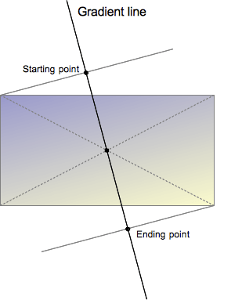

{{CSSRef}}

CSS **`linear-gradient()`** 函数用于创建一个表示两种或多种颜色线性渐变的图片。其结果属于{{cssxref("&lt;gradient&gt;")}}数据类型，是一种特别的{{cssxref("&lt;image&gt;")}}数据类型。

```
/* 渐变轴为45度，从蓝色渐变到红色 */
linear-gradient(45deg, blue, red);

/* 从右下到左上、从蓝色渐变到红色 */
linear-gradient(to left top, blue, red);

/* 从下到上，从蓝色开始渐变、到高度 40% 位置是绿色渐变开始、最后以红色结束 */
linear-gradient(0deg, blue, green 40%, red);
```

{{EmbedInteractiveExample("pages/css/function-linear-gradient.html")}}

如同其他 gradient 函数一般，**`linear-gradient()`** 函数[没有内在尺寸](/zh-CN/docs/Web/CSS/image#no_intrinsic)；即，它不具备固有的或首选的尺寸，也不具备首选的比率。该函数的具体尺寸将与其适用的元素尺寸匹配。

> **备注：** 利用{{cssxref("repeating-linear-gradient")}}函数可以实现线形重复渐变效果。

> **备注：** 由于`<gradient>`数据类型系`<image>`的子数据类型，`<gradient>`只能被用于`<image>`可以使用的地方。因此，`linear-gradient()` 并不适用于{{Cssxref("background-color")}}以及类似的使用 {{cssxref("&lt;color&gt;")}}数据类型的属性中。

## 线形渐变的构成

线性渐变由一个轴 (梯度线) 定义，其上的每个点具有两种或多种的颜色，且轴上的每个点都具有独立的颜色。为了构建出平滑的渐变，`linear-gradient()` 函数构建一系列垂直于渐变线的着色线，每一条着色线的颜色则取决于与之垂直相交的渐变线上的色点

渐变线由包含渐变图形的容器的中心点和一个角度来定义的。渐变线上的颜色值是由不同的点来定义，包括起始点，终点，以及两者之间的可选的中间点（中间点可以有多个）。

起始点是渐变线上代表起始颜色值的点。起始点由渐变线和过容器顶点的垂直线之间的交叉点来定义。（垂直线跟渐变线在同一象限内）

同样的，终点是渐变线上代表最终颜色值的点。终点也是由渐变线和从最近的顶点发出的垂直线之间的交叉点定义的，然而从起始点的对称点来定义终点是更容易理解的一种方式，因为终点是起点关于容器的中心点的反射点。

关于起点和终点的稍微有些复杂的定义导致了一个有趣的性质，有时候被叫做不可思议的顶点效应：起点附近的点具有跟起点相同的颜色值，终点附近的点具有跟终点相同的颜色值。

不仅仅只有起点和终点的颜色值可以指定。通过提供额外的颜色中间点，Web 开发者可以构建在起始颜色值和终点颜色值之间的自定义更强的过渡效果，另外还可以提供多种颜色值的渐变线。

当颜色中间点的位置被隐式定义，它被放置在位于它之前的点和位于它之后的点之间的中间位置处。利用{{cssxref("&lt;length&gt;")}}或者{{cssxref("&lt;percentage&gt;")}}数据类型可以显示定义一个位置。

```
linear-gradient(red, orange, yellow, green, blue);
linear-gradient(red 0%, orange 25%, yellow 50%, green 75%, blue 100%);
```

默认情况下，从一个颜色的终止点平滑的过渡到另一个颜色的终止点，颜色之间的中点是两个颜色转换的中点。你可以将中点移动到这两个颜色之间的任意位置，方法是在两个颜色之间添加未标记的 %，以指示颜色的中转位置。下面的示例是从起始点到 10% 的位置标记红色，从 90% 到结束标记蓝色。在 10% 到 90% 之间，颜色从红色过渡到蓝色，然而过渡的中点是在 30% 的标记上，而不是在没有 30% 中转点的情况下会默认为 50%。

```
linear-gradient(red 10%, 30%, blue 90%);
```

如果两个或多个颜色终止在同一位置，则在该位置声明的第一个颜色和最后一个颜色之间的过渡将是一条生硬线。

颜色终止列表中颜色的终止点应该是依次递增的。如果后面的颜色终止点小于前面颜色的终止点则后面的会被覆盖，从而创建一个硬转换。下面的变化是从红色到黄色在 40% 的位置，然后过渡从黄色到蓝色终止于 65% 的位置处。

```
linear-gradient(red 40%, yellow 30%, blue 65%);
```

允许颜色多个颜色终止位置。通过在 CSS 声明中包含两个位置，可以将一个颜色声明为两个相邻的颜色终止。以下三个梯度是相等的：

```
linear-gradient(red 0%, orange 10%, orange 30%, yellow 50%, yellow 70%, green 90%, green 100%);
linear-gradient(red, orange 10% 30%, yellow 50% 70%, green 90%);
linear-gradient(red 0%, orange 10% 30%, yellow 50% 70%, green 90% 100%);
```

默认情况下，如果不带 0% 终止的颜色，则在该点声明的第一个颜色。类似地，最后一种颜色将持续到 100% 标记，或者如果在最后一个没有声明长度，则在 100% 标记处。

## 语法

### 值

- `<side-or-corner>`
  - : 描述渐变线的起始点位置。它包含 to 和两个关键词：第一个指出水平位置 left or right，第二个指出垂直位置 top or bottom。关键词的先后顺序无影响，且都是可选的。
    to top, to bottom, to left 和 to right 这些值会被转换成角度 0 度、180 度、270 度和 90 度。其余值会被转换为一个以向顶部中央方向为起点顺时针旋转的角度。渐变线的结束点与其起点中心对称。
- `<angle>`
  - : 用角度值指定渐变的方向（或角度）。角度顺时针增加。
- `<linear-color-stop>`
  - : 由一个{{cssxref("&lt;color&gt;")}}值组成，并且跟随着一个可选的终点位置（可以是一个百分比值或者是沿着渐变轴的{{cssxref("&lt;length&gt;")}}）。CSS 渐变的颜色渲染采取了与 SVG 相同的规则。
- `<color-hint>`
  - : 颜色中转点是一个插值提示，它定义了在相邻颜色之间渐变如何进行。长度定义了在两种颜色之间的哪个点停止渐变颜色应该达到颜色过渡的中点。如果省略，颜色转换的中点是两个颜色停止之间的中点。

> **备注：** 渲染颜色中间点的规则 [color stops in CSS gradients](#Gradient_with_multiple_color_stops)与一致 [SVG gradients](/zh-CN/docs/Web/SVG/Tutorial/Gradients)。

### 正式语法

```
linear-gradient(
  [ <angle> | to <side-or-corner> ,]? <color-stop-list> )
  \---------------------------------/ \----------------------------/
    Definition of the gradient line        List of color stops

where <side-or-corner> = [ left | right ] || [ top | bottom ]
  and <color-stop-list> = [ <linear-color-stop> [, <color-hint>? ]? ]#, <linear-color-stop>
  and <linear-color-stop> = <color> [ <color-stop-length> ]?
  and <color-stop-length> = [ <percentage> | <length> ]{1,2}
  and <color-hint> = [ <percentage> | <length> ]
```

### 语法历史

`linear-gradient` 的语法由 2008 年实施的 [first Apple proposal](http://www.webkit.org/blog/175/introducing-css-gradients/) 发展而来。

```
-webkit-gradient(<type>, <point> [, <radius>]?, <point> [, <radius>]? [, <stop>]*)
```

在最初语法中，使用同样的语法实现线性渐变和径向渐变。但这两种渐变所需要的参数有所不同，导致了需要增加第一个参数来区分两种渐变。如果再增加渐变类型，这样的处理方式会变得更加复杂。比如锥形渐变，需要用到函数和不规范的 CSS 值。W3C 并未收到相关草案。

一个替代语法在 2009 年由 Mozilla 提出并实现。这个语法需要两个 CSS 函数，一个用来做线性渐变，另一个用于径向渐变。然而，这个语法并没有被发布产品实现。有人提出了第三种语法，它将线性渐变的语法简化为：

```
-moz-linear-gradient([ [ [top | bottom] || [left | right] ],]? <color-stop>[, <color-stop>]+);
```

新的语法不需要 `to()`、`from()` 和 `color-stop()` 函数，所以这些函数被丢弃。而 `top` / `bottom` 与 `left` / `right` 的顺序也被标记为不重要，所以 `Mozilla` 移除了必需首先定义 `top` / `bottom` 的限制。

新的语法仍然有一个缺点：它只允许水平和垂直渐变。在多次变更解决了方向限制的问题之后，它被增加到 [CSS Images Values and Content Replacement Level 3 draft in 2011-02-17](http://www.w3.org/TR/2011/WD-css3-images-20110217/#ltlinear-gradient)。

- 原生支持{{ cssxref("&lt;angle&gt;") }}允许任何方向的渐变
- 定义 magic corner 算法，允许使用简便的方式定义端点的颜色，从而简化了开发者的工作

在预乘颜色空间里定义过渡色，从而可以防止在使用不同透明度颜色的情况下出现违和的灰色。在未舍弃原生语法的情况下，带前缀的版本被 Webkit 和 Trident（IE）实现。

```
linear-gradient( [ [ {{cssxref("&lt;angle&gt;")}} | [top | bottom] || [left | right] ],]? <color-stop>[, <color-stop>]+);
```

{{ cssxref("&lt;angle&gt;") }}属性的添加导致了一些混乱，它应当指向终点方向，但是这些关键字却通常指起始方向。在 [related W3C CSSWG thread](http://lists.w3.org/Archives/Public/www-style/2011Jun/0377.html)可以查看一些讨论。在一项新的语法中，这个问题被修正。它仍然使用方向关键字，但是在关键字之前增加关键字 `to` 。这项语法被添加到 [CSS Images Values and Content Replacement Level 3 draft in 2011-09-08](http://www.w3.org/TR/2011/WD-css3-images-20110908/#ltlinear-gradient)。

```
linear-gradient([ [ [ {{cssxref("&lt;angle&gt;")}} | to [top | bottom] || [left | right] ],]? <color-stop>[, <color-stop>]+);
```

以上应当是最终语法。

在带前缀的变体和不带前缀的提案之间仍然存在一项语义的分歧。最终 Apple 的提案显示，带前缀的语法都使用极坐标定义 {{ cssxref("&lt;angle&gt;") }} 参数，导致了`0deg` 指向东方。为了与 CSS 的其他部分保持一致，标准将 0deg 指向北方。为了防止使用前缀版本属性的站点不至于崩溃，它们保持原始的角度定义（0deg 指向东方）。在使用不带前缀版本的时候将会切换到正确的规格。在这种不兼容的情况下，Gecko 给所有语法都加上前缀，不带前缀且没有 to 关键词的语法会被丢弃。

## 示例

### 45 度渐变

可以为渐变轴某个位置指定某个颜色，这些位置可被称为“颜色中间点（color-stops）”。颜色会从一个颜色中间点平滑过渡到下一个。在渐变范围内，每个颜色都表现为一条垂直于渐变轴的直线。在下图中，渐变轴从左上角出发并且呈 45 度。渐变轴上定义了红色和蓝色两个颜色中间点。

```html
<div style="width: 200px; height: 200px;"></div>
```

```css
div {
  background: linear-gradient(45deg, red, blue);
}
```

{{EmbedLiveSample("45 度渐变",120,120)}}

### 从 60% 的梯度线开始的渐变

有时候我们不希望一开始就出现渐变，可以从中间某个地方开始最好。为了实现这个效果，可以在你希望渐变梯度开始的地方，加上一个同样色值的颜色中间点。

```html
<div style="width: 200px; height: 200px;"></div>
```

```css
div {
  background: linear-gradient(135deg, red, red 60%, blue);
}
```

#### 结果

{{EmbedLiveSample("从 60% 的梯度线开始的渐变")}}

### 具有多个颜色停止的渐变

如果第一个颜色中间点没有 `<length>` 或 `<percentage>`属性，那么它默认为 0%。如果最后一个颜色中间点没有 `<length>` 或者 `<percentage>`属性，则默认为 100%。如果一个既不是起始也不是终止的颜色中间点，没有被明确声明位置，那么这个颜色就会从前后两个颜色的中间位置开始。

颜色中间点必须按照顺序声明。给起始和终止的颜色中间值赋值后，如果一个颜色中间点的位置比任何一个颜色中间点的位置都要小，那它的位置会按照离它最近的一个颜色中间点来计算。

```html
<div>A rainbow made from a gradient</div>
```

```css
div {
  background: linear-gradient(
    to right,
    red,
    orange,
    yellow,
    green,
    blue,
    indigo,
    violet
  );
}
```

#### 结果

{{EmbedLiveSample("具有多个颜色停止的渐变")}}

### 包含多个颜色中间点的渐变

如果第一个颜色中间点没有定义长度或百分比，它将包含缺省值 0。如果最后一个颜色中间点没有定义长度或百分比，它将包含缺省值 100%。如果中间的颜色中间点没定义长度或百分比，那么它将被设定为前后两站的平均值。

颜色中间点必须被按顺序定义。第一个和最后一个被分配为默认值之后，如果一个颜色中间点的位置比前一个小，那么将会被设定成与前一个相同的值。

使用渐变制作彩虹

```css
background: linear-gradient(
  to right,
  red,
  orange,
  yellow,
  green,
  blue,
  indigo,
  violet
);
```

### 线性重复渐变

线性渐变目前不能实现重复渐变。默认情况下，渐变会撑满它被定义的元素。这项功能可以参考{{ Cssxref("repeating-linear-gradient") }}。

### 使用透明度

```html
<div>线性与透明度</div>
```

```css
div {
  background: linear-gradient(to bottom right, red, rgba(0, 0, 0, 0));
}
```

#### 结果

{{EmbedLiveSample("使用透明度")}}

如果所有点和长度都使用固定单位（而不是相对于 background-size 的值指定的百分比或关键字），则渐变背景不受 {{Cssxref("background-size")}} 的影响。

### 跨浏览器实施渐变

这里包含了所有前缀的渐变设置。

```css
.grad {
  background-color: #f07575; /* 不支持渐变的浏览器回退方案 */
  background-image: -webkit-linear-gradient(
    top,
    hsl(0, 80%, 70%),
    #bada55
  ); /* 支持 Chrome 25 and Safari 6, iOS 6.1, Android 4.3 */
  background-image: -moz-linear-gradient(
    top,
    hsl(0, 80%, 70%),
    #bada55
  ); /* 支持 Firefox (3.6 to 15) */
  background-image: -o-linear-gradient(
    top,
    hsl(0, 80%, 70%),
    #bada55
  ); /* 支持旧 Opera (11.1 to 12.0) */
  background-image: linear-gradient(
    to bottom,
    hsl(0, 80%, 70%),
    #bada55
  ); /* 标准语法; 需要最新版本 */
}
```

\-moz-前缀的规则用于兼容 Fx 3.6 to Fx 15 的火狐浏览器。 -webkit-前缀的规则用于兼容在 Android 4.3 以前版本、iOS 6.1 以前版本、Safari 6。当使用带前缀的规则时，不要加“to”关键字。

> **备注：** 如果将\<body>标签的 background-image 属性设置为线性渐变`linear-gradient`，除非你还设置文档根标签（例如\<html>标签）的 [min-height](/zh-CN/docs/Web/CSS/min-height)属性，否则渐变不会填充浏览器屏幕到 100％。

## 规范

{{Specifications}}

## 浏览器兼容性

{{Compat}}

## 参见

- [Using CSS gradients](/zh-CN/docs/Web/CSS/CSS_images/Using_CSS_gradients), {{cssxref("radial-gradient", "radial-gradient()")}}, {{cssxref("repeating-linear-gradient", "repeating-linear-gradient()")}}, {{cssxref("repeating-radial-gradient", "repeating-radial-gradient()")}};
- Some properties where it can be used: {{cssxref("background-image")}}, {{cssxref("background")}};
- [CSS Gradients Patterns Gallery, by Lea Verou](http://lea.verou.me/css3patterns/)
- [CSS3 Gradients Library, by Estelle Weyl](http://standardista.com/cssgradients).
