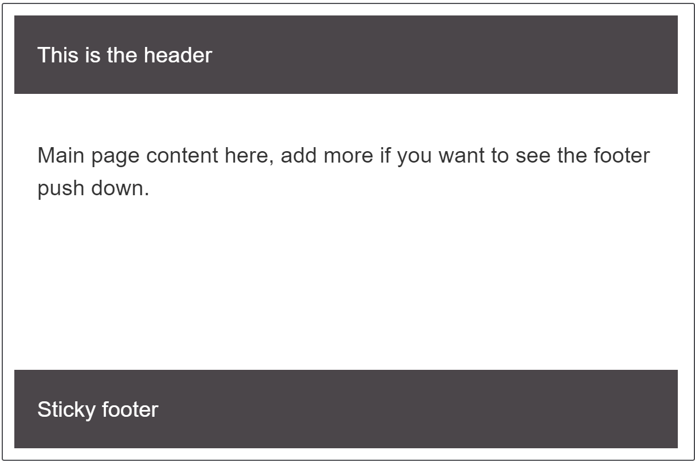

---
title：粘性页脚
slug：Web/CSS/Layout_cookbook/Sticky_footers
---

{{CSSRef}}

粘性页脚模式是指当页面内容不足以填满视口高度时，页脚会“粘附”在视口底部的一种模式。在本教程中，我们将介绍创建粘性页脚的几种技术。

## 要求

粘性页脚模式需要满足以下要求：

- 当内容不足以填满视口时，页脚粘附在视口底部。
- 如果页面内容超过视口底部，页脚会正常地位于内容下方。

## 教程

粘性页脚的两种方法之一是使用 CSS Grid Layout。`.wrapper` 的最小高度为 `100%`，这意味着它与所在的容器一样高。然后我们创建一个单列网格布局，包含三行，每个布局部分占一行。

网格自动放置会按照源顺序放置我们的项目，因此页眉进入第一个自动调整大小的轨道，主要内容进入 `1fr` 轨道，页脚进入最后一个自动调整大小的轨道。`1fr` 轨道将占据所有可用空间，因此会增长以填补空白。

## 替代方法

如果你需要兼容不支持 Grid Layout 的浏览器，你还可以使用 Flexbox 来创建粘性页脚。

Flexbox 示例与前一个示例相似，但我们在 `.wrapper` 上使用 `display:flex` 而不是 `display:grid`；我们还将 `flex-direction` 设置为 `column`。接着，我们将主要内容设置为 `flex-grow: 1`，将其他两个元素设置为 `flex-shrink: 0` —— 这可以防止当内容填充主区域时，它们缩小。

## 浏览器兼容性

{{Compat}}

## MDN 上的资源

- [Grid Layout 的基本概念](/zh-CN/docs/Web/CSS/CSS_Grid_Layout/Basic_Concepts_of_Grid_Layout)
