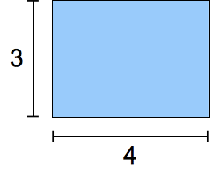
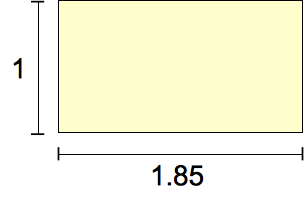
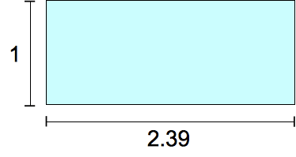

{{CSSRef}}

**`<ratio>`** [CSS](/zh-CN/docs/Web/CSS) [数据类型](/zh-CN/docs/Web/CSS/CSS_Types)用于在[媒体查询](/zh-CN/docs/Web/CSS/CSS_media_queries)中描述[纵横比](/zh-CN/docs/Web/CSS/@media/aspect-ratio)，表示两个无单位值之间的比例关系。

## 语法

在媒体查询第 3 版中，`<ratio>` 数据类型由一个严格的正整数 {{cssxref("&lt;integer&gt;")}} 后跟一个斜杠（“/”，Unicode `U+002F SOLIDUS`）以及第二个严格的正整数
{{cssxref("&lt;integer&gt;")}} 组成。斜线前后的空格是可选的。第一个数字代表宽度，而第二个数字代表高度。

在媒体查询第 4 版中，`<ratio>` 数据类型已更新，现在由一个严格的正整数 {{cssxref("&lt;number&gt;")}} 开头，后跟一个斜杠（“/”，Unicode `U+002F SOLIDUS`
），以及第二个严格的正整数 {{cssxref("&lt;number&gt;")}}。此外，也是允许使用单一的 {{cssxref("&lt;number&gt;")}} 值。

## 形式语法

{{csssyntax}}

## 示例

### 在媒体查询中使用

```css
@media screen and (min-aspect-ratio: 16/9) {
  /* … */
}
```

### 常见的纵横比

|                                                               | Ratio               | 说明                               |
| ------------------------------------------------------------- | ------------------- | ---------------------------------- |
|        | `4/3`               | 二十世纪的传统电视格式。           |
|      | `16/9`              | 现代“宽屏”电视格式。               |
|  | `185/100` = `91/50` | 自 1960 年代以来最普遍的电影格式。 |
|  | `239/100`           | "宽屏"，失真电影格式。             |

## 规范

{{Specifications}}

## 浏览器兼容性

{{Compat}}

## 参见

- [`aspect-ratio`](/zh-CN/docs/Web/CSS/@media/aspect-ratio) 媒体特性
