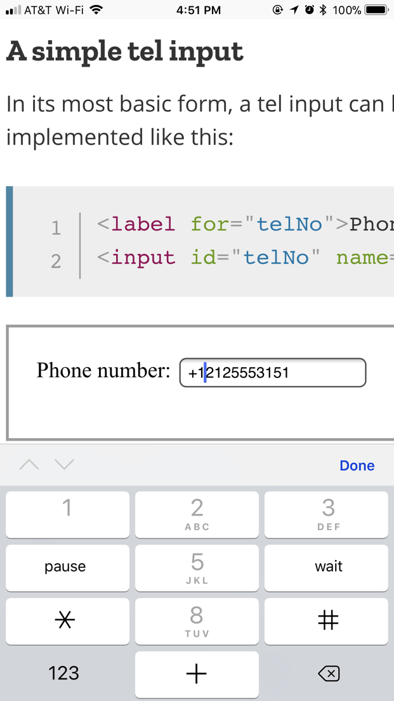

{{HTMLRef("Input_types")}}

**`"tel"`** 类型的 {{HTMLElement("input")}} 元素用于让用户输入和编辑电话号码。不同于[`<input type="email">`](/zh-CN/docs/Web/HTML/Element/input/email) 和 [`<input type="url">`](/zh-CN/docs/Web/HTML/Element/input/url) , 在提交表单之前，输入值不会被自动验证为特定格式，因为世界各地的电话号码格式差别很大。

{{EmbedInteractiveExample("pages/tabbed/input-tel.html", "tabbed-standard")}}

尽管 `tel` 类型的输入在功能上和 `text` 输入一致，但它们确实有用；其中最明显的就是移动浏览器（特别是在手机上），可能会选择提供为输入电话号码而优化的自定义键盘。使用电话号码的特定输入类型也使添加自定义验证和处理电话号码更方便。

> **备注：** 不支持 `"tel"` 类型的浏览器会回退为标准 {{HTMLElement("input/text", "text")}} 类型输入。

```html
<input id="telNo" type="tel">
```

<table class="properties">
 <tbody>
  <tr>
   <td><strong><a href="#值">值</a></strong></td>
   <td>代表电话号码的字符串，或为空</td>
  </tr>
  <tr>
   <td><strong>事件</strong></td>
   <td> 
   {{domxref("HTMLElement/change_event", "change")}} 和 {{domxref("HTMLElement/input_event", "input")}}
   </td>
  </tr>
  <tr>
   <td><strong>支持的通用属性</strong></td>
      <td>
        {{htmlattrxref("autocomplete", "input")}}、{{htmlattrxref("list", "input")}}、{{htmlattrxref("maxlength", "input")}}、{{htmlattrxref("minlength", "input")}}、{{htmlattrxref("pattern", "input")}}、{{htmlattrxref("placeholder", "input")}}、{{htmlattrxref("readonly", "input")}} 和 {{htmlattrxref("size", "input")}}
      </td>
  </tr>
  <tr>
   <td><strong>IDL 属性</strong></td>
   <td><code>list</code>、<code>selectionStart</code>、<code>selectionEnd</code>、<code>selectionDirection</code> 和 <code>value</code></td>
  </tr>
   <tr>
      <td><strong>DOM 接口</strong></td>
      <td><p>{{domxref("HTMLInputElement")}}</p></td>
    </tr>
  <tr>
   <td><strong>方法</strong></td>
   <td>{{domxref("HTMLInputElement.select", "select()")}}、{{domxref("HTMLInputElement.setRangeText", "setRangeText()")}} 和 {{domxref("HTMLInputElement.setSelectionRange", "setSelectionRange()")}}</td>
  </tr>
 </tbody>
</table>

## 值

{{HTMLElement("input")}} 元素的 {{htmlattrxref("value", "input")}} 属性包含表示一个电话号码的字符串或者一个空字符串（`""`）。

## 额外属性

除了对 {{HTMLElement("input")}} 元素生效的通用属性外，电话号码输入框还支持以下属性。

### list

list 属性的值是位于同一文档中的 {{HTMLElement("datalist")}} 元素的 {{domxref("Element.id", "id")}}。{{HTMLElement("datalist")}} 提供了一个预定义的值列表，向用户建议向这个输入框输入的值。列表中任何与 {{htmlattrxref("type", "input")}} 不兼容的值都不包括在建议选项中。所提供的值是建议，并不是必需的：用户可以从这个预定义的列表中选择，或者提供不同的值。

### maxlength

用户可以在电话号码字段中输入的最大字符数（作为 UTF-16 编码单位）。这必须是一个不低于 0 的整数值。如果没有指定 `maxlength`，或者指定了一个无效的值，则电话号码字段没有最大长度。这个值也必须大于或等于 `minlength` 的值。

如果输入字段的文本长度大于 `maxlength` UTF-16 编码单位长度，则输入将无法通过[约束验证](/zh-CN/docs/Web/Guide/HTML/Constraint_validation)。

### minlength

用户可以在电话号码字段中输入的最小字符数（作为 UTF-16 编码单位）。这必须是一个小于或等于 `maxlength` 所指定的值得非负整数。如果没有指定 `minlength`，或者指定了一个无效的值，电话号码的输入就没有最小长度。

如果输入字段的文本长度小于 `maxlength` UTF-16 编码单位长度，则输入将无法通过[约束验证](/zh-CN/docs/Web/Guide/HTML/Constraint_validation)。

### pattern

如果指定了 `pattern` 属性，则该 input 的 {{htmlattrxref("value")}} 将必须要满足其所指定的正则表达式，以通过[约束验证](/zh-CN/docs/Web/Guide/HTML/Constraint_validation)。它必须是一个合法的 {{jsxref("RegExp")}} 类型 JavaScript 正则表达式，其具体使用方法记载到了我们的[正则表达式指南](/zh-CN/docs/Web/JavaScript/Guide/Regular_Expressions)中。在编译正则表达式时，使用了 `'u'` 标志，故所指定模式将视为 Unicode 码点，而非 ASCII。在模式文本中，不可以指定正斜杠符号。

具体介绍和示例请参阅[模式验证](#模式验证)部分。

### placeholder

`placeholoder` 属性是一个字符串，它向用户提供一个简短的提示，说明该字段预计会有什么样的信息。它应该是一个显示预期数据类型的单词或短语，而不是一个解释性的信息。该文本*不得*包括回车或换行。

如果控件的内容具有方向（{{Glossary("LTR")}} 或 {{Glossary("RTL")}}），但需要以相反的方向性呈现占位符，可以使用 Unicode 双向算法格式化字符来覆盖占位符内的方向性；更多信息请参见[如何使用 Unicode 控件处理 bidi 文本](https://www.w3.org/International/questions/qa-bidi-unicode-controls)。

> **备注：** 如果可以的话，避免使用 `placeholder` 属性。它在语义上不如其他解释表单的方式有用，而且会对你的内容造成意想不到的技术问题。参见{{SectionOnPage("/zh-CN/docs/Web/HTML/Element/input", "标签和占位符")}}获取更多信息。

### readonly

一个布尔属性，如果存在，意味着这个字段不能被用户编辑。但是，它的 `value` 仍然可以由 JavaScript 代码通过设置 {{domxref("HTMLInputElement")}} 的 `value` 属性来改变。

> **备注：** 由于只读字段不可以拥有值，`required` 对指定了 `readonly` 属性的输入字段不起作用。

### size

`size` 属性是一个数值，表示输入字段应该有多少个字符宽。该值必须是一个大于 0 的数字，默认值是 20。由于字符的宽度各不相同，该值可能并不精确，而且不应该依赖于此；结果输入可能比指定的字符数更窄或更宽，这取决于使用中的字符和字体（{{cssxref("font")}}）设置。

这并*不是*对用户可以在该字段中输入多少个字符的限制。它只是指定了一次大约可以看到多少个。要设置输入数据的长度上限，请使用 [`maxlength`](#maxlength) 属性。

## 非标准属性

以下非标准属性可用于电话号码输入字段。一般来说，你应该避免使用它们，除非没有办法。

### autocorrect

Safari 的扩展，`autocorrect` 属性是一个字符串，表示在用户编辑这个字段时是否要激活自动更正。允许的值有：

- `on`
  - : 启用自动更正和任何配置的文本替换处理。
- `off`
  - : 禁用自动更正和文本替换。

### mozactionhint

Mozilla 的扩展，当用户编辑该字段时按下键盘的 <kbd>Enter</kbd> 或 <kbd>Return</kbd> 键时，提供的操作帮助。

该属性已经废弃：作为替代，请使用全局属性 {{htmlattrxref("enterkeyhint")}}。

## 使用 tel 输入

电话号码是网络上非常普遍收集的数据类型。例如，在创建任何类型的注册或电子商务网站时，无论出于商业目的还是出于紧急联系目的，您都可能需要向用户索要电话号码。鉴于通常输入的电话号码是多少，不幸的是，用于验证电话号码的“一刀切”解决方案是不实际的。

幸运的是，你可以考虑自己网站的要求，并自行实施适当的验证级别。有关详细信息，请参阅下面的[验证](#验证)部分。

### 自定义键盘

`<input type="tel">` 主要优势是它可以在移动浏览器显示一个特殊的电话号码输入键盘。以下是一些设备上键盘的外观。

| Android 上的 Firefox 浏览器                            | WebKit iOS (Safari/Chrome/Firefox)                           |
| ------------------------------------------------------ | ------------------------------------------------------------ |
|  |  |

### 一个简单的 tel 输入

在最基本的形式中，tel 输入可以这样实现：

```html
<label for="telNo">电话号码：</label>
<input id="telNo" name="telNo" type="tel" />
```

{{ EmbedLiveSample('一个简单的 tel 输入', 600, 40) }}

这里没有什么神奇的事情发生。当提交给服务器时，上述输入的数据将被表示为 `telNo=+12125553151`。

### 占位符

有时候提供关于输入数据应该采用什么形式的上下文提示是很有帮助的。如果页面设计没有为每个 {{HTMLElement("input")}} 页面提供描述性标签，这可能是特别重要的。所以需要**占位符**。一个占位符是一个值，它通过提供一个有效值的例子来演示值的形式，当元素的值是`""`时，它显示在编辑框中。一旦数据输入框中，占位符就会消失；如果该框被清空，占位符会重新出现。

在这里，我们的 `tel` 输入的占位符是 `123-4567-8901`。请注意占位符如何消失并在编辑字段内容时重新出现。

```html
<input id="telNo" name="telNo" type="tel" placeholder="123-4567-8901" />
```

{{ EmbedLiveSample('占位符', 600, 40) }}

### 控制输入长度

不仅可以控制输入框的物理长度，还可以控制输入文本自身允许的最小和最大长度。

#### 输入元素的物理长度

可以使用 {{htmlattrxref("size", "input")}} 属性来控制输入框的物理大小，通过它，你可以指定输入框依次可以显示多少个字符。在以下示例中，`tel` 编辑框具有 20 个字符的宽度：

```html
<input id="telNo" name="telNo" type="tel" size="20" />
```

{{ EmbedLiveSample('输入元素的物理长度', 600, 40) }}

#### 元素值的长度

`size` 和电话号码的长度限制是分开的，你可以使用 {{htmlattrxref("minlength", "input")}} 属性为输入的电话号码指定一个最小长度，以字符为单位；同样，使用 {{htmlattrxref("maxlength", "input")}} 来设置输入电话号码的最大长度。

下面的示例创建了一个 20 个字符的电话号码输入框，要求内容不少于 9 个字符且不超过 14 个字符。

```html
<input
  id="telNo"
  name="telNo"
  type="tel"
  size="20"
  minlength="9"
  maxlength="14" />
```

{{EmbedLiveSample("元素值的长度", 600, 40) }}

> **备注：** 上述属性确实会影响[验证](#验证)——如果值的长度小于 9 个字符，或者大于 14 个，上述示例的输入将被视为无效。大多数浏览器甚至不会让你输入超过最大长度的值。

### 提供默认选项

#### 使用 value 属性提供简单默认选项

与往常一样，你可以通过设置其 {{htmlattrxref("value", "input")}} 属性为 `tel` 输入框提供默认值：

```html
<input id="telNo" name="telNo" type="tel" value="333-4444-4444" />
```

{{EmbedLiveSample("使用 value 属性提供简单默认选项", 600, 40)}}

#### 提供建议值

你可以更进一步，提供一个默认电话号码的列表，让用户从中选择。要做到这一点，使用 {{htmlattrxref("list", "input")}} 属性。这不会将用户限制在这些选项中，但确实能让他们更快选择常用的电话号码。这也为 {{htmlattrxref("autocomplete", "input")}} 提供提示。`list` 属性指定了一个 {{HTMLElement("datalist")}} 元素的 ID，该元素又包含了每个建议值的一个 {{HTMLElement("option")}} 元素；每个 `option' 的 `value' 是电话号码输入框的相应建议值。

```html
<label for="telNo">电话号码：</label>
<input id="telNo" name="telNo" type="tel" list="defaultTels" />

<datalist id="defaultTels">
  <option value="111-1111-1111"></option>
  <option value="122-2222-2222"></option>
  <option value="333-3333-3333"></option>
  <option value="344-4444-4444"></option>
</datalist>
```

{{EmbedLiveSample("提供建议值", 600, 40)}}

有了 {{HTMLElement("datalist")}} 元素及其 {{HTMLElement("option")}} 子元素，浏览器将提供指定的值作为电话号码的潜在值，通常以弹出式或下拉式菜单的形式呈现，其中包含建议。虽然具体的用户体验可能因浏览器而异，但通常情况下，点击编辑框就会出现下拉式的建议电话号码。然后，随着用户的输入，列表被调整为只显示过滤后的匹配值。每一个键入的字符都会缩小列表的范围，直到用户做出选择或键入一个自定义值。

以下屏幕截图是可能的外观表现：


## 验证

正如我们之前谈到的那样，为电话号码提供一种通用的客户端验证解决方案是相当困难的。所以，我们能做些什么？让我们考虑一些选项。

> **警告：** HTML 表单验证*不能*替代服务器端脚本，以确保输入的数据在被允许进入数据库之前是正确的格式。对于有些人来说，调整 HTML 代码是非常容易的，这样他们就可以绕过验证，或者完全删除它。也有人可能完全绕过你的 HTML，直接提交数据到你的服务器。如果你的服务器端代码无法验证接收到的数据，那么当格式不正确的数据（或数据太大，类型错误等等）输入到数据库时，可能会导致灾难。

### 要求电话号码必填

你可以利用 {{htmlattrxref("required", "input")}} 属性令空的输入无效，并阻止其提交到你的服务器。例如，使用以下 HTML 代码：

```html
<form>
  <div>
    <label for="telNo">输入一个电话号码（必填）：</label>
    <input id="telNo" name="telNo" type="tel" required />
    <span class="validity"></span>
  </div>
  <div>
    <button>提交</button>
  </div>
</form>
```

我们包含以下 CSS 代码，将有效输入显示为对勾，无效输入显示错叉：

```css
div {
  margin-bottom: 10px;
  position: relative;
}

input[type="number"] {
  width: 100px;
}

input + span {
  padding-right: 30px;
}

input:invalid + span::after {
  position: absolute;
  content: "✖";
  padding-left: 5px;
  color: #8b0000;
}

input:valid + span::after {
  position: absolute;
  content: "✓";
  padding-left: 5px;
  color: #009000;
}
```

以上代码的输出如下图所示：

{{EmbedLiveSample("要求电话号码必填", 700, 70)}}

### 模式验证

如果你想进一步限制输入的数字，使它们也必须符合特定的模式，你可以使用 {{htmlattrxref("pattern", "input")}} 属性，它的值是{{Glossary("regular expression", "正则表达式")}}，输入的值必须符合这个正则表达式。

在这个示例中我们将使用同样的 CSS 代码，但是 HTML 代码将做一些修改：

```html
<form>
  <div>
    <label for="telNo">
      以 xxx-xxx-xxxx 格式输入一个电话号码：
    </label>
    <input
      id="telNo"
      name="telNo"
      type="tel"
      required
      pattern="[0-9]{3}-[0-9]{3}-[0-9]{4}" />
    <span class="validity"></span>
  </div>
  <div>
    <button>提交</button>
  </div>
</form>
```

```css hidden
div {
  margin-bottom: 10px;
  position: relative;
}

input[type="number"] {
  width: 100px;
}

input + span {
  padding-right: 30px;
}

input:invalid + span::after {
  position: absolute;
  content: "✖";
  padding-left: 5px;
  color: #8b0000;
}

input:valid + span::after {
  position: absolute;
  content: "✓";
  padding-left: 5px;
  color: #009000;
}
```

{{EmbedLiveSample("模式验证", 700, 70)}}

请注意，除非与模式 xxx-xxx-xxxx 相匹配，否则输入的值将被报告为无效；例如，41-323-421 将不被接受。800-MDN-ROCKS 也不被接受。然而，865-555-6502 将被接受。这个特定的模式显然只对某些地区有用——在实际应用中，你可能需要根据用户的地区来改变使用的模式。

## 示例

在这个示例中，我们展示了一个简单的界面，其中有一个 {{htmlelement("select")}} 元素，让用户选择他们所在的国家，还有一组 `<input type="tel">` 元素，让他们输入电话号码的每一部分；显然你应该有多个 `tel` 输入。

每个输入都有一个 {{htmlattrxref("placeholder", "input")}} 属性，以向视力正常的用户显示一个关于输入内容的提示，一个 {{htmlattrxref("pattern", "input")}} 来执行所需部分的特定字符数。和一个 [`aria-label`](/zh-CN/docs/Web/Accessibility/ARIA/Attributes/aria-label )属性，以包含一个提示，向屏幕阅读器用户宣读要输入的信息。

```html
<form>
  <div>
    <label for="country">Choose your country:</label>
    <select id="country" name="country">
      <option>UK</option>
      <option selected>US</option>
      <option>Germany</option>
    </select>
  </div>
  <div>
    <p>输入你的电话号码：</p>
    <span class="areaDiv">
      <input
        id="areaNo"
        name="areaNo"
        type="tel"
        required
        placeholder="Area code"
        pattern="[0-9]{3}"
        aria-label="Area code" />
      <span class="validity"></span>
    </span>
    <span class="number1Div">
      <input
        id="number1"
        name="number1"
        type="tel"
        required
        placeholder="First part"
        pattern="[0-9]{3}"
        aria-label="First part of number" />
      <span class="validity"></span>
    </span>
    <span class="number2Div">
      <input
        id="number2"
        name="number2"
        type="tel"
        required
        placeholder="Second part"
        pattern="[0-9]{4}"
        aria-label="Second part of number" />
      <span class="validity"></span>
    </span>
  </div>
  <div>
    <button>Submit</button>
  </div>
</form>
```

JavaScript 代码相对简单——它包含一个 {{domxref("HTMLElement.change_event", "onchange")}} 事件处理程序，当 `<select>` 值改变时，更新 `<input>` 元素的 `pattern`、`placeholder` 和 `aria-label` 以适应那个国家或地区的电话号码格式。

```js
const selectElem = document.querySelector("select");
const inputElems = document.querySelectorAll("input");

selectElem.onchange = () => {
  for (let i = 0; i < inputElems.length; i++) {
    inputElems[i].value = "";
  }

  if (selectElem.value === "US") {
    inputElems[2].parentNode.style.display = "inline";

    inputElems[0].placeholder = "Area code";
    inputElems[0].pattern = "[0-9]{3}";

    inputElems[1].placeholder = "First part";
    inputElems[1].pattern = "[0-9]{3}";
    inputElems[1].setAttribute("aria-label","First part of number");

    inputElems[2].placeholder = "Second part";
    inputElems[2].pattern = "[0-9]{4}";
    inputElems[2].setAttribute("aria-label", "Second part of number");
  } else if (selectElem.value === "UK") {
    inputElems[2].parentNode.style.display = "none";

    inputElems[0].placeholder = "Area code";
    inputElems[0].pattern = "[0-9]{3,6}";

    inputElems[1].placeholder = "Local number";
    inputElems[1].pattern = "[0-9]{4,8}";
    inputElems[1].setAttribute("aria-label", "Local number");
  } else if (selectElem.value === "Germany") {
    inputElems[2].parentNode.style.display = "inline";

    inputElems[0].placeholder = "Area code";
    inputElems[0].pattern = "[0-9]{3,5}";

    inputElems[1].placeholder = "First part";
    inputElems[1].pattern = "[0-9]{2,4}";
    inputElems[1].setAttribute("aria-label","First part of number");

    inputElems[2].placeholder = "Second part";
    inputElems[2].pattern = "[0-9]{4}";
    inputElems[2].setAttribute("aria-label","Second part of number");
  }
}
```

示例的显示效果如下所示：

{{EmbedLiveSample('示例', 600, 140)}}

这是一个有趣的想法，它显示了处理国际电话号码问题的潜在解决方案。你将不得不扩大这个范例，为潜在的每个国家提供正确的模式，工作量会相当繁重，且仍然不可能全部保证用户所输入的号码值是正确的。

值得在客户端上这么麻烦吗？换个思路，就让用户在客户端随便输入任何它们想要的格式，然后让服务器进行处理，看你怎么想了。

```css hidden
div {
  margin-bottom: 10px;
  position: relative;
}

input[type="number"] {
  width: 100px;
}

input + span {
  padding-right: 30px;
}

input:invalid + span::after {
  position: absolute;
  content: "✖";
  padding-left: 5px;
  color: #8b0000;
}

input:valid + span::after {
  position: absolute;
  content: "✓";
  padding-left: 5px;
  color: #009000;
}
```

## 规范

{{Specifications}}

## 浏览器兼容性

{{Compat}}

## 参见

- [HTML 表单指南](/zh-CN/docs/Learn/Forms)
- [表单无障碍性](/zh-CN/docs/Web/Accessibility/ARIA/forms)
- 相关的 {{HTMLElement("input")}} 元素

  - [`<input type="text">`](/zh-CN/docs/Web/HTML/Element/input/text)
  - [`<input type="email">`](/zh-CN/docs/Web/HTML/Element/input/email)

- [CSS 属性兼容性](/zh-CN/docs/Learn/Forms/Property_compatibility_table_for_form_controls)
