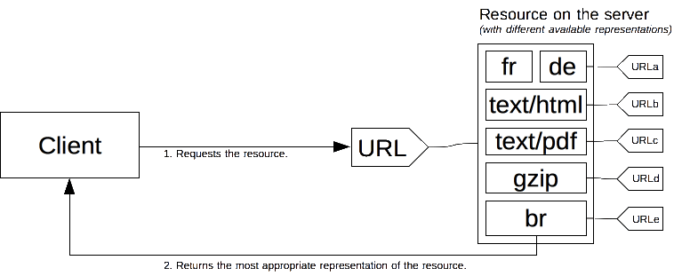
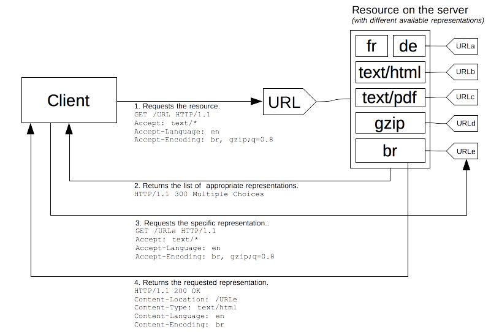

{{HTTPSidebar}}

在 [HTTP](/zh-CN/docs/Glossary/HTTP) 协议中，***内容协商***是一种机制，用于为同一 URI 提供资源不同的{{Glossary("Representation header","表示")}}形式，以帮助用户代理指定最适合用户的表示形式（例如，哪种文档语言、哪种图片格式或者哪种内容编码）。

> **备注：** 你可以在[来自 WHATWG 的维基页面](https://wiki.whatwg.org/wiki/Why_not_conneg)发现 HTTP 内容协商的一些缺点。HTML5 提供其他的选择来进行内容协商，例如 [`<source>` 元素](/zh-CN/docs/Web/HTML/Element/source)。

## 内容协商的基本原则

一份特定的文件被称为一项*资源*。当客户端获取资源的时候，会使用其对应的 URL 发送请求。服务器通过这个 URL 来选择它指向的资源的某一可用的变体——每一个变体称为一种表示形式——然后将这个选定的表示形式返回给客户端。整个资源，以及它的各种表示形式，共享一个特定的 URL。当访问某项资源的时候，**内容协商**会决定如何选择一种指定的表示形式。客户端和服务器端之间存在多种协商方式。

最佳表示形式的选取可以通过两种机制实现：

- 客户端设置特定的 [HTTP 标头](/zh-CN/docs/Web/HTTP/Headers)（又称为*服务端驱动型内容协商*或者*主动内容协商*），这是进行内容协商的标准方式。
- 服务器返回 {{HTTPStatus("300")}}（Multiple Choices）或者 {{HTTPStatus("406")}}（Not Acceptable）、{{HTTPStatus("415")}}（Unsupported Media Type）[HTTP 响应状态码](/zh-CN/docs/Web/HTTP/Status) （又称为*代理驱动型协商*或者*响应式协商*），这种方式一般用作备选方案。

随着时间的推移，也有其他一些内容协商的提案被提出来，比如[透明内容协商](https://datatracker.ietf.org/doc/html/rfc2295)以及 `Alternates` 标头。但是它们都没有获得人们的认可从而被遗弃。

## 服务端驱动型内容协商机制

在*服务端驱动型内容协商*或者主动内容协商中，浏览器（或者其他任何类型的用户代理）会随同 URL 发送一系列的 HTTP 标头。这些标头描述了用户倾向的选择。服务器则以此为线索，通过内部算法来选择最佳方案提供给客户端。如果它不能提供一个合适的资源，它可能使用 {{HTTPStatus("406")}}（Not Acceptable）、{{HTTPStatus("415")}}（Unsupported Media Type）进行响应并为其支持的媒体类型设置标头（例如，分别对 POST 和 PATCH 请求使用 {{HTTPHeader("Accept-Post")}} 或 {{HTTPHeader("Accept-Patch")}} 标头）。相关算法与具体的服务器相关，并没有在规范中进行规定。例如这里有一份 [Apache 服务器的内容协商算法](http://httpd.apache.org/docs/2.2/en/content-negotiation.html#algorithm)。

HTTP/1.1 规范指定了一系列的标准标头用于启动服务端驱动型内容协商（{{HTTPHeader("Accept")}}、{{HTTPHeader("Accept-Charset")}}、{{HTTPHeader("Accept-Encoding")}}、{{HTTPHeader("Accept-Language")}}）。尽管严格来说 {{HTTPHeader("User-Agent")}} 并不在此列，有时候它还是会被用来确定给客户端发送的所请求资源的特定表示形式，不过这种做法不提倡使用。服务器会使用 {{HTTPHeader("Vary")}} 标头来说明实际上哪些标头被用作内容协商的参考依据（确切来说是与之相关的响应标头），这样可以使[缓存](/zh-CN/docs/Web/HTTP/Caching)的运作更有效。

除此之外，有一个向可供选择的列表中增加更多标头的实验性提案，称为*客户端提示*（Client Hint）。客户端示意机制可以告知运行用户代理的设备类型（例如，是桌面计算机还是移动设备）。

即便服务端驱动型内容协商机制是最常用的对资源特定表示形式进行协商的方式，它也存在如下几个缺点：

- 服务器对浏览器并非全知全能。即便是有了客户端示意扩展，也依然无法获取关于浏览器能力的全部信息。与客户端进行选择的代理驱动型内容协商机制不同，服务器端的选择总是显得有点武断。
- 客户端提供的信息相当冗长（HTTP/2 协议的标头压缩机制缓解了这个问题），并且存在隐私风险（HTTP 指纹识别技术）。
- 因为给定的资源需要返回不同的表示形式，共享缓存的效率会降低，而服务器端的实现会越来越复杂。

### `Accept` 标头

{{HTTPHeader("Accept")}} 标头列举了用户代理希望接收的媒体资源的 MIME 类型。其中不同的 MIME 类型之间用逗号分隔，同时每一种 MIME 类型会配有一个品质因数（quality factor），该参数明确了不同 MIME 类型之间的相对优先级。

`Accept` 标头的值由浏览器或其他类型的用户代理确定，并且会由于上下文环境的不同而不同。比如在获取 HTML 页面、图片文件、视频文件或者是脚本文件的时候，无论是通过在地址栏中输入资源地址来获取还是通过 {{HTMLElement("img")}}、{{HTMLElement("video")}} 或 {{HTMLElement("audio")}} 元素引用都是不一样的。浏览器可以自由使用它们认为最为合适的标头值；这里有一份[常见浏览器 Accept 标头默认值](/zh-CN/docs/Web/HTTP/Content_negotiation/List_of_default_Accept_values)的完整列表。

### `Accept-CH` 标头{{experimental_inline}}

> **备注：** 这是被称为*客户端提示*的**实验性**技术方案的一部分，目前仅在 Chrome 46 及以后的版本中得到了实现。Device-Memory 值在 Chrome 61 或更高版本中。

该实验性标头 {{HTTPHeader("Accept-CH")}} 列出了服务器可以用来选择合适响应的配置数据。合法值如下：

| 值               | 含义                                                                                                                          |
| ---------------- | ----------------------------------------------------------------------------------------------------------------------------- |
| `Device-Memory`  | 标明客户端设备的内存大小。该值是个估计值，设备的实际内存值会向 2 的次方取整，且除以 1024。比如 512MB 的内存对应的值为 `0.5`。 |
| `Viewport-Width` | 标明用 CSS 像素数值表示的布局视口（layout viewport）宽度。                                                                    |
| `Width`          | 标明用物理像素值表示的资源宽度（换句话说就是一张图片的固有大小）。                                                            |

### `Accept-CH-Lifetime` 标头

> **备注：** 这是被称为*客户端提示*的**实验性**技术方案的一部分，目前仅在 Chrome 61 及以后的版本中得到了实现。

{{HTTPHeader("Accept-CH-Lifetime")}} 标头与 `Accept-CH` 标头的 `Device-Memory` 值一起使用，并指示设备应与服务器共享设备内存的时间量。该值以毫秒为单位给出，并且是可选的。

### `Accept-Encoding` 标头

{{HTTPHeader("Accept-Encoding")}} 标头明确说明了（接收端）可以接受的内容编码形式（所支持的压缩算法）。该标头的值是一个 Q 因子清单（例如 `br, gzip;q=0.8`），用来提示不同编码类型值的优先级顺序。默认值 `identity` 的优先级最低（除非声明为其他优先级）。

将 HTTP 消息进行压缩是一种最重要的提升 Web 站点性能的方法。该方法会减小所要传输的数据量的大小，节省可用带宽。浏览器总是会发送该标头，服务器则应该配置为接受它，并且采用一定的压缩方案。

### `Accept-Language` 标头

{{HTTPHeader("Accept-Language")}} 标头用来提示用户期望获得的自然语言的优先顺序。该标头的值是一个 Q 因子清单（例如 `de, en;q=0.7`）。用户代理的图形界面上所采用的语言通常可以用来设置为默认值，但是大多数浏览器允许设置不同优先级的语言选项。

由于[基于配置信息的信息熵](https://www.eff.org/deeplinks/2010/01/primer-information-theory-and-privacy)的增加，修改后的值可以用作识别用户的指纹，所以不建议对其进行修改，不过这样的话 Web 站点也就不能依赖该值来揭示用户的真实期望。站点设计者不能过度热衷于通过这个标头来进行语言检测，因为它可能会导致糟糕的用户体验：

- 站点设计者应该总是提供一种方式来使用户能够覆盖由服务器端选择的语言，例如在页面上提供一个用于语言选择的按钮。大多数用户代理会为 `Accept-Language` 标头提供一个默认值，该值采用的是用户界面的显示的语言。通常终端用户不能对其进行修改，或者是不知道该怎么修改，或者在他们计算机的环境中无法进行修改。
- 一旦用户覆盖了服务器端选择的语言选项，站点就不应该再使用语言检测技术，而应该忠于明确选择的语言选项。换句话说，只有站点的入口页面应该使用这个标头来选择合适的语言。

### `User-Agent` 标头

> **备注：** 尽管使用该标头来进行内容选择是合理的，但是依赖这个标头来确定用户代理都支持哪些功能特性通常[被认为是一个糟糕的做法](/zh-CN/docs/Web/HTTP/Browser_detection_using_the_user_agent)。

{{HTTPHeader("User-Agent")}} 标头可以用来识别发送请求的浏览器。该字符串中包含有用空格间隔的*产品标记符*及*注释*的清单。

*产品标记符*由产品名称、后面紧跟的"`/`"以及产品版本号构成，例如 `Firefox/4.0.1`。用户代理可以随意添加多少产品标记符都可以。*注释*是一个用括号分隔的自由形式的字符串。显然括号本身不能用在该字符串中。规范没有规定注释的内部格式，不过一些浏览器会把一些标记符放置在里面，不同的标记符之间使用"`;`"分隔。

### `Vary` 响应标头

与前面列举的 `Accept-*` 形式的由客户端发送的标头相反，{{HTTPHeader("Vary")}} 标头是由服务器在响应中发送的。它指示了服务器在服务端驱动型内容协商阶段所使用的标头清单。`Vary` 标头是必要的，它用于将决策的规范告知缓存，这样它就可以进行复现。这将使缓存发挥它的作用，同时确保缓存可以向用户提供正确的内容。

特殊值"`*`"意味着在服务端驱动型内容协商过程中同时采纳了未在标头中传递的信息来选择合适的内容。

`Vary` 标头是在 HTTP 协议的 1.1 版本中新添加的，它是为了使缓存恰当地工作。缓存为了能够与服务端驱动型内容协商机制协同工作，需要知道服务器选择传送内容的规范。这样的话，缓存服务器就可以重复该算法，直接提供恰当的内容，而不需要向服务器发送更多的请求。显然，通配符"`*`"阻碍了缓存机制发挥作用，因为缓存并不知道该通配符究竟指代哪些元素。有关更多信息，请参见 [HTTP 缓存 > Vary 响应](/zh-CN/docs/Web/HTTP/Caching#vary_响应)。

## 代理驱动型内容协商机制

服务端驱动型内容协商也有一些缺点：它不能很好的扩展。在协商机制中，每一个特性需要对应一个标头。如果想要使用屏幕大小、分辨率或者其他方面的特性，就需要创建一个新的 HTTP 标头。而且在每一次请求中都必须发送这些标头。在标头很少的时候，这并不是问题，但是随着数量的增多，消息的体积会导致性能的下降。带有精确信息的标头发送的越多，信息熵就会越大，也就准许了更多 HTTP 指纹识别行为，以及与此相关的隐私问题的发生。

从 HTTP 协议制定之初，该协议就准许另外一种协商机制：*代理驱动型内容协商*，或称为*响应式协商*。在这种协商机制中，当面临不明确的请求时，服务器会返回一个页面，其中包含了可供选择的资源的链接。资源呈现给用户，由用户做出选择。

不幸的是，HTTP 标准没有明确指定提供可选资源链接的页面的格式，这阻碍了该过程的无痛自动化。除了退回至*服务端驱动型内容协商*外，这种自动化方法几乎无一例外都是通过脚本技术来完成的，尤其是 JavaScript 重定向技术：在检测了协商的条件之后，脚本会触发重定向动作。另外一个问题是，为了获得实际的资源，需要额外发送一次请求，减慢了将资源呈现给用户的速度。
