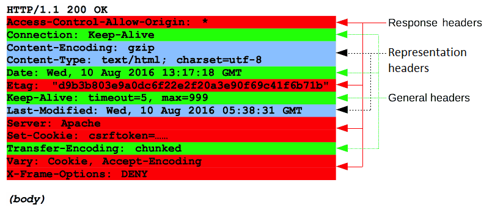
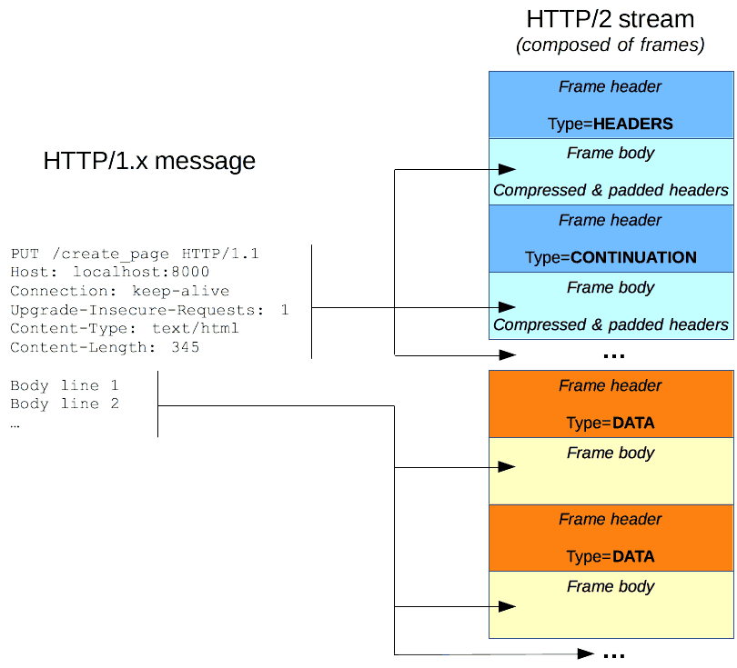

{{HTTPSidebar}}

HTTP 消息是服务器和客户端之间交换数据的方式。有两种类型的消息︰ 请求（requests）-- 由客户端发送用来触发一个服务器上的动作；响应（responses）-- 来自服务器的应答。

HTTP 消息由采用 ASCII 编码的多行文本构成。在 HTTP/1.1 及早期版本中，这些消息通过连接公开地发送。在 HTTP/2 中，为了优化和性能方面的改进，曾经可人工阅读的消息被分到多个 HTTP 帧中。

Web 开发人员或网站管理员，很少自己手工创建这些原始的 HTTP 消息︰ 由软件、浏览器、代理或服务器完成。他们通过配置文件（用于代理服务器或服务器），API（用于浏览器）或其他接口提供 HTTP 消息。

HTTP/2 二进制框架机制被设计为不需要改动任何 API 或配置文件即可应用︰ 它大体上对用户是透明的。

HTTP 请求和响应具有相似的结构，由以下部分组成︰

1. 一行起始行用于描述要执行的请求，或者是对应的状态，成功或失败。这个起始行总是单行的。
2. 一个可选的 HTTP 头集合指明请求或描述消息正文。
3. 一个空行指示所有关于请求的元数据已经发送完毕。
4. 一个可选的包含请求相关数据的正文 (比如 HTML 表单内容), 或者响应相关的文档。正文的大小有起始行的 HTTP 头来指定。

起始行和 HTTP 消息中的 HTTP 头统称为请求头，而其有效负载被称为消息正文。

## HTTP 请求

### 起始行

HTTP 请求是由客户端发出的消息，用来使服务器执行动作。_起始行 (start-line)_ 包含三个元素：

1. 一个 _[HTTP 方法](/zh-CN/docs/Web/HTTP/Methods)_，一个动词 (像 {{HTTPMethod("GET")}}, {{HTTPMethod("PUT")}} 或者 {{HTTPMethod("POST")}}) 或者一个名词 (像 {{HTTPMethod("HEAD")}} 或者 {{HTTPMethod("OPTIONS")}}), 描述要执行的动作。例如，`GET` 表示要获取资源，`POST` 表示向服务器推送数据 (创建或修改资源，或者产生要返回的临时文件)。
2. *请求目标 (request target)，*通常是一个 {{glossary("URL")}}，或者是协议、端口和域名的绝对路径，通常以请求的环境为特征。请求的格式因不同的 HTTP 方法而异。它可以是：

    - 一个绝对路径，末尾跟上一个 ' ? ' 和查询字符串。这是最常见的形式，称为 _原始形式 (origin form)_，被 GET，POST，HEAD 和 OPTIONS 方法所使用。
      `POST / HTTP/1.1 GET /background.png HTTP/1.0 HEAD /test.html?query=alibaba HTTP/1.1 OPTIONS /anypage.html HTTP/1.0`
    - 一个完整的 URL，被称为 _绝对形式 (absolute form)_，主要在使用 `GET` 方法连接到代理时使用。
      `GET http://developer.mozilla.org/en-US/docs/Web/HTTP/Messages HTTP/1.1`
    - 由域名和可选端口（以`':'`为前缀）组成的 URL 的 authority component，称为 _authority form_。仅在使用 `CONNECT` 建立 HTTP 隧道时才使用。
      `CONNECT developer.mozilla.org:80 HTTP/1.1`
    - _星号形式 (asterisk form)_，一个简单的星号 (`'*'`)，配合 `OPTIONS` 方法使用，代表整个服务器。
      `OPTIONS * HTTP/1.1`

3. _HTTP 版本 (HTTP version_)*，*定义了剩余报文的结构，作为对期望的响应版本的指示符。

### Headers

来自请求的 [HTTP headers](/zh-CN/docs/Web/HTTP/Headers) 遵循和 HTTP header 相同的基本结构：不区分大小写的字符串，紧跟着的冒号 `(':')` 和一个结构取决于 header 的值。整个 header（包括值）由一行组成，这一行可以相当长。

有许多请求头可用，它们可以分为几组：

- _General headers_，例如 {{HTTPHeader("Via")}}，适用于整个报文。
- _Request headers_，例如 {{HTTPHeader("User-Agent")}}，{{HTTPHeader("Accept-Type")}}，通过进一步的定义 (例如 {{HTTPHeader("Accept-Language")}})，或者给定上下文 (例如 {{HTTPHeader("Referer")}})，或者进行有条件的限制 (例如 {{HTTPHeader("If-None")}}) 来修改请求。
- _Entity headers_，例如 {{HTTPHeader("Content-Length")}}，适用于请求的 body。显然，如果请求中没有任何 body，则不会发送这样的头文件。

### Body

请求的最后一部分是它的 body。不是所有的请求都有一个 body：例如获取资源的请求，GET，HEAD，DELETE 和 OPTIONS，通常它们不需要 body。有些请求将数据发送到服务器以便更新数据：常见的的情况是 POST 请求（包含 HTML 表单数据）。

Body 大致可分为两类：

- Single-resource bodies，由一个单文件组成。该类型 body 由两个 header 定义： {{HTTPHeader("Content-Type")}} 和 {{HTTPHeader("Content-Length")}}.
- [Multiple-resource bodies](/zh-CN/docs/Web/HTTP/Basics_of_HTTP/MIME_types#multipartform-data)，由多部分 body 组成，每一部分包含不同的信息位。通常是和 [HTML Forms](/zh-CN/docs/Web/Guide/HTML/Forms) 连系在一起。

## HTTP 响应

### 状态行

HTTP 响应的起始行被称作 _状态行_ _(status line)_，包含以下信息：

1. _协议版本_，通常为 `HTTP/1.1。`
2. _状态码_ (_status code_)，表明请求是成功或失败。常见的状态码是 {{HTTPStatus("200")}}，{{HTTPStatus("404")}}，或 {{HTTPStatus("302")}}。
3. _状态文本 (status text)_。一个简短的，纯粹的信息，通过状态码的文本描述，帮助人们理解该 HTTP 消息。

一个典型的状态行看起来像这样：`HTTP/1.1 404 Not Found`。

### Headers

响应的 [HTTP headers](/zh-CN/docs/Web/HTTP/Headers) 遵循和任何其它 header 相同的结构：不区分大小写的字符串，紧跟着的冒号 (`':'`) 和一个结构取决于 header 类型的值。整个 header（包括其值）表现为单行形式。

有许多响应头可用，这些响应头可以分为几组：

- _General headers_，例如 {{HTTPHeader("Via")}}，适用于整个报文。
- _Response headers_，例如 {{HTTPHeader("Vary")}} 和 {{HTTPHeader("Accept-Ranges")}}，提供其它不符合状态行的关于服务器的信息。
- _Entity headers_，例如 {{HTTPHeader("Content-Length")}}，适用于请求的 body。显然，如果请求中没有任何 body，则不会发送这样的头文件。

### Body

响应的最后一部分是 body。不是所有的响应都有 body：具有状态码 (如 {{HTTPStatus("201")}} 或 {{HTTPStatus("204")}}) 的响应，通常不会有 body。

Body 大致可分为三类：

- Single-resource bodies，由**已知**长度的单个文件组成。该类型 body 由两个 header 定义：{{HTTPHeader("Content-Type")}} 和 {{HTTPHeader("Content-Length")}}。
- Single-resource bodies，由**未知**长度的单个文件组成，通过将 {{HTTPHeader("Transfer-Encoding")}} 设置为 `chunked`来使用 chunks 编码。
- [Multiple-resource bodies](/zh-CN/docs/Web/HTTP/Basics_of_HTTP/MIME_types#multipartform-data)，由多部分 body 组成，每部分包含不同的信息段。但这是比较少见的。

## HTTP/2 帧

HTTP/1.x 报文有一些性能上的缺点：

- Header 不像 body，它不会被压缩。
- 两个报文之间的 header 通常非常相似，但它们仍然在连接中重复传输。
- 无法复用。当在同一个服务器打开几个连接时：TCP 热连接比冷连接更加有效。

HTTP/2 引入了一个额外的步骤：它将 HTTP/1.x 消息分成帧并嵌入到流 (stream) 中。数据帧和报头帧分离，这将允许报头压缩。将多个流组合，这是一个被称为 _多路复用 (multiplexing)_ 的过程，它允许更有效的底层 TCP 连接。

HTTP 帧现在对 Web 开发人员是透明的。在 HTTP/2 中，这是一个在 HTTP/1.1 和底层传输协议之间附加的步骤。Web 开发人员不需要在其使用的 API 中做任何更改来利用 HTTP 帧；当浏览器和服务器都可用时，HTTP/2 将被打开并使用。

## 结论

HTTP 报文是使用 HTTP 的关键；它们的结构简单，并且具有高可扩展性。HTTP/2 帧机制是在 HTTP/1.x 语法和底层传输协议之间增加了一个新的中间层，而没有从根本上修改它，即它是建立在经过验证的机制之上。
