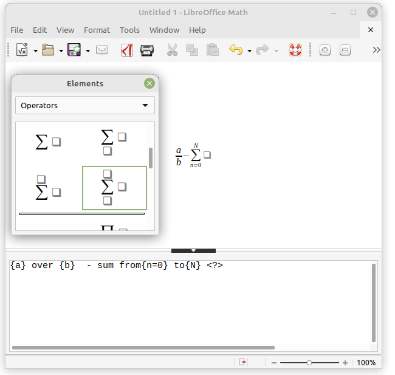
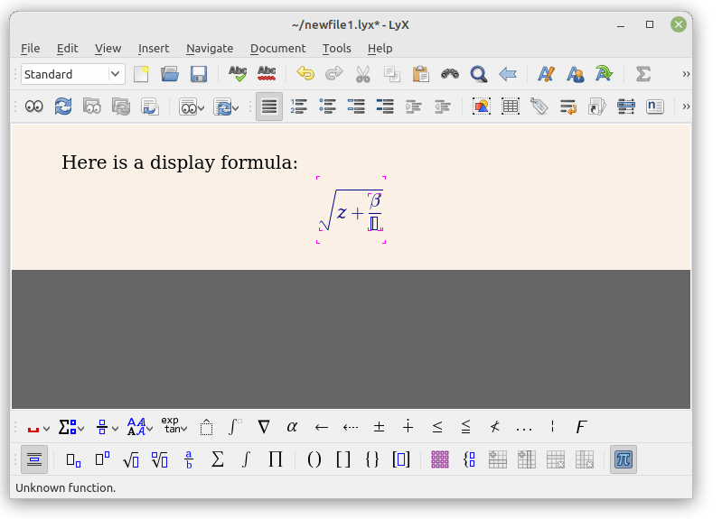
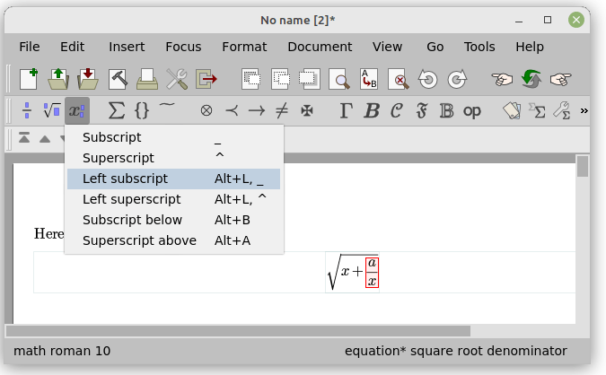
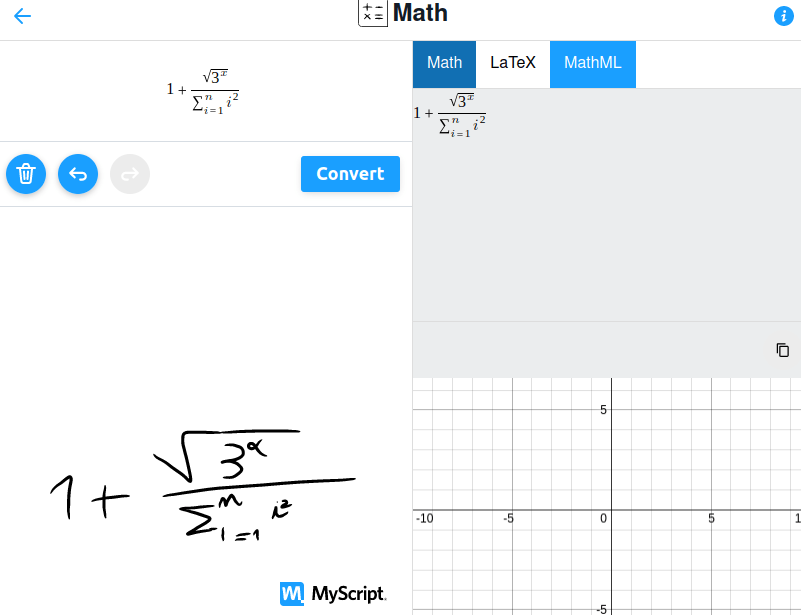

{{MathMLRef}}

本文解释了如何利用 MathML 语言编写数学公式。就像 HTML 或 SVG 一样，MathML 是用标签和属性描述的。当你的文档包含了较为复杂的内容时，文本会变得很冗长，因此需要[适当的编写工具](https://www.w3.org/wiki/Math_Tools#Authoring_tools)，例如从[轻量级标记语言](https://zh.wikipedia.org/wiki/轻量级标记语言)转换，或[所见即所得](https://zh.wikipedia.org/wiki/所见即所得)的公式编辑器。有很多类似的工具可用，我们无法给出一个详尽的清单。相反，本文重点介绍常见的方法和示例。

## 使用 MathML

即使你的 MathML 是由编辑工具生成的，也有必要了解将它们正确集成到文档中的技巧。

#### HTML 网页中的 MathML

每个 MathML 公式都由一个根元素 [`math`](/zh-CN/docs/Web/MathML/Element/math) 表示，其可以直接嵌入到 HTML 网页中。默认情况下，公式将被内联渲染，并进行额外的调整以将其高度最小化。可以使用 `display="block"` 属性，以在独立的段落中渲染复杂的公式。

```html
<!doctype html>
<html lang="en-US">
  <head>
    <meta charset="UTF-8" />
    <title>HTML5 中的 MathML</title>
  </head>
  <body>
    <h1>HTML5 中的 MathML</h1>

    <p>
      一分之根号二（行内样式）：
      <math>
        <mfrac>
          <mn>1</mn>
          <msqrt>
            <mn>2</mn>
          </msqrt>
        </mfrac>
      </math>
    </p>

    <p>
      一分之根号二（展示样式）：
      <math display="block">
        <mfrac>
          <mn>1</mn>
          <msqrt>
            <mn>2</mn>
          </msqrt>
        </mfrac>
      </math>
    </p>
  </body>
</html>
```

> **备注：** 要在 XML 文档（例如 XHTML、EPUB 或 OpenDocument）中使用 MathML，请在每个 `<math>` 元素中放置一个 `xmlns="http://www.w3.org/1998/Math/MathML"` 属性。

> **备注：** 某些电子邮件或即时通讯客户端能够发送和接收 HTML 格式的消息。因此，可以在此类消息中嵌入数学公式，只要标记清理程序未将 MathML 标签过滤掉。

#### 对不支持 MathML 的浏览器的回退方案

建议为不支持 MathML 的浏览器提供一个回退机制。如果你的文档仅包含基本的数学公式，那么一个 [mathml.css](https://github.com/fred-wang/mathml.css) 样式表可能就够了。要按条件加载它，只需要在文档的 head 中插入一行：

```html
<script src="https://fred-wang.github.io/mathml.css/mspace.js"></script>
```

如果你需要更多复杂的结构，你需要考虑使用功能更全面一些的 [MathJax](https://www.mathjax.org) 库作为一个 MathML polyfill：

```html
<script src="https://fred-wang.github.io/mathjax.js/mpadded-min.js"></script>
```

或者，对于没有很好地支持 MathML 的浏览器，你也可以只在网页的顶部显示一条警告，并让用户在不同的回退方案中自主选择：

```html
<script src="https://fred-wang.github.io/mathml-warning.js/mpadded-min.js"></script>
```

> **备注：** 这些脚本会执行特性检测（探测 [mspace](/zh-CN/docs/Web/MathML/Element/mspace) 元素和 [mpadded](/zh-CN/docs/Web/MathML/Element/mpadded) 元素），这优于[浏览器嗅探](/zh-CN/docs/Web/HTTP/Browser_detection_using_the_user_agent)。此外，它们是在开源许可证下分发的，因此可以自由地将它们复制到你自己的服务器上，并根据需要进行调整。

#### 数学公式字体

正如 [MathML 字体](/zh-CN/docs/Web/MathML/Fonts)中所解释的，数学公式字体有助于更好地渲染 MathML 的内容。因此，选择分享[此类字体的安装说明](/zh-CN/docs/Web/MathML/Fonts#installation_instructions)或以 [Web 字体](/zh-CN/docs/Learn/CSS/Styling_text/Web_fonts)的形式提供它们是一个不错的主意。

[MathFonts 页面](https://fred-wang.github.io/MathFonts/)提供了此类 Web 字体，以及适合的样式表。例如，只要在文档 head 下插入以下内容，即可选择带有回退的 Web 字体的拉丁现代字体：

```html
<link
  rel="stylesheet"
  href="https://fred-wang.github.io/MathFonts/LatinModern/mathfonts.css" />
```

其中有多种字体，你可以选择不同的样式，例如 STIX：

```html
<link
  rel="stylesheet"
  href="https://fred-wang.github.io/MathFonts/STIX/mathfonts.css" />
```

> **备注：** MathFonts 页面中的字体和样式表是在开源许可下分发的，因此可以自由地将它们复制到你自己的服务器上，并根据需要进行修改。

## 从简单语法转换

在本节中，我们将回顾一些可以把[轻量级标记语言](https://zh.wikipedia.org/wiki/轻量级标记语言)（如，流行的 [Latex](https://zh.wikipedia.org/wiki/LaTeX) 语言）转换为 MathML 的工具。

### 客户端转换

使用这种方法可以直接在网页中编写公式，JavaScript 库会负责将它们转换为 MathML。这可能是最简单的方式，但它也有一些问题：必须加载和执行额外的 JavaScript 代码，且作者必须转义保留字符；网络爬虫则无法访问 MathML 的输出……

[自定义元素](/zh-CN/docs/Web/API/Web_components/Using_custom_elements)可用于托管这些源代码，并确保对应的 MathML 输出会通过 [shadow 子树](/zh-CN/docs/Web/API/Web_components/Using_shadow_DOM)被插入和渲染 [TeXZilla](https://github.com/fred-wang/TeXZilla) 的 [`<la-tex>`](https://fred-wang.github.io/TeXZilla/examples/customElement.html) 元素，[上面的示例](#html_网页中的_mathml)就可以重写成以下更简洁的样子：

```html
<!doctype html>
<html lang="en-US">
  <head>
    <meta charset="UTF-8" />
    <title>HTML5 中的 MathML</title>
    <script src="https://fred-wang.github.io/TeXZilla/TeXZilla-min.js"></script>
    <script src="https://fred-wang.github.io/TeXZilla/examples/customElement.js"></script>
  </head>
  <body>
    <h1>HTML5中的MathML</h1>

    <p>
      一分之根号二（行内样式）：
      <la-tex>\frac{1}{\sqrt{2}}</la-tex>
    </p>

    <p>
      一分之根号二（展示样式）：
      <la-tex display="block">\frac{1}{\sqrt{2}}</la-tex>
    </p>
  </body>
</html>
```

对于不熟悉 LaTex 的作者，可以使用其他的输入方法，例如 [ASCIIMath](http://asciimath.org/#syntax) 或 [jqMath](https://mathscribe.com/author/jqmath.html) 语法。请记得加载 JavaScript 库并使用正确的分隔符：

```html
<!doctype html>
<html lang="en-US">
  <head>
    <meta charset="utf-8" />
    <meta name="viewport" content="width=device-width" />
    <title>ASCII MathML</title>
    ...
    <!-- ASCIIMathML.js -->
    <script src="/path/to/ASCIIMathML.js"></script>
    ...
    <!-- jqMath -->
    <script src="https://mathscribe.com/mathscribe/jquery-1.4.3.min.js"></script>
    <script src="https://mathscribe.com/mathscribe/jqmath-etc-0.4.6.min.js"></script>
    ...
  </head>
  <body>
    ...
    <p>一分之根号二（行内样式，ASCIIMath）：`1/(sqrt 2)`</p>
    ...
    <p>一分之根号二（行内样式，jqMath）：$1/√2$</p>
    ...
    <p>一分之根号二（展示样式，jqMath）：$$1/√2$$</p>
    ...
  </body>
</html>
```

### 命令行程序

你可以选择命令行程序，而不是在网页加载时再生成 MathML 表达式。这样，网页中将包含静态的 MathML 内容，加载速度也会更快。考虑以下 `input.html` 网页（内容来自[客户端转换](#客户端转换)）：

```html
<!doctype html>
<html lang="en-US">
  <head>
    <meta charset="UTF-8" />
    <title>HTML5中的MathML</title>
  </head>
  <body>
    <h1>HTML5中的MathML</h1>

    <p>一分之根号二（行内样式）：$\frac{1}{\sqrt{2}}$</p>

    <p>一分之根号二（展示样式）：$$\frac{1}{\sqrt{2}}$$</p>
  </body>
</html>
```

该网页包含了一些 [`script`](/zh-CN/docs/Web/HTML/Element/script) 标签。我们可以使用以下命令，利用 [Node.js](https://nodejs.org/) 和 [TeXZilla](https://github.com/fred-wang/TeXZilla/wiki/Using-TeXZilla#usage-from-the-command-line) 完成转换：

```bash
cat input.html | node TeXZilla.js streamfilter > output.html
```

在执行完成上述命令后，将创建一个包含 HTML 输出的 `output.html` 文件。以美元分隔的公式将转换为 MathML：

```html
<!doctype html>
<html lang="en-US">
  <head>
    <meta charset="UTF-8" />
    <title>HTML5中的MathML</title>
  </head>
  <body>
    <h1>HTML5中的MathML</h1>

    <p>
      一分之根号二（行内样式）：
      <math xmlns="http://www.w3.org/1998/Math/MathML"
        ><semantics
          ><mfrac
            ><mn>1</mn><msqrt><mn>2</mn></msqrt></mfrac
          ><annotation encoding="TeX">\frac{1}{\sqrt{2}}</annotation></semantics
        ></math
      >
    </p>

    <p>
      一分之根号二（展示样式）：
      <math xmlns="http://www.w3.org/1998/Math/MathML" display="block"
        ><semantics
          ><mfrac
            ><mn>1</mn><msqrt><mn>2</mn></msqrt></mfrac
          ><annotation encoding="TeX">\frac{1}{\sqrt{2}}</annotation></semantics
        ></math
      >
    </p>
  </body>
</html>
```

还有更复杂的工具可以将任意的 Latex 文档转换为 MathML 形式的文档。例如，使用 [LaTeXML](https://math.nist.gov/~BMiller/LaTeXML/) 可以将 `foo.tex` 转换为 HTML 或 EPUB 文档：

```bash
latexmlc --dest foo.html foo.tex # Generate a HTML document foo.html
latexmlc --dest foo.epub foo.tex # Generate an EPUB document foo.epub
```

`latexmlc` 接受一个 `--javascript` 参数，你可以使用这个参数来包含上面提到的任意一个[回退脚本](#对不支持_mathml_的浏览器的回退方案)：

```bash
latexmlc --dest foo.html --javascript=https://fred-wang.github.io/mathml.css/mspace.js foo.tex  # Add the CSS fallback
latexmlc --dest foo.html --javascript=https://fred-wang.github.io/mathjax.js/mpadded-min.js foo.tex # Add the MathJax fallback
```

> **备注：** 命令行工具可以在服务端使用，例如：[MediaWiki](https://www.mediawiki.org/wiki/MediaWiki) 使用 [Mathoid](https://github.com/wikimedia/mathoid) 以完成从 LaTeX 到 MathML 的转换。

## 图形界面

在本节中，我们将回顾一些提供图形界面的编辑工具。

### 输入框

在数学公式输入框中集成[简单语法转换器](#从简单语法转换)是一种较为简单的方法。例如，[Thunderbird](https://www.thunderbird.net/zh-CN/) 和 [SeaMonkey](https://www.seamonkey-project.org/) 提供了 **Insert > Math** 的命令，这一命令会弹出一个窗口，其中包含了一个从 LaTeX 到 MathML 的输入字段和 MathML 的实时预览：


> **备注：** 你也可以使用 **Insert > HTML** 命令直接插入 MathML 内容。

[LibreOffice](https://www.libreoffice.org/) 的公式编辑器（文件 → 新建 → 公式）提供了增强功能：它的 _StartMath_ 语法输入框提供了额外的公式面板来插入预定义的数学公式结构。



> **备注：** 要获取 libreoffice 的 MathML 代码，请将文档保存为 `mml` 格式，并在你喜欢的文本编辑器中打开它。

### 所见即所得编辑器

其他的编辑器直接将编辑数学公式的功能集成到其所见即所得界面。以下截图来自 [LyX](https://www.lyx.org/) 和 [TeXmacs](https://www.texmacs.org/tmweb/home/welcome.en.html)，它们都支持导出 HTML：





> **备注：** 默认情况下，Lyx 和 TeXmacs 会在它们的 HTML 输出中使用数学公式的图像。要使用 MathML，对于前者，请[参照这里的说明](https://github.com/brucemiller/LaTeXML/wiki/Integrating-LaTeXML-into-TeX-editors#lyx)；对于后者，请选择 `User preference > Convert > Export mathematical formulas as MathML`。

### 光学字符和手写识别

最后一种输入数学公式的方法是使用[光学字符识别](https://zh.wikipedia.org/wiki/光学字符识别)或[手写识别](https://zh.wikipedia.org/wiki/手写识别)的用户界面。其中的部分工具支持数学公式，并支持导出 MathML。以下截图来自 [MyScript 的演示](https://webdemo.myscript.com/views/math/index.html)。


