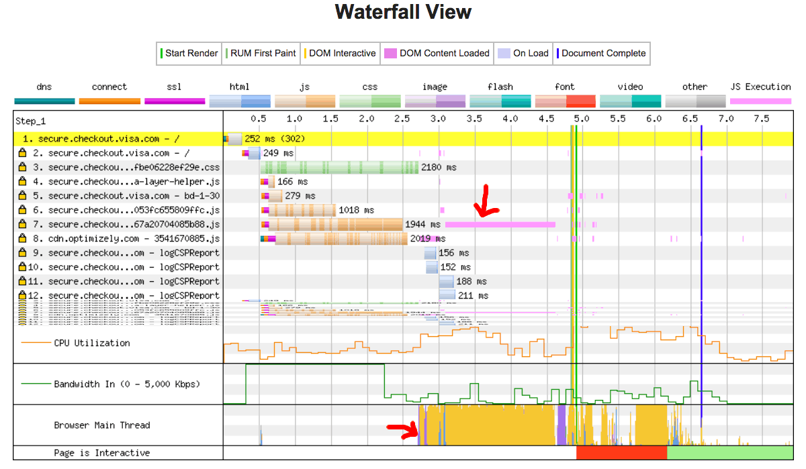

{{QuickLinksWithSubPages("Web/Performance")}}

在浏览网页时用户希望页面的内容能够快速加载且交互流畅。因此，开发者应力争实现这两个目标。

理解浏览器的工作原理有助于开发者了解该如何去衡量性能和提升页面性能。

## 概述

快速响应的网站提供更好的用户体验。用户期待内容快速加载和交互流畅的 Web 体验。

导致 Web 性能问题的原因主要有两种，一是网络延迟，二是大部分情况下的浏览器单线程执行。

保障页面快速加载的最大威胁是网络延迟。开发者的目标是尽可能使网站加载速度快，或者至少看起来加载速度超快，以便用户尽快获取所需信息。网络延迟是将字节传输到计算机的时间。Web 性能的意思是我们越是尽快地加载页面，性能就越高。

大部分情况下，浏览器被认为是单线程的。也就是说，它们在执行一个任务之前会从头到尾完成一个任务，然后才会接受另一个任务。为了实现流畅的交互，开发者的目标是确保网站的交互性能良好，从流畅的滚动到对触摸的响应。在这里渲染时间至关重要，更短的渲染时间能确保主线程能够完成我们分配给它的所有工作，并且始终可以处理用户的交互。通过理解浏览器的单线程特性，并尽可能和适当地减少主线程的责任，可以提高网页性能，以确保渲染流畅，并且对交互的响应是即时的。

## 导航

*导航*是加载 web 页面的第一步。它发生在以下情形：用户通过在地址栏输入一个 URL、点击一个链接、提交表单或者是其他的行为。

Web 性能优化的目标之一就是缩短导航完成所花费的时间，在理想情况下，它通常不会花费太多的时间，但是网络延迟和带宽会让它变久。

### DNS 查询

对于一个 web 页面来说导航的第一步是要去寻找页面资源的位置。如果导航到 `https://example.com`，HTML 页面被定位到 IP 地址为 `93.184.216.34` 的服务器。如果以前没有访问过这个网站，就需要进行 DNS 查询。

浏览器向域名服务器发起 DNS 查询请求，最终得到一个 IP 地址。第一次请求之后，这个 IP 地址可能会被缓存一段时间，这样可以通过从缓存里面检索 IP 地址而不是再通过域名服务器进行查询来加速后续的请求。

每个主机名 (hostname) 在页面加载时通常只需要进行一次 DNS 查询。但是，对于页面指向的不同的主机名，则需要多次 DNS 查询。如果字体（font）、图像（image）、脚本（script）、广告（ads）和网站统计（metric）都有不同的主机名，则需要对每一个主机名进行 DNS 查询。


但是对于移动网络 DNS 查询可能存在性能问题。当一个用户使用移动网络时，所有 DNS 查询必须从手机发送到基站，然后到达一个认证的 DNS 服务器。手机、信号塔、域名服务器之间的距离会明显增加延迟。

### TCP 握手

一旦获取到服务器 IP 地址，浏览器就会通过{{glossary('TCP handshake','TCP“三次握手”')}}与服务器建立连接。这个机制的是用来让两端尝试进行通信——在浏览器和服务器通过上层协议 {{glossary('HTTPS')}} 发送数据之前，可以协商网络 TCP 套接字连接的一些参数。

TCP 的“三次握手”技术经常被称为“SYN-SYN-ACK”——更确切的说是 SYN、SYN-ACK、ACK——因为通过 TCP 首先发送了三个消息进行协商，然后在两台电脑之间开始一个 TCP 会话。是的，这意味着当请求尚未发出的时候，终端与每台服务器之间还要来回多发送三条消息。

### TLS 协商

对于通过 HTTPS 建立的安全连接，还需要另一次 "握手"。这种握手，或者说 {{glossary('TLS')}} 协商，决定使用哪种密码对通信进行加密，验证服务器，并在开始实际数据传输前建立安全连接。这就需要在实际发送内容请求之前，再往返服务器五次。


虽然建立安全连接的步骤增加了等待加载页面的时间，但是为了建立一个安全的连接而增加延迟是值得的，因为在浏览器和 web 服务器之间传输的数据不可以被第三方解密。

如此经过 8 次往返，浏览器终于可以发出请求。

## 响应

一旦我们建立了和 web 服务器的连接，浏览器就会代表用户发送一个初始的 [HTTP `GET` 请求](/zh-CN/docs/Web/HTTP/Methods)，对于网站来说，这个请求通常是一个 HTML 文件。一旦服务器收到请求，它将使用相关的响应头和 HTML 的内容进行回复。

```html
<!doctype html>
<html lang="zh-CN">
  <head>
    <meta charset="UTF-8" />
    <title>简单的页面</title>
    <link rel="stylesheet" href="styles.css" />
    <script src="myscript.js"></script>
  </head>
  <body>
    <h1 class="heading">我的页面</h1>
    <p>含有<a href="https://example.com/about">链接</a>的段落。</p>
    <div>
      
    </div>
    <script src="anotherscript.js"></script>
  </body>
</html>
```

初始请求的响应包含所接收数据的第一个字节。{{glossary('Time to First Byte','首字节时间（TTFB）')}}是用户通过点击链接进行请求与收到第一个 HTML 数据包之间的时间。第一个内容分块通常是 14KB 的数据。

上面的示例中，这个请求肯定是小于 14KB 的，但是直到浏览器在解析阶段遇到链接时才会去请求链接的资源，下面有进行描述。

### 拥塞控制 / TCP 慢启动

在传输过程中，TCP 包被分割成段。由于 TCP 保证了数据包的顺序，因此服务器在发送一定数量的段后，必须从客户端接收一个 ACK 包的确认。

如果服务器在发送每个段之后都等待 ACK，那么客户端将频繁地发送 ACK，并且可能会增加传输时间，即使在网络负载较低的情况下也是如此。

另一方面，一次发送过多的段会导致在繁忙的网络中客户端无法接收段并且长时间地只会持续发送 ACK，服务器必须不断重新发送段的问题。

为了平衡传输段的数量，{{glossary('TCP slow start', 'TCP 慢启动')}}算法用于逐渐增加传输数据量，直到确定最大网络带宽，并在网络负载较高时减少传输数据量。

传输段的数量由拥塞窗口（CWND）的值控制，该值可初始化为 1、2、4 或 10 MSS（以太网协议中的 MSS 为 1500 字节）。该值是发送的字节数，客户端收到后必须发送 ACK。

如果收到 ACK，那么 CWND 值将加倍，这样服务器下次就能发送更多的数据段。相反，如果没有收到 ACK，那么 CWND 值将减半。因此，这种机制在发送过多网段和过少网段之间取得了平衡。

## 解析

一旦浏览器收到第一块数据，它就可以开始解析收到的信息。{{glossary('parse', '“解析”')}}是浏览器将通过网络接收的数据转换为 {{glossary('DOM')}} 和 {{glossary('CSSOM')}} 的步骤，通过渲染器把 DOM 和 CSSOM 在屏幕上绘制成页面。

虽然 DOM 是浏览器标记的内部表示，但是它也被暴露出来，可以通过 JavaScript 中的各种 API 进行操作。

即使请求页面的 HTML 大于初始的 14KB 数据包，浏览器也将根据其拥有的数据开始解析并尝试渲染。这就是为什么在前 14KB 中包含浏览器开始渲染页面所需的所有内容，或者至少包含页面模板（第一次渲染所需的 CSS 和 HTML）对于 web 性能优化来说是重要的。但是在渲染到屏幕上面之前，HTML、CSS、JavaScript 必须被解析完成。

### 构建 DOM 树

我们在[关键渲染路径](/zh-CN/docs/Web/Performance/Critical_rendering_path)这篇文章中描述了五个步骤。

第一步是处理 HTML 标记并构造 DOM 树。HTML 解析涉及到[符号化](/zh-CN/docs/Web/API/DOMTokenList)和树的构造。HTML 标记包括开始和结束标记，以及属性名和值。如果文档格式良好，则解析它会简单而快速。解析器将标记化的输入解析到文档中，构建文档树。

DOM 树描述了文档的内容。[`<html>`](/zh-CN/docs/Web/HTML/Element/html) 元素是第一个标签也是文档树的根节点。树反映了不同标记之间的关系和层次结构。嵌套在其他标记中的标记是子节点。DOM 节点的数量越多，构建 DOM 树所需的时间就越长。


当解析器发现非阻塞资源，例如一张图片，浏览器会请求这些资源并且继续解析。当遇到一个 CSS 文件时，解析也可以继续进行，但是对于 `<script>` 标签（特别是没有 [`async`](/zh-CN/docs/Web/JavaScript/Reference/Statements/async_function) 或者 `defer` 属性的）会阻塞渲染并停止 HTML 的解析。尽管浏览器的预加载扫描器加速了这个过程，但过多的脚本仍然是一个重要的瓶颈。

### 预加载扫描器

浏览器构建 DOM 树时，这个过程占用了主线程。当这种情况发生时，预加载扫描仪将解析可用的内容并请求高优先级资源，如 CSS、JavaScript 和 web 字体。多亏了预加载扫描器，我们不必等到解析器找到对外部资源的引用来请求它。它将在后台检索资源，以便在主 HTML 解析器到达请求的资源时，它们可能已经在运行，或者已经被下载。预加载扫描仪提供的优化减少了阻塞。

```html
<link rel="stylesheet" href="styles.css" />
<script src="myscript.js" async></script>

<script src="anotherscript.js" async></script>
```

在这个例子中，当主线程在解析 HTML 和 CSS 时，预加载扫描器将找到脚本和图像，并开始下载它们。为了确保脚本不会阻塞进程，当 JavaScript 解析和执行顺序不重要时，可以添加 `async` 属性或 `defer` 属性。

等待获取 CSS 不会阻塞 HTML 的解析或者下载，但是它确实会阻塞 JavaScript，因为 JavaScript 经常用于查询元素的 CSS 属性。

### 构建 CSSOM 树

第二步是处理 CSS 并构建 CSSOM 树。CSS 对象模型和 DOM 是相似的。DOM 和 CSSOM 是两棵树。它们是独立的数据结构。浏览器将 CSS 规则转换为可以理解和使用的样式映射。浏览器遍历 CSS 中的每个规则集，根据 CSS 选择器创建具有父、子和兄弟关系的节点树。

与 HTML 一样，浏览器需要将接收到的 CSS 规则转换为可以使用的内容。因此，它重复了 HTML 到对象的过程，但对于 CSS。

CSSOM 树包括来自用户代理样式表的样式。浏览器从适用于节点的最通用规则开始，并通过应用更具体的规则递归地优化计算的样式。换句话说，它级联属性值。

构建 CSSOM 非常快，并且在当前的开发工具中没有以独特的颜色显示。相反，开发人员工具中的“重新计算样式”显示解析 CSS、构建 CSSOM 树和递归计算计算样式所需的总时间。在 web 性能优化方面，它是可轻易实现的，因为创建 CSSOM 的总时间通常小于一次 DNS 查询所需的时间。

### 其他过程

#### JavaScript 编译

在解析 CSS 和创建 CSSOM 的同时，包括 JavaScript 文件在内的其他资源也在下载（这要归功于预加载扫描器）。JavaScript 会被解析、编译和解释。脚本被解析为抽象语法树。有些浏览器引擎会将[抽象语法树](https://zh.wikipedia.org/wiki/抽象语法树)输入编译器，输出字节码。这就是所谓的 JavaScript 编译。大部分代码都是在主线程上解释的，但也有例外，例如在 [web worker](/zh-CN/docs/Web/API/Web_Workers_API) 中运行的代码。

#### 构建无障碍树

浏览器还构建辅助设备用于分析和解释内容的[无障碍](/zh-CN/docs/Learn/Accessibility)树。无障碍对象模型（AOM）类似于 DOM 的语义版本。当 DOM 更新时，浏览器会更新辅助功能树。辅助技术本身无法修改无障碍树。

在构建 AOM 之前，[屏幕阅读器](/zh-CN/docs/Web/Accessibility/ARIA/ARIA_Screen_Reader_Implementors_Guide)无法访问内容。

## 渲染

渲染步骤包括样式、布局、绘制，在某些情况下还包括合成。在解析步骤中创建的 CSSOM 树和 DOM 树组合成一个渲染树，然后用于计算每个可见元素的布局，然后将其绘制到屏幕上。在某些情况下，可以将内容提升到它们自己的层并进行合成，通过在 GPU 而不是 CPU 上绘制屏幕的一部分来提高性能，从而释放主线程。

### 样式

关键呈现路径的第三步是将 DOM 和 CSSOM 组合成渲染树。计算样式树或渲染树的构建从 DOM 树的根开始，遍历每个可见节点。

不会被显示的元素，如 [`<head>`](/zh-CN/docs/Web/HTML/Element/head) 元素及其子元素，以及任何带有 `display: none` 的节点，如用户代理样式表中的 `script { display: none; }`，都不会包含在渲染树中，因为它们不会出现在渲染输出中。应用了 `visibility: hidden` 的节点会包含在渲染树中，因为它们会占用空间。由于我们没有给出任何指令来覆盖用户代理默认值，因此上述代码示例中的 `script` 节点不会包含在渲染树中。

每个可见节点都应用了 CSSOM 规则。渲染树包含所有可见节点的内容和计算样式，将所有相关样式与 DOM 树中的每个可见节点匹配起来，并根据 [CSS 级联](/zh-CN/docs/Web/CSS/Cascade)，确定每个节点的计算样式。

### 布局

第四步是在渲染树上运行布局以计算每个节点的几何体。*布局*是确定呈现树中所有节点的宽度、高度和位置，以及确定页面上每个对象的大小和位置的过程。回流是对页面的任何部分或整个文档的任何后续大小和位置的确定。

构建渲染树后，开始布局。渲染树标识显示哪些节点（即使不可见）及其计算样式，但不标识每个节点的尺寸或位置。为了确定每个对象的确切大小和位置，浏览器从渲染树的根开始遍历它。

在网页上，大多数东西都是一个盒子。不同的设备和不同的桌面意味着无限数量的不同的视区大小。在此阶段，考虑到视口大小，浏览器将确定屏幕上所有不同框的尺寸。以视口的大小为基础，布局通常从 body 开始，用每个元素的框模型属性排列所有 body 的子孙元素的尺寸，为不知道其尺寸的替换元素（例如图像）提供占位符空间。

第一次确定节点的大小和位置称为布局。随后对节点大小和位置的重新计算称为回流。在我们的示例中，假设初始布局发生在返回图像之前。由于我们没有声明图像的尺寸，因此一旦知道图像的尺寸，就会出现回流。

### 绘制

最后一步是将各个节点绘制到屏幕上，第一次出现的节点称为 [first meaningful paint](/zh-CN/docs/Glossary/First_meaningful_paint)。在绘制或光栅化阶段，浏览器将在布局阶段计算的每个框转换为屏幕上的实际像素。绘画包括将元素的每个可视部分绘制到屏幕上，包括文本、颜色、边框、阴影和替换的元素（如按钮和图像）。浏览器需要非常快地完成这项工作。

为了确保平滑滚动和动画，占据主线程的所有内容，包括计算样式，以及回流和绘制，必须让浏览器在 16.67 毫秒内完成。在 2048x1536 分辨率的 iPad 上，有超过 314.5 万像素将被绘制到屏幕上。那是很多像素需要快速绘制。为了确保重绘的速度比初始绘制的速度更快，屏幕上的绘图通常被分解成数层。如果发生这种情况，则需要进行合成。

绘制可以将布局树中的元素分解为多个层。将内容提升到 GPU 上的层（而不是 CPU 上的主线程）可以提高绘制和重新绘制性能。有一些特定的属性和元素可以实例化一个层，包括 [`<video>`](/zh-CN/docs/Web/HTML/Element/video) 和 [`<canvas>`](/zh-CN/docs/Web/HTML/Element/canvas)，任何 CSS 属性为 [`opacity`](/zh-CN/docs/Web/CSS/opacity) 、3D [`transform`](/zh-CN/docs/Web/CSS/transform)、[`will-change`](/zh-CN/docs/Web/CSS/will-change) 的元素，还有一些其他元素。这些节点将与子节点一起绘制到它们自己的层上，除非子节点由于上述一个（或多个）原因需要自己的层。

分层确实可以提高性能，但是它以内存管理为代价，因此不应作为 web 性能优化策略的一部分过度使用。

### 合成

当文档的各个部分以不同的层绘制，相互重叠时，必须进行合成，以确保它们以正确的顺序绘制到屏幕上，并正确显示内容。

当页面继续加载资源时，可能会发生回流（回想一下我们迟到的示例图像），回流会触发重新绘制和重新组合。如果我们定义了图像的大小，就不需要重新绘制，只需要重新绘制需要重新绘制的层，并在必要时进行合成。但我们没有包括图像大小！从服务器获取图像后，渲染过程将返回到布局步骤并从那里重新开始。

## 交互

一旦主线程绘制页面完成，你会认为我们已经“准备好了”，但事实并非如此。如果加载包含 JavaScript（并且延迟到 [`onload`](/zh-CN/docs/Web/API/Window/load_event) 事件触发后执行），则主线程可能很忙，无法用于滚动、触摸和其他交互。

{{glossary('Time to Interactive', '可交互时间（TTI）')}}是测量从第一个请求导致 DNS 查询和 SSL 连接到页面可交互时所用的时间——可交互是 {{glossary('First Contentful Paint')}} 之后的时间点，页面在 50ms 内响应用户的交互。如果主线程正在解析、编译和执行 JavaScript，则它不可用，因此无法及时（小于 50ms）响应用户交互。

在我们的示例中，可能图像加载很快，但 `anotherscript.js` 文件可能是 2MB，而且用户的网络连接很慢。在这种情况下，用户可以非常快地看到页面，但是在下载、解析和执行脚本之前，就无法滚动。这不是一个好的用户体验。避免占用主线程，如下面的网页测试示例所示：



在本例中，DOM 内容加载过程花费了超过 1.5 秒的时间，主线程在这段时间内完全被占用，对单击事件或屏幕点击没有响应。

## 参见

- [Web 性能](/zh-CN/docs/Web/Performance)
